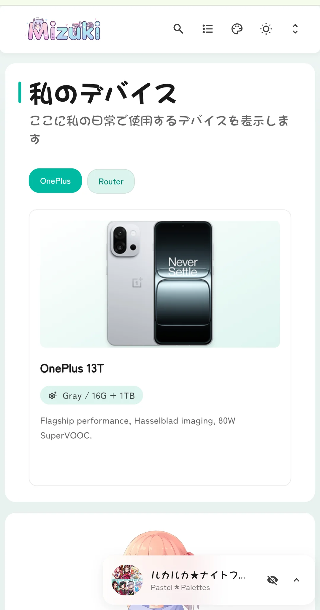

# 🌸 Mizuki优化版
一个现代化、功能丰富的静态博客模板，基于 [Astro](https://astro.build) 构建，具有先进的功能和精美的设计。——然后，在这个[**仓库**](https://github.com/matsuzaka-yuki/mizuki.git)的基础上进行功能的优化。

[](https://nodejs.org/) [](https://pnpm.io/) [](https://astro.build/) [](https://www.typescriptlang.org/) [](https://opensource.org/licenses/Apache-2.0)

## 📱 效果展示


<table>
  <tr>
    <td></td>
    <td></td>
    <td></td>
  <tr>
  <tr>
    <td></td>
    <td></td>
    <td></td>
  <tr>
</table>
## ✨ 功能特性

### 🎨 设计与界面
- [x] 基于 [Astro](https://astro.build) 和 [Tailwind CSS](https://tailwindcss.com) 构建
- [x] 使用 [Swup](https://swup.js.org/) 实现流畅的动画和页面过渡
- [x] 明暗主题切换，支持系统偏好检测
- [x] 可自定义主题色彩和动态横幅轮播
- [x] 全屏背景图片，支持轮播、透明度和模糊效果
- [x] 全设备响应式设计
- [x] 使用 JetBrains Mono 字体的优美排版
- [x] 支持自定义字体方案，可灵活切换中英文排版

### 🔍 内容与搜索
- [x] 基于 [Pagefind](https://pagefind.app/) 的高级搜索功能
- [x] [增强的 Markdown 功能](#-markdown-扩展语法)，支持语法高亮
- [x] 交互式目录，支持自动滚动
- [x] RSS 订阅生成
- [x] 阅读时间估算
- [x] 文章分类和标签系统

### 📱 特色页面
- [x] **归档页面** - 有序的文章时间线视图
- [x] **日记页面** - 分享生活瞬间，支持自动分页
- [x] **相册页面** - 瀑布流/网格双模式的相册展示
- [x] **追番页面** - 追踪动画观看进度和评分，支持 Filter 筛选、分页、表头统计信息
- [x] **技能页面** - 展示个人技能与掌握程度的可视化页面
- [x] **时间线页面** - 导航栏时间线入口，描述已更新以更准确地反映内容性质
- [x] **友链页面** - 精美卡片展示朋友网站
- [x] ~~**设备页面** - 删除~~
- [x] ~~**关于页面** - 删除~~

### 🛠 技术特性
- [x] **增强代码块**，基于 [Expressive Code](https://expressive-code.com/)
- [x] **数学公式支持**，KaTeX 渲染
- [x] **图片优化**，PhotoSwipe 画廊集成
- [x] **SEO 优化**，包含站点地图和元标签
- [x] **性能优化**，懒加载和缓存机制
- [x] **评论系统**，支持 Twikoo 集成

## 🎯 快速开始

### 📦 安装

1. 从**release**中下载仓库
   
2. **安装依赖：**
   
   ```bash
   # 如果没有安装 pnpm，先安装
   npm install -g pnpm
   
   # 安装项目依赖
   pnpm install
```
   
3. **配置博客：**
   - 编辑 `src/config.ts` 自定义博客设置
   - 更新站点信息、主题色彩、横幅图片和社交链接
   - 配置特色页面功能
   - (可选) 配置内容仓库分离 - 见 [内容仓库配置](#-代码内容分离可选)

4. **启动开发服务器：**
   ```bash
   pnpm dev
   ```
   博客将在 `http://localhost:4321` 可用

### 📝 内容管理

- **创建新文章：** `pnpm new-post <文件名>`
- **编辑文章：** 修改 `src/content/posts/` 中的文件
- **自定义页面：** 编辑 `src/content/spec/` 中的特殊页面
- **添加图片：** 将图片放在 `src/assets/` 或 `public/` 中

### 🚀 部署

将博客部署到任何静态托管平台：

- **Vercel**
- **Netlify**
- **GitHub Pages**
- **Cloudflare Pages**
- **Tencent Edge One**
- **环境变量配置（可选）：** 可参照 `.env.example` 来配置

部署前，请在 `src/config.ts` 中更新 `siteURL`。
**不建议**将 `.env` 文件提交到 Git，`.env` 应该仅在本地调试或构建使用。若要将项目在云平台部署，建议通过平台上的 `环境变量` 配置传入。

### ⚡ 参考命令

所有命令都在项目根目录运行：

| 命令                       | 操作                                    |
|:---------------------------|:---------------------------------------|
| `pnpm install`             | 安装依赖                               |
| `pnpm dev`                 | 在 `localhost:4321` 启动本地开发服务器 |
| `pnpm build`               | 构建生产站点到 `./dist/`               |
| `pnpm preview`             | 在部署前本地预览构建                   |
| `pnpm check`               | 运行 Astro 错误检查                    |
| `pnpm format`              | 使用 Prettier 格式化代码                  |
| `pnpm lint`                | 检查并修复代码问题                     |
| `pnpm new-post <文件名>`   | 创建新博客文章                         |
| `pnpm astro ...`           | 运行 Astro CLI 命令                    |

## ✏️ 贡献

我们欢迎贡献！请随时提交问题和拉取请求。

1. Fork 仓库
2. 创建功能分支 (`git checkout -b feature/amazing-feature`)
3. 提交更改 (`git commit -m 'Add some amazing feature'`)
4. 推送到分支 (`git push origin feature/amazing-feature`)
5. 打开拉取请求

## 🔒 许可证

### 📄 本项目许可证

本项目基于 Apache 许可证 2.0 - 查看 [LICENSE](LICENSE) 文件了解详情。

### 📄 原始项目许可证

本项目基于 [Fuwari](https://github.com/saicaca/fuwari) 开发，该项目使用 MIT 许可证。根据 MIT 许可证要求，原始版权声明和许可声明已包含在 LICENSE.MIT 文件中。

## 🙏 致谢

- 参考原始 [Fuwari](https://github.com/saicaca/fuwari) 模板
- 参考基础 [Mizuki](https://github.com/LyraVoid/Mizuki) 博客模板
- 灵感来源于 [Yukina](https://github.com/WhitePaper233/yukina) - 一个美丽优雅的博客模板
- 部分设计灵感来源于 [Firefly](https://github.com/CuteLeaf/Firefly) 和 [Twilight](https://github.com/spr-aachen/Twilight) 模板
- 使用 [Pio](https://github.com/Dreamer-Paul/Pio) 实现可爱的 Live2D 看板娘插件
- 使用 [Astro](https://astro.build) 和 [Tailwind CSS](https://tailwindcss.com) 构建
- 图标来自 [Iconify](https://iconify.design/)

⭐ 如果您觉得这个项目有帮助，请考虑给它一个星标！
