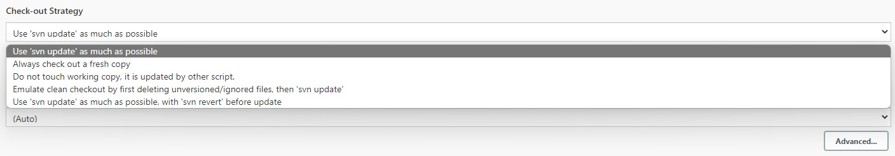

# 1. update

## 选项

`Use 'svn update' as much as possible`

## 描述

​		Use 'svn update' whenever possible, making the build faster. But this causes the artifacts from the previous build to remain when a new build starts.

- **首次构建**
  - **把工作目录下的所有文件清空，然后check-out一份完整的项目到工作目录下。**

- **后续构建**
  - **SVN update**

## 特点

1. 只更新SVN管理的文件，以往构建产生的缓存文件，不予清理。
2. 如果在Jenkins目录下做了文件修改，再更新时会产生冲突。

# 2. 清空 + 完整checkout

## 选项

`Always check out a fresh copy`

## 描述

​		Delete everything first, then perform "svn checkout". While this takes time to execute, it ensures that the workspace is in the pristine state.

- **首次构建**
  - **把工作目录下的所有文件清空，然后check-out一份完整的项目到工作目录下。**

- **后续构建**
  - **把工作目录下再清空，重新check-out一份完整的项目到工作目录下。**

## 特点

1. 确保每次更新获取的是SVN的内容，不会有其他文件。
2. 当SVN更新的文件较多时，用这个方式消耗的时间会比较长。

# 3. 不动作，仅由外部脚本控制更新

## 选项

`Do not touch working copy, it is updated by other script`

## 描述

- **首次构建**
  - **报警提示：“没有用于SVN checkout的目录”。**

- **后续构建**
  - **目录不更新。**

## 特点

1. 手动管理目录，不由Jenkins控制。

# 4. 删除未管理文件 + update

## 选项

`Emulate clean checkout by first deleting unversioned/ignored files, then 'svn update'`

## 描述

​		Jenkins will first remove all the unversioned/modified files/directories, as well as files/directories ignored by "svn:ignore", then execute "svn update". This emulates the fresh check out behaviour without the cost of full checkout.

- **首次构建**
  - **把工作目录下的所有文件清空，然后check-out一份完整的项目到工作目录下。**

- **后续构建**
  - **先删除unversioned/ignored文件，再SVN update。**

## 特点

1. 删除SVN没有管理的内容，再更新SVN内容。
2. 用这个方式，可以清除以往构建时产生的缓存文件。

# 5. revert + update

## 选项

`Use 'svn update' as much as possible，with 'svn revert' before update`

## 描述

​		Do 'svn revert' before doing 'svn update'. This slows down builds a bit, but this prevents files from getting modified by builds.

- **首次构建**
  - **把工作目录下的所有文件清空，然后check-out一份完整的项目到工作目录下。**

- **后续构建**
  - **先SVN revert，再SVN update。**

## 特点

1. 对SVN管控的文件，先强制回滚到受控的版本，再更新至新的版本。
2. 用这个方式，可强制恢复对Jenkins目录里SVN管控文件的修改，避免更新时产生冲突。