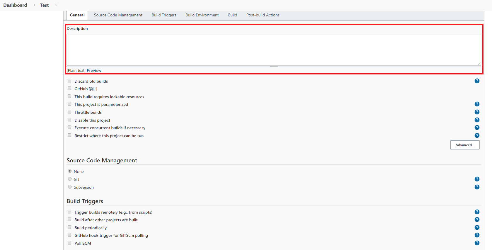
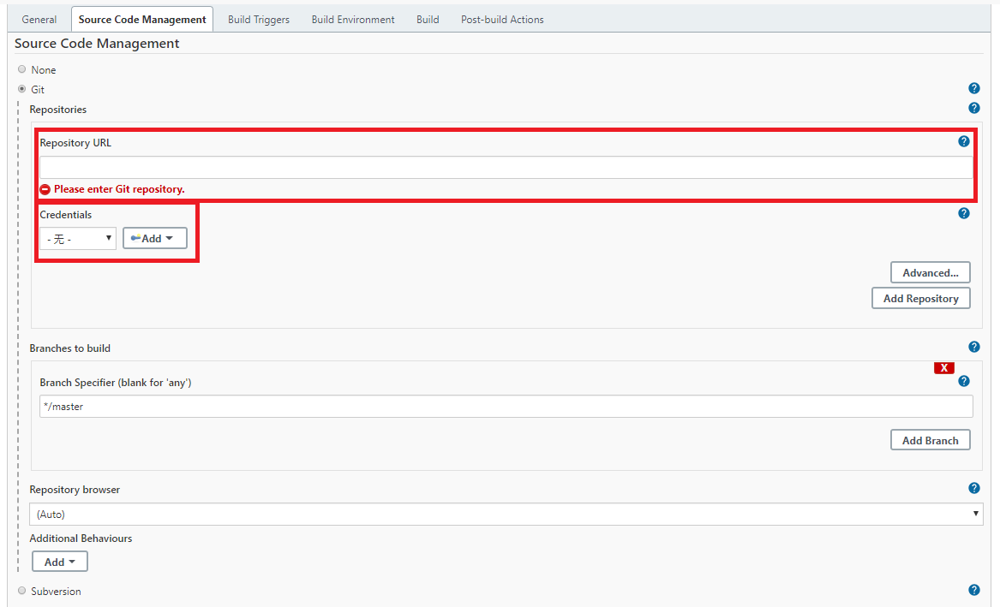
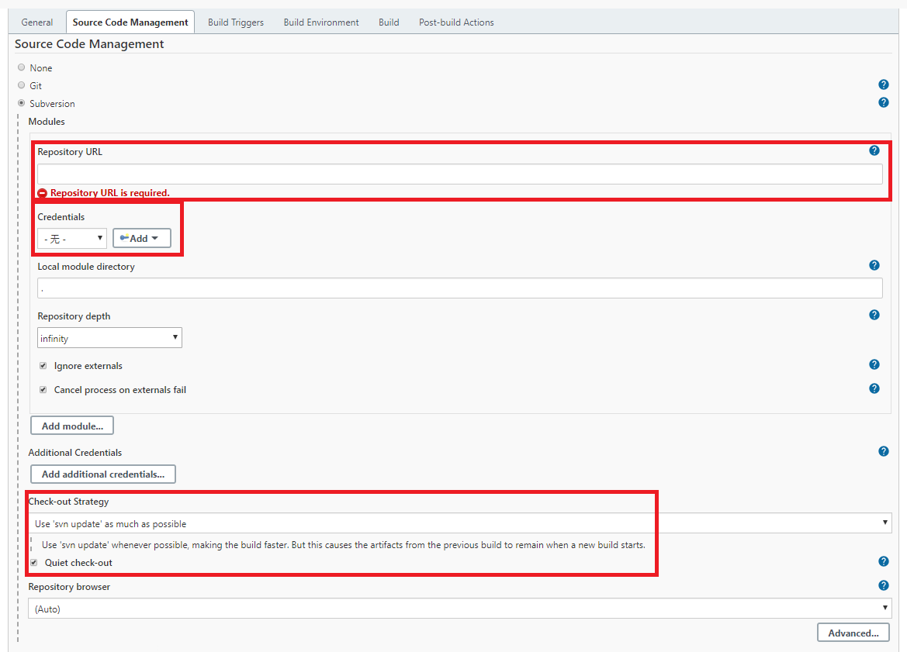
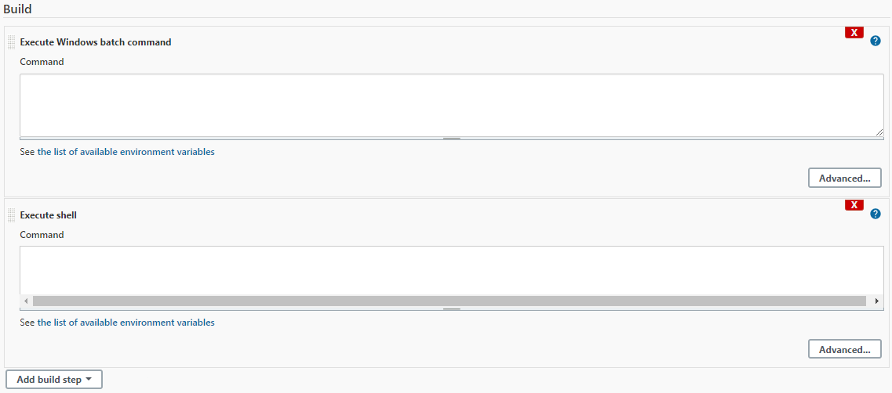
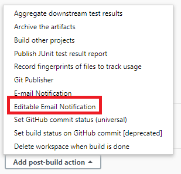
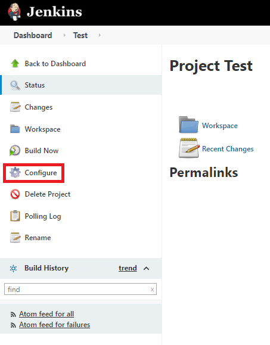

# 1. 新建任务

- 点击`Dashboard`下的`New Item`

- 编辑`Item Name`，选择如没有特别的需要，一般默认选择`FreeStyle Project`

- **快捷操作**：如果要**在既有的任务上创建新任务**，可以使用`Copy From`的功能创建**新任务**

# 2. 任务设置

## 2.1 Pre-Build（构建前的操作）

### ① 任务的描述信息

- **作用**：描述任务的工作用途
- **默认**：**非必填项**，即使为空，也不影响任务的运行

### ② 指定任务的运行节点

- **作用**：指定任务的运行节点，在多工作节点系统下适用
- **默认**：**非必填项**，如果**没有指定工作节点**，则**任务运行在本机环境内**

### ③ 配置获取源码的方式

- **作用**：获取仓库代码，进行自动化作业（测试、部署、发布等）

- **支持仓库类型**：**空**、**GIT**、**Subversion（SVN）**

  - `Git`：填入**仓库地址**、**账户凭据**即可使用。可以**选择master/branch分支**

    

  - `SVN`：填入**仓库地址**、**账户凭据**即可使用。可以**选择checkout的策略**

    

### ④ 任务触发机制设定

- **作用**：设置任务的触发机制，可选`手动触发`、`周期触发`、`计划触发`等
- **默认**：**非必填项**，如果没有设置，则任务为**手动触发**机制

## 2.2 Build（构建）

### ① 指定构建时需要执行的脚本

- **作用**：指定构建时需要执行的脚本
  - 一般情况下，**Linux平台设置`shell脚本`、Windows平台设置`cmd脚本`、特定平台可以直接设置`python脚本`**

### ② 撰写执行脚本内容

- **作用**：Jenkins自动化作业的**核心功能**。**该模块会执行构建脚本的内容，根据构建脚本的执行状态，Jenkins反馈运行`成功`或`失败`。**

- **Jenkins天气状态变化**
  - Jenkins以`晴雨状态`来表示它的**运行状态**反馈，晴天表示成功，雨天表示失败

## 2.3 Post-Build（构建后的操作）

### ① 发送邮件通知

- **作用**：设置任务完成的邮件通知机制，可按照`Always`、`Successful`、`Failure`等状态分别给不同的相关人员发送邮件
- **依赖项**：需要提前设置**发件人**相关信息
- **默认**：**非必填项**，如果没有设置，则不发送任何邮件

# 3. 对既有任务进行配置修改

​		点击**既有的任务**，选择左侧的`Configure`，之后**参照上一节内容**进行设置调整。

​		