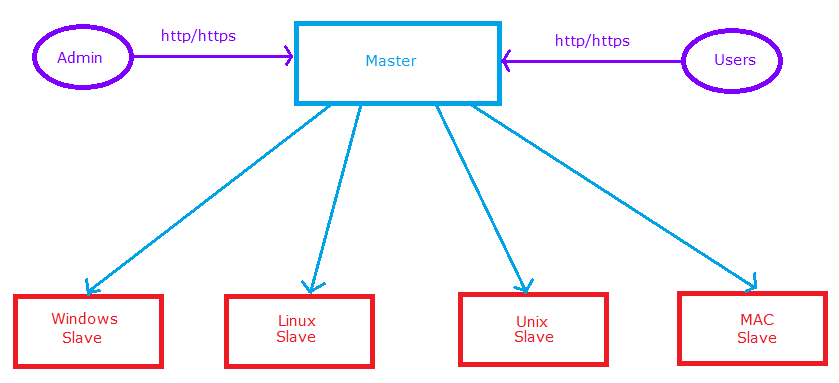
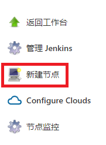
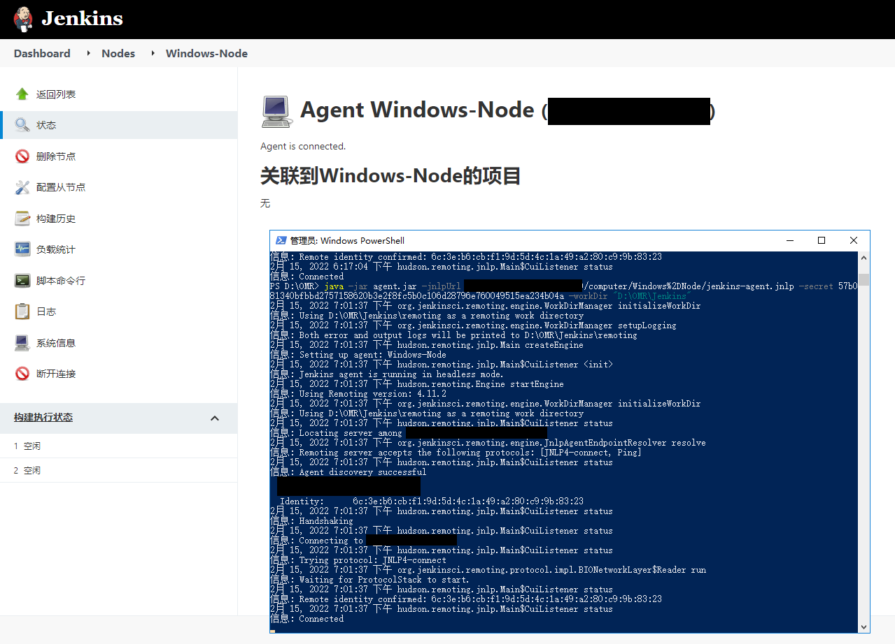
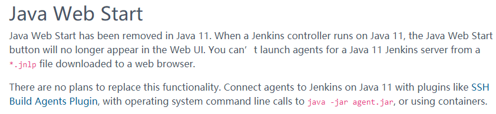
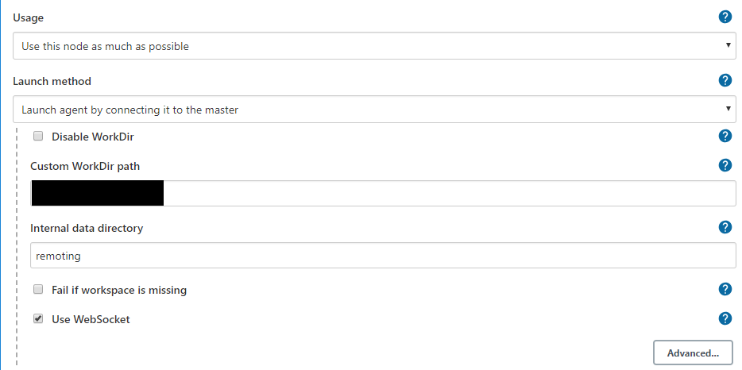

# 1. 介绍

:::important[核心思想]

​		当手头有空闲的服务器可以投入使用时，可以考虑**使用Jenkins的`分布式部署`方案，将部分任务分配到其他节点上，以减轻原始节点的工作负荷。**

:::

- **收益**：通过将构建任务分配到从节点上，减轻主节点的压力。
  - 任务**可以分配在Master上运行**，**也可以被分配到Slave上运行。**
  - **一个Master可以关联多个Slave**，用来为**不同任务**或者**相同任务的不同配置**来服务。
- **做法**：Master提供web接口让用户来管理Job和Slave。

# 2. 配置方法：以Windows环境、Java Web Start方案为例

## 2.1 新建节点

1. 选择`Manage Jenkins`，再选择`Manage Nodes and Clouds`，准备配置节点

   

2. 选择`新建节点`

   

3. **填写`节点名称`**，并勾选`Permanent Agent`

   

## 2.2 配置节点启动方式

​		节点启动方式设定为`Launch agent by connecting it to the controller`。

**提醒**：这里的**启动方式的描述内容**，由于Jenkins的软件版本更新，更改过好几次，但都是一个含义。

- 起初：Launch agent via Java Web Start

- 后来：Launch agent by connecting it to the master

- 现在：Launch agent by connecting it to the controller

## 2.3 启动服务

​		**保存完配置**后，就可以从slave设备启动服务了。**可以通过`浏览器启动`，也可以通过`命令行启动`**（需要下载agent.jar文件到本地）。

## 2.4 连接成功

# 3. 疑难杂症

## 3.1 浏览器方式启动打不开？

​		和Java环境版本有关。[JDK 11不再支持Java Web Start功能](https://www.jenkins.io/doc/administration/requirements/upgrade-java-guidelines/)，JDK 8支持。

## 3.2 连接的时候JNLP4报错？

​		配置节点时要**勾选WebSocket**。

