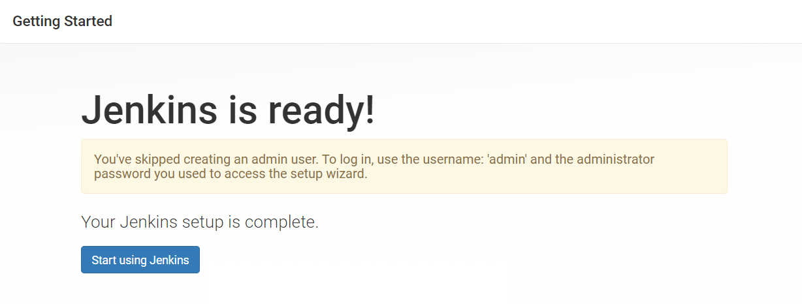
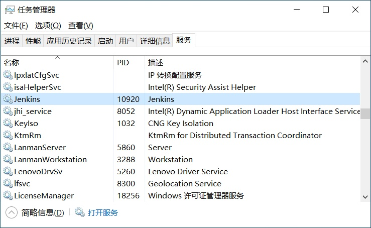

# 1. Jenkins的初始化

## 1.1 启动Jenkins

​		打开浏览器，在地址栏输入**IP:PORT**，IP默认为：`127.0.0.1`，端口号默认为：`8080`。

​		按照提示，**使用管理员的密码文件，解锁Jenkins**。

## 1.2 配置插件

​		**安装推荐的插件即可。**

​		后续如有需要可在Jenkins的配置管理中进行增减。

## 1.3 创建管理员账户

​		既可以**继续使用**原本的admin账户，也可以**额外创建**admin账户，推荐先使用默认的admin账户。

## 1.4 进入Jenkins主界面

​		完成配置后Jenkins就准备就绪、可以进行使用了！

# 2. Jenkins的启动和停止

## 2.1 浏览器方式

- **启动**：http://localhost:8080
- **退出**：http://localhost:8080/exit
- **立即重启**：http://localhost:8080/restart
- **安全重启**：http://localhost:8080/safeRestart
  - **等待所有正在运行的作业完成**后，**自动重启Jenkins**
- **建议**：日常维护情况下，先从浏览器关闭Jenkins服务，再从终端停止Jenkins的服务。

## 2.2 Windows服务方式

- 打开**任务管理器**，进入**服务**。
- 找到**Jenkins**，右键对该服务进行管理：**停止**或**启用**。

## 2.3 Linux服务方式

- **启动**：`sudo service jenkins start`
- **停止**：`sudo service jenkins stop`
- **重启**：`sudo service jenkins restart`

## 2.4 Docker方式

- **启动**：`docker start Jenkins容器ID`
- **停止**：`docker stop Jenkins容器ID`
- **重启**：`docker restart Jenkins容器ID`