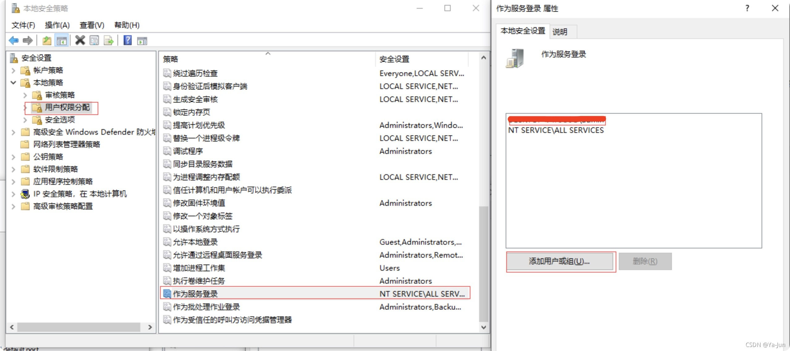
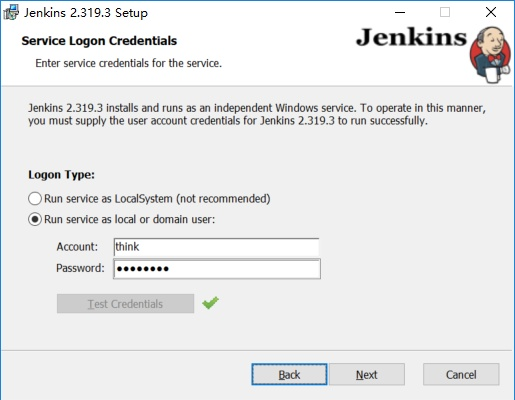
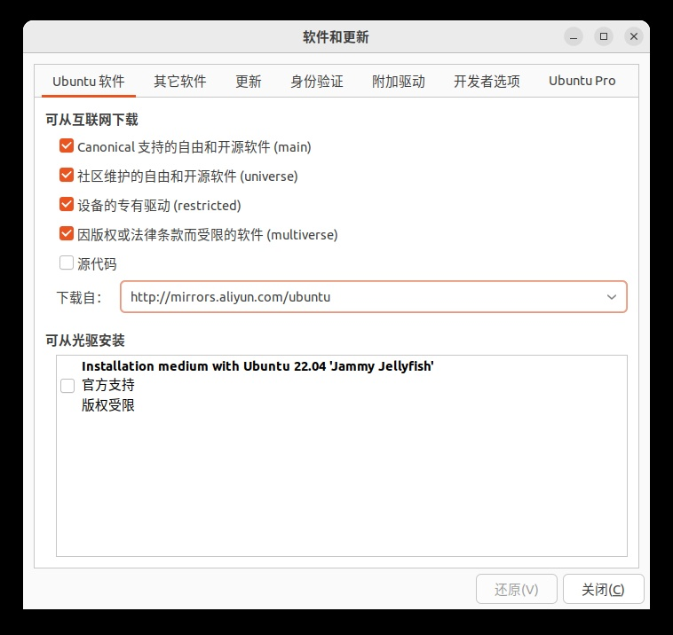
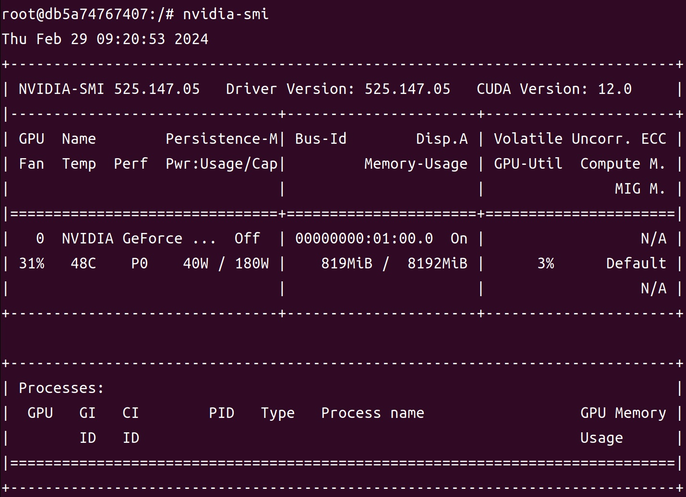

# 1. Windows环境

## 1.1 运行环境准备

- **安装Java运行环境**，版本：`Java 1.8` 或 `Java11`


## 1.2 下载Jenkins

​		官网下载链接：https://www.jenkins.io/download

​		推荐下载**LTS**版本。

## 1.3 安装Jenkins

​		跟随安装提示，安装Jenkins即可。


## 1.4 疑难杂症：在安装过程中如何需要选择Logon Type？

- 选择`以本地用户或域用户来运行服务`。


- 用**cmd**运行`secpol.msc`打开**本地安全策略**



- **添加用户**


- 回到安装界面**填入本地账户**即可




# 2. Linux环境：Docker容器化技术

## 2.1 运行环境准备

### 2.1.1 更新系统环境

- 切换系统的**安装源**



- 终端内**更新系统软件**

  ```shell
  sudo apt update
  sudo apt upgrade
  ```

### 2.1.2 安装Docker

```shell
# 安装curl
sudo apt-get install curl
# 获取Docker的GPG
curl -fsSL https://download.docker.com/linux/ubuntu/gpg | sudo gpg --dearmor -o /usr/share/keyrings/docker-archive-keyring.gpg
# 下载Docker并安装
curl -fsSL http://get.docker.com | bash -s docker --mirror Aliyun
```

### 2.1.3 备用操作

```shell
systemctl start docker    # 启动docker
docker -v                 # 检查docker版本
systemctl stop docker     # 停止docker

sudo docker images        # 查看全部镜像
sudo docker ps -a         # 查看全部容器

sudo docker rmi 镜像ID号或镜像名称 # 删除镜像
sudo docker rm 容器ID号或容器名称  # 删除容器
```

## 2.2 Docker环境内加载NVIDIA显卡驱动

​		在**Docker 19**版本之后，安装 `nvidia-container-runtime` 的运行包即可调用英伟达显卡驱动，使用的时候用 **--gpus参数** 来控制显卡驱动的功能。

### 2.2.1 安装nvidia-container-runtime

- **添加Nvidia的apt存储库**

```bash
curl -s -L https://nvidia.github.io/nvidia-container-runtime/gpgkey | \
sudo apt-key add -
distribution=$(. /etc/os-release;echo $ID$VERSION_ID)
curl -s -L https://nvidia.github.io/nvidia-container-runtime/$distribution/nvidia-container-runtime.list | \
sudo tee /etc/apt/sources.list.d/nvidia-container-runtime.list
```

- **更新apt存储库**

```bash
sudo apt-get update   
```

- **在docker环境外，安装nvidia-container-runtime**

```bash
sudo apt-get install nvidia-container-runtime
```

- **重启docker服务**

```bash
sudo systemctl restart docker
```

### 2.2.2 功能验证

- 新建空文件夹，在文件夹内**创建dockerfile文件**，内容如下

  ```dockerfile
  FROM ubuntu:22.04
  ```

- 在文件夹内打开终端，**构建docker镜像**，镜像名称可自定义，如：`nvidia_docker_test`

  ```bash
  sudo docker build -t nvidia_docker_test:1.0 .
  ```

- **创建容器**

  - 方案一

    ```bash
    sudo docker run -it --name Nvidia --gpus '"device=all","capabilities=compute,utility"'  nvidia_docker_test:1.0 /bin/bash
    ```

  - 方案二

    ```bash
    sudo docker run -it --name Nvidia --gpus all -e NVIDIA_VISIBLE_DEVICES=all -e NVIDIA_DRIVER_CAPABILITIES=compute,utility nvidia_docker_test:1.0 /bin/bash
    ```

- 进入新的容器，运行`nvidia-smi`确认显卡驱动运行状态。



## 2.3 用Dockerfile方式制作Jenkins镜像

- 手动编写**dockerfile**，放入**JenkinsEnv**文件夹中

```dockerfile
FROM jenkins/jenkins:lts

USER root

# Update apt source
RUN touch /etc/apt/sources.list
RUN echo "deb https://mirrors.aliyun.com/debian/ bookworm main non-free non-free-firmware contrib" >> /etc/apt/sources.list
RUN echo "deb-src https://mirrors.aliyun.com/debian/ bookworm main non-free non-free-firmware contrib" >> /etc/apt/sources.list
RUN echo "deb https://mirrors.aliyun.com/debian-security/ bookworm-security main" >> /etc/apt/sources.list
RUN echo "deb-src https://mirrors.aliyun.com/debian-security/ bookworm-security main" >> /etc/apt/sources.list
RUN echo "deb https://mirrors.aliyun.com/debian/ bookworm-updates main non-free non-free-firmware contrib" >> /etc/apt/sources.list
RUN echo "deb-src https://mirrors.aliyun.com/debian/ bookworm-updates main non-free non-free-firmware contrib" >> /etc/apt/sources.list
RUN echo "deb https://mirrors.aliyun.com/debian/ bookworm-backports main non-free non-free-firmware contrib" >> /etc/apt/sources.list
RUN echo "deb-src https://mirrors.aliyun.com/debian/ bookworm-backports main non-free non-free-firmware contrib" >> /etc/apt/sources.list
RUN apt-get update

# Install wget vim
RUN apt-get install -y wget vim

# Install miniconda3
RUN wget https://mirrors.tuna.tsinghua.edu.cn/anaconda/miniconda/Miniconda3-py310_23.9.0-0-Linux-x86_64.sh
RUN bash Miniconda3-py310_23.9.0-0-Linux-x86_64.sh -p /opt/miniconda3 -b   
RUN rm Miniconda3-py310_23.9.0-0-Linux-x86_64.sh

# Configure miniconda
ENV PATH=/opt/miniconda3/bin:${PATH}
RUN conda init

# Update miniconda conda source
RUN touch ~/.condarc
RUN echo "show_channel_urls: true" >> ~/.condarc
RUN echo "default_channels:" >> ~/.condarc
RUN echo "  - https://mirrors.tuna.tsinghua.edu.cn/anaconda/pkgs/main" >> ~/.condarc
RUN echo "  - https://mirrors.tuna.tsinghua.edu.cn/anaconda/pkgs/free/" >> ~/.condarc
RUN echo "  - https://mirrors.tuna.tsinghua.edu.cn/anaconda/pkgs/r" >> ~/.condarc
RUN echo "  - https://mirrors.tuna.tsinghua.edu.cn/anaconda/pkgs/msys2" >> ~/.condarc
RUN echo "  - https://mirrors.tuna.tsinghua.edu.cn/anaconda/cloud/pytorch/" >> ~/.condarc
RUN echo "  - https://mirrors.tuna.tsinghua.edu.cn/anaconda/cloud/menpo/" >> ~/.condarc
RUN echo "  - https://mirrors.tuna.tsinghua.edu.cn/anaconda/cloud/bioconda/" >> ~/.condarc
RUN echo "  - https://mirrors.tuna.tsinghua.edu.cn/anaconda/cloud/msys2/" >> ~/.condarc
RUN echo "  - https://mirrors.tuna.tsinghua.edu.cn/anaconda/cloud/conda-forge/" >> ~/.condarc
RUN conda clean -i -y

# Update miniconda pip source
RUN pip config set global.index-url https://pypi.tuna.tsinghua.edu.cn/simple
```

- 打开终端，切换到**JenkinsEnv**文件夹中

- 执行命令，**生成Jenkins镜像**——镜像名称和TAG可自行定义。此处**镜像名为jenkins_tool，TAG为1.0**

  ```bash
  sudo docker build -t jenkins_tool:1.0 .
  ```

- 镜像中包含

  - 基本工具：**wget**、**vim**、**miniconda3**
  - 国内镜像源：**apt源**、**conda源**、**pip源**

## 2.4 创建Jenkins容器

### 2.4.1 设置Jenkins的工作路径

```shell
# 以/media/seagate/jenkins_home为例
sudo mkdir -p /media/seagate/jenkins_home
sudo chmod 777 /media/seagate/jenkins_home
```

### 2.4.2 运行Jenkins容器

```shell
# 运行Jenkins
sudo docker run -dit \
                --name jenkins_env \
                --net=host \
                -v /var/run/docker.sock:/var/run/docker.sock \
                -v /usr/bin/docker:/usr/bin/docker \
                -v /media/seagate/jenkins_home:/var/jenkins_home \
                -v /etc/localtime:/etc/localtime \
                --gpus '"device=all","capabilities=compute,utility"' \
                jenkins_kbqa:1.0
```

- 参数说明

  - `-d`：后台运行容器
  - `-i`：以交互模式运行容器

  - `-t`：为容器重新分配一个伪输入终端

  - `--name`：**容器名称**

  - `--net=host`：默认容器的net方式为bridge方式，此处需要改为host方式，**使用这种方式容器可以直接使用宿主机的IP和端口，而不会自行虚拟IP和端口**

  - `-v /var/run/docker.sock:/var/run/docker.sock`和`-v /usr/bin/docker:/usr/bin/docker`：以**Docker outside of Docker**的方式启动容器，**使用这种方式可以在容器中进行docker命令**

  - `--gpus '"device=all","capabilities=compute,utility"'`：借助**nvidia-container-runtime**工具，**使容器内可以调度GPU资源**

### 2.4.3 备用操作

```shell
sudo docker start jenkins_env               # 启动Jenkins容器
sudo docker exec -it jenkins_env /bin/bash  # 进入Jenkins容器的工作目录
sudo docker stop jenkins_env                # 停止Jenkins容器
```

## 2.5 启动Jenkins

​		在浏览器中输入 **IP:PORT**，一般IP默认为 `127.0.0.1`，端口默认为`8080`端口，**浏览器弹出下述界面，表示Jenkins安装完成并成功启动了**。

