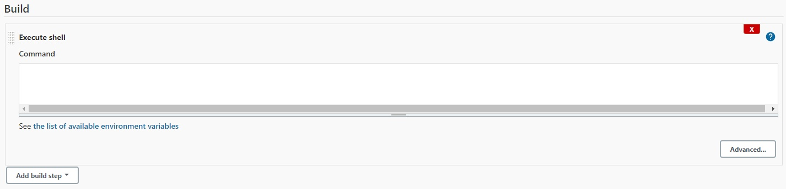
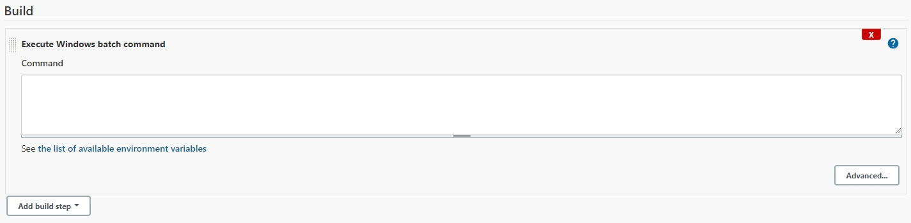
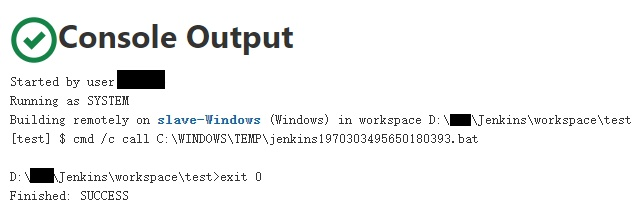
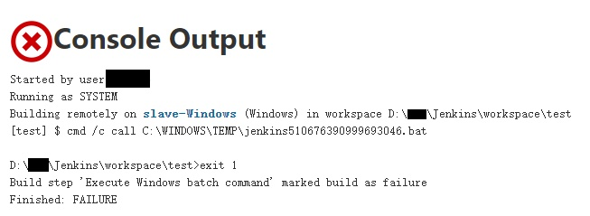

# 1. 触发任务

- `手动触发`：点击**任务**，选择左侧功能菜单中的**Build Now**即可

- `自动触发`：如果任务**设定了自动触发机制**，则在**满足触发时间条件**后，Jenkins会自动触发任务

# 2. 获取源代码

​		在任务触发后，Jenkins会**自动将仓库中的代码检出到本地指定的目录下**，一般为**指定的workspace工作路径**，以用于在本地执行Jenkins的工作任务。

# 3. 运行构建脚本

​		获取到源代码后，Jenkins会**自动将构建脚本的内容缓存到`tmp文件夹`**下，然后**启动相关程序运行文件**。

- `Linux环境`：启动**终端**执行`bash`文件

- `Windows环境`：启动**命令提示符**执行`bat`文件

# 4. 发送邮件通知

​		若Jenkins设置了邮件通知相关内容，则Jenkins在运行完构建脚本后会**自动向设定的邮箱中发送邮件**。

# 5. 反馈运行状态

​		Jenkins在执行完`cmd`或`shell`的命令块后，会有不同的状态提示：

- **命令块返回值为0时**，Jenkins提示`Finished: SUCCESS`

- **命令块返回值非0时**，Jenkins提示`Finished: FAILURE`

