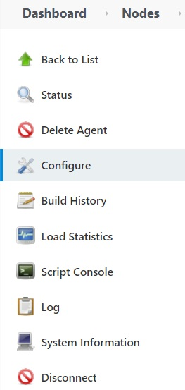
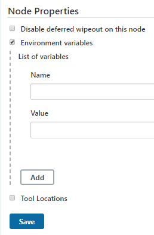

# 1. 介绍

​		如果jenkins在执行build过程时发生如 `“(某程序)不是内部或外部命令，也不是可运行的程序”` 这种报错，那么需要在Jenkins节点中**添加环境变量**：`Name`中填入**path**，`Value`中填入相应的**路径**，路径以分号结尾，**多个路径直接连接，不需要用分隔符**。

# 2. 操作方法

- 选择**当前运行的节点**，点击`Configure`进行配置修改

- 下拉至最下方，找到`Node Properties`，勾选`Environment variable`，填写`Name`和`Value`即可
  - `Name`：path
  - `Value`：路径;路径;...

# 3. 举例

## 不能识别python程序

- **提示**： `'python' 不是内部或外部命令，也不是可运行的程序`

- **Value追加路径**：C:\\Python35;C:\\Python35\\Scripts;

## 不能识别chcp命令

- **提示**： `'chcp' 不是内部或外部命令，也不是可运行的程序`

- **Value追加路径**：C:\\Windows;C:\\Windows\\System32;

## 不能识别conda环境

- **Value追加路径**：C:\\Users\\\*\\Anaconda3;C:\\Users\\\*\\Anaconda3\\Scripts;

## 不能识别CUDA环境

- **Value追加路径**：C:\\Program Files\\NVIDIA GPU Computing Toolkit\\CUDA\\v11.1\\bin;C:\\Program Files\\NVIDIA GPU Computing Toolkit\\CUDA\v11.1\\libvvp;C:\\Program Files\\Apache-Subversion-1.14.1\\bin;