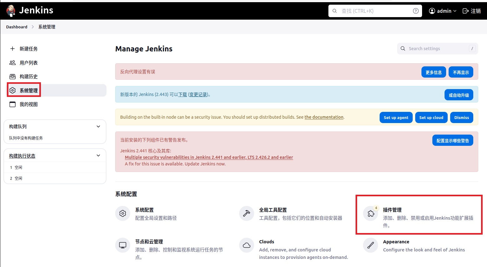
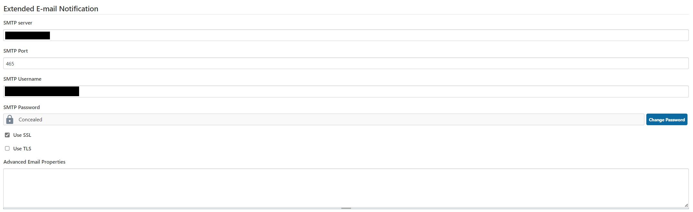
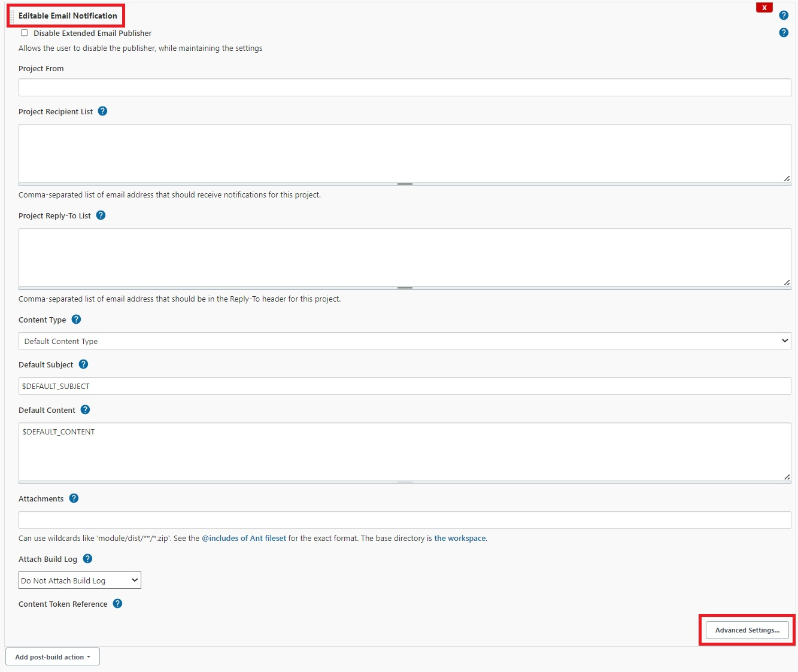
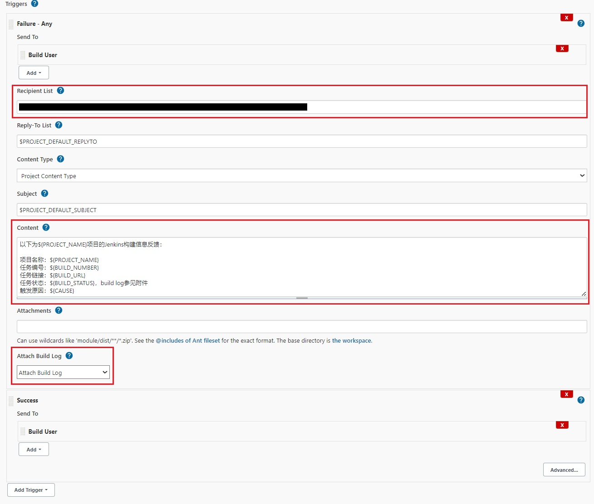
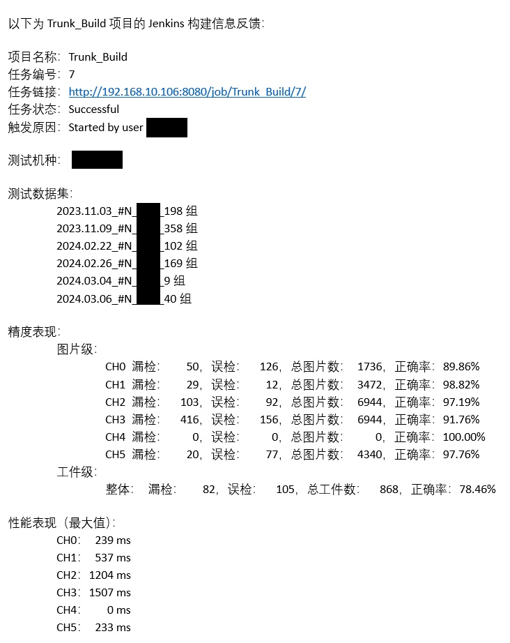

# 1. 介绍

​		完成基于Jenkins的持续集成部署后，在自动化测试执行完成，可以通过设定`邮件通知`的方案，将测试结果发送给相关人员。

# 2. 插件安装

- 选择左侧的`系统管理`，然后选择右侧的`插件管理`

- 搜索Jenkins插件并安装：`Email Extension`

# 3. 邮箱信息配置

- 选择左侧的`系统管理`，然后选择右侧的`系统配置`

- 填入**系统管理员邮件地址**：发件人邮箱
- 填入**SMTP Server地址**
- 填入**SMTP Port**：**465**

- 填入**SMTP Username**：发件人邮箱**账户**
- 填入**SMTP Password**：发件人邮箱**账户密码**（会自动隐藏）

# 4. 任务配置

​		在任务配置的**构建后**流程中，可以**添加`邮件通知`模块**。邮件通知机制可分为**无差别投递**和**精准投递**。

## 无差别投递

### 特点

​		**不论任务执行成功与否，都进行邮件推送。**

### 配置

- 在**构建后**流程中增加`邮件通知模块`
- 在`Project Recipient List`中添加收件人信息，用**英文逗号**或**空格**分隔
- **可选**配置`Attach Build Log`：邮件中**以附件形式发送构建过程的log信息**

## 精准投递

### 特点

​		**根据不同的任务执行结果，将邮件发送给相关的收件人**

### 配置

- 在**构建后**流程中增加`邮件通知模块`，选择`Advance Settings`

- **增加发送邮件的`触发规则`**，常用的有：**Failure**、**Success**、**Fixed**、**Always**等

  - 根据不同的触发规则，在`Recipient List`中填写相应的收件人
  - 在`Content`中填写邮件内容，可以使用**系统变量**作为便捷信息进行通知
  - 同**无差别投递**一样，支持在邮件中**以附件形式发送构建过程的log信息**

# 5. 预览

