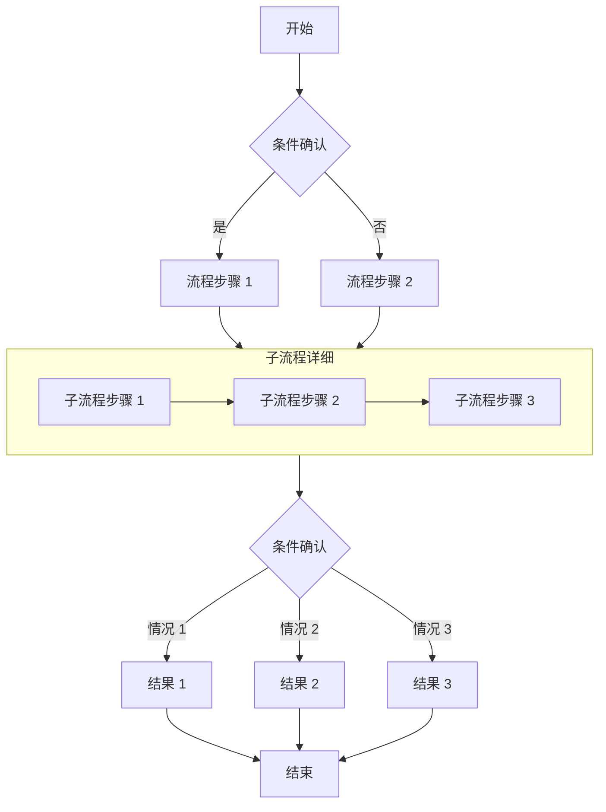
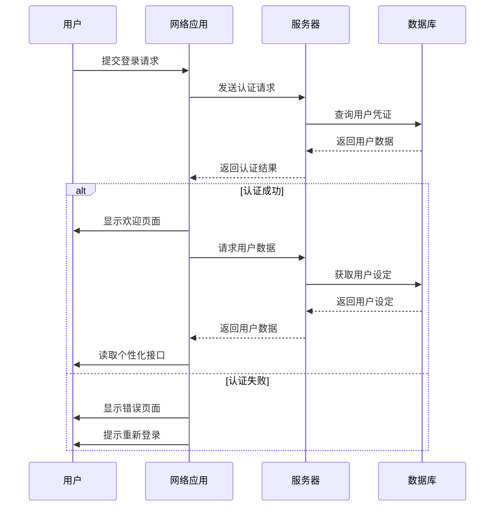
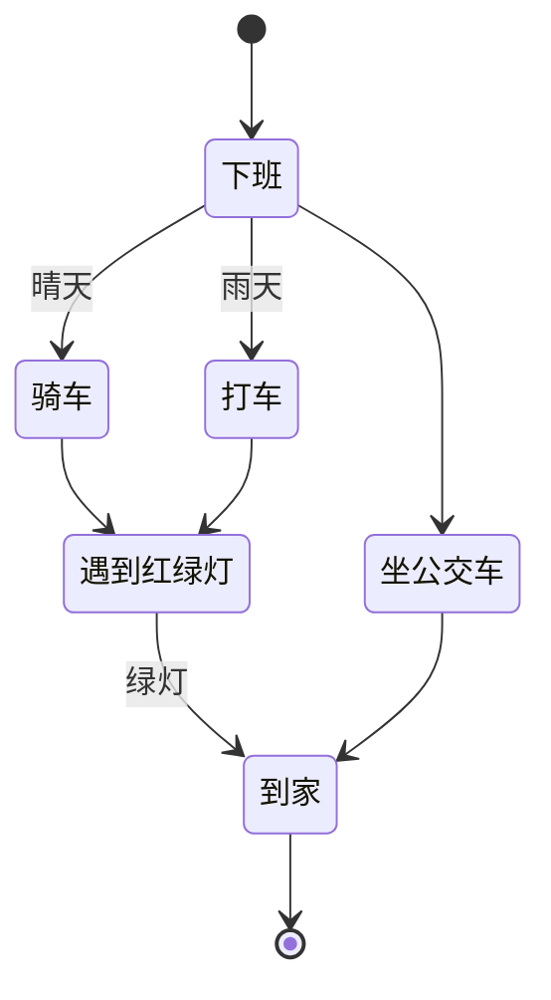
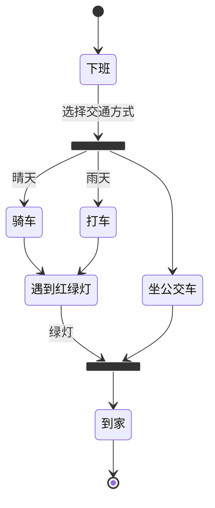
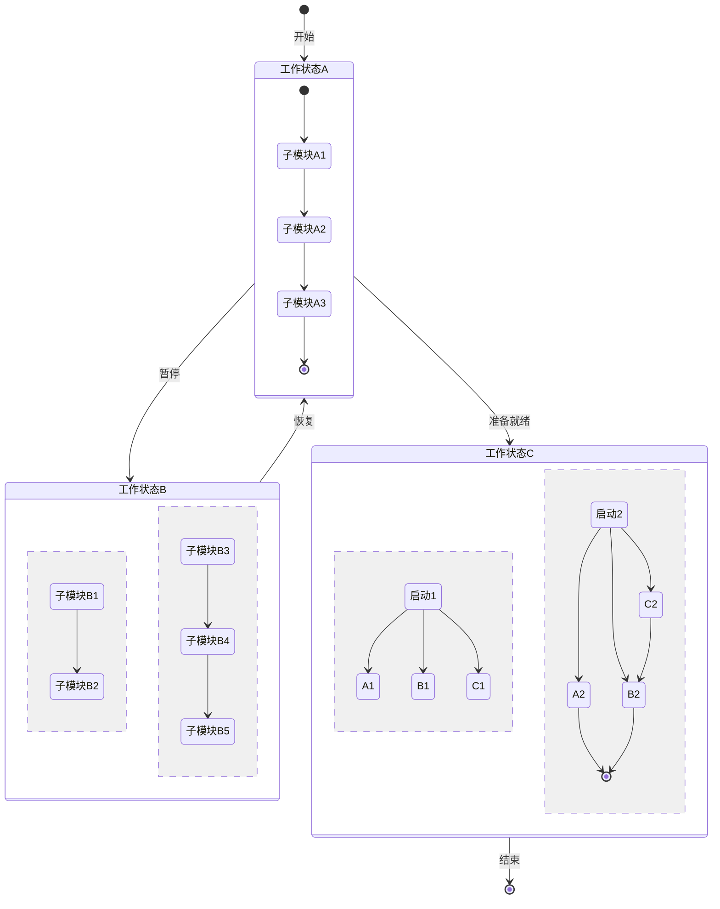
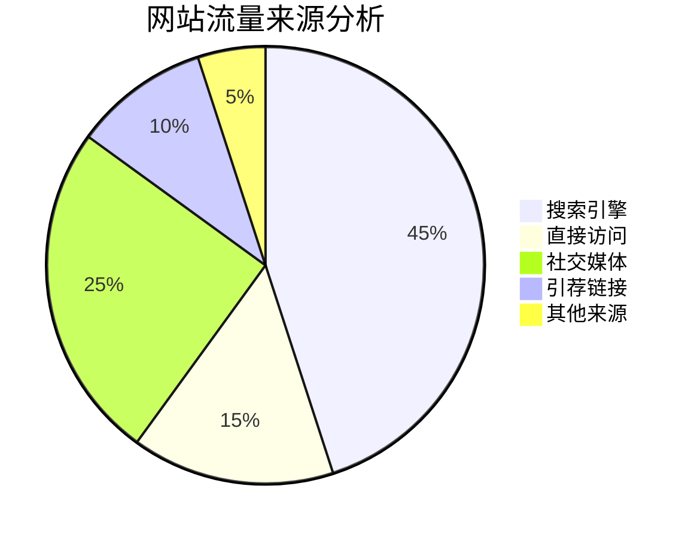
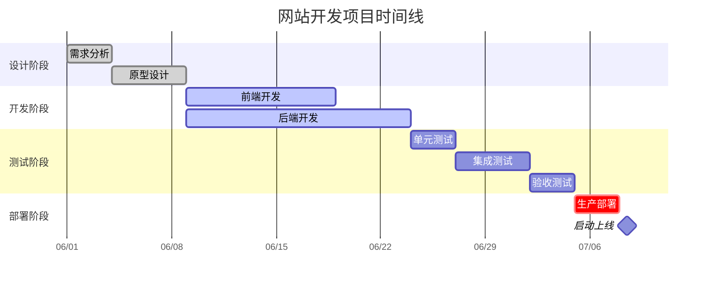
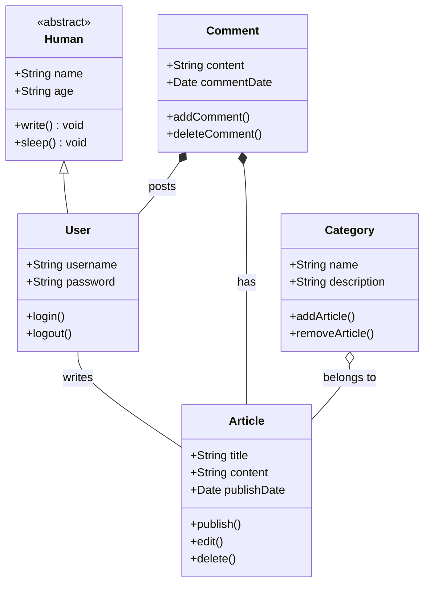

# 1. 流程图：flow

```text
graph TD
    A[开始] --> B{条件确认}
    B -->|是| C[流程步骤 1]
    B -->|否| D[流程步骤 2]
    C --> E[子流程]
    D --> E
    subgraph E [子流程详细]
        E1[子流程步骤 1] --> E2[子流程步骤 2]
        E2 --> E3[子流程步骤 3]
    end
    E --> F{条件确认}
    F -->|情况 1| G[结果 1]
    F -->|情况 2| H[结果 2]
    F -->|情况 3| I[结果 3]
    G --> J[结束]
    H --> J[结束]
    I --> J[结束]
```



# 2. 时序图：sequence

```text
sequenceDiagram
    participant 用户
    participant 网络应用
    participant 服务器
    participant 数据库

    用户 ->> 网络应用: 提交登录请求
    网络应用 ->> 服务器: 发送认证请求
    服务器 ->> 数据库: 查询用户凭证
    数据库 -->> 服务器: 返回用户数据
    服务器 -->> 网络应用: 返回认证结果

alt 认证成功
    网络应用 ->> 用户: 显示欢迎页面
    网络应用 ->> 服务器: 请求用户数据
    服务器 ->> 数据库: 获取用户设定
    数据库 -->> 服务器: 返回用户设定
    服务器 -->> 网络应用: 返回用户数据
    网络应用 ->> 用户: 读取个性化接口
else 认证失败
    网络应用 ->> 用户: 显示错误页面
    网络应用 ->> 用户: 提示重新登录
end
```



# 3. 状态图：diagram

## 起点、终点、分支条件

- **[\*]** 表示**起点**和**终点**
- **状态后加备注**表示**分支条件**

```text
stateDiagram-v2

[*] --> 下班
下班 --> 骑车: 晴天
下班 --> 坐公交车
下班 --> 打车: 雨天
骑车 --> 遇到红绿灯
打车 --> 遇到红绿灯
遇到红绿灯 --> 到家: 绿灯
坐公交车 --> 到家
到家 --> [*]
```



## fork分流、join合流

```text
stateDiagram-v2

state fork <<fork>>
state join <<join>>

[*] --> 下班
下班 --> fork: 选择交通方式
fork --> 骑车: 晴天
fork --> 坐公交车
fork --> 打车: 雨天
骑车 --> 遇到红绿灯
打车 --> 遇到红绿灯
遇到红绿灯 --> join: 绿灯
坐公交车 --> join
join --> 到家
到家 --> [*]
```



## 状态子模块

```text
stateDiagram-v2

[*] --> 工作状态A:开始
工作状态A --> 工作状态B:暂停
工作状态B --> 工作状态A:恢复
工作状态A --> 工作状态C:准备就绪
工作状态C --> [*]:结束

state 工作状态A
{
[*] --> 子模块A1
子模块A1 --> 子模块A2
子模块A2 --> 子模块A3
子模块A3 --> [*]
}

state 工作状态B
{
子模块B1 --> 子模块B2
--
子模块B3 --> 子模块B4
子模块B4 --> 子模块B5
}

state 工作状态C
{
启动1 --> A1
启动1 --> B1
启动1 --> C1
--
启动2 --> A2
启动2 --> B2
启动2 --> C2
A2 --> [*]
B2 --> [*]
C2 --> B2
}
```



# 4. 饼图：Pie

```text
pie title 网站流量来源分析
    "搜索引擎" : 45
    "直接访问" : 15
    "社交媒体" : 25
    "引荐链接" : 10
    "其他来源" : 5
```



# 5. 甘特图：Gantt

## 常用参数

- **状态**：`done`（完成）、`active`（进行中）、`crit`（关键任务）
- **日期格式**：`YYYY-MM-DD`（年-月-日）
- **时间单位**：`d`（天）、`w`（周）、`h`（小时）
- **依赖关系**：`after 任务ID`（在某个任务之后开始）

## 示例

```text
gantt
    title 网站开发项目时间线
    dateFormat YYYY-MM-DD
    axisFormat %m/%d

    section 设计阶段
    需求分析     :done, a1, 2025-06-01, 3d
    原型设计     :done, a2, after a1, 5d
    
    section 开发阶段
    前端开发     :active, b1, after a2, 10d
    后端开发     :active, b2, after a2, 15d
    
    section 测试阶段
    单元测试     :c1, after b2, 3d
    集成测试     :c2, after c1, 5d
    验收测试     :c3, after c2, 3d
    
    section 部署阶段
    生产部署     :crit, d1, after c3, 3d
    启动上线     :milestone, after d1, 0d
```



# 6. 类图：Class

## 类成员修饰符

- `+` public（公共）
- `-` private（私有）
- `#` protected（保护）
- `~` package/internal（包内/内部）

## 关系类型

- `<|--` 继承（Inheritance）
- `*--` 组合（Composition）
- `o--` 聚合（Aggregation）
- `-->` 关联（Association）
- `..|>` 接口实现（Interface Realization）

## 特殊标记

- `<<enum>>` 枚举变量

- `<<interface>>` 接口
- `<<abstract>>` 抽象类

## 示例

```text
classDiagram
    class Human {
        <<abstract>>
        +String name
        +String age
        +write() void
        +sleep() void
    }

    class User {
        +String username
        +String password
        +login()
        +logout()
    }
    
    class Article {
        +String title
        +String content
        +Date publishDate
        +publish()
        +edit()
        +delete()
    }
    
    class Comment {
        +String content
        +Date commentDate
        +addComment()
        +deleteComment()
    }
    
    class Category {
        +String name
        +String description
        +addArticle()
        +removeArticle()
    }
    
    Human <|-- User
    User -- Article : writes
    Comment *-- User : posts
    Comment *-- Article : has
    Category o-- Article : belongs to
```

