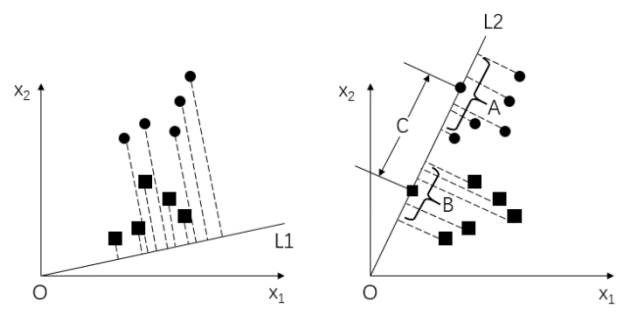
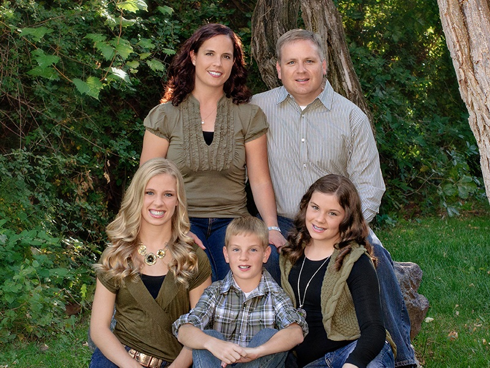
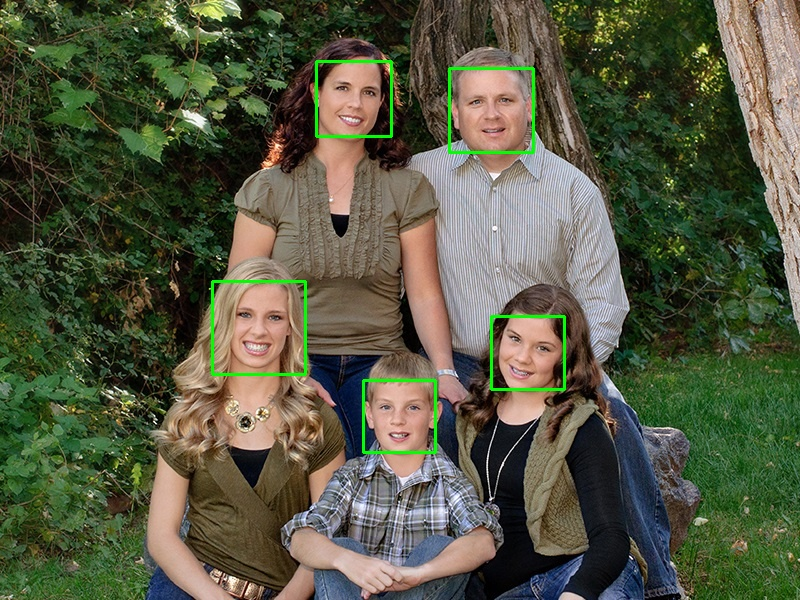

# 	1. 介绍

​		**人脸识别**是指**程序对输入的人脸图像进行判断**，并**识别出其对应的人**的过程。

# 2. 人脸识别

​		人脸识别，就是要**找到一个模型**可以**用简洁又具有差异性的方式准确反映出每个人脸的特征**。**在识别人脸时，先`将当前人脸采用与前述同样的方式提取特征`，再`从已有特征集中找出当前特征的最邻近样本`，从而得到当前人脸的标签**。

​		OpenCV提供了三种人脸识别方法，分别是**LBPH方法**、**EigenFishfaces方法**和**Fisherfaces方法**。

## 2.1 LBP人脸识别

### 原理

​		**LBP算法**的基本原理是，将**像素点A的值与其最邻近的 8 个像素点的值逐一比较**：

- 如果**A的像素值大于其临近点的像素值**，则得到**0**。
- 如果**A的像素值小于其临近点的像素值**，则得到**1**。

​		最后，将得到的0和1值连起来，得到一个**8位的二进制序列**，这个二进制序列转换为十进制数，即是点A的**LBP值**。

​		**LBP算法**也是**获取图像的灰度变化特征**，但**LBP算法受光照影响较小，算法稳定性较强**。

### 使用方法

- 用函数`cv2.face.LBPHFaceRecognizer_create()`**生成识别器实例**。
  - **函数原型**：`val = cv2.face.LBPHFaceRecognizer_create( radius, neighbors, grid_x, grid_y, threshold )`
- 用函数`cv2.face_FaceRecognizer.train()`完成**模型训练**。
  - **函数原型**：`None = cv2.face_FaceRecognizer.train( src, labels )`
- 用函数`cv2.face_FaceRecognizer.predict()`完成**人脸识别**。
  - **函数原型**：`label, confidence = cv2.face_FaceRecognizer.predict( src )`

### 示例

```python
import cv2
import numpy as np

Amount = 9
Group = 40

# 准备训练数据
images = []
for s in range(1, 1 + Group):
    for n in range(1, 1 + Amount):
        path  = "ORL" + "\\" + "s" + str(s) + "\\" + str(n) + ".pgm"
        image = cv2.imread(path, 0)
        # cv2.imshow("preview", image)
        # cv2.waitKey()
        images.append(image)

labels = []
count  = 0
for s in range(1, 1 + Group):
    label = [count] * Amount
    count = count + 1
    labels.extend(label)

# 训练
recognizer = cv2.face.LBPHFaceRecognizer_create()
recognizer.train(images, np.array(labels))

# 预测
s = np.random.randint(1, 1 + Group)

path  = "ORL" + "\\" + "s" + str(s) + "\\10.pgm"
predict_image = cv2.imread(path, 0)
cv2.imwrite("LBPH_predict.png", predict_image)

label, confidence = recognizer.predict(predict_image)

print("select =", str(s))
print("predict =", str(label+1))
print("confidence = %.2f" % confidence)   # 值越接近于0，识别可靠性越高
```

```python
select = 12
predict = 12
confidence = 64.23
```


## 2.2 PCA人脸识别（EigenFace）

### 原理

​		**EigenFaces**通常也被称为**特征脸**，它**使用 `主成分分析` 方法将高维的人脸数据处理为低维数据后，再进行数据分析和处理，获取识别结果**。

### 使用方法

- 用函数`cv2.face.EigenFaceRecognizer_create()`**生成识别器实例**。
  - **函数原型**：`val = cv2.face.LBPHFaceRecognizer_create( num_components, threshold )`
- 用函数`cv2.face_FaceRecognizer.train()`完成**模型训练**。
  - **函数原型**：`None = cv2.face_FaceRecognizer.train( src, labels )`
- 用函数`cv2.face_FaceRecognizer.predict()`完成**人脸识别**。
  - **函数原型**：`label, confidence = cv2.face_FaceRecognizer.predict( src )`

### 示例

```python
import cv2
import numpy as np

Amount = 9
Group = 40

# 准备训练数据
images = []
for s in range(1, 1 + Group):
    for n in range(1, 1 + Amount):
        path  = "ORL" + "\\" + "s" + str(s) + "\\" + str(n) + ".pgm"
        image = cv2.imread(path, 0)
        # cv2.imshow("preview", image)
        # cv2.waitKey()
        images.append(image)

labels = []
count  = 0
for s in range(1, 1 + Group):
    label = [count] * Amount
    count = count + 1
    labels.extend(label)

# 训练
recognizer = cv2.face.EigenFaceRecognizer_create()
recognizer.train(images, np.array(labels))

# 预测
s = np.random.randint(1, 1 + Group)

path  = "ORL" + "\\" + "s" + str(s) + "\\10.pgm"
predict_image = cv2.imread(path, 0)
cv2.imwrite("EigenFace_predict.png", predict_image)

label, confidence = recognizer.predict(predict_image)

print("select =", str(s))
print("predict =", str(label+1))
print("confidence = %.2f" % confidence)   # 值越接近于0，识别可靠性越高
```

```python
select = 33
predict = 33
confidence = 772.21
```


## 2.3 LDA人脸识别（FisherFace）

### 原理

​		**Fisherfaces**采用**LDA方法**（Linear Discriminant Analysis）实现人脸识别。

​		**线性判别分析**在**对特征降维**的同时考虑类别信息：在**低维**表示下，**相同的类应该紧密地聚集在一起**；**不同的类别应该尽可能地分散开，并且它们之间的距离尽可能地远**。

​		`线性判别分析`就是要尽力满足以下两个要求：

- `类别之间的差别尽可能地大`。
- `类别内部的差别尽可能地小`。

​		做**线性判别分析**时，首先**将训练样本集投影到一条直线上，让投影后的点满足：同类间的点尽可能地靠近，异类间的点尽可能地远离**。做**识别**时，**将待测样本再投影到直线上**，**根据投影点的位置判定样本的类别，就完成了识别**。



### 使用方法

- 用函数`cv2.face.FisherFaceRecognizer_create()`**生成识别器实例**。
  - **函数原型**：`val = cv2.face.LBPHFaceRecognizer_create( num_components, threshold )`
- 用函数`cv2.face_FaceRecognizer.train()`完成**模型训练**。
  - **函数原型**：`None = cv2.face_FaceRecognizer.train( src, labels )`
- 用函数`cv2.face_FaceRecognizer.predict()`完成**人脸识别**。
  - **函数原型**：`label, confidence = cv2.face_FaceRecognizer.predict( src )`

### 示例

```python
import cv2
import numpy as np

Amount = 9
Group = 40

# 准备训练数据
images = []
for s in range(1, 1 + Group):
    for n in range(1, 1 + Amount):
        path  = "ORL" + "\\" + "s" + str(s) + "\\" + str(n) + ".pgm"
        image = cv2.imread(path, 0)
        # cv2.imshow("preview", image)
        # cv2.waitKey()
        images.append(image)

labels = []
count  = 0
for s in range(1, 1 + Group):
    label = [count] * Amount
    count = count + 1
    labels.extend(label)

# 训练
recognizer = cv2.face.FisherFaceRecognizer_create()
recognizer.train(images, np.array(labels))

# 预测
s = np.random.randint(1, 1 + Group)

path  = "ORL" + "\\" + "s" + str(s) + "\\10.pgm"
predict_image = cv2.imread(path, 0)
cv2.imwrite("FisherFace_predict.png", predict_image)

label, confidence = recognizer.predict(predict_image)

print("select =", str(s))
print("predict =", str(label+1))
print("confidence = %.2f" % confidence)   # 值越接近于0，识别可靠性越高
```

```python
select = 2
predict = 2
confidence = 616.28
```


# 3. 人脸检测

​		在**人脸检测**中，主要任务是**构造能够区分包含人脸实例和不包含人脸实例的分类器**。这些**包含人脸图像**的实例，被称为**正类**，而**不包含人脸图像**的实例，则被称为**负类**。

​		OpenCV提供了**三种不同的训练好的级联分类器**，分别为 **`HAAR特征`级联分类器**、 **`HOG特征`分类器**和 **基于`LBP算法`的级联分类器**。

​		在OpenCV中，**有一些训练好的级联分类器**，方便供用户使用。这些分类器可以用来**检测人脸**、**检测脸部特征**（眼睛、鼻子）、**检测人体或其他物体**。这些级联分类器**以XML文件的形式**存放在OpenCV源文件的**data目录**下，**加载不同级联分类器的XML文件就可以实现对不同对象的检测**。

​		**Haar特征**反映的是**图像的灰度变化**，它**将像素划分为模块后求差值**。**Haar特征用黑白两种矩形框组合成特征模板**，在特征模板内，**用白色矩形像素块的像素和减去黑色矩形像素块的像素和**来表示该模板的特征。

| XML文件名                           | 级联分类器类型 |
| :---------------------------------- | :------------: |
| harrcascade_eye.xml                 |    眼睛检测    |
| haarcascade_eye_tree_eyeglasses.xml |    眼镜检测    |
| haarcascade_mcs_nose.xml            |    鼻子检测    |
| haarcascade_mcs_mouth.xml           |    嘴巴检测    |
| harrcascade_smile.xml               |    表情检测    |
| hogcascade_pedestrians.xml          |    行人检测    |
| lbpcasecade_frontalface.xml         |  正面人脸检测  |
| lbpcasecade_profileface.xml         |  侧面人脸检测  |
| lbpcascade_silverware.xml           |    金属检测    |

## 示例

```python
import cv2

# 读取待检测的图像
image = cv2.imread('family.jpg')

# 获取 XML 文件，加载人脸检测器
faceCascade = cv2.CascadeClassifier('haarcascade_frontalface_default.xml')

# 色彩转换，转换为灰度图像
gray = cv2.cvtColor(image,cv2.COLOR_BGR2GRAY)

# 调用函数 detectMultiScale
faces = faceCascade.detectMultiScale( gray,
                                      scaleFactor=1.15,
                                      minNeighbors=10,
                                      minSize=(5,5))

# 打印输出的测试结果
print("共发现{0}个人脸!".format(len(faces)))
print("人脸坐标为：\n", faces)

# 逐个标注人脸
for (x, y, w, h) in faces:
    cv2.rectangle(image, (x, y), (x + w, y + w), (0, 255, 0), 2)

# 保存检测结果
cv2.imwrite("face_detect.jpg", image)
```

```python
共发现5个人脸!
人脸坐标为：
 [[449  68  84  84]
 [363 380  72  72]
 [316  61  75  75]
 [491 316  73  73]
 [212 281  93  93]]
```

|         原图          |            检测结果             |
| :-------------------: | :-----------------------------: |
|  |  |

# 4. 人脸数据库

- 在线数据集合：http://face-rec.org/databases

## CAS-PEAL

​		**CAS-PEAL**是**中科院计算技术研究所在2003年完成的包含1040位志愿者**（其中有**595位男性**和**445位女性**）**的共99594幅人脸图像的数据库**。

​		数据集的所有图像都是在专门的采集环境中采集的，涵盖了**姿态**、**表情**、**饰物**和**光照**等4种主要变化条件，部分人脸图像**具有背景、距离和时间跨度的变化**。

​		目前，该数据库面向研究开放了其子集**CAS-PEAL-R1**，包含**1040人**的**30900幅图像**。

## ORL

​		**ORL数据集**包含**40个人**的**400幅图像**。这些图像具有**不同的拍摄时间**、**不同的光线**、**不同的面部表情**和**不同的面部细节**。

​		**所有的图像**都是在**亮度均匀的背景**下拍摄的，被拍摄对象处于**直立状态**，拍摄**正脸**。

​		数据集内所有的图像是**以PGM格式存储**的，都是尺寸为**92×112**，包含**256个灰度级**的灰度图像。**图像文件被放置在40个不同的目录内，目录名用3位数字的序号表示，每个目录对应一个不同的人，里面有10幅被拍摄对象的不同图像，并用两位数字作为文件名**。

## Yale

​		**Yale数据集**由**15人**（14名男性、1名女性）的人脸图像组成，**每人都有11幅灰度图像**。这个数据集的人脸图像，在**光线条件**、**面部表情**和**饰物**等方面都有变化。

## Extended Yale

​		在Yale数据集上扩充至**28人**，其数据集包含**28个人**在**9个姿势**和**64个照明条件**下的**16128幅图像**。

## FERET

​		FERET（Facial Recognition Technology）是由美国国防部资助的计划，该计划**旨在开发用于人脸自动识别的新技术和算法**。

​		**FERET数据库**包含**1564组**， **共计14126幅图像**。所有这些图像，是**由1199个不同的被拍摄对象**及**365组重复拍摄对象**的图像构成的，其中的365组重复拍摄对象，是指被拍摄对象在已经完成第1组拍摄的情况下，在不同的时间又拍摄了第2组图像。

​		**FERET数据库**是**人脸识别领域应用最广泛的人脸数据库之一**。