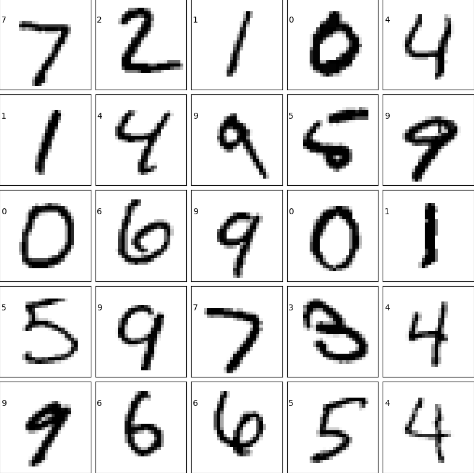

# 1. 介绍

​		**MNIST数据集**是**由0~9手写数字图片和数字标签组成**，包含**60000个训练样本**和**10000个测试样本**，每个样本都是一张**28 * 28像素**的**灰度**手写数字图片。本文采用 **`K近邻方式`** 对**MNIST数据集**进行**训练与识别**。




# 2. 数据读取

- 采用**struct模块**，**读取MNIST图像数据**。

- 读取完成后，得到**4个变量**：
  - **train_images**：`train-images.idx3-ubyte`，unit8类型，(60000, 768)，每一行对应一个图像数据
  - **train_labels**：`train-labels.idx1-ubyte`, unit8类型，(60000, )，每一行对应一个图像数据的标签
  - **test_images**：`t10k-images.idx3-ubyte`, unit8类型，(10000, 768)，每一行对应一个图像数据
  - **test_labels**：`t10k-labels.idx1-ubyte`, unit8类型，(10000, )，每一行对应一个图像数据的标签

```python
import os
import time
import struct
import numpy as np
import matplotlib.pyplot as plt
import cv2

def load_mnist(path, kind='train'):
    # train: train, test: t10k
    labels_path = os.path.join(path,'%s-labels.idx1-ubyte'% kind)
    images_path = os.path.join(path,'%s-images.idx3-ubyte'% kind)
    with open(labels_path, 'rb') as lbpath:
        magic, n = struct.unpack('>II',lbpath.read(8))
        labels = np.fromfile(lbpath,dtype=np.uint8)
    with open(images_path, 'rb') as imgpath:
        magic, num, rows, cols = struct.unpack('>IIII',imgpath.read(16))
        images = np.fromfile(imgpath,dtype=np.uint8).reshape(len(labels), 784)
    return images, labels

# 读取MNIST数据
train_images, train_labels=load_mnist(".", "train")
test_images, test_labels=load_mnist(".", "t10k")

# 显示MNIST数据
fig=plt.figure(figsize=(8,8))
fig.subplots_adjust(left=0, right=1, bottom=0, top=1, hspace=0.05, wspace=0.05)
for i in range(25):
    images = np.reshape(test_images[i], [28,28])
    ax = fig.add_subplot(5, 5, i+1, xticks=[], yticks=[])
    ax.imshow(images,cmap=plt.cm.binary, interpolation='nearest')
    ax.text(0,7,str(test_labels[i]))
plt.show()
```

# 3. 数据变形

- 将**trains_labels**和**test_labels**转换为**二维数组**
- 将**train_images**、**train_labels**、**test_images**、**test_labels**四组数据转换为**浮点数**，以用于KNN训练

```python
# 数据变形
train_labels = train_labels.reshape(len(train_labels), 1)
test_labels = test_labels.reshape(len(test_labels), 1)

# 类型转换
train_images = train_images.astype(np.float32)
train_labels = train_labels.astype(np.float32)
test_images = test_images.astype(np.float32)
test_labels = test_labels.astype(np.float32)
```

# 4.  KNN训练

```python
# 训练
knn = cv2.ml.KNearest_create()
start = time.time()
knn.train(train_images, cv2.ml.ROW_SAMPLE, train_labels)
end = time.time()
print("训练时长：%d ms" % ((end - start) * 1000))
```

```bash
训练时长：29 ms
```

# 5. KNN推理

- **平均推理每张图耗时1.08毫秒左右**

```python
# 推理：使用 K 近邻算法分类
K = 11
start = time.time()
ret, inferences, neighbours, dist = knn.findNearest(test_images, K)
end = time.time()
print("推理时长：%d ms" % ((end - start) * 1000))
```

```bash
推理时长：10861 ms
```

# 6. 性能统计

- 统计**每个字符的准确率**和**整体的准确率**

```python
# 结果统计
cnt = np.zeros(shape=(10,2), dtype="uint32")
for idx in range(0, 10000):
    if np.abs(inferences[idx][0] - test_labels[idx][0]) < 0.1:
        digit = int(test_labels[idx][0])
        cnt[digit][0] = cnt[digit][0] + 1
        cnt[digit][1] = cnt[digit][1] + 1
    else:
        digit = int(test_labels[idx][0])
        cnt[digit][1] = cnt[digit][1] + 1

for n in range(0, 10):
    print("字符%d的准确率为：%3.2f %%" % (n, 100 * cnt[n][0] / cnt[n][1]))

total = np.sum(cnt, axis=0)
print("整体的准确率为： %3.2f %%" % (100 * total[0] / total[1]))
```

```bash
字符0的准确率为：99.18 %
字符1的准确率为：99.74 %
字符2的准确率为：94.96 %
字符3的准确率为：96.44 %
字符4的准确率为：95.52 %
字符5的准确率为：97.09 %
字符6的准确率为：98.43 %
字符7的准确率为：95.82 %
字符8的准确率为：93.53 %
字符9的准确率为：95.84 %
整体的准确率为： 96.68 %
```

