# 1. 介绍

​		**滤镜**是图像处理过程中常见的一种应用，它能够**改变图像原有的颜色、轮廓等信息，使图像看起来更具艺术效果**。

# 2. 颜色效果

## 2.1 颜色通道提取

```python
import cv2

img = cv2.imread("family.jpg")

B = img[ : , : , 0]
G = img[ : , : , 1]
R = img[ : , : , 2]

cv2.imwrite("family-B.jpg", B)
cv2.imwrite("family-G.jpg", G)
cv2.imwrite("family-R.jpg", R)
```

|      原图       |     蓝色通道      |     绿色通道      |     红色通道      |
| :-------------: | :---------------: | :---------------: | :---------------: |
|  | 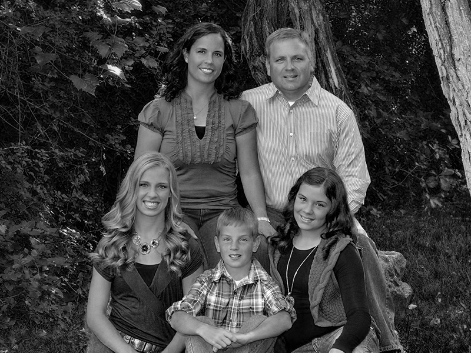 | 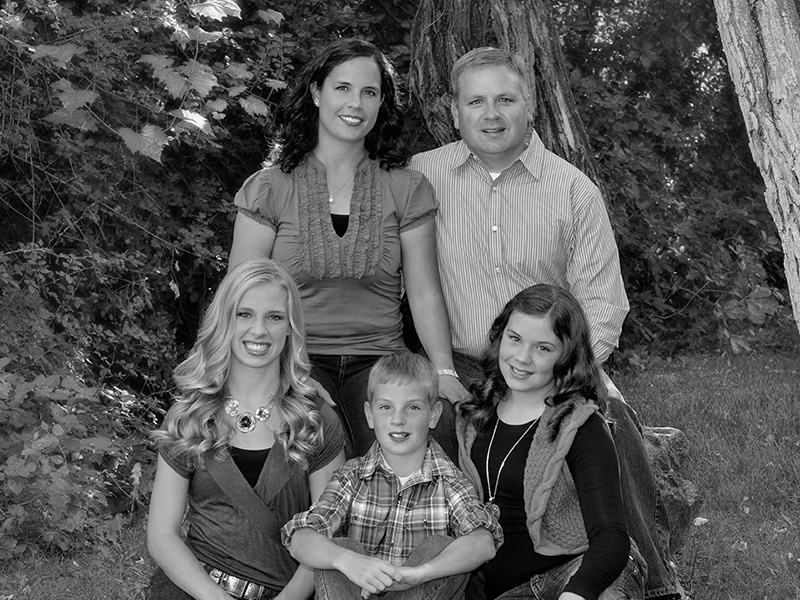 | 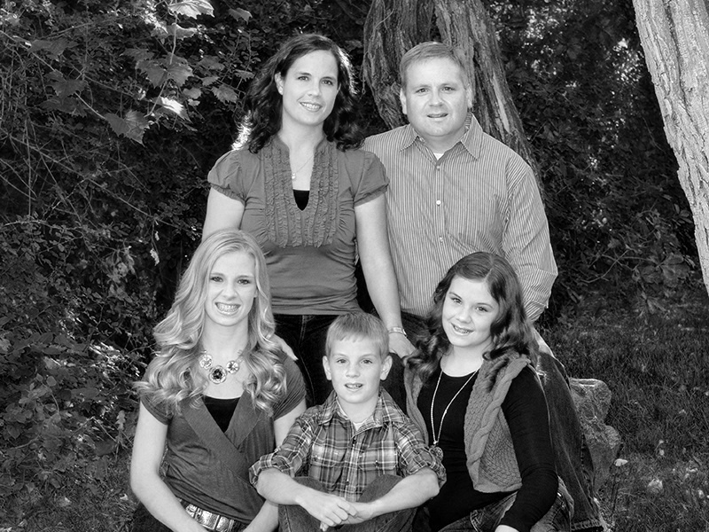 |

## 2.2 红绿互换

```python
import cv2

img = cv2.imread("family.jpg")

B, G, R = cv2.split(img)

img = cv2.merge([B, R, G])

cv2.imwrite("family-BRG.jpg", img)
```

|      原图       |       效果图        |
| :-------------: | :-----------------: |
|  | 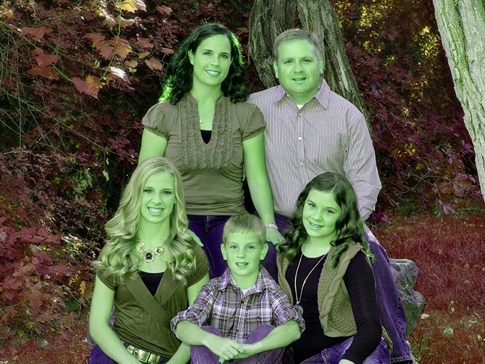 |

## 2.3 灰度化

```python
import cv2

BGR = cv2.imread("family.jpg")

GRAY = cv2.cvtColor(BGR, cv2.COLOR_BGR2GRAY)

cv2.imwrite("family-gray.jpg", GRAY)
```

|      原图       |        效果图        |
| :-------------: | :------------------: |
|  | 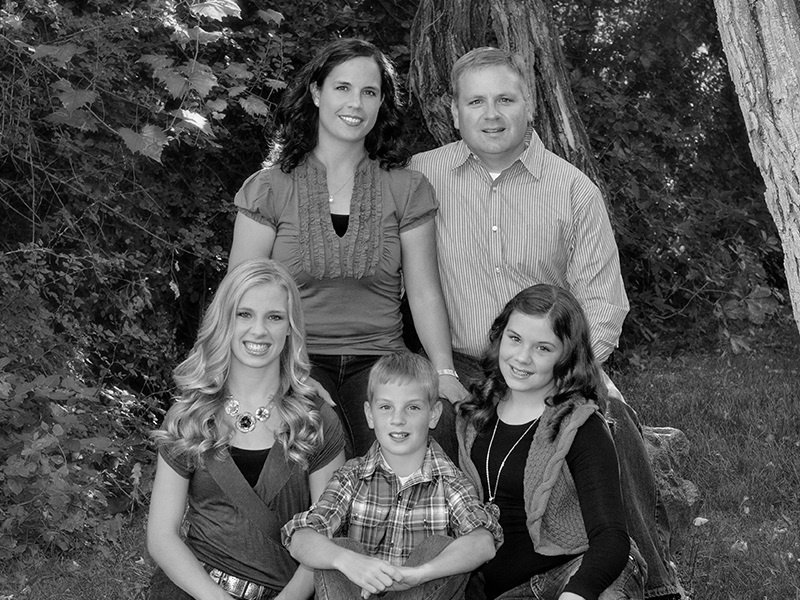 |

## 2.4 二值化

```python
import cv2

BGR = cv2.imread("family.jpg")

GRAY = cv2.cvtColor(BGR, cv2.COLOR_BGR2GRAY)

val, BINARY = cv2.threshold(src=GRAY, thresh=127, maxval=255, type=cv2.THRESH_BINARY)

cv2.imwrite("family-binary.jpg", BINARY)
```

|      原图       |        灰度图        |         二值图         |
| :-------------: | :------------------: | :--------------------: |
|  |  |  |

# 3. 光线效果

## 3.1 反相

```python
import cv2

src = cv2.imread("family.jpg")

dst = 255 - src

cv2.imwrite("family-invert.jpg", dst)
```

|      原图       |         效果图         |
| :-------------: | :--------------------: |
|  | 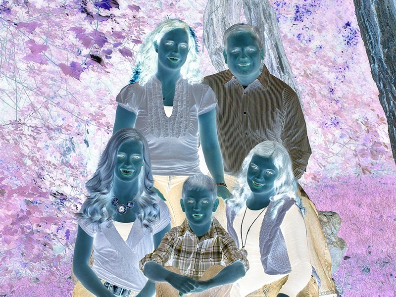 |

## 3.2 黑白底片

```python
import cv2

src = cv2.imread("family.jpg")

dst = cv2.cvtColor(255 - src, cv2.COLOR_BGR2GRAY)

cv2.imwrite("family-invert-gray.jpg", dst)
```

|      原图       |           效果图            |
| :-------------: | :-------------------------: |
|  | 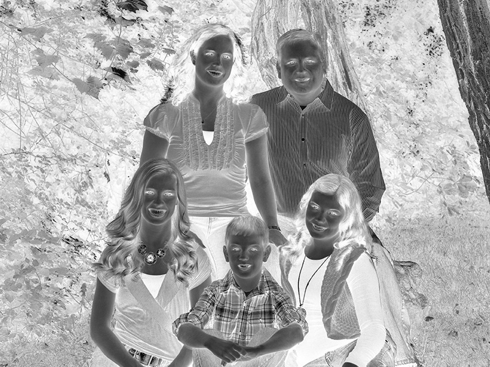 |

## 3.3 强光

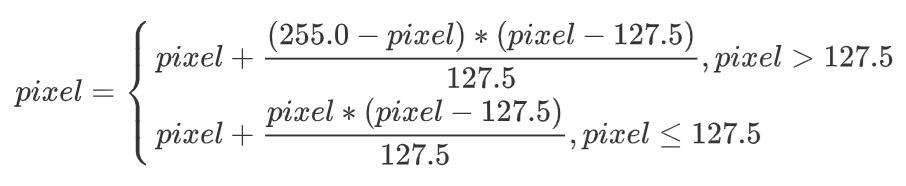

```python
import cv2
import numpy as np

src = cv2.imread("family.jpg")
H, W, C = src.shape
dst = np.zeros(shape=(H, W, C), dtype="uint8")

for h in range(0, H):
    for w in range(0, W):
        for c in range(0, C):
            pixel = float(src[h,w,c])
            if pixel > 127.5:
                pixel = pixel + (255.0 - pixel) * (pixel - 127.5) / 127.5
                pixel = np.clip(a=pixel, a_min=0, a_max=255).astype("uint8")
                dst[h,w,c] = pixel
            else:
                pixel = pixel + pixel * (pixel - 127.5) / 127.5
                pixel = np.clip(a=pixel, a_min=0, a_max=255).astype("uint8")
                dst[h,w,c] = pixel

cv2.imwrite("family-glare.jpg", dst)
```

|      原图       |        效果图         |
| :-------------: | :-------------------: |
|  |  |

# 4. 艺术效果

## 4.1 模糊

​		使用**自定义滤波器**，实现模糊效果。

```python
import cv2
import numpy as np

src = cv2.imread("family.jpg")

kernel = [[1, 2, 1], [2, 4, 2], [1, 2, 1]]
kernel = np.array(kernel, np.float32) / np.sum(kernel)
dst = cv2.filter2D(src, -1, kernel)

cv2.imwrite("family-blur.jpg", dst)
```

|      原图       |        效果图        |
| :-------------: | :------------------: |
|  |  |

## 4.2 柔和

​		使用**3*3**的**均值滤波器**，实现柔和效果。

```python
import cv2

src = cv2.imread("family.jpg")

dst = cv2.blur(src, (3, 3))

cv2.imwrite("family-soft.jpg", dst)
```

|      原图       |        效果图        |
| :-------------: | :------------------: |
|  |  |

## 4.3 锐化

​		首先**计算当前像素点与周围像素点平均值之差**，再**将该差值与当前点进行算术运算**，求得当前像素点的锐化值。

- **差值 = 当前像素点 - 周围像素点的平均值**
- **锐化像素点 = 当前像素点 + 差值 * 锐化系数**

```python
import cv2
import numpy as np

src = cv2.imread("family.jpg")
H, W, C = src.shape
dst = np.zeros(shape=(H, W, C), dtype="uint8")

coff = 2
src = src.astype(np.float32)
for h in range(1, H-1):
    for w in range(1, W-1):
        for c in range(0, C):
            LU = src[h-1,w-1,c]
            MU = src[h-1, w ,c]
            RU = src[h-1,w+1,c]
            L  = src[ h ,w-1,c]
            R  = src[ h ,w+1,c]
            LB = src[h+1,w-1,c]
            MB = src[h+1, w ,c]
            RB = src[h+1,w+1,c]
            MEAN = np.mean([LU, MU, RU, L, R, LB, MB, RB])
            SHARP = src[h,w,c] + (src[h,w,c] - MEAN) * coff
            dst[h,w,c] = np.clip(SHARP, a_min=0, a_max=255).astype(np.uint8)

cv2.imwrite("family-sharp.jpg", dst)
```

|      原图       |        效果图         |
| :-------------: | :-------------------: |
|  | 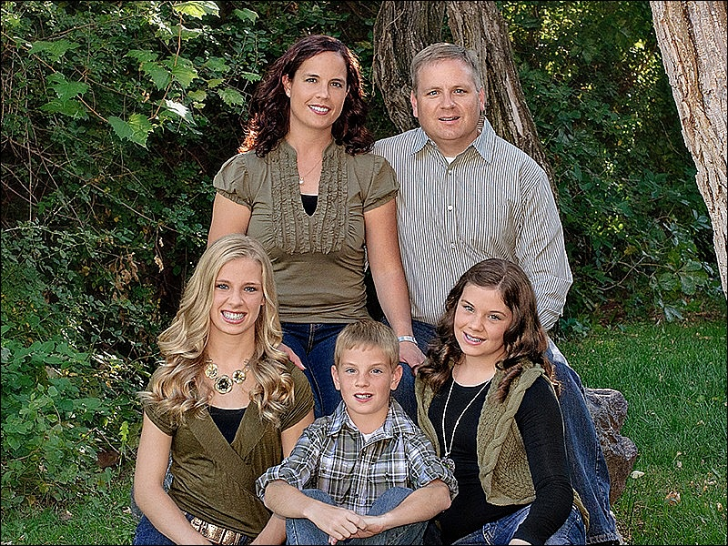 |

## 4.4 扩散

​		**扩散**指**用当前像素点或其周边的像素点，替换当前像素点**。选择逻辑是**随机选择**。

```python
import cv2
import numpy as np

src = cv2.imread("family.jpg")
H, W, C = src.shape
dst = np.zeros(shape=(H, W, C), dtype="uint8")

for h in range(1, H-1):
    for w in range(1, W-1):
        for c in range(0, C):
            LU = src[h-1,w-1,c]
            MU = src[h-1, w ,c]
            RU = src[h-1,w+1,c]
            L  = src[ h ,w-1,c]
            M  = src[ h , w ,c]
            R  = src[ h ,w+1,c]
            LB = src[h+1,w-1,c]
            MB = src[h+1, w ,c]
            RB = src[h+1,w+1,c]
            LIST = np.array([LU, MU, RU, L, M, R, LB, MB, RB])
            index = np.random.randint(0, len(LIST))
            dst[h,w,c] = condition[index]

cv2.imwrite("family-diffusion.jpg", dst)
```

|      原图       |          效果图           |
| :-------------: | :-----------------------: |
|  | 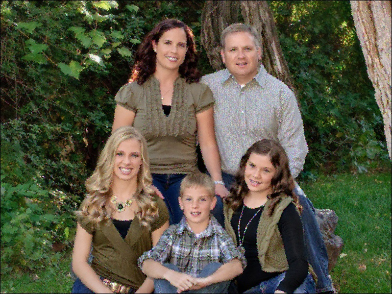 |

## 4.5 老照片

​		**传统的纸质相片在经过岁月的洗礼后会泛黄**，在图像上表现为**黄褐色效果**。

```python
import cv2
import numpy as np

src = cv2.imread("family.jpg")
dst = np.zeros(shape=(src.shape), dtype="uint8")

src = src.astype(np.uint32)
B = (34 * src[:,:,0] + 137 * src[:,:,1] +  70 * src[:,:,2]) // 256
G = (43 * src[:,:,0] + 176 * src[:,:,1] +  89 * src[:,:,2]) // 256
R = (48 * src[:,:,0] + 197 * src[:,:,1] + 101 * src[:,:,2]) // 256

dst[:,:,0] = np.clip(B, a_min=0, a_max=255).astype(np.uint8)
dst[:,:,1] = np.clip(G, a_min=0, a_max=255).astype(np.uint8)
dst[:,:,2] = np.clip(R, a_min=0, a_max=255).astype(np.uint8)

cv2.imwrite("family-old-photo.jpg", dst)
```

|      原图       |          效果图           |
| :-------------: | :-----------------------: |
|  |  |

## 4.6 木雕画

​		木雕画指将图像雕刻在木雕上。**将图像处理为木雕画效果**，可以**将图像的轮廓以白色显示，背景用黑色显示**。

```python
import cv2
import numpy as np

src = cv2.imread("family.jpg", 0)
H, W = src.shape
dst = np.zeros(shape=(H, W), dtype="uint8")

delta = 64
src = src.astype(np.float32)
for h in range(1, H-1):
    for w in range(1, W-1):
        LU = np.abs(src[h,w] - src[h-1,w-1])
        MU = np.abs(src[h,w] - src[h-1, w ])
        RU = np.abs(src[h,w] - src[h-1,w+1])
        L  = np.abs(src[h,w] - src[ h ,w-1])
        M  = np.abs(src[h,w] - src[ h , w ])
        R  = np.abs(src[h,w] - src[ h ,w+1])
        LB = np.abs(src[h,w] - src[h+1,w-1])
        MB = np.abs(src[h,w] - src[h+1, w ])
        RB = np.abs(src[h,w] - src[h+1,w+1])
        condition = np.array([LU, MU, RU, L, M, R, LB, MB, RB])
        if (any(condition>delta)):
            dst[h,w] = 255
        else:
            dst[h,w] = 0

cv2.imwrite("family-wooden-sculpture.jpg", dst)
```

|      原图       |              效果图              |
| :-------------: | :------------------------------: |
|  | 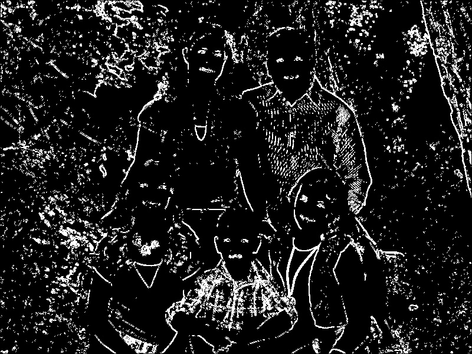 |

## 4.7 铅笔画

​		铅笔画指用铅笔在白纸上作画。**将图像处理为铅笔画效果**，可以**将图像的轮廓以黑色显示，背景用白色显示**。

```python
import cv2
import numpy as np

src = cv2.imread("family.jpg", 0)
H, W = src.shape
dst = np.zeros(shape=(H, W), dtype="uint8")

delta = 40
src = src.astype(np.float32)
for h in range(1, H-1):
    for w in range(1, W-1):
        LU = np.abs(src[h,w] - src[h-1,w-1])
        MU = np.abs(src[h,w] - src[h-1, w ])
        RU = np.abs(src[h,w] - src[h-1,w+1])
        L  = np.abs(src[h,w] - src[ h ,w-1])
        M  = np.abs(src[h,w] - src[ h , w ])
        R  = np.abs(src[h,w] - src[ h ,w+1])
        LB = np.abs(src[h,w] - src[h+1,w-1])
        MB = np.abs(src[h,w] - src[h+1, w ])
        RB = np.abs(src[h,w] - src[h+1,w+1])
        condition = np.array([LU, MU, RU, L, M, R, LB, MB, RB])
        if (any(condition>delta)):
            dst[h,w] = 0
        else:
            dst[h,w] = 255

cv2.imwrite("family-pencil.jpg", dst)
```

|      原图       |         效果图         |
| :-------------: | :--------------------: |
|  | 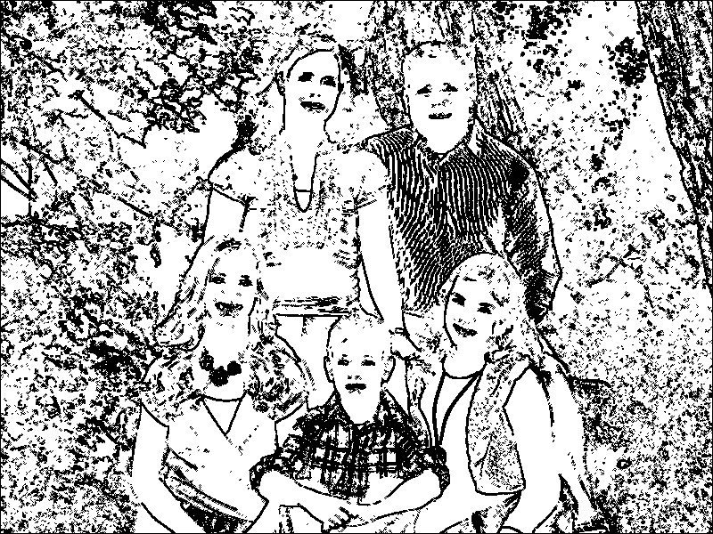 |

## 4.8 凸雕、阳刻

​		实现**凸雕效果**时，使用**右下角像素点的值减去左上角像素点的值**。

```python
import cv2
import numpy as np

depth = 100

src = cv2.imread("family.jpg", 0)
H, W = src.shape
dst = np.zeros(shape=(H, W), dtype="uint8")

src = src.astype(np.float32)
for h in range(1, H-1):
    for w in range(1, W-1):
        LU = src[h-1,w-1]
        RB = src[h+1,w+1]
        pixel = RB - LU + depth
        dst[h,w] = np.clip(pixel, a_min=0, a_max=255).astype("uint8")

cv2.imwrite("family-embossment.jpg", dst)
```

|      原图       |           效果图           |
| :-------------: | :------------------------: |
|  | 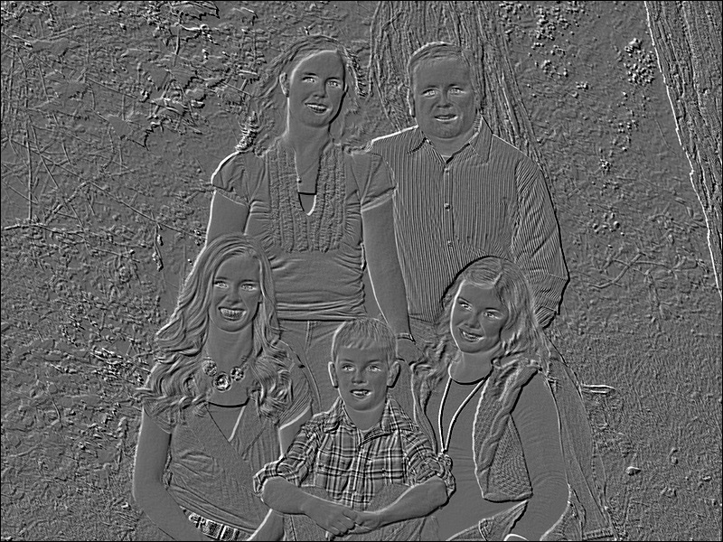 |

## 4.9 凹雕、阴刻

​		实现**凹雕效果**时，使用**左上角像素点的值减去右下角像素点的值**。

```python
import cv2
import numpy as np

depth = 100

src = cv2.imread("family.jpg", 0)
H, W = src.shape
dst = np.zeros(shape=(H, W), dtype="uint8")

src = src.astype(np.float32)
for h in range(1, H-1):
    for w in range(1, W-1):
        LU = src[h-1,w-1]
        RB = src[h+1,w+1]
        pixel = LU - RB + depth
        dst[h,w] = np.clip(pixel, a_min=0, a_max=255).astype("uint8")

cv2.imwrite("family-intaglio.jpg", dst)
```

|      原图       |          效果图          |
| :-------------: | :----------------------: |
|  | 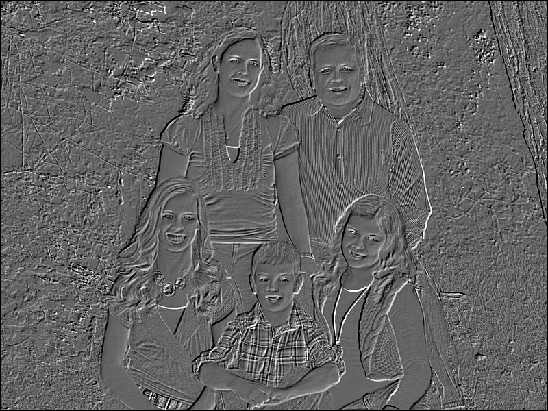 |