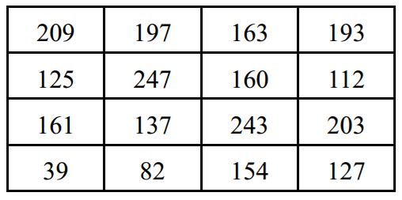
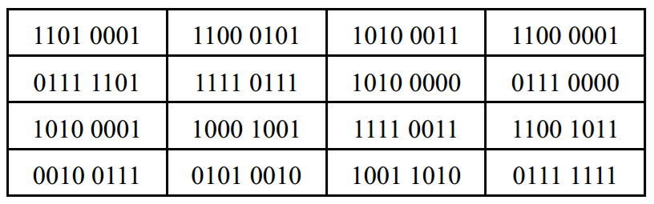
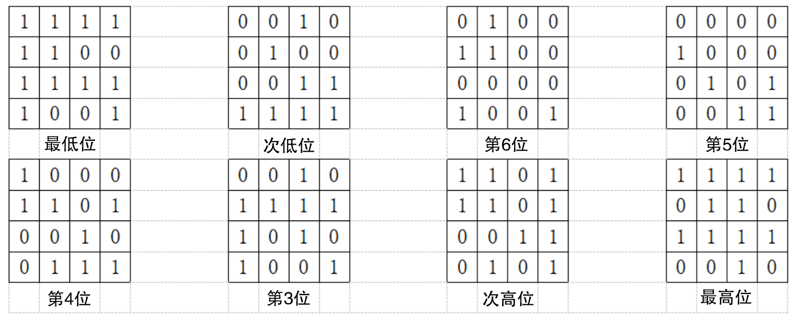
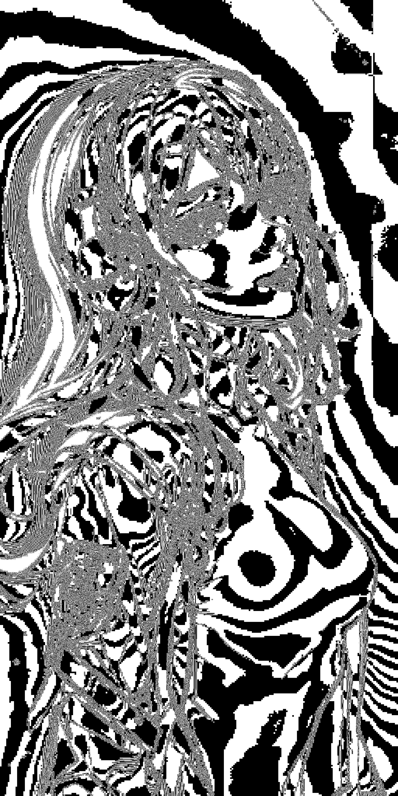
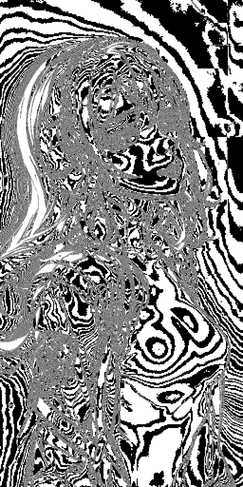
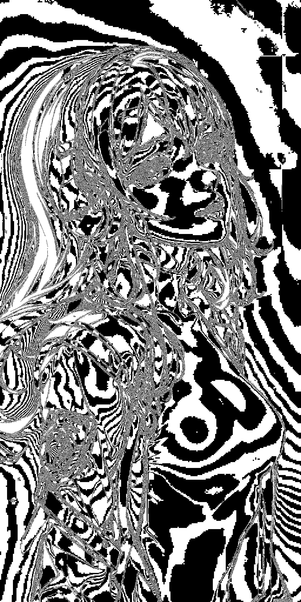
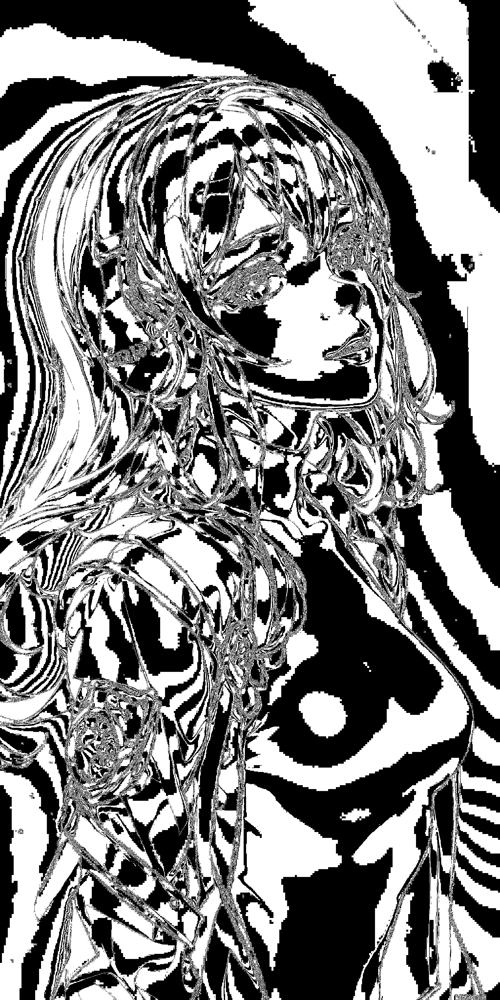
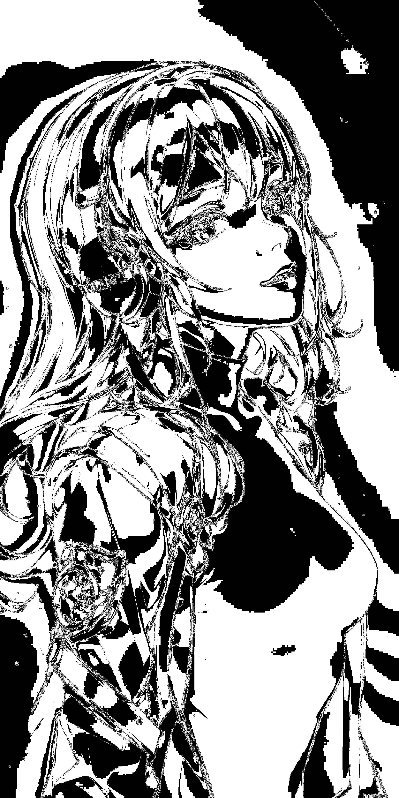

# 1. 定义

​		**将`灰度图像`中`处于同一比特位上的二进制像素值进行组合`， 得到一幅`二进制值图像`**，这个图像被称为灰度图像的一个**位平面**，这个过程被称为 **`位平面分解`** 。

# 2. 8位图的位平面分解

​		在8位灰度图中，每一个像素都是使用8位二进制值来表示的，~~其~~值的范围在[0,255]之间。可以将其中的值表示为：$$ value = \sum_{i=0}^{7} a_i \times 2^i$$，其中 **a<sub>i</sub>** 的可能值为 `0` 或者 `1` 。可以看出，**各个𝑎<sub>𝑖</sub>的权重是不一样的， 𝑎<sub>7</sub>的权重最高， 𝑎<sub>0</sub>的权重最低**，这代表着**𝑎<sub>7</sub>的值对图像的影响最大， 而𝑎<sub>0</sub>的值对图像的影响最小**。

​		通过**提取灰度图像像素点二进制像素值的每一比特位的组合**，可以**得到多个位平面图像**。图像中全部像素值的𝑎<sub>𝑖</sub>值所构成的位平面，称为第i个位平面。`在8位灰度图中，可以组成8个二进制值图像，即可以将原图分解为8个位平面。`

​		通过**计算得到的位平面是一个二值图像**，如果直接将上述得到的位平面显示出来，则会得到一张近似黑色的图像，这是因为默认当前显示的图像是8位灰度图，而当其中的像素值较小时，显示的图像就会是近似黑色的。**要想让其显示为白色，必须将所有大于零的数据都处理为255。**

## 2.1 演示

### **图像数据**

|               10进制表示                |               2进制表示               |
| :-------------------------------------: | :-----------------------------------: |
|  |  |

### 图像数据的位平面分解



## 2.2 示例

```python
import cv2
import numpy as np

img = cv2.imread("person.jpg", 0)
cv2.imwrite("person-gray.jpg", img)

h, w = img.shape

x = np.zeros((h, w, 8), dtype=np.uint8)
for i in range(8):
    x[:,:,i] = 2**i

r = np.zeros((h, w, 8), dtype=np.uint8)
for i in range(8):
    r[:,:,i] = cv2.bitwise_and(img, x[:,:,i])
    mask = r[:,:,i]>0
    r[mask]=255
    cv2.imwrite(str(i) + ".jpg", r[:,:,i])
```

### 原始图像

|       彩色图像        |            灰度图像             |
| :-------------------: | :-----------------------------: |
|  |  |

### 位平面分解的图像

|   第0层    |   第1层    |   第2层    |   第3层    |
| :--------: | :--------: | :--------: | :--------: |
|  |  |  |  |

|   第4层 |   第5层    |   第6层    |   第7层    |
| :--------: | :--------: | :--------: | :--------: |
|  |  |  |  |