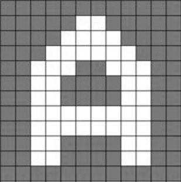
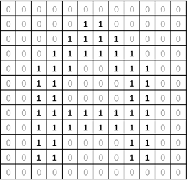
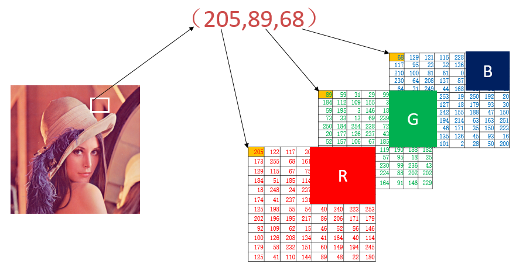

# 1. 像素与通道

## 1.1 像素

​		计算机是通过一个**栅格状排列的数据矩阵**来**表示和处理图像**的。计算机在处理图像时，会将其划分为一个个小方块，每一个小方块就是一个独立的处理单位，称为`像素`。

## 1.2 图像的基本表示方法

### 二值图像

- 含义：**仅仅包含`黑色`和`白色`两种颜色**的图像。
- 示例：**字母"A"的二值图像**在计算机内的**存储形式**如下所示。

|       字母"A"       |                    计算机内的存储形式                     |
| :-----------------: | :-------------------------------------------------------: |
|  |  |

### 灰度图像

​		二值图像表示起来简单方便，但是因为其仅有黑白两种颜色，所表示的图像不够细腻。如果想要表现更多的细节，就需要使用更多的颜色。

​		通常，计算机会**将灰度处理为`256个灰度级`**，用数值区间[0, 255]来表示，其中，**数值“255”表示纯白色，数值“0”表示纯黑色，其余的数值表示从纯白到纯黑之间不同级别的灰度**。


### 彩色图像

​		自然界中常见的各种色光都可以通过将**三原色**按照一定的比例混合构成。

​		**采用不同的方式表述颜色的模式**称为色彩空间。

​		最常用的色彩空间就是为**RGB色彩空间**。在RGB 色彩空间中，存在**R通道**【红色】、**G通道**【绿色】和**B通道**【蓝色】三个通道，每个色彩通道值的范围都在[0, 255]之间，用这三个色彩通道的组合表示颜色。

- **常见颜色**的RGB值示例：

<table>
  <tr>
    <th style="text-align: center">颜色（RGB值）</th>
    <th style="text-align: center">颜色（RGB值）</th>
    <th style="text-align: center">颜色（RGB值）</th>
  </tr>
  <tr>
    <td>
      <div style="text-align: center">
        <div style="width: 80px; height: 80px; background-color: rgb(0,0,0); margin: 0 auto; border: 1px solid #ccc;"></div>
        <div>(0,0,0)</div>
      </div>
    </td>
    <td>
      <div style="text-align: center">
        <div style="width: 80px; height: 80px; background-color: rgb(127,127,127); margin: 0 auto; border: 1px solid #ccc;"></div>
        <div>(127,127,127)</div>
      </div>
    </td>
    <td>
      <div style="text-align: center">
        <div style="width: 80px; height: 80px; background-color: rgb(255,255,255); margin: 0 auto; border: 1px solid #ccc;"></div>
        <div>(255,255,255)</div>
      </div>
    </td>
  </tr>
  <tr>
    <td>
      <div style="text-align: center">
        <div style="width: 80px; height: 80px; background-color: rgb(255,0,0); margin: 0 auto; border: 1px solid #ccc;"></div>
        <div>(255,0,0)</div>
      </div>
    </td>
    <td>
      <div style="text-align: center">
        <div style="width: 80px; height: 80px; background-color: rgb(0,255,0); margin: 0 auto; border: 1px solid #ccc;"></div>
        <div>(0,255,0)</div>
      </div>
    </td>
    <td>
      <div style="text-align: center">
        <div style="width: 80px; height: 80px; background-color: rgb(0,0,255); margin: 0 auto; border: 1px solid #ccc;"></div>
        <div>(0,0,255)</div>
      </div>
    </td>
  </tr>
  <tr>
    <td>
      <div style="text-align: center">
        <div style="width: 80px; height: 80px; background-color: rgb(255,255,0); margin: 0 auto; border: 1px solid #ccc;"></div>
        <div>(255,255,0)</div>
      </div>
    </td>
    <td>
      <div style="text-align: center">
        <div style="width: 80px; height: 80px; background-color: rgb(0,255,255); margin: 0 auto; border: 1px solid #ccc;"></div>
        <div>(0,255,255)</div>
      </div>
    </td>
    <td>
      <div style="text-align: center">
        <div style="width: 80px; height: 80px; background-color: rgb(255,0,255); margin: 0 auto; border: 1px solid #ccc;"></div>
        <div>(255,0,255)</div>
      </div>
    </td>
  </tr>
</table>

​		彩色图像，可以理解为由R通道、G通道、B通道三个通道构成，每一个通道都是一个独立的灰度图像。比如，左侧彩色图像中的白色方块内的区域，对应右侧三个通道的三个矩阵，白色方块**左上角顶点**的**RGB值**即为(205,89,68)。



## 1.3 像素处理

​		**`像素是图像构成的基本单位`**，像素处理是图像处理的基本操作，可以通过**位置索引**的形式**对图像内的像素进行访问、处理**。

​		在OpenCV中，**最小**的**数据类型**是**无符号的8位整数数**（uint8）。

​		在OpenCV中，实际上并没有二值图像这种数据类型，**二值图像经常是通过处理得到的，`使用0表示黑色，使用255表示白色`**。因此，**可以将二值图像理解为特殊的灰度图像进行处理**。

​		在基于Python语言的OpenCV中，**图像就是numpy库中的数组**：**一个灰度图像相当于是一个二维数组**，而**一个彩色图像相当于是一个三维数组**，可以使用**位置索引**的方式，**访问其中的像素值**。

### 灰度图像

- 使用**image[0,0]**访问图像**image**、**第0行**、**第0列**位置上的像素点。
  - **第1个索引**表示**第0行**。可以使用 **:** 表示**全部行**。
  - **第2个索引**表示**第0列**。可以使用 **:** 表示**全部列**。

- **示例**

```python
import numpy as np
import cv2

img = np.zeros((150,600,3),dtype=np.uint8)

img[:,   0:120] = 0
img[:, 120:240] = 60
img[:, 240:360] = 120
img[:, 360:480] = 180
img[:, 480:600] = 240

cv2.imshow("logo",img)

cv2.waitKey()
cv2.destroyAllWindows()
```


### 彩色图像

- 使用**image[0,0,0]**访问图像**image**的**B通道**内的**第0行**、**第0列**的像素点
  - **第1个索引**表示**第0行**。可以使用 **:** 表示**全部行**。
  - **第2个索引**表示**第0列**。可以使用 **:** 表示**全部列**。
  - **第3个索引**表示**第0个颜色通道**。注意**B、G、R**的通道排序。

- **示例**

```python
import numpy as np
import cv2

img = np.zeros((300,300,3),dtype=np.uint8)

img[:,   0:100, 0] = 255
img[:, 100:200, 1] = 255
img[:, 200:300, 2] = 255

cv2.imshow("img",img)
cv2.waitKey()
cv2.destroyAllWindows()
```


### item()和itemset()

- 函数**item()**可以用来**访问图像的像素点**。
  - 函数原型：`item(行,列)`、`item(行,列,通道)`
  - **示例**
    - **img.item(150, 200)** <==> **img[150, 200]**
    - **img.item(150, 200, 2)** <==> **img[150, 200, 2]**
- 函数**itemset()**可以用来**修改像素值**。
  - 函数原型：`itemset(二元组索引值,新值)`、`itemset(三元组索引值,新值)`
  - 针对**彩色图像**的访问，必须**同时指定行、列以及通道**，仅仅指定行和列是不可以的。
  - **示例**
    - **img.itemset(150, 200) = 255** <==> **img[150, 200] = 255**
    - **img.item(150, 200, 2) = 255** <==> **img[150, 200, 2] = 255**

## 1.4 通道处理

​		在**RGB图像**中，**图像**是**由R通道、G通道、B通道三个通道构成**的。

​		在**OpenCV**中，通道是**按照`B通道`→`G通道`→`R通道`的顺序存储**的。

### 通道拆分

​		针对**RGB图像**，可以分别拆分出其R通道、G通道、B通道。既可以通过**索引**的方式拆分通道，也可以通过**函数**的方式拆分通道。

- **索引方式**
  - 提取**蓝色**通道：**B = img[ : , : , 0]**
  - 提取**绿色**通道：**G = img[ : , : , 1]**
  - 提取**红色**通道：**R = img[ : , : , 2]**

- **函数方式**
  - 提取**全部颜色**通道：**B, G, R = cv2.split(img)**
  - 提取**蓝色**通道：**B = cv2.split(img)[0]**
  - 提取**绿色**通道：**G = cv2.split(img)[1]**
  - 提取**红色**通道：**R = cv2.split(img)[2]**

- **示例**

```python
import cv2

img = cv2.imread("logo.png")

B, G, R = cv2.split(img)

# B = cv2.split(img)[0]
# G = cv2.split(img)[1]
# R = cv2.split(img)[2]

# B = img[ : , : , 0]
# G = img[ : , : , 1]
# R = img[ : , : , 2]

cv2.imshow("logo", img)

cv2.imshow("logo-B", B)
cv2.imshow("logo-G", G)
cv2.imshow("logo-R", R)

cv2.waitKey()
cv2.destroyAllWindows()
```

|       原图        |       蓝色通道        |       绿色通道        |       红色通道        |
| :---------------: | :-------------------: | :-------------------: | :-------------------: |
|  |  |  |  |

### 通道合并

​		通道合并是通道拆分的逆过程，**通过合并通道可以将三个通道的灰度图像构成一幅彩色图像**。

- **方法**：使用函数`cv2.merge()`可以将这三个单通道图像，合并为一个基于BGR颜色空间的三通道彩色图像。
- **示例**：BGR → RGB

```python
import cv2

img = cv2.imread("logo.png")
cv2.imshow("logo-BGR", img)

B, G, R = cv2.split(img)
img = cv2.merge([R, G, B])

cv2.imshow("logo-RGB", img)

cv2.waitKey()
cv2.destroyAllWindows()
```

|        BGR        |            RGB            |
| :---------------: | :-----------------------: |
|  |  |

# 2. 图像属性

- 获取**图像的形状**：**img.shape**
  - 返回**元组**。灰度图像为 **(行数、列数)** ，彩色图像为 **(行数、列数、通道数)** 。
- 获取**图像的像素数目**：**img.size**
  - 返回**数值**。灰度图像为**行数 * 列数**，彩色图像为**行数 * 列数 * 通道数**。
- 获取**图像的数据类型**：**img.dtype**，一般情况下都是**uint8**，即**8位位深**的图像。

# 3. ROI

​		在图像处理的过程中，我们可能会**对图像的某一个特定区域感兴趣**，该区域即被称为 **`感兴趣区域`** （ Region of Interest， **`ROI`** ）。

- **示例**

```python
import cv2

img = cv2.imread("logo.png")
cv2.imshow("logo",img)

img = img[587:, :]
cv2.imshow("text",img)

cv2.waitKey()
cv2.destroyAllWindows()
```

|       LOGO        |       TEXT        |
| :---------------: | :---------------: |
|  |  |