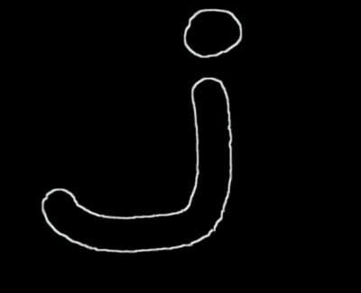
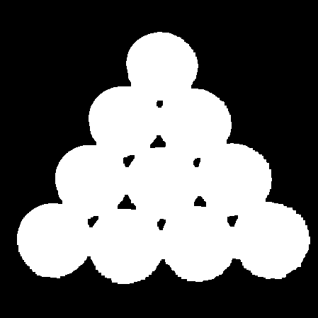
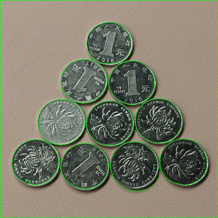

# 1. 分水岭算法

​		在图像处理的过程中，**经常需要从图像中将前景对象作为目标图像分割或者提取出来**。

​		**分水岭算法**将图像形象地比喻为**地理学上的地形表面**，实现**图像分割**。任何一幅**灰度图像**，都可以被看作是**地理学上的地形表面**：**灰度值高**的区域可以被看成是**山峰**，**灰度值低**的区域可以被看成是**山谷**。

# 2. 使用方法

​		使用函数`cv2.watershed()`实现**分水岭算法**，期间需要借助**形态学函数**、**距离变换函数**`cv2.distanceTransform()`、`cv2.connectedComponents()`完成图像分割。

## 2.1 形态学操作

### 开运算

​		开运算是**先腐蚀、后膨胀**的操作，开运算**能够去除图像内的噪声，如毛刺、噪点等**。

```python
import cv2
import numpy as np

J = cv2.imread("J.png")
kernel = np.ones((5, 5), np.uint8)
J_open = cv2.morphologyEx(src=J, op=cv2.MORPH_OPEN, kernel=kernel)

cv2.imwrite("J_open.png", J_open)
```

|   毛刺图    |    开运算：去毛刺     |
| :---------: | :-------------------: |
|  |  |

### 获取图像边界

​		通过**膨胀图像减去腐蚀图像**，能够**获取图像的边界**。

```python
import cv2
import numpy as np

J = cv2.imread("J_open.png")
kernel = np.ones((3, 3), np.uint8)
J_gradient = cv2.morphologyEx(src=J, op=cv2.MORPH_GRADIENT, kernel=kernel)

cv2.imwrite("J_gradient.png", J_gradient)
```

|         原图          |        形态学梯度运算         |
| :-------------------: | :---------------------------: |
|  |  |

## 2.2 距离变换、前景提取

​		距离变换函数`cv2.distanceTransform()`**计算二值图像内任意点到最近背景点的距离**，其计算结果反映了各个像素与背景的距离关系。通常情况下：

- 如果**前景对象**的**中心**距离值为0的像素点距离**较远**，会得到一个**较大**的值。
- 如果**前景对象**的**边缘**距离值为0的像素点距离**较近**，会得到一个**较小**的值。

- **函数原型**：`dst = cv2.distanceTransform(src, distanceType, maskSize, dstType )`
- **参数说明**：
  - **src**：**8位**、**单通道**的**二值图像**。
  - **distanceType**：**距离类型参数**。
    - cv2.DIST_USER：用户自定义距离
    - **cv2.DIST_L1**：  L-1范数，街区距离，$$ dist=|x_1-x_2|+|y_1-y_2| $$  
    - **cv2.DIST_L2**：L-2范数，欧式距离，$$ dist=\sqrt{(x_1-x_2)^2+(|y_1-y_2)^2} $$  
    - **cv2.DIST_C**：  L-∞范数，棋盘距离，$$ dist=max(|x_1-x_2|,|y_1-y_2|) $$
  - **maskSize**：**掩模的尺寸**，当**distanceType**为**cv2.DIST_L1**或**cv2.DIST_C**时，**maskSize**强制为**3**。
  - **dstType **：**目标图像的类型**，默认为**CV_32F**。
  - **dst **：**目标图像**，可以是**8位**或**32位**的**浮点数据**，**尺寸和src相同**。

```python
import cv2
import numpy as np
import matplotlib.pyplot as plt

# 灰度处理
img = cv2.imread("coins.jpg")
img_gray = img[:,:,2]

cv2.imwrite("coins_gray.png", img_gray)

# 二值化处理、形态学处理
ret, img_bw = cv2.threshold(img_gray, 139, 255, cv2.THRESH_BINARY_INV)
kernel = np.ones((5, 5), np.uint8)
img_morph = cv2.morphologyEx(img_bw, cv2.MORPH_CLOSE, kernel, iterations=1)
img_morph = cv2.morphologyEx(img_morph, cv2.MORPH_OPEN, kernel, iterations=1)

cv2.imwrite("coins_morph.png", img_morph)

# 距离变换
dist_transform = cv2.distanceTransform(img_morph, cv2.DIST_L2, 0)

plt.figure(figsize=(10,10))
plt.imshow(dist_transform)
plt.axis('off')
plt.savefig("coins_dist_transform.png")

# 前景提取
ret, foreground = cv2.threshold(dist_transform, 0.7*dist_transform.max(), 255, 0)

plt.figure(figsize=(10,10))
plt.imshow(foreground)
plt.axis('off')
plt.savefig("coins_foreground.png")
```

|        原图         |            灰度图             |             二值图              |
| :-----------------: | :---------------------------: | :-----------------------------: |
|  |  |  |

|                     距离变换                      |                 前景提取                  |
| :-----------------------------------------------: | :---------------------------------------: |
|  |  |

## 2.3 确定未知区域

- **未知区域** = **图像** - **确定背景** - **确定前景**

```python
import cv2
import numpy as np
import matplotlib.pyplot as plt


img = cv2.imread("coins_morph.png", 0)

ret, background = cv2.threshold(img, 127, 255, cv2.THRESH_BINARY)

dist_transform = cv2.distanceTransform(background, cv2.DIST_L2, 0)
ret, foreground = cv2.threshold(dist_transform, 0.7*dist_transform.max(), 255, 0)

unknown = cv2.subtract(background, np.uint8(foreground))

plt.figure(figsize=(10,10))
plt.imshow(unknown)
plt.axis('off')
plt.savefig("coins_unknown.png")
```

|                  前景图                   |              未知区域               |
| :---------------------------------------: | :---------------------------------: |
|  |  |

## 2.4 标注前景区域

- 使用函数`cv2.connectedComponents()`进行标注，函数会将**背景**标注为**0**，将**其他对象**使用**从1开始的正整数**进行标注。

- **函数原型**：`ret, labels = cv2.connectedComponents( image )`
- **参数说明**：
  - **image **：**8位**、**单通道**的**待标注图像**。
  - **ret**：返回的**标注的数量**。
  - **labels**：**标注的结果图像**。

```python
import cv2
import numpy as np
import matplotlib.pyplot as plt


img = cv2.imread("coins_morph.png", 0)

ret, background = cv2.threshold(img, 127, 255, cv2.THRESH_BINARY)

dist_transform = cv2.distanceTransform(background, cv2.DIST_L2, 0)
ret, foreground = cv2.threshold(dist_transform, 0.7*dist_transform.max(), 255, 0)

ret, markers = cv2.connectedComponents(np.uint8(foreground))

plt.figure(figsize=(10,10))
plt.imshow(markers)
plt.axis('off')
plt.savefig("coins_markers.png")
```

|                  前景图                   |            前景区域标注             |
| :---------------------------------------: | :---------------------------------: |
|  |  |

## 2.5 图像分割

- 使用函数`cv2.watershed()`实现基于**分水岭算法**的**图像分割**。

- **函数原型**：`markers  = cv2.watershed( image, markers )`
- **参数说明**：
  - **image **：**8位**、**三通道**的**图像**。
  - **markers**：**32位**、**单通道**的**标注结果**。每一个像素要么被设置为初始种子值，要么被设置为-1，表示边界。

- **基本步骤**
  1. 通过**形态学开运算**对原始图像O去噪。
  2. 通过**腐蚀操作**获取背景B。
  3. 利用**距离变换函数**对原始图像进行运算，并进行阈值处理，得到前景F。
  4. 计算**未知区域**UN。其中，**UN = O - B - F**。
  5. 对**前景区域**进行**标注**。
  6. 对**标注结果**进行**修正**。
  7. 使用**分水岭算法完成图像分割**。

```python
import cv2
import numpy as np
import matplotlib.pyplot as plt

# 灰度处理
img = cv2.imread("coins.jpg")
img_gray = img[:,:,2]

# 二值化处理、形态学处理
ret, img_bw = cv2.threshold(img_gray, 139, 255, cv2.THRESH_BINARY_INV)
kernel = np.ones((5, 5), np.uint8)
img_morph = cv2.morphologyEx(img_bw, cv2.MORPH_CLOSE, kernel, iterations=1)
img_morph = cv2.morphologyEx(img_morph, cv2.MORPH_OPEN, kernel, iterations=1)

# 距离变换
dist_transform = cv2.distanceTransform(img_morph, cv2.DIST_L2, 0)

# 前景提取
ret, foreground = cv2.threshold(dist_transform, 0.7*dist_transform.max(), 255, 0)

# 获取未知区域
unknown = cv2.subtract(img_morph, np.uint8(foreground))

# 前景标注
ret, markers = cv2.connectedComponents(np.uint8(foreground))

# 标注结果修正
markers = markers + 1
markers[unknown==255] = 0

# 图像分割：分水岭算法
markers = cv2.watershed(img,markers)

# 边缘标记
img[markers == -1] = [0, 255, 0]

cv2.imwrite("coins_watershed.png", img)
```

|        原图         |                图像分割                 |
| :-----------------: | :-------------------------------------: |
|  |  |
