# 	1. 描述轮廓

​		边缘检测虽然能够检测出边缘，但边缘是不连续的，检测到的边缘并不是一个整体。**图像轮廓**是指**将边缘连接起来形成的一个整体** ，可以用于后续的计算。

## 1.1 查找轮廓

### 使用方法

- 通过**函数**`cv2.findContours()`，实现**图像轮廓的查找**。
- **函数原型**：
  - **OpenCV 3.x**：`dst, contours, hierarchy = cv2.findContours( src, mode, method )`
  - **OpenCV 4.x**：`contours, hierarchy = cv2.findContours( src, mode, method )`
- **参数说明**：
  - **dst**：**目标图像**，与原始图像具有相同的大小和类型。
  - **`contours`**：**`轮廓信息`**。
    - **type属性**：**list类型**，**每个元素都是图像的一个轮廓**
    - **`轮廓的个数`**：`len(contours)`
    - **`轮廓的点坐标`**：`contours[i]`，**i为轮廓索引**
    - **`轮廓的点数`**：`len(contours[i])`，**i为轮廓索引**
  - **`hierarchy`**：关于图像**轮廓层次**的 **`拓扑信息`** 。
    - **图像内的轮廓可能位于不同的位置**，如一个轮廓位于另一个轮廓的内部。这种情况下，**将外部的轮廓称为父轮廓**，**将内部的轮廓称为子轮廓**。
    - **每个轮廓contours[i]对应4个元素来说明当前轮廓的层次关系： `[Next, Previous, First_Child, Parent]`** 。
      - **Next**：**后一个轮廓**的索引编号。
      - **Previous**：**前一个轮廓**的索引编号。
      - **First_Child**：**第1个子轮廓**的索引编号。
      - **Parent**：**父轮廓**的索引编号。
    - **索引-1**表示**不存在**。
  - **src**：**原始图像**。8 位单通道图像，所有非零值被处理为 1，所有零值保持不变。建议**直接使用二值图像**。
  - **mode**：**轮廓检索模式**。
    - **cv2.RETR_EXTERNAL**：**只检测外轮廓**。
    - **cv2.RETR_LIST**：**对检测到的轮廓不建立等级关系**。
    - **cv2.RETR_CCOMP**：**检索所有轮廓并将它们组织成两级层次结构**。上面的一层为外边界，下面的一层为内孔的边界。如果内孔内还有一个连通物体，那么这个物体的边界仍然位于顶层。
    - **cv2.RETR_TREE**：**建立一个等级树结构的轮廓**。
  - **method**：**轮廓的近似方法**。
    - **cv2.CHAIN_APPROX_NONE**：存储所有的轮廓点，相邻两个点的像素位置差不超过1。
    - **cv2.CHAIN_APPROX_SIMPLE**：压缩水平方向、垂直方向、对角线方向的元素，只保留该方向的终点坐标。

### 示例1：轮廓信息解析

```python
import cv2

image = cv2.imread("sample_1.png", 0)

val, image = cv2.threshold(image, 127, 255, cv2.THRESH_BINARY)

cv2.imwrite("sample_1_binary.png", image)

contours, hierarchy = cv2.findContours( image, cv2.RETR_EXTERNAL, cv2.CHAIN_APPROX_NONE)

print (len(contours))    # 3

print (len(contours[0])) # 256
print (len(contours[1])) # 342
print (len(contours[2])) # 198
```

|       原图        |        二值化的图        |
| :---------------: | :----------------------: |
| 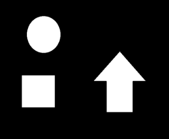 |  |

### 示例2：拓扑信息解析

```python
import cv2

image = cv2.imread("sample_2.png", 0)

val, image = cv2.threshold(image, 127, 255, cv2.THRESH_BINARY)

cv2.imwrite("sample_2_binary.png", image)

contours, hierarchy = cv2.findContours( image, cv2.RETR_EXTERNAL, cv2.CHAIN_APPROX_NONE)
print("cv2.RETR_EXTERNAL: ")
print(hierarchy)

contours, hierarchy = cv2.findContours( image, cv2.RETR_LIST, cv2.CHAIN_APPROX_NONE)
print("cv2.RETR_LIST: ")
print(hierarchy)

contours, hierarchy = cv2.findContours( image, cv2.RETR_CCOMP, cv2.CHAIN_APPROX_NONE)
print("cv2.RETR_CCOMP: ")
print(hierarchy)

contours, hierarchy = cv2.findContours( image, cv2.RETR_TREE, cv2.CHAIN_APPROX_NONE)
print("cv2.RETR_TREE: ")
print(hierarchy)
```

|       原图        |        二值化的图        |
| :---------------: | :----------------------: |
|  | 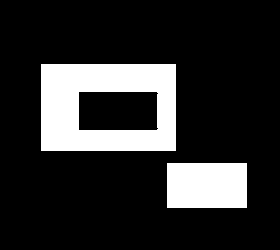 |

|         类型          |            图示            |                      说明                      |
| :-------------------: | :------------------------: | :--------------------------------------------: |
| **cv2.RETR_EXTERNAL** |  |        [[[1 -1 -1 -1],  [-1  0 -1 -1]]]        |
|   **cv2.RETR_LIST**   |      | [[[1 -1 -1 -1], [2  0 -1 -1], [-1  1 -1 -1]]]  |
|  **cv2.RETR_CCOMP**   |  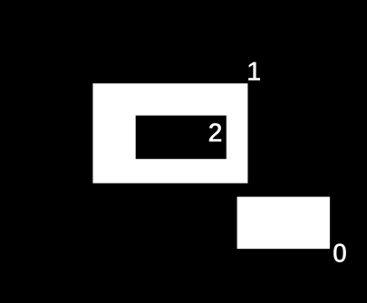   | [[[1 -1 -1 -1], [-1  0  2 -1], [-1 -1 -1  1]]] |
|   **cv2.RETR_TREE**   |      | [[[1 -1 -1 -1], [-1  0  2 -1], [-1 -1 -1  1]]] |

## 1.2 绘制轮廓

### 使用方法

- 通过**函数**`cv2.drawContours()`**绘制图像轮廓**。
- **函数原型**：`image = cv2.drawContours( image, contours, contourIdx, color, thickness, lineType, hierarchy, maxLevel, offset )`
- **参数说明**：
  - **image**：**待绘制轮廓的图像**。函数会在原始图像上直接绘制轮廓，即函数执行完成以后，**image不再是原始图像，而是包含了轮廓的图像**。
  - **contours**：**需要绘制的轮廓**。
    - 对应函数`cv2.findContours()`输出的**轮廓信息**。
  - **contourIdx**：**需要绘制的边缘索引**，提示函数要绘制某一条轮廓还是
    全部轮廓。
    - 参数是**一个整数**或者**零**：绘制**对应索引号的轮廓**。
    - 参数是**负数**：绘制**全部轮廓**。
  - **color**：**绘制的颜色**，用**BGR格式**表示。
  - **thickness**：**绘制轮廓时所用画笔的粗细**。
  - **lineType**：**绘制轮廓时所用的线型**。
  - **hierarchy**：关于图像**轮廓层次**的**拓扑信息**。
    - 对应函数`cv2.findContours()`输出的**轮廓拓扑信息**。
  - **maxLevel**：**控制所绘制的轮廓层次的深度**。
  - **offset**：**偏移参数**，使轮廓偏移到不同的位置。

### 示例

```python
import cv2
import numpy as np

image = cv2.imread("sample_1.png", 0)

val, image = cv2.threshold(image, 127, 255, cv2.THRESH_BINARY)

contours, hierarchy = cv2.findContours( image, cv2.RETR_EXTERNAL, cv2.CHAIN_APPROX_NONE)

amount = len(contours)

for i in range(amount):
    zero = np.zeros(image.shape, np.uint8)
    dst  = cv2.drawContours(image=zero, contours=contours, contourIdx=i, color=[255,255,255], thickness=1)
    cv2.imwrite("sample_1_draw_" + str(i) + ".png", dst)
```

|       原图        |        二值化的图        |          轮廓0           |          轮廓1           |          轮廓2           |
| :---------------: | :----------------------: | :----------------------: | :----------------------: | :----------------------: |
|  |  |  | 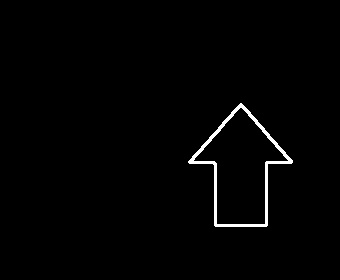 | 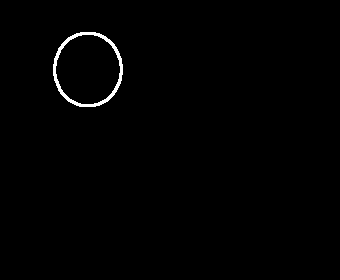 |

# 	2. 拟合轮廓

​		在计算轮廓时，可能**并不需要实际的轮廓**，而**仅需要一个接近于轮廓的近似多边形**。

## 2.1 矩形包围框

### 使用方法

- 通过**函数**`cv2.boundingRect()`**绘制轮廓的矩形边界**。
- **函数原型**：
  - `ret = cv2.boundingRect( array )`
  - `x, y, w, h = cv2.boundingRect( array )`
- **参数说明**：
  - **ret**：元组形式，矩形边界的**左上角顶点的坐标值**及矩形边界的**宽度**和**高度**。
  - **x**：矩形边界左上角顶点的**x坐标**。
  - **y**：矩形边界左上角顶点的**y坐标**。
  - **w**：矩形边界的**x方向的长度**。
  - **h**：矩形边界的**y方向的长度**。
  - **array**：**灰度图像**或**轮廓**。

### 示例

```python
import cv2

image = cv2.imread('sample_3.png')
image_gray = cv2.cvtColor(image, cv2.COLOR_BGR2GRAY)
ret, binary = cv2.threshold(image_gray, 127, 255, cv2.THRESH_BINARY)

contours, hierarchy = cv2.findContours(binary, cv2.RETR_LIST, cv2.CHAIN_APPROX_SIMPLE)

x,y,w,h = cv2.boundingRect(contours[0])
cv2.rectangle(image, (x,y), (x+w,y+h), (0,255,255), 1)

cv2.imwrite("sample_3_rect.png", image)
```

|       原图        |       矩形包围框       |
| :---------------: | :--------------------: |
| 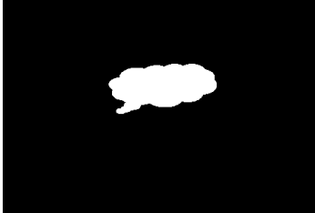 | 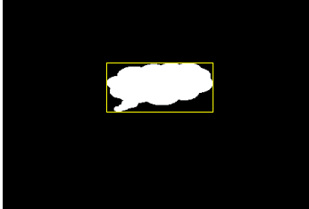 |

## 2.2 最小包围矩形框

### 使用方法

- 通过**函数**`cv2.minAreaRect()`**绘制轮廓的最小包围矩形框**。
- **函数原型**：`box = cv2.minAreaRect( points )`
- **参数说明**：
  - **box**：矩形的特征信息，结构为：(**最小外接矩形的中心坐标(x,y)**, (**宽度**,**高度**), **旋转角度**)。
    - **不符合函数cv2.drawContours()的参数结构要求**，**需要通过`cv2.boxPoints()`进行转换**，才能进行轮廓绘制。
  - **points**：**轮廓**。

- **函数原型**：`points = cv2.boxPoints( box )`
- **参数说明**：
  - **box**：矩形的特征信息，结构为：(**最小外接矩形的中心坐标(x,y)**, (**宽度**,**高度**), **旋转角度**)。
  - **points**：**轮廓**。

### 示例

```python
import cv2
import numpy as np

image = cv2.imread('sample_3.png')
image_gray = cv2.cvtColor(image, cv2.COLOR_BGR2GRAY)
ret, binary = cv2.threshold(image_gray, 127, 255, cv2.THRESH_BINARY)

contours, hierarchy = cv2.findContours(binary, cv2.RETR_LIST, cv2.CHAIN_APPROX_SIMPLE)

rect = cv2.minAreaRect(contours[0])
pts = cv2.boxPoints(rect) # 转换坐标信息
pts = np.intp(pts)        # 转换坐标信息为整数

image = cv2.drawContours(image, [pts], 0, (0,255,255), 1)

cv2.imwrite("sample_3_minAreaRect.png", image)
```

|       原图        |        最小包围矩形框         |
| :---------------: | :---------------------------: |
|  |  |

## 2.3 最小包围圆

### 使用方法

- 通过**函数**`cv2.minEnclosingCircle()`**绘制轮廓的面积最小的包围圆形**。
- **函数原型**：`center, radius = cv2.minEnclosingCircle( points )`
- **参数说明**：
  - **center**：最小包围圆形的**中心**。
  - **radius**：最小包围圆形的**半径**。
  - **points**：**轮廓**。

### 示例

```python
import cv2

image = cv2.imread('sample_3.png')
image_gray = cv2.cvtColor(image, cv2.COLOR_BGR2GRAY)
ret, binary = cv2.threshold(image_gray, 127, 255, cv2.THRESH_BINARY)

contours, hierarchy = cv2.findContours(binary, cv2.RETR_LIST, cv2.CHAIN_APPROX_SIMPLE)

(x, y), radius = cv2.minEnclosingCircle(contours[0])

center = (int(x), int(y)) # 转换信息为整数
radius = int(radius)      # 转换信息为整数

cv2.circle(image, center, radius, (0,255,255), 1)

cv2.imwrite("sample_3_minEnclosingCircle.png", image)
```

|       原图        |              最小包围圆              |
| :---------------: | :----------------------------------: |
|  | 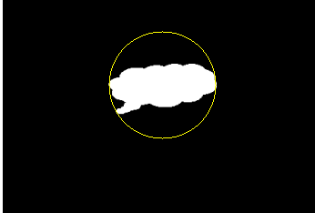 |

## 2.4 最小包围三角形

### 使用方法

- 通过**函数**`cv2.minEnclosingTriangle()`**绘制轮廓的面积最小的包围三角形**。
- **函数原型**：`area, triangle = cv2.minEnclosingTriangle( points )`
- **参数说明**：
  - **area**：最小包围三角形的**面积**。
  - **triangle**：最小包围三角形的**三个顶点集**。
  - **points**：**轮廓**。

### 示例

```python
import cv2

image = cv2.imread('sample_3.png')
image_gray = cv2.cvtColor(image, cv2.COLOR_BGR2GRAY)
ret, binary = cv2.threshold(image_gray, 127, 255, cv2.THRESH_BINARY)

contours, hierarchy = cv2.findContours(binary, cv2.RETR_LIST, cv2.CHAIN_APPROX_SIMPLE)

area, triangle = cv2.minEnclosingTriangle(contours[0])

for n in range(len(triangle)):
    cv2.line(image, tuple(triangle[n][0].astype(int)), tuple(triangle[(n+1)%3][0].astype(int)), (0,255,255), 1)

cv2.imwrite("sample_3_minEnclosingTriangle.png", image)
```

|       原图        |             最小包围三角形             |
| :---------------: | :------------------------------------: |
|  | 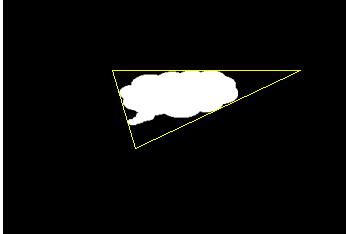 |

## 2.5 最优拟合椭圆

### 使用方法

- 通过**函数**`cv2.fitEllipse()`**构造最优拟合椭圆**。
- **函数原型**：`ret = cv2.fitEllipse( points )`
- **参数说明**：
  - **ret **：**RotatedRect类型**的值，包含外接矩形的**质心**、**宽**、**高**、**旋转角度**等参数信息，与椭圆的**中心点**、**轴长度**、**旋转角度**等信息吻合。
  - **points**：**轮廓**。

### 示例

```python
import cv2

image = cv2.imread('sample_3.png')
image_gray = cv2.cvtColor(image, cv2.COLOR_BGR2GRAY)
ret, binary = cv2.threshold(image_gray, 127, 255, cv2.THRESH_BINARY)

contours, hierarchy = cv2.findContours(binary, cv2.RETR_LIST, cv2.CHAIN_APPROX_SIMPLE)

ellipse = cv2.fitEllipse(contours[0])

cv2.ellipse(image, ellipse, (0,255,0), 2)

cv2.imwrite("sample_3_fitEllipse.png", image)
```

|       原图        |         最优拟合椭圆         |
| :---------------: | :--------------------------: |
|  |  |

## 2.6 最优拟合直线

### 使用方法

- 通过**函数**`cv2.fitLine()`**构造最优拟合直线**。
- **函数原型**：`line = cv2.fitLine( points, distType, param, reps, aeps )`
- **参数说明**：
  - **line**：**最优拟合直线参数**。对于2D场景，返回4个值：(vx, vy, x, y)
    - **斜率**：$$\frac{v_y}{v_x}$$
    - **定点**：$$(x_0, y_0)$$
    - 可使用直线**点斜式方程**：$$y-y_0=k·(x-x_0)$$，求解其他位置的解
  - **points**：**轮廓**。
  - **distType**：**距离类型**。
    - cv2.DIST_USER：用户自定义距离
    - **cv2.DIST_L1**：  L-1范数，街区距离，$$ dist=|x_1-x_2|+|y_1-y_2| $$  
    - **cv2.DIST_L2**：L-2范数，欧式距离，$$ dist=\sqrt{(x_1-x_2)^2+(|y_1-y_2)^2} $$  
    - **cv2.DIST_C**：  L-∞范数，棋盘距离，$$ dist=max(|x_1-x_2|,|y_1-y_2|) $$
  - **param**：**距离参数**，与距离类型有关。当被设置为0时，会自动选择最优值。
  - **reps**：用于表示拟合直线所需要的**径向精度**，通常被设定为**0.01**。
  - **aeps**：用于表示拟合直线所需要的**角度精度**，通常该值被设定为**0.01**。

### 示例

```python
import cv2

image = cv2.imread('sample_3.png')
image_gray = cv2.cvtColor(image, cv2.COLOR_BGR2GRAY)
row, col = image_gray.shape

ret, binary = cv2.threshold(image_gray, 127, 255, cv2.THRESH_BINARY)

contours, hierarchy = cv2.findContours(binary, cv2.RETR_LIST, cv2.CHAIN_APPROX_SIMPLE)

[[vx],[vy],[x],[y]] = cv2.fitLine(contours[0], cv2.DIST_L2, 0, 0.01, 0.01)

left_y = int(vy / vx * (0 - x) + y)
right_y = int(vy / vx * (col - x) + y)
cv2.line(image, (0, left_y), (col - 1, right_y), (0,255,0), 2)

cv2.imwrite("sample_3_fitLine.png", image)
```

|       原图        |       最优拟合直线        |
| :---------------: | :-----------------------: |
|  | 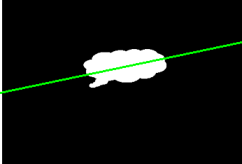 |

## 2.7 逼近多边形

### 使用方法

- 通过**函数**`cv2.approxPolyDP()`**构造指定精度的逼近多边形曲线**。
  - **算法**：**Douglas-Peucker算法**
- **函数原型**：`approxCurve = cv2.approxPolyDP( curve, epsilon, closed )`
- **参数说明**：
  - **approxCurve **：**逼近多边形**的**点集**。
  - **curve**：**轮廓**。
  - **epsilon**：**精度**，**原始轮廓的边界点**与**逼近多边形边界**之间的**最大距离**。
  - **closed **：**轮廓封闭信息**，用来表示轮廓是**闭合的**还是**开口的**。
    - **True**：闭合
    - **False**：开口

### 示例

```python
import cv2

image = cv2.imread('sample_3.png')
image_gray = cv2.cvtColor(image, cv2.COLOR_BGR2GRAY)
ret, binary = cv2.threshold(image_gray, 127, 255, cv2.THRESH_BINARY)

contours, hierarchy = cv2.findContours(binary, cv2.RETR_LIST, cv2.CHAIN_APPROX_SIMPLE)

proportion = [0.10, 0.08, 0.06, 0.04, 0.02, 0.01]

for n in range(len(proportion)):
    epsilon = proportion[n] * cv2.arcLength(contours[0], True)
    approx = cv2.approxPolyDP(contours[0], epsilon, True)
    img = cv2.drawContours(image.copy(), [approx], 0, (0,0,255), 2)

    cv2.imwrite("sample_3_approxPolyDP_" + str(n+1) + ".png", img)
```

|            逼近多边形            |            逼近多边形            |            逼近多边形            |
| :------------------------------: | :------------------------------: | :------------------------------: |
| 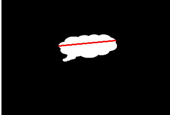 | 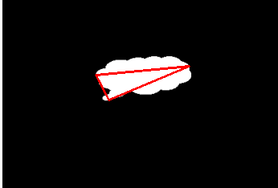 |  |
| 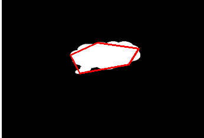 | 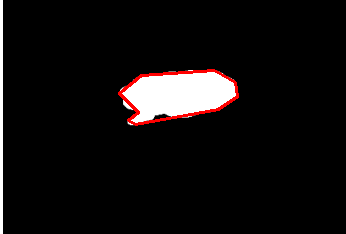 | 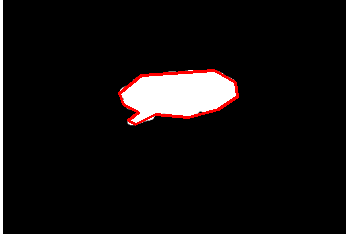 |

## 2.8 凸包

​		**逼近多边形**是**针对轮廓的高度近似**，但有时候希望使用一个多边形的**凸包**来简化它。

​		**凸包**指的是**完全包含原有轮廓**，并且**仅由轮廓上的点所构成的多边形**。

​		**凸包**的**每一处都是凸的**，即**在凸包内连接任意两点的直线都在凸包的内部**。在凸包内，**任意连续三个点的内角小于180°**。

### 使用方法

- 通过**函数**`cv2.convexHull()`**获取轮廓的凸包**。
- **函数原型**：`hull = cv2.convexHull( points, clockwise, returnPoints )`
- **参数说明**：
  - **hull **：**凸包**的**角点集**。
  - **points**：**轮廓**。
  - **clockwise**：布尔型数据。
    - **True**：凸包角点将按**顺时针方向**排列。
    - **False**：凸包角点将按**逆时针方向**排列。
  - **returnPoints**：布尔型数据。
    - **True**：返回**凸包角点**的**坐标**。
    - **False**：返回**凸包角点**的**索引**。

### 示例

```python
import cv2

image = cv2.imread('sample_4.png')
image_gray = cv2.cvtColor(image, cv2.COLOR_BGR2GRAY)
ret, binary = cv2.threshold(image_gray, 127, 255, cv2.THRESH_BINARY)

contours, hierarchy = cv2.findContours(binary, cv2.RETR_LIST, cv2.CHAIN_APPROX_SIMPLE)

hull = cv2.convexHull(contours[0])

cv2.polylines(image, [hull], True, (0, 255, 0), 2)

cv2.imwrite("sample_4_hull.png", image)
```

|       原图        |          凸包          |
| :---------------: | :--------------------: |
| 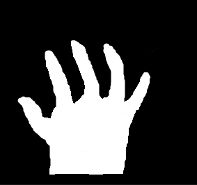 | 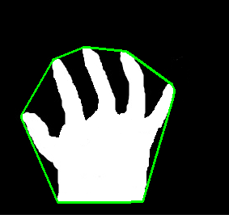 |

## 2.9 凸缺陷

​		在**轮廓边缘与凸包之间的部分**，被称为**凸缺陷**。

### 使用方法

- 通过**函数**`cv2.convexityDefects()`**获取轮廓的凸缺陷**。
- **函数原型**：`defects = cv2.convexityDefects( contour, contourhull )`
- **参数说明**：
  - **defects**：**凸缺陷**的**角点集**。
    - 它是一个**数组**，每一行包含的值是[**起点**， **终点**， **轮廓上距离凸包最远的点**， **最远点到凸包的近似距离**]
  - **contour**：**轮廓**。
  - **contourhull**：**凸包**的**角点集**。
    - 调用**cv2.convexHull()**时，参数**returnPoints**的值必须是**False**。

### 示例

```python
import cv2

image = cv2.imread('sample_4.png')
image_gray = cv2.cvtColor(image, cv2.COLOR_BGR2GRAY)
ret, binary = cv2.threshold(image_gray, 127, 255, cv2.THRESH_BINARY)

contours, hierarchy = cv2.findContours(binary, cv2.RETR_LIST, cv2.CHAIN_APPROX_SIMPLE)

hull = cv2.convexHull(contours[0], returnPoints=False)

defects = cv2.convexityDefects(contours[0], hull)

for i in range(defects.shape[0]):
    s, e, f, d = defects[i,0]
    start = tuple(contours[0][s][0])
    end = tuple(contours[0][e][0])
    far = tuple(contours[0][f][0])
    cv2.line(image, start, end, [0,255,0], 2)
    cv2.circle(image, far, 5, [255,0,0], 1)

cv2.imwrite("sample_4_hullDefects.png", image)
```

|       原图        |            凸缺陷             |
| :---------------: | :---------------------------: |
|  | 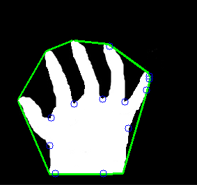 |

## 2.10 测试轮廓是否是凸形的

### 使用方法

- 通过**函数**`cv2.isContourConvex()`**判断轮廓是否是凸形的**。
- **函数原型**：`ret = cv2.isContourConvex( contour )`
- **参数说明**：
  - **ret**：布尔型数据。
    - **True**：轮廓**是**凸形的。
    - **False**：轮廓**不是**凸形的。
  - **contour**：**轮廓**。

### 示例

```python
import cv2

image = cv2.imread('sample_4.png')
image_gray = cv2.cvtColor(image, cv2.COLOR_BGR2GRAY)
ret, binary = cv2.threshold(image_gray, 127, 255, cv2.THRESH_BINARY)

contours, hierarchy = cv2.findContours(binary, cv2.RETR_LIST, cv2.CHAIN_APPROX_SIMPLE)

# 逼近多边形
epsilon = 0.02 * cv2.arcLength(contours[0], True)
approx = cv2.approxPolyDP(contours[0], epsilon, True)

# 凸包
hull = cv2.convexHull(contours[0])

# 检测轮廓是否是凸形
print("逼近多边形为凸形？", cv2.isContourConvex(approx))
print("凸包为凸形？", cv2.isContourConvex(hull))
```

```python
逼近多边形为凸形？ False
凸包为凸形？ True
```

## 2.11 计算点到轮廓的距离

### 使用方法

- 通过**函数**`cv2.pointPolygonTest()`**计算点到多边形轮廓的最短距离**。
- **函数原型**：`ret = cv2.pointPolygonTest( contour, point, measureDist )`
- **参数说明**：
  - **ret**：与参数measureDist的值有关。
  - **contour**：**轮廓**。
  - **point**：**待判定的点**。
  - **measureDist**：布尔型数据。
    - **True**：计算点到轮廓的**距离**，**负数**表示**点在轮廓外部**、**0**表示**在轮廓上**、**正数**表示**点在轮廓内部**。
    - **False**：不计算距离，只返回 **-1** 、 **0** 和 **1** 中的一个值，分别表示**在轮廓外**、**在轮廓上**、**在轮廓内**。

### 示例

```python
import cv2

image = cv2.imread('sample_4.png')
image_gray = cv2.cvtColor(image, cv2.COLOR_BGR2GRAY)
ret, binary = cv2.threshold(image_gray, 127, 255, cv2.THRESH_BINARY)

contours, hierarchy = cv2.findContours(binary, cv2.RETR_LIST, cv2.CHAIN_APPROX_SIMPLE)

hull = cv2.convexHull(contours[0])

ptA = (150, 125)
ptB = (155, 63)
ptC = (200, 60)

distA = cv2.pointPolygonTest(hull, ptA, True)
distB = cv2.pointPolygonTest(hull, ptB, True)
distC = cv2.pointPolygonTest(hull, ptC, True)

print("点A到轮廓的距离", distA)
print("点B到轮廓的距离", distB)
print("点C到轮廓的距离", distC)

cv2.polylines(image, [hull], True, (0, 255, 255), 2)
cv2.circle(image, ptA, 1, (0, 0, 255), -1)
cv2.circle(image, ptB, 1, (0, 255, 0), -1)
cv2.circle(image, ptC, 1, (255, 0, 0), -1)

cv2.imwrite("sample_4_dist.png", image)
```

|       原图        |        点和凸包        |
| :---------------: | :--------------------: |
|  | 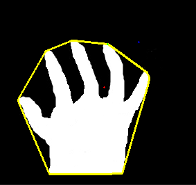 |
