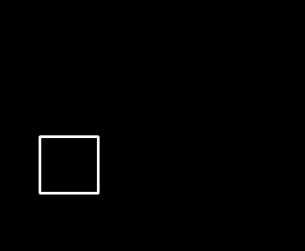
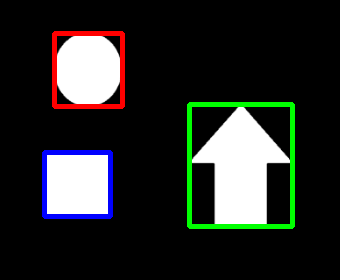
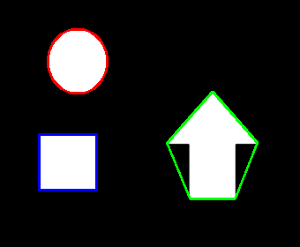
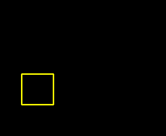
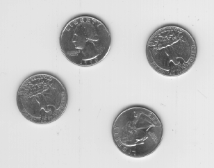
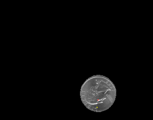
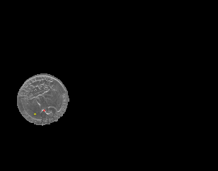
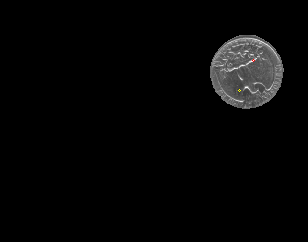
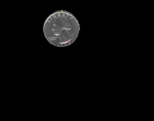
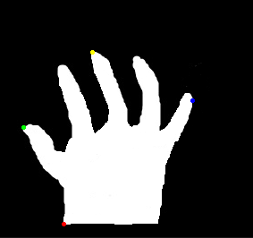

# 1. 计算轮廓面积

## 1.1 使用方法

- 通过**函数**`cv2.contourArea()`**计算轮廓面积**。
- **函数原型**：`val = cv2.contourArea( contour , oriented )`
- **参数说明**：
  - **contours**：**轮廓信息**。
  - **oriented**：**朝向信息**，用来表示轮廓是**顺时针**还是**逆时针**。默认为**False**。

## 1.2 示例

```python
import cv2
import numpy as np

image = cv2.imread("sample_1.png", 0)

val, image = cv2.threshold(image, 127, 255, cv2.THRESH_BINARY)

contours, hierarchy = cv2.findContours( image, cv2.RETR_EXTERNAL, cv2.CHAIN_APPROX_NONE)

amount = len(contours)

for i in range(amount):
    print("contours[" + str(i) + "]的面积为：",cv2.contourArea(contours[i]))
```

|       原图        |        二值化的图        |          轮廓0           |          轮廓1           |          轮廓2           |
| :---------------: | :----------------------: | :----------------------: | :----------------------: | :----------------------: |
|  |  |  |  |  |

```python
contours[0]的面积为： 4095.0
contours[1]的面积为： 6185.0
contours[2]的面积为： 3816.0
```

# 2. 计算轮廓周长

##  2.1 使用方法

- 通过**函数**`cv2.arcLength()`**计算轮廓周长**。
- **函数原型**：`val = cv2.arcLength( contour , closed )`
- **参数说明**：
  - **contours**：**轮廓信息**。
  - **closed**：**轮廓封闭信息**，用来表示轮廓是**闭合的**还是**开口的**。
    - **True**：闭合
    - **False**：开口

## 2.2 示例

```python
import cv2
import numpy as np

image = cv2.imread("sample_1.png", 0)

val, image = cv2.threshold(image, 127, 255, cv2.THRESH_BINARY)

contours, hierarchy = cv2.findContours( image, cv2.RETR_EXTERNAL, cv2.CHAIN_APPROX_NONE)

amount = len(contours)

for i in range(amount):
    print("contours[" + str(i) + "]的长度为：%d" % cv2.arcLength(contours[i], True))
```

|       原图        |        二值化的图        |          索引0           |          索引1           |          索引2           |
| :---------------: | :----------------------: | :----------------------: | :----------------------: | :----------------------: |
|  |  |  |  |  |

```python
contours[0]的长度为：256
contours[1]的长度为：385
contours[2]的长度为：231
```

# 3. 计算矩

​		比较两个轮廓最简单的方法是比较二者的轮廓矩。**轮廓矩**代表了**一个轮廓、一幅图像、一组点集的全局特征**。**矩信息**包含了对应对象**不同类型的几何特征**，例如**大小**、**位置**、**角度**、**形状**等。**矩特征**被广泛地应用在**模式识别**、**图像识别**等方面。

## 3.1 轮廓矩

​		轮廓矩描述了一个轮廓的重要特征，包括**空间矩**、**中心矩**、**归一化中心矩**。

### 使用方法

- 通过**函数**`cv2.moments()`**计算轮廓矩**。
- **函数原型**：`val = cv2.moments( array, binaryImage )`
- **参数说明**：
  - **val**：**矩特征**。
    - **`空间矩`**
      - 零阶矩：m00
        - $$ M_{00} = \sum\limits_{I}\sum\limits_{J}{f(x,y)} $$
      - 一阶矩：m10, m01
        - $$ M_{10} = \sum\limits_{I}\sum\limits_{J}{x·f(x,y)} $$
        - $$ M_{01} = \sum\limits_{I}\sum\limits_{J}{y·f(x,y)} $$
      - 二阶矩：m20, m11, m02
        - $$ M_{20} = \sum\limits_{I}\sum\limits_{J}{x^2·f(x,y)} $$
        - $$ M_{02} = \sum\limits_{I}\sum\limits_{J}{y^2·f(x,y)} $$
        - $$ M_{11} = \sum\limits_{I}\sum\limits_{J}{x·y·f(x,y)} $$
      - 三阶矩：m30, m21, m12, m03
    - **`中心矩`**
      - 二阶中心矩：mu20, mu11, mu02
        - $$ \mu_{pq} = \sum\limits_{x=1}^{M}\sum\limits_{y=1}^{N}{(x-\bar{x})^p·(y-\bar{y})^q·f(x,y)} $$
      - 三阶中心矩：mu30, mu21, mu12, mu03
    - **`归一化中心矩`**
      - 二阶归一化中心矩：nu20, nu11, nu02
      - 三阶归一化中心矩：nu30, nu21, nu12, nu03
  - **array**：**点集、灰度图像、二值图像**。
  - **binaryImage**：当为**True**时，**array内所有的非零值都被处理为1**。
    - 仅在**array为图像**时**生效**。

### 示例

```python
import cv2
import numpy as np

image = cv2.imread("sample_1.png", 0)

val, image = cv2.threshold(image, 127, 255, cv2.THRESH_BINARY)

contours, hierarchy = cv2.findContours( image, cv2.RETR_EXTERNAL, cv2.CHAIN_APPROX_NONE)

amount = len(contours)

for i in range(amount):
    print("轮廓" + str(i) + "的矩:\n", cv2.moments(contours[i]))
```

|       原图        |        二值化的图        |          轮廓0           |          轮廓1           |          轮廓2           |
| :---------------: | :----------------------: | :----------------------: | :----------------------: | :----------------------: |
|  |  |  |  |  |

```python
轮廓0的矩:
{'m00': 4095.0, 'm10': 313267.5, 'm01': 751432.5, 'm20': 25406745.0, 'm11': 57484586.25, 'm02': 139242285.0, 'm30': 2164208523.75, 'm21': 4662137707.5, 'm12': 10652034802.5, 'm03': 26048031896.25, 'mu20': 1441781.25, 'mu11': 0.0, 'mu02': 1354421.25, 'mu30': 0.0, 'mu21': 0.0, 'mu12': 0.0, 'mu03': 0.0, 'nu20': 0.08597883597883597, 'nu11': 0.0, 'nu02': 0.08076923076923077, 'nu30': 0.0, 'nu21': 0.0, 'nu12': 0.0, 'nu03': 0.0}
轮廓1的矩:
{'m00': 6185.0, 'm10': 1487036.6666666665, 'm01': 1045703.1666666666, 'm20': 359515958.1666666, 'm11': 251423445.75, 'm02': 182409066.0, 'm30': 87395289837.40001, 'm21': 60780796520.95, 'm12': 43859139353.71667, 'm03': 32758876074.850002, 'mu20': 1993234.1551693082, 'mu11': 8902.292800724506, 'mu02': 5611149.625433415, 'mu30': -253670.05528259277, 'mu21': -7150446.50486964, 'mu12': 192258.16863298416, 'mu03': 21457835.751960754, 'nu20': 0.05210494148474602, 'nu11': 0.00023271397605688018, 'nu02': 0.14668052026758915, 'nu30': -8.431793146434249e-05, 'nu21': -0.002376752185690158, 'nu12': 6.390510329726085e-05, 'nu03': 0.0071324158552785255}
轮廓2的矩:
{'m00': 3816.0, 'm10': 333770.5, 'm01': 263440.5, 'm20': 30255849.166666664, 'm11': 23042621.5, 'm02': 19451408.5, 'm30': 2832209271.25, 'm21': 2088845625.0, 'm12': 1701377158.6666667, 'm03': 1517424559.25, 'mu20': 1062257.2719470598, 'mu11': 517.8822720088065, 'mu02': 1264590.6173349023, 'mu30': 26308.4995470047, 'mu21': 19173.20728830993, 'mu12': -32485.745966747403, 'mu03': -22387.81401515007, 'nu20': 0.07294793135896001, 'nu11': 3.556430389153735e-05, 'nu02': 0.08684268113452724, 'nu30': 2.9246585130629595e-05, 'nu21': 2.131443635479422e-05, 'nu12': -3.611369524327952e-05, 'nu03': -2.488804453910166e-05}
```

## 3.2 Hu矩

​		**Hu矩**是**归一化中心矩**的**线性组合**。**Hu矩在图像旋转、缩放、平移等操作后，仍能保持矩的不变性**，因此，**经常使用Hu矩来识别图像的特征**。

$I_{1}=\nu_{20}+\nu_{02}$

$I_{2}=(\nu_{20}-\nu_{02})^{2}+4\nu_{11}^{2}$

$I_{3}=(\nu_{30}-3\nu _{12})^{2}+(3\nu _{21}-\nu _{03})^{2}$

$I_{4}=(\nu _{30}+\nu _{12})^{2}+(\nu _{21}+\nu _{03})^{2}$

$I_{5}=(\nu _{30}-3\nu _{12})(\nu _{30}+\nu _{12})[(\nu _{30}+\nu _{12})^{2}-3(\nu _{21}+\nu _{03})^{2}]+(3\nu _{21}-\nu _{03})(\nu _{21}+\nu _{03})[3(\nu _{30}+\nu _{12})^{2}-(\nu _{21}+\nu _{03})^{2}]$

$I_{6}=(\nu _{20}-\nu _{02})[(\nu _{30}+\nu _{12})^{2}-(\nu _{21}+\nu _{03})^{2}]+4\nu _{11}(\nu _{30}+\nu _{12})(\nu _{21}+\nu _{03})$

$I_{7}=(3\nu _{21}-\nu _{03})(\nu _{30}+\nu _{12})[(\nu _{30}+\nu _{12})^{2}-3(\nu _{21}+\nu _{03})^{2}]-(\nu _{30}-3\nu _{12})(\nu _{21}+\nu _{03})[3(\nu _{30}+\nu _{12})^{2}-(\nu _{21}+\nu _{03})^{2}]$

### 使用方法

- 通过**函数**`cv2.HuMoments()`**计算轮廓的Hu矩**。
- **函数原型**：`hu = cv2.HuMoments( val  )`
- **参数说明**：
  - **hu**：**轮廓Hu矩**的值。
  - **val**：**轮廓矩**的值。
    - 二阶Hu矩：nu20, nu11, nu02
    - 三阶Hu矩：nu30, nu21, nu12, nu03

###  示例

```python
import cv2

image = cv2.imread("sample_1.png", 0)

moments = cv2.moments(image)
hu = cv2.HuMoments(moments)

print("轮廓矩：\n", moments)
print("Hu矩：\n", hu)
```

```python
轮廓矩：
 {'m00': 3709042.0, 'm10': 560169360.0, 'm01': 542963851.0, 'm20': 108801897982.0, 'm11': 87197848120.0, 'm02': 90011266623.0, 'm30': 24191041256496.0, 'm21': 17704395888988.0, 'm12': 14780486701098.0, 'm03': 15940551210805.0, 'mu20': 24200614986.873608, 'mu11': 5195079502.7114, 'mu02': 10527199445.343296, 'mu30': 448960261735.35156, 'mu21': 207762999745.50302, 'mu12': -334746386875.111, 'mu03': -318267497958.3831, 'nu20': 0.001759150111134978, 'nu11': 0.0003776319192510914, 'nu02': 0.0007652253500276909, 'nu30': 1.6945466319440315e-05, 'nu21': 7.841765106348364e-06, 'nu12': -1.2634600671384719e-05, 'nu03': -1.2012624784162841e-05}
Hu矩：
 [[ 2.52437546e-03]
 [ 1.55830990e-06]
 [ 4.27138600e-09]
 [ 3.59796331e-11]
 [-1.36308086e-20]
 [-2.59790335e-14]
 [ 3.62612694e-21]]
```

## 3.3 形状匹配

### 使用方法

- 通过**函数**`cv2.matchShapes()`进行**图像形状的匹配**。
- **函数原型**：`ret = cv2.matchShapes( contour1, contour2, method, parameter )`
- **参数说明**：
  - **ret**：返回值，**提示匹配度**。
  - **contour1**：**第1个**的**轮廓**或者**灰度图像**。
  - **contour2**：**第2个**的**轮廓**或者**灰度图像**。
  - **method**：**比较两个对象的Hu矩的方法**。
    - **cv2.CONTOURS_MATCH_I1**
    - **cv2.CONTOURS_MATCH_I2**
    - **cv2.CONTOURS_MATCH_I3**
  - **parameter**：扩展参数，应用于method的特定参数，可暂不用考虑。

### 示例

```python
import cv2
import numpy as np

image = cv2.imread("sample_1.png", 0)

val, image = cv2.threshold(image, 127, 255, cv2.THRESH_BINARY)

contours, hierarchy = cv2.findContours( image, cv2.RETR_EXTERNAL, cv2.CHAIN_APPROX_NONE)

cnt_0 = contours[0]
cnt_1 = contours[1]
cnt_2 = contours[2]

match_0 = cv2.matchShapes(cnt_0, cnt_1, 1, 0.0)
match_1 = cv2.matchShapes(cnt_0, cnt_2, 1, 0.0)
match_2 = cv2.matchShapes(cnt_1, cnt_2, 1, 0.0)

print("轮廓0和轮廓1的匹配度：%.6f" % match_0)
print("轮廓0和轮廓2的匹配度：%.6f" % match_1)
print("轮廓1和轮廓2的匹配度：%.6f" % match_2)
```

```
轮廓0和轮廓1的匹配度：0.409022
轮廓0和轮廓2的匹配度：0.080113
轮廓1和轮廓2的匹配度：0.388656
```

|       原图        |          轮廓0           |          轮廓1           |          轮廓2           |
| :---------------: | :----------------------: | :----------------------: | :----------------------: |
|  |  |  |  |

# 4. 轮廓的特征值

​		轮廓**自身的一些属性特征**及轮廓**所包围对象的特征**对于描述图像具有重要意义。

## 4.1 宽高比

- **Ratio** = **包围框宽度** / **包围框高度**

```python
import cv2
import numpy as np

image = cv2.imread("sample_1.png")
image_gray = cv2.cvtColor(image, cv2.COLOR_BGR2GRAY)

val, image_binary = cv2.threshold(image_gray, 127, 255, cv2.THRESH_BINARY)

contours, hierarchy = cv2.findContours( image_binary, cv2.RETR_EXTERNAL, cv2.CHAIN_APPROX_NONE)

x,y,w,h = cv2.boundingRect(contours[0])
ratio = float(w / h)
cv2.rectangle(image, (x, y), (x + w, y + h), (255, 0, 0), 3)
print("蓝色轮廓的Ratio为：", ratio)

x,y,w,h = cv2.boundingRect(contours[1])
ratio = float(w / h)
cv2.rectangle(image, (x, y), (x + w, y + h), (0, 255, 0), 3)
print("绿色轮廓的Ratio为：", ratio)

x,y,w,h = cv2.boundingRect(contours[2])
ratio = float(w / h)
cv2.rectangle(image, (x, y), (x + w, y + h), (0, 0, 255), 3)
print("红色轮廓的Ratio为：", ratio)

cv2.imwrite("sample_1_rect.png", image)
```

```python
蓝色轮廓的Ratio为： 1.03125
绿色轮廓的Ratio为： 0.8442622950819673
红色轮廓的Ratio为： 0.9315068493150684
```

|       原图        |        二值化的图        |        外接矩形        |
| :---------------: | :----------------------: | :--------------------: |
|  |  |  |

## 4.2 Extend

- **Extend** = **轮廓面积** / **矩形包围框面积**

```python
import cv2
import numpy as np

image = cv2.imread("sample_1.png")
image_gray = cv2.cvtColor(image, cv2.COLOR_BGR2GRAY)

val, image_binary = cv2.threshold(image_gray, 127, 255, cv2.THRESH_BINARY)

contours, hierarchy = cv2.findContours( image_binary, cv2.RETR_EXTERNAL, cv2.CHAIN_APPROX_NONE)

x,y,w,h = cv2.boundingRect(contours[0])
rectArea = float(w * h)
contoursArea = cv2.contourArea(contours[0])
extend = float(contoursArea / rectArea)
print("蓝色轮廓的extend为：", extend)

x,y,w,h = cv2.boundingRect(contours[1])
rectArea = float(w * h)
contoursArea = cv2.contourArea(contours[1])
extend = float(contoursArea / rectArea)
print("绿色轮廓的extend为：", extend)

x,y,w,h = cv2.boundingRect(contours[2])
rectArea = float(w * h)
contoursArea = cv2.contourArea(contours[2])
extend = float(contoursArea / rectArea)
print("红色轮廓的extend为：", extend)
```

```python
蓝色轮廓的extend为： 0.9694602272727273
绿色轮廓的extend为： 0.49220117778131467
红色轮廓的extend为： 0.7687348912167606
```

|       原图        |        二值化的图        |        外接矩形        |
| :---------------: | :----------------------: | :--------------------: |
|  |  |  |

## 4.3 Solidity

- **Solidity** = **轮廓面积** / **凸包面积**

```python
import cv2
import numpy as np

image = cv2.imread("sample_1.png")
image_gray = cv2.cvtColor(image, cv2.COLOR_BGR2GRAY)

val, image_binary = cv2.threshold(image_gray, 127, 255, cv2.THRESH_BINARY)

contours, hierarchy = cv2.findContours( image_binary, cv2.RETR_EXTERNAL, cv2.CHAIN_APPROX_NONE)

hull = cv2.convexHull(contours[0])
cv2.polylines(image, [hull], True, (255, 0, 0), 2)
hullArea = cv2.contourArea(hull)
contoursArea = cv2.contourArea(contours[0])
solidity = float(contoursArea / hullArea)
print("蓝色轮廓的solidity为：", solidity)

hull = cv2.convexHull(contours[1])
cv2.polylines(image, [hull], True, (0, 255, 0), 2)
hullArea = cv2.contourArea(hull)
contoursArea = cv2.contourArea(contours[1])
solidity = float(contoursArea / hullArea)
print("绿色轮廓的solidity为：", solidity)

hull = cv2.convexHull(contours[2])
cv2.polylines(image, [hull], True, (0, 0, 255), 2)
hullArea = cv2.contourArea(hull)
contoursArea = cv2.contourArea(contours[2])
solidity = float(contoursArea / hullArea)
print("红色轮廓的solidity为：", solidity)

cv2.imwrite("sample_1_hull.png", image)
```

```python
蓝色轮廓的solidity为： 1.0
绿色轮廓的solidity为： 0.7878980891719746
红色轮廓的solidity为： 0.9888572168955688
```

|       原图        |        二值化的图        |          凸包          |
| :---------------: | :----------------------: | :--------------------: |
|  |  |  |

## 4.4 等效直径

-  $$ \text{等效直径} = 2 * \sqrt{\frac{\text{轮廓面积}}{\pi}} $$

```python
import cv2
import numpy as np

image = cv2.imread("sample_1.png")
image_gray = cv2.cvtColor(image, cv2.COLOR_BGR2GRAY)

val, image_binary = cv2.threshold(image_gray, 127, 255, cv2.THRESH_BINARY)

contours, hierarchy = cv2.findContours( image_binary, cv2.RETR_EXTERNAL, cv2.CHAIN_APPROX_NONE)

contoursArea = cv2.contourArea(contours[0])
equiDiameter = np.sqrt(4 * contoursArea / np.pi)
print("蓝色轮廓的等效直径为：", equiDiameter)

contoursArea = cv2.contourArea(contours[1])
equiDiameter = np.sqrt(4 * contoursArea / np.pi)
print("绿色轮廓的等效直径为：", equiDiameter)

contoursArea = cv2.contourArea(contours[2])
equiDiameter = np.sqrt(4 * contoursArea / np.pi)
print("红色轮廓的等效直径为：", equiDiameter)
```

```python
蓝色轮廓的等效直径为： 72.20745069375107
绿色轮廓的等效直径为： 88.74112115691902
红色轮廓的等效直径为： 69.7042473792622
```

# 5. 利用掩膜获取图像感兴趣区域的特征

## 5.1 根据轮廓设置掩膜图像

​		**cv2.drawContours()**的轮廓**宽度参数**（**thickness**）设置为**正数**，可获得特定对象的**空心轮廓**；设置为 **-1** ，即可获取特定对象的**实心轮廓**。

```python
import cv2
import numpy as np

image = cv2.imread("sample_1.png")
image_gray = cv2.cvtColor(image, cv2.COLOR_BGR2GRAY)

val, image_binary = cv2.threshold(image_gray, 127, 255, cv2.THRESH_BINARY)

contours, hierarchy = cv2.findContours( image_binary, cv2.RETR_EXTERNAL, cv2.CHAIN_APPROX_NONE)

mask_0 = np.zeros(image.shape, np.uint8)
cv2.drawContours(mask_0, [contours[0]], 0, [0, 255, 255], 1)

mask_1 = np.zeros(image.shape, np.uint8)
cv2.drawContours(mask_1, [contours[1]], 0, [0, 255, 0], -1)

mask_2 = np.zeros(image.shape, np.uint8)
cv2.drawContours(mask_2, [contours[2]], 0, [0, 0, 255], 2)

cv2.imwrite("sample_1_mask_0.png", mask_0)
cv2.imwrite("sample_1_mask_1.png", mask_1)
cv2.imwrite("sample_1_mask_2.png", mask_2)
```

|       原图        |          轮廓0           |          轮廓1           |          轮廓2           |
| :---------------: | :----------------------: | :----------------------: | :----------------------: |
|  |  |  |  |

##  5.2 ROI的最大值、最小值及其位置

### 使用方法

- 通过**函数**`cv2.minMaxLoc()`用于**在指定的对象内查找最大值、最小值及其位置**。
- **函数原型**：`min_val, max_val, min_loc, max_loc = cv2.minMaxLoc( img, mask )`
- **参数说明**：
  - **min_val**：**最小值**。
  - **max_val**：**最大值**。
  - **min_loc**：**最小值的位置**。
  - **max_loc**：**最大值的位置**。

### 示例

```python
import cv2
import numpy as np

image = cv2.imread("sample_5.png")
image_gray = cv2.cvtColor(image, cv2.COLOR_BGR2GRAY)
val, image_BW = cv2.threshold(image_gray, 127, 255, cv2.THRESH_BINARY_INV)

kernel = np.ones((7, 7), np.uint8)
image_BW = cv2.morphologyEx(src=image_BW, op=cv2.MORPH_CLOSE, kernel=kernel)

contours, hierarchy = cv2.findContours( image_BW, cv2.RETR_EXTERNAL, cv2.CHAIN_APPROX_NONE)

for n in range(len(contours)):
    contour = contours[n]
    mask = np.zeros(image_gray.shape, np.uint8)
    mask = cv2.drawContours(mask, [contour], -1, 255, -1)
    minVal, maxVal, minLoc, maxLoc = cv2.minMaxLoc(image_gray, mask)
    print("Area:", str(n))
    print("minVal =", minVal)
    print("maxVal =", maxVal)
    print("minLoc =", minLoc)
    print("maxLoc =", maxLoc)
    print("")

    mask = np.zeros(image.shape, np.uint8)
    mask = cv2.drawContours(mask, [contour], -1, [255, 255, 255], -1)
    ROI = cv2.bitwise_and(image.copy(), mask)
    ROI = cv2.circle(ROI, minLoc, 1, [0, 255, 255], 1)
    ROI = cv2.circle(ROI, maxLoc, 1, [0,   0, 255], 1)

    cv2.imwrite("sample_5_ROI_%d.png" % (n+1), ROI)
```

```python
Area: 0
minVal = 56.0
maxVal = 255.0
minLoc = (195, 216)
maxLoc = (197, 201)

Area: 1
minVal = 72.0
maxVal = 208.0
minLoc = (49, 161)
maxLoc = (62, 156)

Area: 2
minVal = 61.0
maxVal = 255.0
minLoc = (239, 90)
maxLoc = (253, 60)

Area: 3
minVal = 61.0
maxVal = 255.0
minLoc = (124, 22)
maxLoc = (136, 82)
```

|       原图        |    最大值、最小值-1     |    最大值、最小值-2     |    最大值、最小值-3     |    最大值、最小值-4     |
| :---------------: | :---------------------: | :---------------------: | :---------------------: | :---------------------: |
|  |  |  |  |  |

## 5.3 ROI的平均颜色

### 使用方法

- 通过**函数**`cv2.mean()`用于**计算一个对象的平均颜色**。
- **函数原型**：`val = cv2.mean( img, mask )`
- **参数说明**：
  - **val**：**平均值**。
  - **img**：**原始图像**。
  - **mask**：**掩膜**。

### 示例

```python
import cv2
import numpy as np

image = cv2.imread("sample_5.png")
image_gray = cv2.cvtColor(image, cv2.COLOR_BGR2GRAY)
val, image_BW = cv2.threshold(image_gray, 127, 255, cv2.THRESH_BINARY_INV)

kernel = np.ones((7, 7), np.uint8)
image_BW = cv2.morphologyEx(src=image_BW, op=cv2.MORPH_CLOSE, kernel=kernel)

contours, hierarchy = cv2.findContours( image_BW, cv2.RETR_EXTERNAL, cv2.CHAIN_APPROX_NONE)

for n in range(len(contours)):
    contour = contours[n]

    mask = np.zeros(image_gray.shape, np.uint8)
    mask = cv2.drawContours(mask, [contour], -1, [255,255,255], -1)
    meanVal = cv2.mean(image, mask)

    print("Area:", str(n))
    print("meanVal =", meanVal)
    print("")
```

```python
Area: 0
meanVal = (106.39981118716072, 106.39981118716072, 106.39981118716072, 0.0)

Area: 1
meanVal = (109.6024501561374, 109.6024501561374, 109.6024501561374, 0.0)

Area: 2
meanVal = (104.70035419126329, 104.70035419126329, 104.70035419126329, 0.0)

Area: 3
meanVal = (101.13106912221957, 101.13106912221957, 101.13106912221957, 0.0)
```

## 5.4 ROI的边界点

### 使用方法

- 通过**属性**`argmin`和`argmax`**获取边界值**，即**最左端**、**最右端**、**最上端**、**最下端**的四个点。

### 示例

```python
import cv2
import numpy as np

image = cv2.imread("sample_4.png")
image_gray = cv2.cvtColor(image, cv2.COLOR_BGR2GRAY)
val, image_BW = cv2.threshold(image_gray, 127, 255, cv2.THRESH_BINARY)

kernel = np.ones((7, 7), np.uint8)
image_BW = cv2.morphologyEx(src=image_BW, op=cv2.MORPH_CLOSE, kernel=kernel)

contours, hierarchy = cv2.findContours( image_BW, cv2.RETR_EXTERNAL, cv2.CHAIN_APPROX_NONE)

for n in range(len(contours)):

    contour = contours[n]

    mask = np.zeros(image_gray.shape, np.uint8)
    mask = cv2.drawContours(mask, [contour], 0, 255, -1)

    left = tuple(contour[contour[:,:,0].argmin()][0])
    right = tuple(contour[contour[:,:,0].argmax()][0])
    top = tuple(contour[contour[:,:,1].argmin()][0])
    bottom = tuple(contour[contour[:,:,1].argmax()][0])

    print("Area:", str(n))
    print("left =", left)
    print("right =", right)
    print("top =", top)
    print("bottom =", bottom)
    print("")

    image = cv2.circle(image,   left, 1, [  0, 255,   0], 2)
    image = cv2.circle(image,  right, 1, [255,   0,   0], 2)
    image = cv2.circle(image,    top, 1, [  0, 255, 255], 2)
    image = cv2.circle(image, bottom, 1, [  0,   0, 255], 2)

    cv2.imwrite("sample_4_boundaryDot.png", image)
```

```python
Area: 0
left = (26, 142)
right = (215, 112)
top = (103, 58)
bottom = (71, 250)
```

|       原图        |             角点              |
| :---------------: | :---------------------------: |
|  |  |