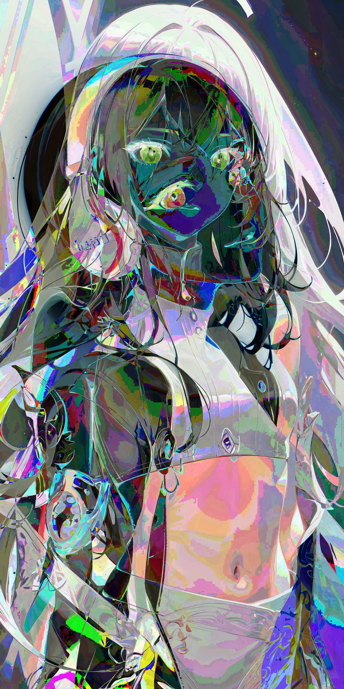

# 0. 参考图

|      参考图1      |      参考图2      |
| :---------------: | :---------------: |
|  |  |

# 1. 加法运算

​		通常情况下，在8位的灰度图像中，像素会用一个 `8bit` 数来表示，即像素值的范围是[0,255]。当两个像素值在进行加法运算时，求得的和很可能超过255，这时不同的加法运算策略得到的结果会不一样。

## 1.1 加号运算符

​		使用 **加号运算符 `+`** 对 **像素值 `a`** 和 **像素值 `b`** 进行**求和运算**时，遵循以下规则：

$$
{\begin{equation}
a+b=\left\{
	\begin{aligned}
	a+b, \quad a+b≤255\\
	mod(a+b,256), \quad a+b>255\\
	\end{aligned}
	\right.
\end{equation}}
$$

​		式中，mod()是取模运算，**mod(a+b, 256)**表示计算**a与b的和，除以256取的余数**。

## 1.2 cv.add()

- 函数**cv2.add()**可以用来**计算图像像素值相加的和**。
  - 函数原型：
    - `val = cv2.add(像素值 a, 像素值 b, mask)`
    - `val = cv2.add(图像 a, 像素值 b, mask)`
    - `val = cv2.add(像素值 a, 图像 b, mask)`
  - 计算规则：

$$
{\begin{equation}
a+b=\left\{
	\begin{aligned}
	a+b, \quad a+b≤255\\
	255, \quad a+b>255\\
	\end{aligned}
	\right.
\end{equation}}
$$

## 1.3 cv.addWeighted()

- 函数**cv2.addWeighted()**可以用来**计算图像像素值相加的和，**在计算两幅图像的像素值之和时，会将每幅图像的**权重**考虑进来。
  - 函数原型：`dst = cv2.addWeighted(src1, α, src2, β, γ)`
  - 计算规则：$${dst = saturate(src1 × \alpha + src2 × \beta + \gamma)}$$
  - 参数说明：
    - **α**：图像1的计算权重
    - **β**：图像2的计算权重
    - **γ**：亮度调节权重

## 1.4 示例

```python
import cv2

src_1 = cv2.imread("person-1.jpg")
src_2 = cv2.imread("person-2.jpg")

dst_3 = src_1 + src_2
dst_4 = cv2.add(src_1, src_2)
dst_5 = cv2.addWeighted(src_1, 0.6, src_2, 0.4, 0)

cv2.imwrite("1.jpg", dst_3)
cv2.imwrite("2.jpg", dst_4)
cv2.imwrite("3.jpg", dst_5)
```

|        +        |        cv2.add()        |        cv2.addWeighted()        |
| :-------------: | :---------------------: | :-----------------------------: |
|  |  |  |

# 2. 位运算

## 2.1 位与运算

- 函数**cv2.bitwise_and()**用于实现按**位与**运算
  - 函数原型：`dst = cv2.bitwise_and( src1, src2, mask )`
  - 计算规则：

    | 算子1 | 算子2 | 计算结果 |
    | :---: | :---: | :------: |
    |   0   |   0   |    0     |
    |   0   |   1   |    0     |
    |   1   |   0   |    0     |
    |   1   |   1   |    1     |

## 2.2 位或运算

- 函数**cv2.bitwise_or()**用于实现按**位或**运算
  - 函数原型：`dst = cv2.bitwise_or( src1, src2, mask )`
  - 计算规则：

    | 算子1 | 算子2 | 计算结果 |
    | :---: | :---: | :------: |
    |   0   |   0   |    0     |
    |   0   |   1   |    1     |
    |   1   |   0   |    1     |
    |   1   |   1   |    1     |

## 2.3 位非运算

- 函数**cv2.bitwise_not()**用于实现按**位非**运算
  - 函数原型：`dst = cv2.bitwise_not( src, mask )`
  - 计算规则：

    | 算子1 | 计算结果 |
    | :---: | :------: |
    |   0   |    1     |
    |   1   |    0     |

## 2.4 位异或运算

- 函数**cv2.bitwise_xor()**用于实现按**位异或**运算
  - 函数原型：`dst = cv2.bitwise_xor( src1, src2, mask )`
  - 计算规则：

    | 算子1 | 算子2 | 计算结果 |
    | :---: | :---: | :------: |
    |   0   |   0   |    0     |
    |   0   |   1   |    1     |
    |   1   |   0   |    1     |
    |   1   |   1   |    0     |

## 2.5 示例

```python
import cv2

src_1 = cv2.imread("person-1.jpg")
src_2 = cv2.imread("person-2.jpg")
pixel_1 = src_1[1000, 1000, 1]
pixel_2 = src_2[1000, 1000, 1]
print("src_1的像素点：\t", pixel_1, ",", bin(pixel_1))
print("src_2的像素点：\t", pixel_2, ",", bin(pixel_2))

dst_3 = cv2.bitwise_and( src_1, src_2 )
pixel_3 = dst_3[1000, 1000, 1]
print("位与：\t\t", pixel_3, ",", bin(pixel_3))

dst_4 = cv2.bitwise_or( src_1, src_2 )
pixel_4 = dst_4[1000, 1000, 1]
print("位或：\t\t", pixel_4, ",", bin(pixel_4))

dst_5 = cv2.bitwise_not( src_1 )
pixel_5 = dst_5[1000, 1000, 1]
print("位与：\t\t", pixel_5, ",", bin(pixel_5))

dst_6 = cv2.bitwise_xor( src_1, src_2 )
pixel_6 = dst_6[1000, 1000, 1]
print("位异或：\t", pixel_6, ",", bin(pixel_6))

cv2.imwrite("4.jpg", dst_3)
cv2.imwrite("5.jpg", dst_4)
cv2.imwrite("6.jpg", dst_5)
cv2.imwrite("7.jpg", dst_6)
```

```bash
src_1的像素点：  189 , 0b10111101
src_2的像素点：  247 , 0b11110111
位与：          181 , 0b10110101
位或：          255 , 0b11111111
位与：           66 , 0b01000010
位异或：         74 , 0b01001010
```

|        位与        |        位或        |        位非        |        位异或        |
| :-------------: | :---------------------: | :-----------------------------: | :-----------------------------: |
|  |  |  |  |

# 3. 掩膜

- 当使用掩模参数时，**操作只会在掩模值为非空的像素点上执行**，同时，**将其他像素点的值置为0**。

## 3.1 示例

```python
import cv2
import numpy as np

img_1 = np.ones((4,4), dtype=np.uint8) * 3
img_2 = np.ones((4,4), dtype=np.uint8) * 5
mask = np.zeros((4,4), dtype=np.uint8)
mask[2:4, 2:4] = 1

img_3 = cv2.add(img_1, img_2, mask=mask)
```

|                输入图：img_1                 |                输入图：img_2                 |                  掩膜：mask                  |
| :------------------------------------------: | :------------------------------------------: | :------------------------------------------: |
| [[3 3 3 3], [3 3 3 3], [3 3 3 3], [3 3 3 3]] | [[5 5 5 5], [5 5 5 5], [5 5 5 5], [5 5 5 5]] | [[0 0 0 0], [0 0 0 0], [0 0 1 1], [0 0 1 1]] |

|                输出图：img_3                 |
| :------------------------------------------: |
| [[0 0 0 0], [0 0 0 0], [0 0 8 8], [0 0 8 8]] |