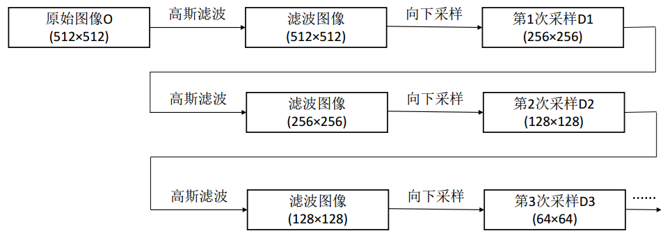
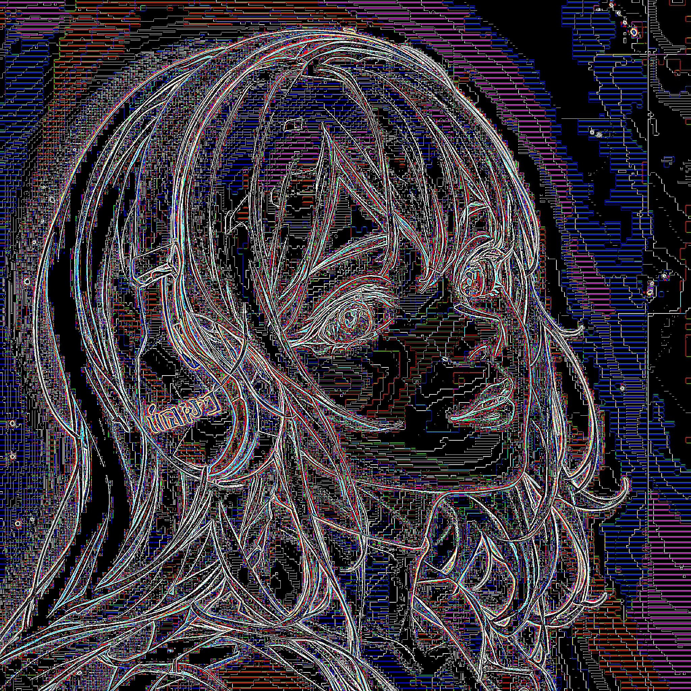
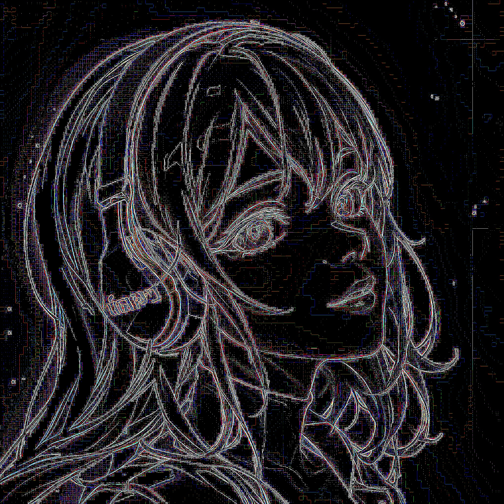
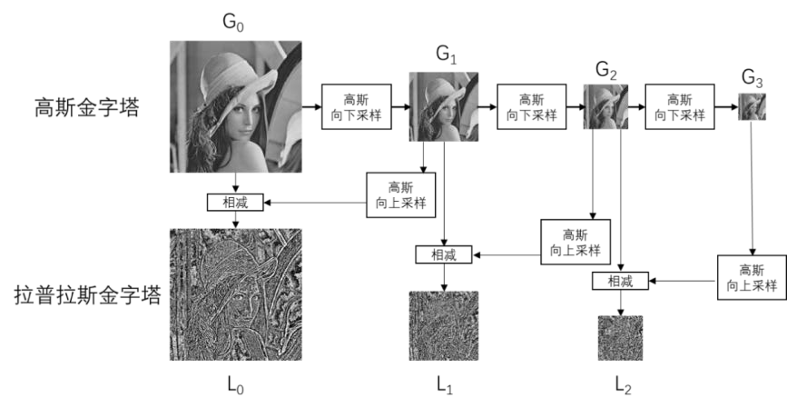
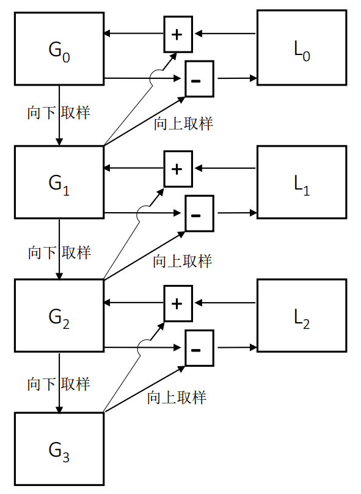
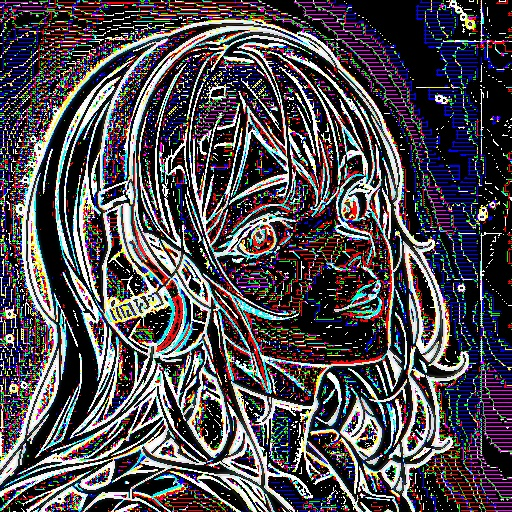

# 1. 理论基础

​		图像金字塔是**由一幅图像的多个不同分辨率的子图所构成的图像集合**。该组图像是**由单个图像通过不断地降采样所产生的**，最小的图像可能仅仅有一个像素点。

​		通常情况下，**图像金字塔的底部是待处理的高分辨率图像**（原始图像），而**顶部是其低分辨率的近似图像**。**向金字塔的顶部移动时，图像的尺寸和分辨率都不断地降低**。通常情况下，**每向上移动一级，图像的宽和高都降低为原来的二分之一**。

​		图示就是一个图像金字塔的**示例**：


# 2. 高斯金字塔

## 2.1 下采样

​		**最简单**的图像金字塔可以通过**不断地删除图像的偶数行和偶数列得到**。

​		另一种方式是，先**对原始图像滤波**，得到原始图像的近似图像，然后**将近似图像的偶数行和偶数列删除**以获取向下采样的结果。在滤波时有多种滤波器可以选择，如 **`均值滤波器`** 、 **`高斯滤波器`** 等，相应地，产生的金字塔即为 **`均值金字塔`** 和 **`高斯金字塔`** 。

​		**高斯金字塔**就是通过**不断地使用高斯滤波和下采样**所产生的。



​		**原始图像**与**各次向下采样所得到的结果图像**共同**构成了高斯金字塔**。

## 2.2 下采样：pyrDown函数

### 使用方式

- 通过函数`cv2.pyrDown()`，实现图像**高斯金字塔**操作中的**向下采样**。
- **函数原型**：`dst = cv2.pyrDown( src, dstsize, borderType )`
- **参数说明**：
  - **dst**：表示**目标图像**。
  - **src**：表示**原始图像**。
  - **dstsize**：表示**目标图像的大小**。
  - **borderType**：表示**边界类型**。默认值为BORDER_DEFAULT，且仅支持BORDER_DEFAULT。

### 示例

```python
import cv2

src = cv2.imread("person.jpg")

pyr1 = cv2.pyrDown(src)
pyr2 = cv2.pyrDown(pyr1)
pyr3 = cv2.pyrDown(pyr2)

print("src.shape =", src.shape)   # src.shape = (2048, 2048, 3)
print("pyr1.shape =", pyr1.shape) # pyr1.shape = (1024, 1024, 3)
print("pyr2.shape =", pyr2.shape) # pyr2.shape = (512, 512, 3)
print("pyr3.shape =", pyr3.shape) # pyr3.shape = (256, 256, 3)

cv2.imwrite("gauss_down_pyr1.jpg", pyr1)
cv2.imwrite("gauss_down_pyr2.jpg", pyr2)
cv2.imwrite("gauss_down_pyr3.jpg", pyr3)
```

|    原图（第0层）     |             第1层             |             第2层             |             第3层             |  ……  |
| :------------------: | :---------------------------: | :---------------------------: | :---------------------------: | :--: |
|  |  |  |  |  ……  |

## 2.3 上采样

​		在向上采样的过程中，通常将图像的宽度和高度都变为原来的2倍，这意味着向上采样的结果图像的大小是原始图像的4倍，因此，**要在结果图像中补充大量的像素点**。**对新生成的像素点进行赋值**，即为**插值**操作。

​		插值可以通过多种方式实现，如用最邻近的像素点给当前还没有值的像素点赋值的**最近邻插值**、对像素点以补零的方式进行插值的**补零插值**。


## 2.4 上采样：pyrUp函数

### 使用方式

- 通过函数`cv2.pyrUp()`，实现图像**高斯金字塔**操作中的**向上采样**。
- **函数原型**：`dst = cv2.pyrUp( src, dstsize, borderType )`
- **参数说明**：
  - **dst**：表示**目标图像**。
  - **src**：表示**原始图像**。
  - **dstsize**：表示**目标图像的大小**。
  - **borderType**：表示**边界类型**。默认值为BORDER_DEFAULT，且仅支持BORDER_DEFAULT。

### 示例

```python
import cv2

pyr3 = cv2.imread("gauss_down_pyr3.jpg")

pyr2 = cv2.pyrUp(pyr3)
pyr1 = cv2.pyrUp(pyr2)
pyr0 = cv2.pyrUp(pyr1)

print("pyr3.shape =", pyr3.shape) # pyr3.shape = (256, 256, 3)
print("pyr2.shape =", pyr2.shape) # pyr2.shape = (512, 512, 3)
print("pyr1.shape =", pyr1.shape) # pyr1.shape = (1024, 1024, 3)
print("pyr0.shape =", pyr0.shape) # pyr0.shape = (2048, 2048, 3)

cv2.imwrite("gauss_up_pyr2.jpg", pyr2)
cv2.imwrite("gauss_up_pyr1.jpg", pyr1)
cv2.imwrite("gauss_up_pyr0.jpg", pyr0)
```

|    第3层     |            第2层            |          第1层           |          第0层           |
| :------------------: | :-------------------------: | :----------------------: | :----------------------: |
|  |  |  |  |

# 3. 可逆性研究

​		上采样和下采样是相反的两种操作。但是，由于**下采样会丢失像素值**，所以这两种操作并**不是可逆的**。`对一幅图像先上采样、再下采样，是无法恢复其原始状态的`；同样，`对一幅图像先下采样、再上采样也无法恢复到原始状态`。

```python
import cv2

src = cv2.imread("person.jpg")

pyr_down_up = cv2.pyrUp(cv2.pyrDown(src))
imgDiff = src - pyr_down_up
cv2.imwrite("gauss_pyr_down_up.jpg", pyr_down_up)
cv2.imwrite("gauss_diff_down_up.jpg", imgDiff)

pyr_up_down = cv2.pyrDown(cv2.pyrUp(src))
imgDiff = src - pyr_up_down
cv2.imwrite("gauss_pyr_up_down.jpg", pyr_up_down)
cv2.imwrite("gauss_diff_up_down.jpg", imgDiff)
```

|        原图         |              先下采样、再上采样              |              差分               |
| :-----------------: | :------------------------------------------: | :-----------------------------: |
|  |  |  |

|        原图         |              先上采样、再下采样              |              差分               |
| :-----------------: | :------------------------------------------: | :-----------------------------: |
|  |  |  |

# 4. 拉普拉斯金字塔

## 4.1 原理

​		一幅图像在经过向下采样后，再对其进行向上采样，是无法恢复为原始状态的。因为**向下采样时在使用高斯滤波器处理后还要抛弃偶数行和偶数列，不可避免地要丢失一些信息**。为了在向上采样时能够恢复具有较高分辨率的原始图像，就要获取在采样过程中所丢失的信息，这些 **`丢失的信息`** 就**构成了 `拉普拉斯金字塔`** 。



## 4.2 示例应用：恢复高分辨率的图像



```python
import cv2
import numpy as np

src = cv2.imread("person.jpg")

Gauss0 = src
Gauss1 = cv2.pyrDown(Gauss0)
Gauss2 = cv2.pyrDown(Gauss1)
Gauss3 = cv2.pyrDown(Gauss2)

UpSample0 = cv2.pyrUp(Gauss1)
UpSample1 = cv2.pyrUp(Gauss2)
UpSample2 = cv2.pyrUp(Gauss3)

Laplacian0 = Gauss0 - UpSample0
Laplacian1 = Gauss1 - UpSample1
Laplacian2 = Gauss2 - UpSample2

Restore0 = Laplacian0 + cv2.pyrUp(Gauss1)
Restore1 = Laplacian1 + cv2.pyrUp(Gauss2)
Restore2 = Laplacian2 + cv2.pyrUp(Gauss3)

cv2.imwrite("gauss_pyr_0.jpg", Gauss0)
cv2.imwrite("gauss_pyr_1.jpg", Gauss1)
cv2.imwrite("gauss_pyr_2.jpg", Gauss2)

cv2.imwrite("upsample_0.jpg", UpSample0)
cv2.imwrite("upsample_1.jpg", UpSample1)
cv2.imwrite("upsample_2.jpg", UpSample2)

cv2.imwrite("laplacian_pyr_0.jpg", Laplacian0)
cv2.imwrite("laplacian_pyr_1.jpg", Laplacian1)
cv2.imwrite("laplacian_pyr_2.jpg", Laplacian2)

cv2.imwrite("restore_0.jpg", Restore0)
cv2.imwrite("restore_1.jpg", Restore1)
cv2.imwrite("restore_2.jpg", Restore2)
```

|           高斯金字塔           |          上采样           |             拉普拉斯金字塔             |          图像恢复          |
| :----------------------------: | :-----------------------: | :------------------------------------: | :------------------------: |
|  |  |  |  |
|  |  |  |  |
|  |  |  |  |