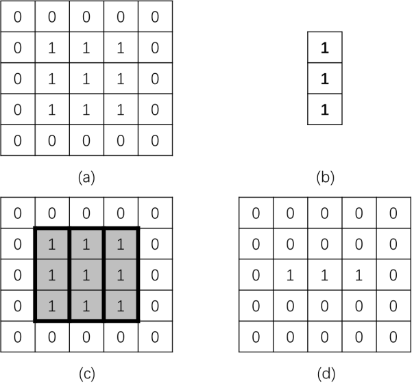
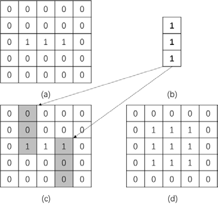
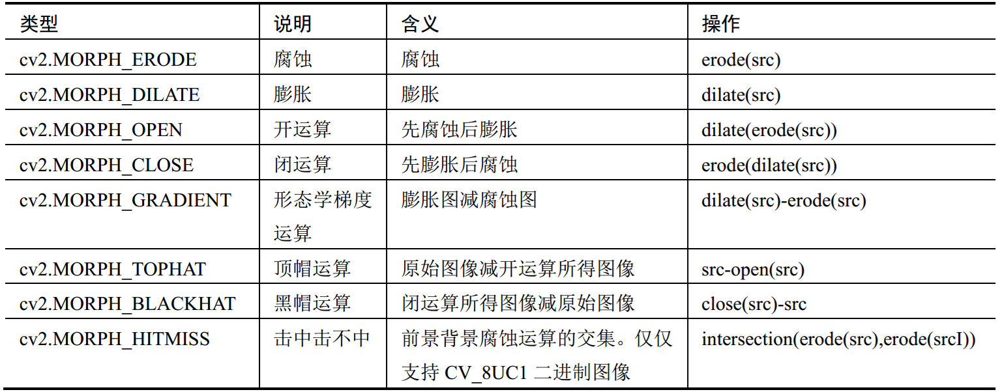
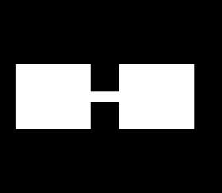
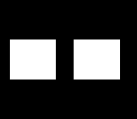
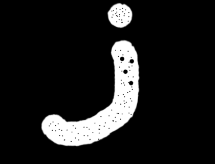
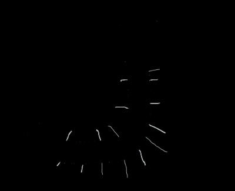
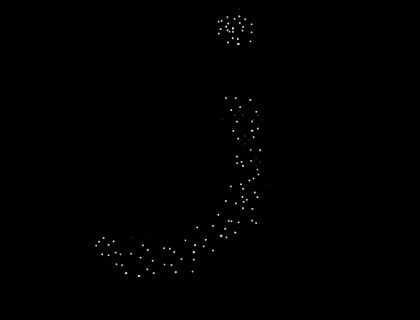

# 1. 基础概念

​		**形态学**主要**从图像内提取分量信息**，该分量信息通常对于 **`表达和描绘图像的形状`** 具有重要意义，通常是图像理解时所使用的最本质的形状特征。

​		形态学处理在**视觉检测**、**文字识别**、**医学图像处理**、**图像压缩编码**等领域都有非常重要的应用。

​		**形态学操作**主要包含： **`腐蚀`** 、 **`膨胀`** 、 **`开运算`** 、 **`闭运算`** 、 **`梯度运算`** 、 **`顶帽运算`** 、 **`黑帽运算`** 等操作。**腐蚀操作和膨胀操作是形态学运算的基础**，将腐蚀和膨胀操作进行结合，就可以实现其他不同形式的运算。

# 2. 腐蚀

​		腐蚀是形态学中的最基本操作，它能够**将图像的边界点消除**，**使图像沿着边界向内收缩**，还可以**将小于指定结构体元素的部分去除**。

​		腐蚀用来**收缩**或者**细化**二值图像中的**前景**，借此实现**去除噪声**、**元素分割**等功能。

## 2.1 原理

​		在腐蚀过程中，通常**使用一个结构元来逐个像素地扫描要被腐蚀的图像**，并**根据结构元和被腐蚀图像的关系**来**确定腐蚀结果**。
- 如果**结构元**`完全处于前景图像`中，就将**结构元中心点**所对应的腐蚀结果图像中的**像素点**处理为 **`前景色`** 。
- 如果**结构元**`未完全处于前景图像`中，就将**结构元中心点**对应的腐蚀结果图像中的**像素点**处理为 **`背景色`** 。



## 2.2 使用方法

- 通过**函数**`cv2.erode()`，实现**腐蚀操作**。
- **函数原型**：`dst = cv2.erode( src, kernel, anchor, iterations, borderType, borderValue )`
- **参数说明**：
  - **dst**：**腐蚀后输出的目标图像**，与原始图像具有相同的大小和类型。
  - **src**：**要进行腐蚀的图像**，图像的**通道数可以是任意的**，但图像的深度必须是**CV_8U**、**CV_16U**、**CV_16S**、**CV_32F**、**CV_64F**中的一种。
  - **kernel**：**腐蚀操作时所采用的结构元**。
  - **anchor**：**可选**参数，结构元中**锚点的位置**，默认为(-1, -1)，在核的中心位置。
  - **iterations**：**可选**参数，**腐蚀操作迭代的次数**，默认为1，即只进行一次腐蚀操作。
  - **borderType**：**可选**参数，边界样式，默认为**BORDER_CONSTANT**。
  - **borderValue**：**可选**参数，边界值， 一般采用默认值。

## 2.3 示例

```python
import cv2
import numpy as np

J = cv2.imread("J.png")

kernel = np.ones((5, 5), np.uint8)
J_erosion_1 = cv2.erode(J, kernel, iterations = 1)

kernel = np.ones((9, 9), np.uint8)
J_erosion_2 = cv2.erode(J, kernel, iterations = 1)

cv2.imwrite("J_erosion_1.png", J_erosion_1)
cv2.imwrite("J_erosion_2.png", J_erosion_2)
```

|    原图     |  5x5的结构元，腐蚀1次   |  9x9的结构元，腐蚀1次   |
| :---------: | :---------------------: | :---------------------: |
|  |  |  |

# 3. 膨胀

​		**膨胀操作**是形态学中另外一种基本的操作。**膨胀操作**是**将当前对象接触到的背景点合并到当前对象内**，从而**实现将图像的边界点向外扩张**。**如果图像内两个对象的距离较近，那么在膨胀的过程中，两个对象有可能会连通在一起。**膨胀操作对**填补图像分割后图像内所存在的空白**相当有帮助。

## 3.1 原理

​		同腐蚀过程一样，在膨胀过程中，也是**使用一个结构元（核函数）来逐个像素地扫描要被膨胀的图像**，并**根据结构元和待膨胀图像的关系来确定膨胀结果**。

- 如果**结构元中`任意一点处于前景图像中`**，就**将`膨胀结果`图像中对应`像素点`处理为`前景色`**。
- 如果**结构元`完全处于背景图像外`**，就**将`膨胀结果`图像中对应`像素点`处理为`背景色`**。



## 3.2 使用方法

- 通过**函数**`cv2.dilate()`，实现**膨胀操作**。
- **函数原型**：`dst = cv2.dilate( src, kernel, anchor, iterations, borderType, borderValue )`
- **参数说明**：
  - **dst**：**膨胀后输出的目标图像**，与原始图像具有相同的大小和类型。
  - **src**：**要进行膨胀的图像**，图像的**通道数可以是任意的**，但图像的深度必须是**CV_8U**、**CV_16U**、**CV_16S**、**CV_32F**、**CV_64F**中的一种。
  - **kernel**：**腐蚀操作时所采用的结构元**。
  - **anchor**：**可选**参数，结构元中**锚点的位置**，默认为(-1, -1)，在核的中心位置。
  - **iterations**：**可选**参数，**膨胀操作迭代的次数**，默认为1，即只进行一次膨胀操作。
  - **borderType**：**可选**参数，边界样式，默认为**BORDER_CONSTANT**。
  - **borderValue**：**可选**参数，边界值， 一般采用默认值。

## 3.3 示例

```python
import cv2
import numpy as np

J = cv2.imread("J.png")

kernel = np.ones((5, 5), np.uint8)
J_dilate_1 = cv2.dilate(J, kernel, iterations = 1)

kernel = np.ones((9, 9), np.uint8)
J_dilate_2 = cv2.dilate(J, kernel, iterations = 1)

cv2.imwrite("J_dilation_1.png", J_dilate_1)
cv2.imwrite("J_dilation_2.png", J_dilate_2)
```

|    原图     |   5x5的结构元，膨胀1次   |   9x9的结构元，膨胀1次   |
| :---------: | :----------------------: | :----------------------: |
|  |  |  |

# 4. 形态学函数

## 4.1 使用方法

- 通过**函数**`cv2.morphologyEx()`，可以实现**形态学操作**。

- **函数原型**：`dst = cv2.morphologyEx( src, op, kernel, anchor, iterations, borderType, borderValue )`
  
- **参数说明**：

  - **dst**：**膨胀后输出的目标图像**，与原始图像具有相同的大小和类型。

  - **src**：**要进行膨胀的图像**，图像的**通道数可以是任意的**，但图像的深度必须是**CV_8U**、**CV_16U**、**CV_16S**、**CV_32F**、**CV_64F**中的一种。

  - **op**：**具体的形态学操作**

    

  - **kernel**：**腐蚀操作时所采用的结构元**。

  - **anchor**：**可选**参数，结构元中**锚点的位置**，默认为(-1, -1)，在核的中心位置。

  - **iterations**：**可选**参数，**膨胀操作迭代的次数**，默认为1，即只进行一次膨胀操作。

  - **borderType**：**可选**参数，边界样式，默认为**BORDER_CONSTANT**。

  - **borderValue**：**可选**参数，边界值， 一般采用默认值。

## 4.2 开运算：先腐蚀，再膨胀

​		**开运算**进行的操作是**先将图像腐蚀**，**再对腐蚀的结果进行膨胀**。

​		**开运算**可以用于**去噪**、**去毛刺**、**划分连接在一起的不同区域以计数**等。

```python
import cv2
import numpy as np

J = cv2.imread("J.png")
kernel = np.ones((5, 5), np.uint8)
J_open = cv2.morphologyEx(src=J, op=cv2.MORPH_OPEN, kernel=kernel)

box = cv2.imread("box.png")
kernel = np.ones((15, 15), np.uint8)
box_open = cv2.morphologyEx(src=box, op=cv2.MORPH_OPEN, kernel=kernel)

cv2.imwrite("J_open.png", J_open)
cv2.imwrite("box_open.png", box_open)
```

|   毛刺图    |    开运算：去毛刺     |
| :---------: | :-------------------: |
|  |  |

|     粘连图      |     开运算：划分区域      |
| :-------------: | :-----------------------: |
|  |  |

## 4.3 闭运算：先膨胀，再腐蚀

​		**闭运算**是**先膨胀、后腐蚀**的运算。

​		**闭运算**有助于**关闭前景物体内部的小孔**，**去除物体上的小黑点**，还可以**将不同的前景图像进行连接**。

```python
import cv2
import numpy as np

J_hole = cv2.imread("J_hole.png")
kernel = np.ones((9, 9), np.uint8)
J_hole_close = cv2.morphologyEx(src=J_hole, op=cv2.MORPH_CLOSE, kernel=kernel)

cv2.imwrite("J_hole_close.png", J_hole_close)
```

|        孔洞图         |         闭运算：闭合孔洞          |
| :-------------------: | :-------------------------------: |
|  |  |

## 4.4 形态学梯度运算：膨胀 - 腐蚀

​		**形态学梯度运算**是用图像的**膨胀图像减腐蚀图像**的操作。

​		**形态学梯度运算**可以**获取原始图像中前景图像的边缘**。

```python
import cv2
import numpy as np

J = cv2.imread("J_open.png")
kernel = np.ones((3, 3), np.uint8)
J_gradient = cv2.morphologyEx(src=J, op=cv2.MORPH_GRADIENT, kernel=kernel)

cv2.imwrite("J_gradient.png", J_gradient)
```

|        原图         |         形态学梯度运算         |
| :-------------------: | :-------------------------------: |
|  |  |

## 4.5 顶帽运算：原图 - 开运算

​		**顶帽运算**是用**原始图像减去其开运算图像**的操作。

​		**顶帽运算**能够**获取图像的噪声信息**，或者**得到比原始图像的边缘更亮的边缘信息**。

```python
import cv2
import numpy as np

J = cv2.imread("J.png")
kernel = np.ones((3, 3), np.uint8)
J_tophat = cv2.morphologyEx(src=J, op=cv2.MORPH_TOPHAT, kernel=kernel)

cv2.imwrite("J_tophat.png", J_tophat)
```

|    原图     |        开运算         |         顶帽运算          |
| :---------: | :-------------------: | :-----------------------: |
|  |  |  |

## 4.6 黑帽运算：闭运算 - 原图

​		**黑帽运算**是用**闭运算图像减去原始图像**的操作。

​		**黑帽运算**能够**获取图像内部的小孔**、**前景色中的小黑点**，或者**得到比原始图像的边缘更暗的边缘部分**。

```python
import cv2
import numpy as np

J_hole = cv2.imread("J_hole.png")
kernel = np.ones((3, 3), np.uint8)
J_blackhat = cv2.morphologyEx(src=J_hole, op=cv2.MORPH_BLACKHAT, kernel=kernel)

cv2.imwrite("J_blackhat.png", J_blackhat)
```

|         原图          |              闭运算               |           黑帽运算            |
| :-------------------: | :-------------------------------: | :---------------------------: |
|  |  |  |

# 5. 自定义结构元

​		在进行形态学操作时，必须使用一个**特定的结构元**，既可以**自定义生成**，也可以**通过函数`cv2.getStructuringElement()`构造**。

## 5.1 使用方法

- 通过**函数**`cv2.getStructuringElement()`能够**构造并返回一个用于形态学处理所使用的结构元素**。
- **函数原型**：`retval = cv2.getStructuringElement( shape, ksize, anchor)`
- **参数说明**：
  - **shape**：结构元的**形状类型**。
    - **cv2.MORPH_RECT**：**矩形**结构元素，**所有元素值都是1**。
    - **cv2.MORPH_CROSS**：**十字形**结构元素，**对角线元素值为1**。
    - **cv2.MORPH_ELLIPSE**：**椭圆形**结构元素。
  - **ksize**：结构元的**大小**。
  - **anchor**：结构元中**锚点的位置**，默认为(-1, -1)，在核的中心位置。

## 5.2 示例

```python
import cv2

kernel_rect    = cv2.getStructuringElement(cv2.MORPH_RECT, (7, 7))
kernel_cross   = cv2.getStructuringElement(cv2.MORPH_CROSS, (7, 7))
kernel_ellipse = cv2.getStructuringElement(cv2.MORPH_ELLIPSE, (7, 7))

print("kernel_rect = \n", kernel_rect)
print("kernel_cross = \n", kernel_cross)
print("kernel_ellipse = \n", kernel_ellipse)
```

```python
kernel_rect = 
 [[1 1 1 1 1 1 1]
  [1 1 1 1 1 1 1]
  [1 1 1 1 1 1 1]
  [1 1 1 1 1 1 1]
  [1 1 1 1 1 1 1]
  [1 1 1 1 1 1 1]
  [1 1 1 1 1 1 1]]
kernel_cross =
 [[0 0 0 1 0 0 0]
  [0 0 0 1 0 0 0]
  [0 0 0 1 0 0 0]
  [1 1 1 1 1 1 1]
  [0 0 0 1 0 0 0]
  [0 0 0 1 0 0 0]
  [0 0 0 1 0 0 0]]
kernel_ellipse =
 [[0 0 0 1 0 0 0]
  [0 1 1 1 1 1 0]
  [1 1 1 1 1 1 1]
  [1 1 1 1 1 1 1]
  [1 1 1 1 1 1 1]
  [0 1 1 1 1 1 0]
  [0 0 0 1 0 0 0]]
```

