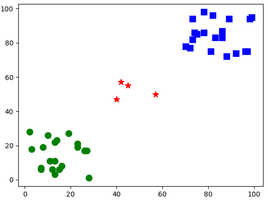
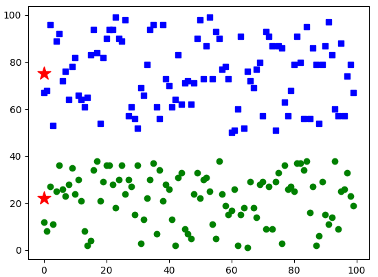
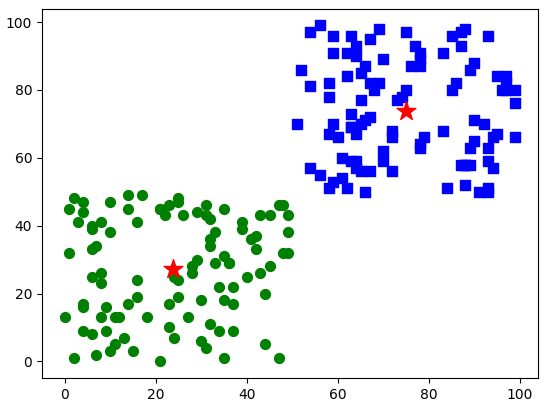
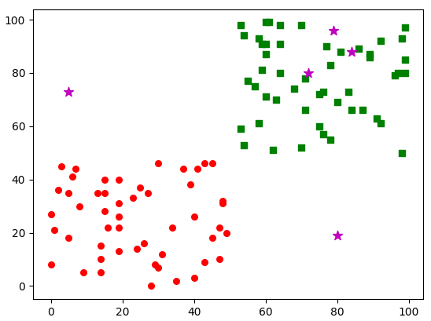

# 	1. 机器学习

## 1.1 介绍

​		**机器学习算法**是**从数据中产生模型**，在**面对新的情况**时，模型就会为我们**提供预测结果**。

## 1.2 训练

​		**从数据中学得模型的过程**称为 **`学习`** （learning）或者 **`训练`** （training）**。在训练过程中所使用的数据**称为 **`训练数据`** ，其中的**每个样本**称为**训练样本**，**训练样本所组成的集合**称为 **`训练集`** 。

## 1.3 标签

​		如果希望获取一个模型，除了有数据，还需要**给样本贴上对应的`标签`**（label），通常将**拥有了标签的样本**称为**样例**。

## 1.4 测试

​		学得模型后，为了**测试模型的效果**，还要**对其进行测试**，**被测试的样本**称为 **`测试样本`** 。

​		**输入测试样本时，并不提供测试样本的目标类别，而是由模型决定样本属于哪个类别。**

## 1.5 计算精确度

​		**比较测试样本预测的标签与实际样本标签之间的差别**，就**可以计算出模型的精确度**。

# 2. K近邻算法

## 2.1 本质

​		**对指定对象根据已知特征值分类**。比如，看到一对父子，一般情况下，通过判断他们的年龄，就能够马上分辨出哪位是父亲，哪位是儿子，这是通过**年龄属性**的特征值来划分对象的。

​		为了**提高算法的可靠性**，**在实施时会取k个近邻点**，这k个点中属于哪一类的较多，然后将当前待识别点划分为哪一类。为了方便判断， **k值通常取奇数**。

## 2.2 基本思想（举例说明）

​		已知某知名双胞胎艺人**A**和**B**长得很像，如果要判断一张图像**T**上的人物到底是**A**还是**B**， 采用**K近邻算法**实现的具体步骤如下：

1. **`收集数据`**：收集**艺人A**和**艺人B**的照片各100张。
2. **`选取特征`**：**确定几个用来识别人物的重要特征**，**使用这些特征来标注A和B的照片**。
   - 例如，**选取4个特征**，每张照片可以表示为 **[156, 34, 890, 457]** 这样的形式。
   - 这样，可以获得**A的100张照片的数据集F<sub>A</sub>**、**B的100张照片的数据集F<sub>B</sub>**。每个数据集集合中各有 100 个这样的特征值。
3. **`计算特征`**：**计算待识别图像T的特征**，**使用特征值表示图像T**。
   - 例如，图像T的特征值可能为 **[257, 896, 236, 639]** 。
4. **`计算距离`**：**计算图像T的特征值与F<sub>A</sub>、F<sub>B</sub>中各特征值之间的距离**。
   - **曼哈顿距离**：用**绝对值之和**表示距离。
   - **欧氏距离**：用**平方和的平方根**表示距离。
5. **`决策`**：**寻找产生其中 `k个最短距离` 的样本点，统计k个样本点中属于F<sub>A</sub>和F<sub>B</sub>的样本点个数，属于哪个数据集的样本点多，就将T确定为哪个艺人的图像**。
   - 例如，**找到11个最近的点**，在这11个点中，**属于F<sub>A</sub>的样本点有7个，属于F<sub>B</sub>的样本点有4个，那么就确定这张图像T上的艺人为 A**；反之，如果这11个点中，**有6个样本点属于F<sub>B</sub>，有5个样本点属于F<sub>A</sub>，那么就确定这张图像T上的艺人为B**。

## 2.3 使用

- 通过函数`cv2.ml.KNearest_create()`用来**创建K近邻算法对象**。
- 通过函数`obj.train()`用来**训练K近邻算法数据**。
  - **函数原型**：`obj.train( trainData, cv2.ml.ROW_SAMPLE, trainLable )`
  - **参数说明**
    - **trainData**：**训练数据**
    - **cv2.ml.ROW_SAMPLE**：**每一行是一个样本**
    - **trainLable**：**训练数据标签**
- 通过函数`obj.findNearest()`用来**推理K近邻算法数据**。
  - **函数原型**：`ret, results, neighbours, dist = obj.findNearest( testData, K )`
  - **参数说明**
    - **testData**：**测试数据**
    - **K**：**数量**，通常为**奇数**，表示寻找K个近邻
    - **results**：**数据点的类别**
    - **neighbours**：**K近邻数据点的类别**
    - **dist**：**与K近邻数据点的距离**

## 2.4 示例

```python
import cv2
import numpy as np
import matplotlib.pyplot as plt

######### 数据量 #########
num_train = 20
num_test = 4

######### 准备训练数据 #########
# 制作训练数据
rand1 = np.random.randint(0, 30, (num_train, 2)).astype(np.float32)   # rand1数据位于(0, 30)
rand2 = np.random.randint(70, 100, (num_train, 2)).astype(np.float32) # rand2数据位于(70, 100)
trainData = np.vstack((rand1, rand2)) # 将rand1和rand2拼接为训练数据

# 制作标签
r1Label = np.zeros((num_train, 1)).astype(np.float32)  # r1Label对应rand1的标签，类型0
r2Label = np.ones((num_train, 1)).astype(np.float32)   # r2Label对应rand2的标签，类型1
trainLable = np.vstack((r1Label, r2Label))

# 显示数据
# 绿色：数据类别0
# 蓝色：数据类别1
g = trainData[trainLable.ravel() == 0]
plt.scatter(g[:,0], g[:,1], 80, 'g', 'o')
b = trainData[trainLable.ravel() == 1]
plt.scatter(b[:,0], b[:,1], 80, 'b', 's')

######### 训练模型 #########
knn = cv2.ml.KNearest_create()
knn.train(trainData, cv2.ml.ROW_SAMPLE, trainLable)

######### 准备测试数据 #########
# 制作测试数据
test = np.random.randint(40, 60, (num_test, 2)).astype(np.float32) # test数据位于(0, 100)

# 显示数据
# 红色：测试
plt.scatter(test[:, 0], test[:, 1], 80, 'r', '*')

######### 推理 #########
# 推理：使用 K 近邻算法分类
K = 7
ret, results, neighbours, dist = knn.findNearest(test, K)

# 推理结果
for n in range(num_test):
    print("第%s个点的类别为：" % (n+1), results[n][0])
    print("距离该点最近的%s个邻居的类别分别为：" % K, neighbours[n])
    print("距离该点最近的%s个邻居的距离分别为：" % K, dist[n])
plt.show()
```

```python
第1个点的类别为： 1.0
距离该点最近的7个邻居的类别分别为： [1. 1. 1. 1. 1. 1. 1.]
距离该点最近的7个邻居的距离分别为： [ 953.  954. 1201. 1280. 1445. 1549. 1585.]
第2个点的类别为： 1.0
距离该点最近的7个邻居的类别分别为： [1. 1. 0. 1. 0. 1. 0.]
距离该点最近的7个邻居的距离分别为： [1154. 1213. 1460. 1513. 1640. 1696. 1768.]
第3个点的类别为： 0.0
距离该点最近的7个邻居的类别分别为： [0. 0. 0. 0. 0. 0. 0.]
距离该点最近的7个邻居的距离分别为： [ 841.  965. 1069. 1073. 1096. 1252. 1341.]
第4个点的类别为： 0.0
距离该点最近的7个邻居的类别分别为： [1. 1. 0. 1. 0. 0. 0.]
距离该点最近的7个邻居的距离分别为： [1225. 1300. 1429. 1586. 1657. 1805. 1825.]
```



# 	3. K均值聚类

## 3.1 介绍

​		机器学习模型可以将训练集中的数据划分为若干个组，每个组被称为一个**簇**，这种学习方式被称为**聚类**。它的重要特点是**在学习过程中不需要用标签对训练样本进行标注**，也就是说，**学习过程能够根据现有训练集自动完成聚类**。

​		**根据训练数据是否有标签**，我们可以将学习划分为 **`有监督学习`** 和 **`无监督学习`** 。**K近邻算法、支持向量机**都是**有监督学习**，**提供有标签的数据给算法学习，然后对数据分类**，**聚类**是**无监督学习**，**事先并不知道分类标签是什么，直接对数据分类**。

​		聚类能够**将具有相似属性的对象划分到同一个簇中**。聚类方法能够应用于所有对象，**簇内的对象越相似，聚类算法的效果越好**。

## 3.2 基本步骤

​		**K均值聚类**是**一种将输入数据划分为k个簇的聚类算法**。这个算法**不断提取当前分类的中心点，并最终在分类稳定时完成聚类**。因此，**K均值聚类**本质上是一种**迭代算法**。

​		**K均值聚类**算法的**基本步骤**如下：

1. **随机选取k个点作为分类的中心点**。
   - 可以是**原始数据中的点**，也可以是**原始数据中不存在的数据点**。
2. **将每个数据点放到距离它最近的中心点所在的类中**。
   - 在**具体计算距离**时，可以**根据需要采用不同形式的距离度量方法**。
3. **重新计算各个分类的数据点的平均值，将平均值作为新的分类中心点**。
4. **重复步骤2和步骤3，直到分类稳定**。

## 3.3 使用

- 通过函数`cv2.kmeans()`用来**实现K均值聚类**。
- **函数原型**：`val, bestLabels, centers=cv2.kmeans( data, K, bestLabels, criteria, attempts, flags )`
- **参数说明**
  - **data**：**输入的待处理数据集合**。
  - **K**：**分类的数目。**
  - **bestLabels**：**计算之后各个数据点的最终分类标签**。实际调用时，**默认设置为None**。
  - **criteria**：**算法迭代的终止条件**。当**达到最大循环数目**或者**指定的精度阈值**时，算法停止迭代。参数由3个子参数构成，分别为**type**、**max_iter**和**eps**。
    - **type**：表示**终止的类型**。
      - **cv2.TERM_CRITERIA_EPS**：**精度满足eps时， 停止迭代**。
      - **cv2.TERM_CRITERIA_MAX_ITER**：**迭代次数超过阈值max_iter时，停止迭代**。
      - **cv2.TERM_CRITERIA_EPS + cv2.TERM_CRITERIA_MAX_ITER**：**上述两个条件中的任意一个满足时，停止迭代**。
    - **max_iter**：**最大迭代次数**。
    - **eps**：**精确度的阈值**。
  - **attempts**：让算法**使用不同的初始值**进行**attempts次**的尝试。
  - **flags**：**选择初始中心点的方法**。主要有以下 3 种：
    - **cv2.KMEANS_RANDOM_CENTERS**：**随机选取**中心点。
    - **cv2.KMEANS_PP_CENTERS**：**基于中心化算法选取**中心点。
    - **cv2.KMEANS_USE_INITIAL_LABELS**：**使用用户输入的数据**作为第一次分类中心点。
  - **val**：**距离值**，返回**每个点到相应中心点距离的平方和**。
  - **centers**：**每个分类的中心点数据**。

## 3.4 示例

### 一维数据

```python
import cv2
import numpy as np
import matplotlib.pyplot as plt

######### 数据量 #########
Amount = 100
Group = 2

######### 准备数据 #########
rand1 = np.random.randint(0, 40, Amount).astype(np.float32)   # rand1数据位于(0, 50)
rand2 = np.random.randint(50, 100, Amount).astype(np.float32) # rand2数据位于(50, 100)
data = np.hstack((rand1, rand2)) # 拼接数据

####### 实施K均值聚类 #######
criteria = (cv2.TERM_CRITERIA_EPS + cv2.TERM_CRITERIA_MAX_ITER, 10, 1.0)
flags = cv2.KMEANS_RANDOM_CENTERS
retval, labels, centers = cv2.kmeans(data, Group, None, criteria, 10, flags)

# print("retval:", retval)
# print("labels:", labels)
print("centers:", centers)

####### 获取分类结果 #######
label0 = data[labels.ravel() == 0]
label1 = data[labels.ravel() == 1]

######### 显示数据 #########
plt.plot(label0, 'go')
plt.plot(label1, 'bs')

plt.scatter(0, centers[0], 200, 'r', '*')
plt.scatter(0, centers[1], 200, 'r', '*')

plt.show()
```

```python
centers: [[22.16],  
          [75.29]]
```



### 二维数据

```python
import cv2
import numpy as np
import matplotlib.pyplot as plt

######### 数据量 #########
Amount = 100
Group = 2

######### 准备数据 #########
rand1 = np.random.randint(0, 50, (Amount, 2)).astype(np.float32)   # rand1数据位于(0, 50)
rand2 = np.random.randint(50, 100, (Amount, 2)).astype(np.float32) # rand2数据位于(50, 100)
data = np.vstack((rand1, rand2)) # 拼接数据

####### 实施K均值聚类 #######
criteria = (cv2.TERM_CRITERIA_EPS + cv2.TERM_CRITERIA_MAX_ITER, 10, 1.0)
flags = cv2.KMEANS_RANDOM_CENTERS
retval, labels, centers = cv2.kmeans(data, Group, None, criteria, 10, flags)

# print("retval:", retval)
# print("labels:", labels)
print("centers:", centers)

####### 获取分类结果 #######
label0 = data[labels.ravel() == 0]
label1 = data[labels.ravel() == 1]

######### 显示数据 #########
plt.scatter(label0[:, 0], label0[:, 1], 50, 'g', 'o')
plt.scatter(label1[:, 0], label1[:, 1], 50, 'b', 's')

plt.scatter(centers[0, 0], centers[0, 1], 200, 'r', '*')
plt.scatter(centers[1, 0], centers[1, 1], 200, 'r', '*')

plt.show()
```

```python
centers: [[23.91, 27.21],
          [74.909996, 73.78]]
```



# 	4. 支持向量机

## 4.1 介绍

​		**支持向量机**（ Support Vector Machine， SVM）是**一种 `二分类` 模型**，目标是**寻找一个超平面对样本数据进行分割，分割的原则是确保分类类别之间的间隔最大**。当数据集较小时，使用支持向量机进行分类非常有效。


- **支持向量机**就是 **`在已有数据中，找到离分类器最近的点，确保它们离分类器尽可能地远`** 。

- **离分类器最近的点到分类器的距离**称为**间隔**。目标是**希望间隔尽可能地大**，这样**分类器在处理数据时就会更加准确**。
- **离分类器最近的那些点**称为**支持向量**，它们**决定了分类器所在的位置**。

​		在对原始数据分类的过程中，可能**无法使用线性方法实现分割**。支持向量机在分类时，可以`把无法线性分割的数据映射到高维空间`，然后再`在高维空间找到分类最优的线性分类器`。


## 4.2 使用

- 通过函数`cv2.ml.SVM_create()`用来**创建支持向量机模块对象**。
- 通过函数`obj.train()`用来**训练支持向量机分类器**。
  - **函数原型**：`obj.train( trainData, cv2.ml.ROW_SAMPLE, trainLable )`
  - **参数说明**
    - **trainData**：**训练数据**
    - **cv2.ml.ROW_SAMPLE**：**每一行是一个样本**
    - **trainLable**：**训练数据标签**
- 通过函数`obj.predict()`用来**预测测试数据的类别**。
  - **函数原型**：`ret, results = obj.predict( testData )`
  - **参数说明**
    - **testData**：**测试数据**
    - **results**：**数据点的类别**

## 4.3 示例

```python
import cv2
import numpy as np
import matplotlib.pyplot as plt

######### 数据量 #########
num_train = 50
num_test = 5

######### 准备训练数据 #########
# 制作训练数据
rand1 = np.random.randint(0, 50, (num_train, 2)).astype(np.float32)   # rand1数据位于(0, 30)
rand2 = np.random.randint(50, 100, (num_train, 2)).astype(np.float32) # rand2数据位于(70, 100)
trainData = np.vstack((rand1, rand2)) # 将rand1和rand2拼接为训练数据

# 制作标签
r1Label = np.zeros((num_train, 1)).astype(np.int32)  # r1Label对应rand1的标签，类型0
r2Label = np.ones((num_train, 1)).astype(np.int32)   # r2Label对应rand2的标签，类型1
trainLable = np.vstack((r1Label, r2Label))

# 显示数据
# 红色：数据类别0
# 绿色：数据类别1
g = trainData[trainLable.ravel() == 0]
plt.scatter(g[:,0], g[:,1], 30, 'r', 'o')
b = trainData[trainLable.ravel() == 1]
plt.scatter(b[:,0], b[:,1], 30, 'g', 's')

# ######### 训练模型 #########
svm = cv2.ml.SVM_create()
svm.setType(cv2.ml.SVM_C_SVC)
svm.setKernel(cv2.ml.SVM_LINEAR)
svm.setC(0.01)
svm.train(trainData, cv2.ml.ROW_SAMPLE, trainLable)

# ######### 准备测试数据 #########
# 制作测试数据
test = np.random.randint(0, 100, (num_test, 2)).astype(np.float32) # test数据位于(0, 100)

# 显示数据
# 红色：测试
plt.scatter(test[:, 0], test[:, 1], 80, 'm', '*')

######### 推理 #########
# 推理：使用SVM预测分类
(ret, results) = svm.predict(test)

# 推理结果
for n in range(num_test):
    print("第%s个点的数据为：(%d, %d)，类别为：%d" % 
          ((n+1), test[n][0], test[n][1], results[n][0]))
plt.show()
```

```python
第1个点的数据为：(84, 88)，类别为：1
第2个点的数据为：(72, 80)，类别为：1
第3个点的数据为：(5, 73)，类别为：0
第4个点的数据为：(79, 96)，类别为：1
第5个点的数据为：(80, 19)，类别为：1
```

