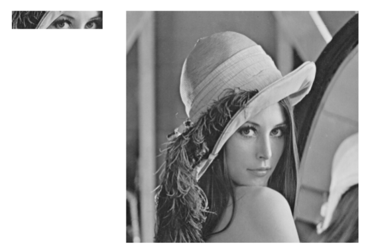
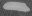
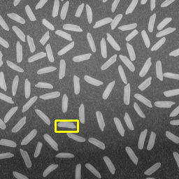
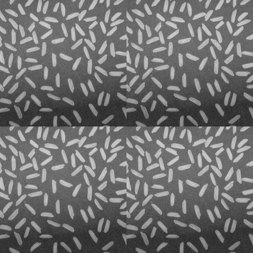
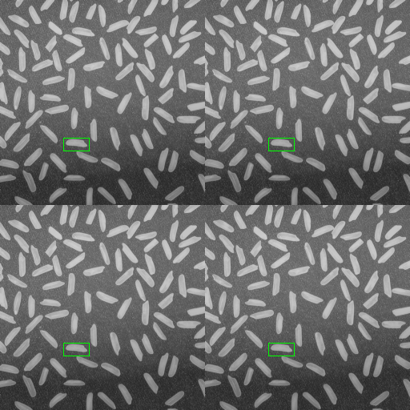

# 	1. 介绍

​		**模板匹配**是指**在当前图像A内寻找与图像B最相似的部分**，一般将**图像A**称为**输入图像**，将**图像B**称为**模板图像**。**模板匹配**的操作方法是**将模板图像B在图像A上`滑动`， 遍历所有像素以完成匹配**。



# 2. 单目标匹配

## 2.1 使用方法

- 通过**函数**`cv2.matchTemplate()`实现**模板匹配**。
- **函数原型**：`ret = cv2.matchTemplate( image, template, method, mask )`
- **参数说明**：
  - **image**：**原始图像**，必须是**8位**或者**32位**的**浮点型图像**。
  - **template**：**模板图像**。**尺寸必须小于或等于原始图像**，并且与原始图像具有同样的类型。
  - **method**：**匹配方法**。
  - **mask**：模板图像**掩模**。
  - **ret**：由每个位置的比较结果组合所构成的一个**结果集**，类型是**单通道、32位浮点型**。
    - 如果输入图像尺寸是 **W** \* **H**，模板的尺寸是 **w** \* **h**，
      则返回值的大小为(**W** - **w** + **1**) \* (**H** - **h** + **1**)。

| 参数值                   |  值  | 说明                                                         |
| ------------------------ | :--: | ------------------------------------------------------------ |
| **cv2.TM_SQDIFF**        |  0   | **以方差为依据**进行匹配。若**完全匹配**，则**结果为零**；若**不匹配**，则会**得到一个很大的值**。 |
| **cv2.TM_SQDIFF_NORMED** |  1   | **以标准（归一化）方差为依据**进行匹配。                     |
| **cv2.TM_CCORR**         |  2   | **相关匹配**。将模板图像与输入图像相乘，如果**乘积较大**，表示**匹配程度较高**；如果**乘积为 0**，则表示**匹配效果最差**。 |
| **cv2.TM_CCORR_NORMED**  |  3   | **以标准（归一化）相关为依据**进行匹配。                     |
| **cv2.TM_CCOEFF**        |  4   | **相关系数匹配**。将模板图像与其均值的相对值，和输入图像与其均值的相关值进行匹配。**1表示完美匹配，-1表示糟糕的匹配，0表示没有任何相关性。** |
| **cv2.TM_CCOEFF_NORMED** |  5   | **以标准（归一化）相关系数为依据**进行匹配。                 |

:::tip[提醒]

在**查找最佳匹配**时，首先要**确定使用的是何种方法**，然后**再确定到底是查找最大值，还是查找最小值**。

:::

## 2.2 示例

### 最小值方案：`cv2.TM_SQDIFF`

```python
import cv2

img = cv2.imread('rice.png')

template = cv2.imread('template.png')
th, tw, tc = template.shape

rv = cv2.matchTemplate(img, template, cv2.TM_SQDIFF)

minVal, maxVal, minLoc, maxLoc = cv2.minMaxLoc(rv)
topLeft = minLoc
bottomRight = (topLeft[0] + tw, topLeft[1] + th)
# print(topLeft)

cv2.rectangle(img, topLeft, bottomRight, [0, 0, 255], 2)

cv2.imwrite("detect_TM_SQDIFF.png", img)
```

|     原图      |       目标        |         位置匹配          |
| :-----------: | :---------------: | :-----------------------: |
|  |  |  |

### 最大值方案：`cv2.TM_CCOEFF`

```python
import cv2

img = cv2.imread('rice.png')

template = cv2.imread('template.png')
th, tw, tc = template.shape

rv = cv2.matchTemplate(img, template, cv2.TM_CCOEFF)

minVal, maxVal, minLoc, maxLoc = cv2.minMaxLoc(rv)
topLeft = maxLoc
bottomRight = (topLeft[0] + tw, topLeft[1] + th)
# print(topLeft)

cv2.rectangle(img, topLeft, bottomRight, [0, 255, 255], 2)

cv2.imwrite("detect_TM_CCOEFF.png", img)
```

|     原图      |       目标        |         位置匹配          |
| :-----------: | :---------------: | :-----------------------: |
|  |  |  |

# 3. 多目标匹配

- **`单目标匹配`**：**模板图像**在整个输入图像内**仅出现了一次**。
- **`多目标匹配`**：**模板图像**很可能在输入图像内**出现多次**，需要找出多个匹配结果。

## 3.1 使用方法

- 通过函数`np.where()`，**获取满足条件的模板匹配位置的集合**。
- 通过函数`zip()`，**将对象中对应的元素打包成坐标元组**。 
- **行列互换**：函数`cv2.matchTemplate()`的**输出值**的形式为 **（行号，列号）** ，在使用函数`np.where()`过滤信息后，需要进行**行列互换操作——`[::-1]`**，将形式转换为 **（列号，行号）** 以便绘图需要。

## 3.2 示例

```python
import cv2
import numpy as np

img = cv2.imread('rices.png')

template = cv2.imread('template.png')
th, tw, tc = template.shape

rv = cv2.matchTemplate(img, template, cv2.TM_CCOEFF_NORMED)

threshold = 0.975
loc = np.where( rv >= threshold )

for pt in zip(*loc[::-1]):
    # print(pt)
    cv2.rectangle(img, pt, (pt[0] + tw, pt[1] + th), [0, 255, 0], 1)

cv2.imwrite("detect_TM_CCOEFF_NORMED.png", img)
```

|      原图      |       目标        |             位置匹配             |
| :------------: | :---------------: | :------------------------------: |
|  |  |  |
