# 1. 直方图归一化

## 原理

​		从统计的角度讲，**直方图**是关于**图像内灰度值的统计特性与图像灰度值之间**的函数，**直方图统计图像内各个灰度级出现的次数**。从直方图的图形上观察，**横坐标**是**图像中各像素点的灰度级**，**纵坐标**是**具有该灰度级的像素个数**。

- **示例**

  - **图像**：
  
    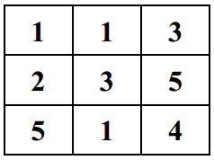

  - **灰度级次数统计**：

    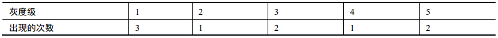

  - **直方图**：

    

## 直方图归一化

​		在归一化的直方图中， **x轴**仍然表示**灰度级**， **y轴**不再表示灰度级出现的次数，而是表示**灰度级出现的频率**。

- **示例**

  - **图像**：

    

  - **灰度级频率统计**：`灰度级出现的频率 = 灰度级出现的次数 / 总像素数`

    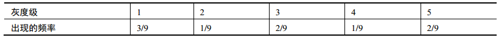

  - **直方图归一化**：

    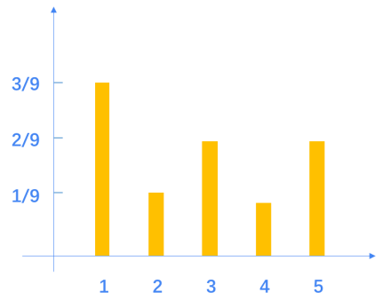

## dims、range、bins

- **dims**：在绘制直方图时，收集的参数的数量。一般情况下，直方图中收集的数据
  只有一种，就是灰度级。因此，该值**默认为1**。
- **range**：表示要统计的灰度级范围，**一般为[0, 255]**。0对应的是黑色，255对应的是
  白色。
- **bins**：参数子集的数目。**对于灰度级区间为[0, 255]的图像，其BINS值就是256**。

# 2. 绘制直方图

## matplotlib.pyplot.hist()

- 使用函数`matplotlib.pyplot.hist()`，可以根据**数据源**和**灰度级分组**绘制直方图
  - 函数原型：`matplotlib.pyplot.hist(X, BINS)`
  - 参数说明：
    - **X**：**数据源，必须是一维的**。图像通常是二维的，需要使用 `ravel()函数` 将图像处理为一维数据源以后，再作为参数使用。
    - **BINS**：**灰度级的分组数**。
- **示例**

```python
import cv2
import matplotlib.pyplot as plt

img = cv2.imread("color.png")

cv2.imshow("color", img)

plt.hist(img.ravel(), 256)
plt.show()

cv2.waitKey()
cv2.destroyAllWindows()
```

|        原图         |         直方图          |
| :-----------------: | :---------------------: |
|  | 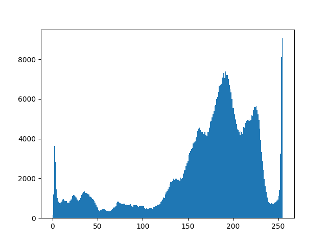 |

## cv2.calcHist() + plt.plot()

- 使用函数`cv2.calcHist()`，可以**统计图像直方图信息**
  - 函数原型：`hist = cv2.calcHist(images, channels, mask, histSize, ranges, accumulate)`
  - 参数说明：
    - **hist**：**返回的统计直方图，是一个一维数组**，数组内的元素是**各个灰度级的像素个数**。
    - **images**：**原始图像**，该图像需要使用“ [ ]” 括起来。
    - **channels**：**指定通道编号**。通道编号需要用“ [ ]”括起来，如果输入图像是单通道灰度图像， 该参数的值就是[0]。对于彩色图像，它的值可以是[0]、 [1]、 [2]， 分别对应通道B、 G、 R。
    - **mask**：**掩膜图像**。当统计整幅图像的直方图时，将这个值设为 None。 当统计图像某一部分的直方图时，需要用到掩膜图像。
    - **histSize**：**BINS的值**，该值需要用“ [ ]”括起来。
    - **ranges**：**像素值范围**。例如， 8 位灰度图像的像素值范围是[0, 255]。
    - **accumulate**：累计标识，默认值为 False。一般情况下不需要设置。
- **示例**

```python
import cv2
import matplotlib.pyplot as plt

img = cv2.imread("color.png")

cv2.imshow("color", img)

histb = cv2.calcHist([img], [0], None, [256], [0,255])
histg = cv2.calcHist([img], [1], None, [256], [0,255])
histr = cv2.calcHist([img], [2], None, [256], [0,255])

plt.plot(histb, color='b')
plt.plot(histg, color='g')
plt.plot(histr, color='r')

plt.show()

cv2.waitKey()
cv2.destroyAllWindows()
```

|        原图         |         直方图         |
| :-----------------: | :--------------------: |
|  |  |

# 3. 直方图均衡化

​		如果一幅图像`拥有全部可能的灰度级`，并且`像素值的灰度均匀分布`，那么这幅图像就具有`高对比度`和`多变的灰度色调`，`灰度级丰富`且`覆盖范围较大`。在外观上，这样的图像**具有`更丰富的色彩`，不会过暗或过亮**。

​		直方图均衡化主要目的是 **`将原始图像的灰度级均匀地映射到整个灰度级范围内`** ，得到一个灰度级分布均匀的图像。这种均衡化，既实现了灰度值统计上的**概率均衡**，也实现了人类视觉系统上的**视觉均衡**。

## 原理

- **示例图像**：

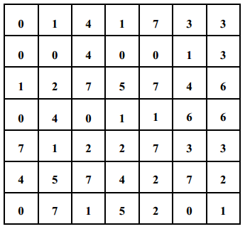

- **灰度级次数统计**：

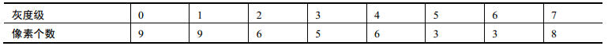

- **灰度级频率统计**：

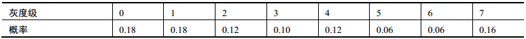

- **灰度级累积频率**：

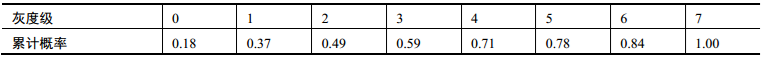

- **灰度级均衡化**：`累积频率 * 灰度最大值` —— 结果舍入至整数

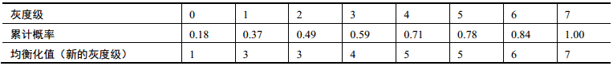

- **均衡化后的灰度级和对应像素个数**：

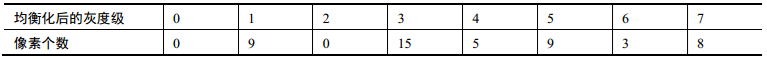

- **直方图均衡化**：

|              直方图均衡化·前              |              直方图均衡化·后              |
| :---------------------------------------: | :---------------------------------------: |
| 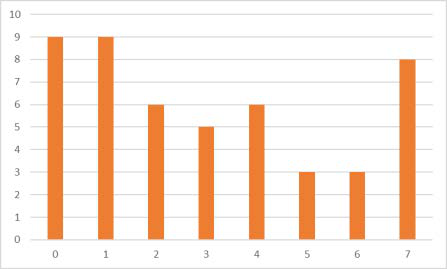 |  |

## 直方图均衡化

- 使用函数`cv2.equalizeHist()`实现**直方图均衡化**
  - 函数原型：`dst = cv2.equalizeHist( src )`
  - 参数说明：
    - **src**：8位、单通道图像
    - **dst**：直方图均衡化之后的图像

- **示例**

```python
import cv2
import matplotlib.pyplot as plt

img = cv2.imread("color.png", cv2.IMREAD_GRAYSCALE)

equ = cv2.equalizeHist(img)

cv2.imshow("grey", img)
cv2.imshow("equalizeHist", equ)

plt.figure("原始图像直方图")
plt.hist(img.ravel(),256)
plt.figure("均衡化直方图")
plt.hist(equ.ravel(),256)
plt.show()

cv2.waitKey()
cv2.destroyAllWindows()
```

|                 原始图像                  |           直方图均衡化后的图像            |
| :---------------------------------------: | :---------------------------------------: |
|           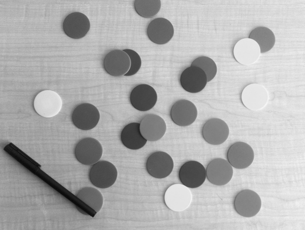           | 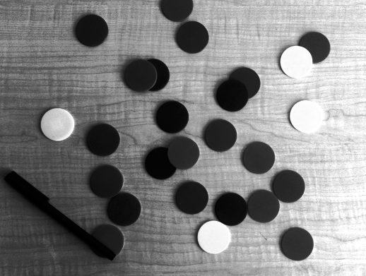 |
| 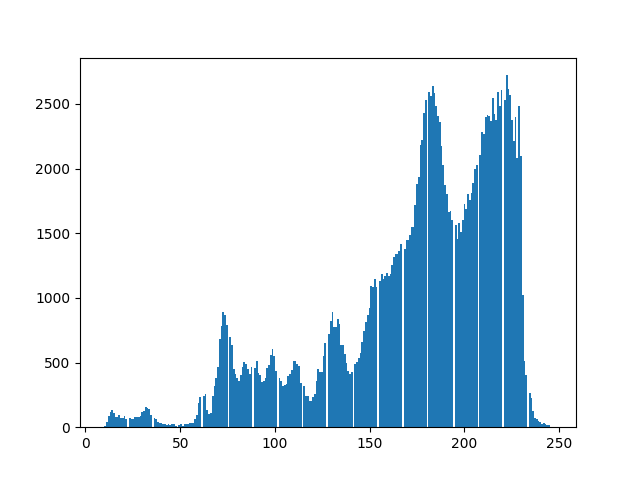 | 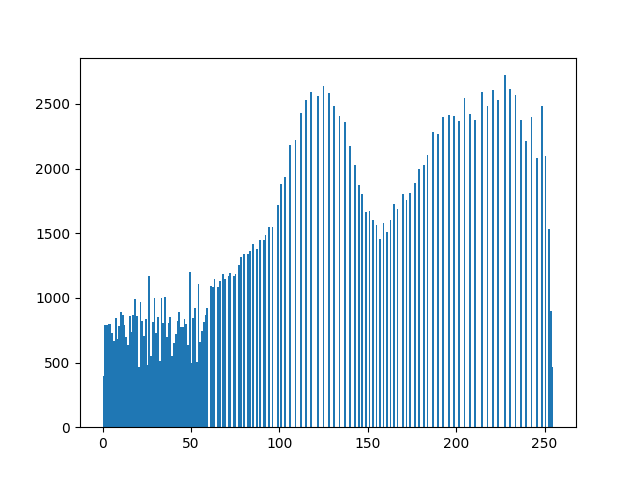 |
