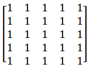
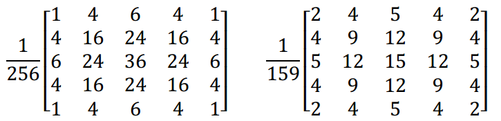
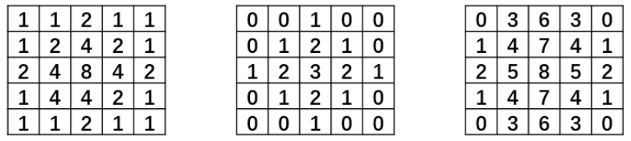
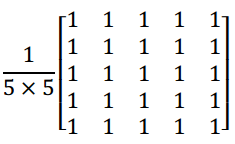

# 1. 介绍

​		**在`尽量保留图像原有信息`的情况下，`过滤掉图像内部的噪声`**，这一过程称为对图像的 **`平滑`处理** ，所得的图像称为**平滑图像**。

​		图像平滑处理的基本原理是，**将噪声所在像素点的像素值处理为其周围临近像素点的值的近似值**。常见的平滑处理方式有： **`均值滤波`** 、 **`方块滤波`** 、 **`高斯滤波`** 、 **`中值滤波`** 、 **`双边滤波`** 等。

# 2. 均值滤波

## 2.1 原理

​		均值滤波是指用当前像素点周围**N \* N**个像素值的**均值**来**代替当前像素值**。

​		针对**边缘像素点**，可以**只取图像内存在的周围邻域点的像素值均值**。

## 2.2 使用方法

- 通过函数`cv2.blur()`实现**均值滤波**。
- **函数原型**：`dst = cv2.blur( src, ksize, anchor, borderType )`
- **参数说明**：
  - **dst**：表示**目标图像**。
  - **src**：表示**原始图像**。
  - **ksize**：表示**滤波核**的大小。滤波核大小是指在滤波处理过程中，邻域图像的高度和宽度。
    - 例如，5x5的滤波器可记为(5, 5)，表示如下的滤波器：
    - **卷积核越大，去噪效果越好，花费的计算时间越长，图像失真越严重。**
  - **anchor**：表示**锚点**，默认值是(-1, -1)，表示当前计算均值的点位于核的中心点位置。
  - **borderType**：表示**边界样式**，决定了以何种方式处理边界。

## 2.3 示例

```python
import cv2

src = cv2.imread("logo_noise.png")
dst = cv2.blur(src, (5, 5))

cv2.imwrite("mean_blur.png", dst)
```

|      原图       |      噪声图      |      均值滤波      |
| :-------------: | :----------------: | :----------------: |
|  |  |  |

# 3. 方框滤波

## 3.1 原理

​		在方框滤波中，可以**自由选择地选择**滤波结果是**邻域像素值之和的平均值**，还是**邻域像素值之和**，以**代替当前像素值**。

## 3.2 使用方法

- 通过函数`cv2.boxFilter()`实现**方框滤波**。
- **函数原型**：`dst = cv2.boxFilter( src, ddepth, ksize, anchor, normalize, borderType )`
- **参数说明**：
  - **dst**：表示**目标图像**。
  - **src**：表示**原始图像**。
  - **ddepth**：表示处理结果图像的图像深度，**一般使用-1**，即**与原始图像使用相同的图像深度**。
  - **ksize**：表示**滤波核**的大小。滤波核大小是指在滤波处理过程中，邻域图像的高度和宽度。
    - 例如，5x5的滤波器可记为(5, 5)，表示如下的滤波器：
  - **anchor**：表示**锚点**，默认值是(-1, -1)，表示当前计算均值的点位于核的中心点位置。
  - **normalize**：表示**是否进行归一化处理**。默认为0。
    - 当**normalize=1**时，表示要进行归一化处理，要**用邻域像素值的和除以面积**。
    - 当**normalize=0**时，表示不需要进行归一化处理，**直接使用邻域像素值的和**。如果不做归一化处理，滤波得到的值很可能超过当前像素值范围的最大值，从而被截断为最大值，这样会得到一幅纯白色的图像。
  - **borderType**：表示**边界样式**，决定了以何种方式处理边界。

## 3.3 示例

```python
import cv2

src = cv2.imread("logo_noise.png")

dst = cv2.boxFilter(src, -1, (5, 5), normalize=0)
cv2.imwrite("boxFilter_unnormalized.png", dst)

dst = cv2.boxFilter(src, -1, (5, 5), normalize=1)
cv2.imwrite("boxFilter_normalized.png", dst)
```

|      原图       |      噪声图      |       方框滤波：不归一化        | 方框滤波：归一化              |
| :-------------: | :-----------------------------: | ----------------------------- | :---------------------------: |
|  |  |  |  |

# 4. 高斯滤波

## 4.1 原理

​		在进行**均值滤波**和**方框滤波**时，其**邻域内每个像素的权重是相等的**。在**高斯滤波**中，**会将中心点的权重值加大，远离中心点的权重值减小**，在此基础上计算邻域内各个像素值不同权重的和。

​		**常见**的高斯滤波器如：

​		对于高斯滤波器而言，**同一尺寸的卷积核可以有不同的权重比**。

## 4.2 使用方法

- 通过函数`cv2.GaussianBlur()`实现**高斯滤波**。
- **函数原型**：`dst = cv2.GaussianBlur( src, ksize, sigmaX, sigmaY, borderType )`
- **参数说明**：
  - **dst**：表示**目标图像**。
  - **src**：表示**原始图像**。
  - **ksize**：表示**滤波核**的大小。滤波核的值**必须是奇数**。
  - **sigmaX**：表示卷积核在**水平方向（X轴方向）的标准差**，控制其权重比例。
    - 不同的sigmaX决定的卷积核，它们在水平方向上的标准差不同。
  - **sigmaY**：表示卷积核在**竖直方向（Y轴方向）的标准差**，控制其权重比例。
    - 如果将该值设置为**0**，则**只采用sigmaX的值**。
    - 如果**sigmaX 和sigmaY都是0**，则**通过ksize.width和ksize.height计算得到**：
      - `sigmaX = 0.3 × [(ksize.width - 1) × 0.5 - 1] + 0.8`
      - `sigmaY = 0.3 × [(ksize.height - 1) × 0.5 - 1] + 0.8`
  - **borderType**：表示**边界样式**，决定了以何种方式处理边界。

## 4.3 示例

```python
import cv2

src = cv2.imread("logo_noise.png")
dst = cv2.GaussianBlur(src, (5, 5), 0, 0)

cv2.imwrite("gaussian_blur.png", dst)
```

|       原图        |         噪声图          |            高斯滤波            |
| :---------------: | :---------------------: | :----------------------------: |
|  |  |  |

# 5. 中值滤波

## 5.1 原理

​		在**中值滤波**中，**不再采用加权求均值的方式计算滤波结果**，而是**用邻域内所有像素值的`中值`替代当前像素点的像素值**。

- **优点**：在中值滤波处理中，噪声成分很难被选上，所以**可以在几乎不影响原有图像的情况下去除全部噪声**。
- **缺点**：由于中值滤波需要进行内部排序操作，因此**运算量相对更大一些**。

## 5.2 使用方法

- 通过函数`cv2.medianBlur()`实现**中值滤波**。
- **函数原型**：`dst = cv2.medianBlur( src, ksize )`
- **参数说明**：
  - **dst**：表示**目标图像**。
  - **src**：表示**原始图像**。
  - **ksize**：表示**滤波核**的大小。滤波核的值**必须是奇数**，此处是一个**整数值**，而不用表示为~~**元组形式**~~。

## 5.3 示例

```python
import cv2

src = cv2.imread("logo_noise.png")
dst = cv2.medianBlur(src, 5)

cv2.imwrite("median_blur.png", dst)
```

|       原图        |          噪声图           |           中值滤波           |
| :---------------: | :-----------------------: | :--------------------------: |
|  |  |  |

# 6. 双边滤波

## 6.1 原理

​		双边滤波是**综合考虑空间信息和色彩信息**的滤波方式，在滤波过程中**能够有效地保护图像内的边缘信息**。

​		在双边滤波中，当**处在边缘**时，**与当前点色彩相近的像素点会被给予较大的权重值**，而**与当前色彩差别较大的像素点会被给予较小的权重值**，这样就保护了边缘信息。

​		双边滤波**去除噪声的效果并不好**，它的**优势**在于**对边缘信息的保护**上。

## 6.2 使用方法

- 通过函数`cv2.bilateralFilter()`实现**双边滤波**。
- **函数原型**：`dst = cv2.bilateralFilter( src, d, sigmaColor, sigmaSpace, borderType )`
- **参数说明**：
  - **dst**：表示**目标图像**。
  - **src**：表示**原始图像**。
  - **d**：表示在滤波时选取的**空间距离参数**，这里表示**以当前像素点为中心点的直径**。
    - 如果该值为非正数，则会自动从sigmaSpace计算得到。
    - 推荐`d=5`。对于**较大噪声**的离线滤波，可以选择`d=9`。
  - **sigmaColor**：表示滤波处理时选取的**颜色差值范围**，**决定周围哪些像素点能够参与到滤波中来**。
    - 与当前像素点的像素值差值**小于sigmaColor**的像素点， **能够参与到当前的滤波中**。
    - **sigmaColor=0**，滤波失去意义。**sigmaColor=255**，所有点都能够参与运算。
  - **sigmaSpace**：表示坐标空间中的**sigma**值。它的**值越大，说明有越多的点能够参与到滤波计算中来**。
    - 当**d>0**时，**无论 sigmaSpace 的值如何，d都指定邻域大小**；否则，**d与sigmaSpace的值成比例**。
  - **borderType**：表示**边界样式**，决定了以何种方式处理边界。

## 6.3 示例

```python
import cv2

src = cv2.imread("logo_noise.png")
dst = cv2.bilateralFilter(src, 25, 100, 100)

cv2.imwrite("bilateral_blur.png", dst)
```

|       原图        |          噪声图           |            双边滤波             |
| :---------------: | :-----------------------: | :-----------------------------: |
|  |  |  |

# 7. 自定义卷积核的滤波

## 7.1 原理

​		在希望**使用特定的卷积核实现卷积操作**时，可以通过函数`cv2.filter2D()`进行**自定义卷积核**。

## 7.2 使用方法

- 通过函数`cv2.filter2D()`实现**自定义卷积**。
- **函数原型**：`dst = cv2.filter2D( src, ddepth, kernel, anchor, delta, borderType )`
- **参数说明**：
  - **dst**：表示**目标图像**。
  - **src**：表示**原始图像**。
  - **ddepth**：表示处理结果图像的图像深度，**一般使用-1**，即**与原始图像使用相同的图像深度**。
  - **ksize**：表示**卷积核**，它是一个单通道的数组。如果想在处理彩色图像时，让每个通道使用不同的核，则必须将彩色图像分解后使用不同的核完成操作。
  - **anchor**：表示**锚点**，默认值是(-1, -1)，表示当前计算均值的点位于核的中心点位置。
  - **delta**：表示**修正值**，如果该值存在，会在基础滤波的结果上加上该值作为最终的滤波处理结果。
  - **borderType**：表示**边界样式**，决定了以何种方式处理边界。

## 7.3 示例

- 自定义卷积核：
  - **滤波效果等同于均值滤波**

```python
import cv2
import numpy as np

src = cv2.imread("logo_noise.png")
kernel = np.ones((5, 5), np.float32) / (5 * 5)
dst = cv2.filter2D(src, -1, kernel)

cv2.imwrite("conv_blur.png", dst)
```

|       原图        |          噪声图           |          自定义卷积          |          均值滤波          |
| :---------------: | :-----------------------: | :--------------------------: | :------------------------: |
|  |  |  |  |
