# 1. 边缘检测

## 1.1 基本概念

​		边缘检测的目的是 **`标识图像中亮度变换明显`** 的点。**边缘检测大幅度的减少了图像的数据量，剔除了不相关的信息，保留了重要的结构属性**。**图像的边缘检测是`图像分割`、`目标区域识别`和`区域形状提取`等图像分析的基石**，也**是图像中`特征提取`的很重要的方法**。

## 1.2 特征

- **`沿着边缘方向，像素值逐渐平稳`**
- **`垂直于边缘方向，像素值变化剧烈`**

## 1.3 分类

- **阶跃性边缘**：**两边的像素值有明显的差距**，**一阶方向导数**在边缘处是**零**。
- **屋顶状边缘**：**从增加到减少的转折点**，**二阶方向导数**在此处**取得极值**。

# 2. 梯度计算

​		图像梯度计算的是**图像变化的速度**。对于**图像的边缘部分**，其**灰度值变化较大**，梯度值也较大，相反，对于**图像中比较平滑的部分**，其**灰度值变化较小**，相应的梯度值也较小。

## 2.1 一阶微分边缘检测

​		通过**计算图像的梯度值**来检测图像边缘，常见的算子有**Sobel**、**Prewitt**、**Roberts**、 **`Canny`** 等。

​		**一阶导数**可以产生 **`比较粗劣的边缘`** 。

## 2.2 二阶微分边缘检测

​		通过求**二阶导数过零点**来检测图像边缘，常见的算子有 **`Laplacian`** 、**Gauss-Laplacian**等。

​		**二阶导数对`细节的把控比较好`**，如**细线**，**孤立的亮点**等，但**二阶导数**会**在灰度斜坡和台阶出会产生`双边边缘响应`**。

# 3. Sobel算子

## 3.1 滤波器

|                    水平方向                    |                    垂直方向                    |
| :--------------------------------------------: | :--------------------------------------------: |
| 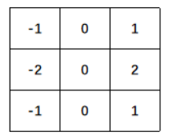 | 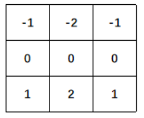 |

## 3.2 使用方式

- 通过函数`cv2.Sobel()`实现**Sobel算子运算**。
- **函数原型**：`dst = cv2.Sobel( src, ddepth, dx, dy, ksize, scale, delta, borderType )`
- **参数说明**：
  - **dst**：表示**目标图像**。
  - **src**：表示**原始图像**。
  - **ddepth**：表示处理结果图像的图像深度。通常设置为**cv2.CV_64F**。
    - 如果**直接将ddepth的值设置为-1**，在计算时**得到的结果可能是错误的**。
    - 在实际操作中，**计算梯度值可能会出现负数**。如果处理的图像是 8 位图类型， 则**在ddepth的值为-1时，所有负数会自动截断为0，发生信息丢失**。 
    - 为了避免信息丢失，在计算时要先使用更高的数据类型**cv2.CV_64F**，再通过**取绝对值**将其映射为**cv2.CV_8U**。 
  - **dx**、**dy**：分别代表**x方向上、y方向上的求导阶数**。通常为0或者为1，最大值为2。
  - **ksize**：表示**滤波核**的大小。值为 **-1** 时，会使用**Scharr算子**进行运算。
  - **scale**：表示**计算导数值时所采用的缩放因子**，默认情况下是1，即没有缩放。
  - **delta**：表示**额外加在目标图像上的值**，默认为0。
  - **borderType**：表示**边界样式**，决定了以何种方式处理边界。
- **边缘检测方向组合**

|  x   |  y   |                     检测方向                      |
| :--: | :--: | :-----------------------------------------------: |
|  0   |  0   |                      不允许                       |
|  0   |  1   |          **垂直方向**检测：检测**横线**           |
|  1   |  0   |          **水平方向**检测：检测**竖线**           |
|  1   |  1   | **垂直方向**检测 + **水平方向**检测：检测**角点** |

## 3.3 示例

```python
import cv2

src = cv2.imread("sample.png", cv2.IMREAD_GRAYSCALE)

SobelX = cv2.Sobel(src, cv2.CV_64F, 1, 0)
SobelX = cv2.convertScaleAbs(SobelX)
cv2.imwrite("sobel_x.png", SobelX)

SobelY = cv2.Sobel(src, cv2.CV_64F, 0, 1)
SobelY = cv2.convertScaleAbs(SobelY)
cv2.imwrite("sobel_y.png", SobelY)

SobelXY = cv2.Sobel(src, cv2.CV_64F, 1, 1)
SobelXY = cv2.convertScaleAbs(SobelXY)
cv2.imwrite("sobel_xy.png", SobelXY)

SobelXY = cv2.addWeighted(SobelX, 0.5, SobelY, 0.5, 0)
cv2.imwrite("sobel_x_y.png", SobelXY)
```

|        原图         |      检测：横线      |      检测：竖线      |      检测：角点       |       检测：横线+竖线       |
| :-----------------: | :------------------: | :------------------: | :-------------------: | :-------------------------: |
| 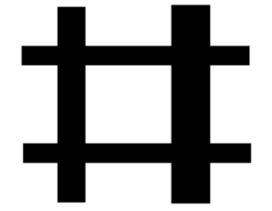 | 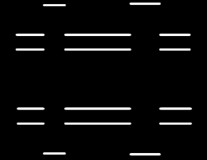 | 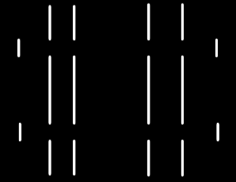 | 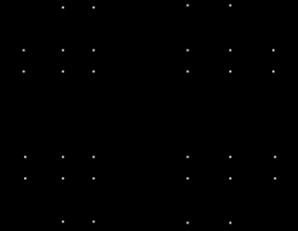 | 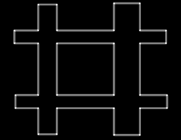 |

# 4. Scharr算子

​		在使用 **3×3** 的**Sobel**算子时，可能计算结果并不太精准。 **Scharr**算子具有和**Sobel**算子**同样的速度**，且**精度更高**。

## 4.1 滤波器

|                    水平方向                    |                    垂直方向                    |
| :--------------------------------------------: | :--------------------------------------------: |
| 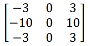 | 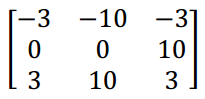 |

## 4.2 使用方式

- 通过函数`cv2.Scharr()`实现**Scharr算子运算**。
- **函数原型**：`dst = cv2.Scharr( src, ddepth, dx, dy, scale, delta, borderType )`
- **参数说明**：
  - **dst**：表示**目标图像**。
  - **src**：表示**原始图像**。
  - **ddepth**：表示处理结果图像的图像深度。通常设置为**cv2.CV_64F**。
  - **dx**、**dy**：分别代表**x方向上、y方向上的求导阶数**。通常为0或者为1，最大值为2。
  - **scale**：表示**计算导数值时所采用的缩放因子**，默认情况下是1，即没有缩放。
  - **delta**：表示**额外加在目标图像上的值**，默认为0。
  - **borderType**：表示**边界样式**，决定了以何种方式处理边界。
- **边缘检测方向组合**

|  x   |  y   |            检测方向            |
| :--: | :--: | :----------------------------: |
|  0   |  0   |             不允许             |
|  0   |  1   | **垂直方向**检测：检测**横线** |
|  1   |  0   | **水平方向**检测：检测**竖线** |
|  1   |  1   |             不允许             |

## 4.3 示例

```python
import cv2

src = cv2.imread("sample.png", cv2.IMREAD_GRAYSCALE)

ScharrX = cv2.Scharr(src, cv2.CV_64F, 1, 0)
ScharrX = cv2.convertScaleAbs(ScharrX)
cv2.imwrite("scharr_x.png", ScharrX)

ScharrY = cv2.Sobel(src, cv2.CV_64F, 0, 1)
ScharrY = cv2.convertScaleAbs(ScharrY)
cv2.imwrite("scharr_y.png", ScharrY)

ScharrXY = cv2.addWeighted(ScharrX, 0.5, ScharrY, 0.5, 0)
cv2.imwrite("scharr_x_y.png", ScharrXY)
```

|        原图         |      检测：横线       |      检测：竖线       |       检测：横线+竖线        |
| :-----------------: | :-------------------: | :-------------------: | :--------------------------: |
|  |  |  | 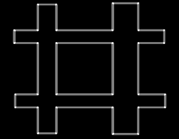 |

# 5. Canny算子

​		Canny边缘检测是一种使用**多级边缘检测算法**检测边缘的方法。

## 5.1 原理及步骤

1.  **去噪**：噪声会影响边缘检测的准确性。
   - 通常采用**高斯滤波**去除图像中的噪声。
2.  **计算梯度的幅度与方向**。
3.  **非极大值抑制**：适当地让边缘“变瘦”。
   - 根据梯度的幅度和方向，遍历图像中的像素点，**去除所有非边缘的点**。
4.  **确定边缘**：使用**双阈值算法**确定最终的边缘信息。
   - 设置两个阈值：高阈值 **maxVal**，低阈值 **minVal**。
   - 当前边缘像素的**梯度值 ≥ maxVal**， 则将当前边缘像素标记为**强边缘**。
   - 当前边缘像素的**梯度值**介于**maxVal**与**minVal**之间，则将当前边缘像素标记为**虚边缘**。
     - **与强边缘连接**，则将该边缘处理为**边缘**。
     - **与强边缘无连接**，则该边缘为弱边缘，将其**抑制**。
   - 当前边缘像素的**梯度值 ≤ minVal**，则**抑制**当前边缘像素。

## 5.2 使用方式

- 通过函数`cv2.Canny()`实现**Canny算子运算**。
- **函数原型**：`dst = cv2.Canny( src, threshold1, threshold2, apertureSize, L2gradient )`
- **参数说明**：
  - **dst**：表示**目标图像**。
  - **src**：表示**原始图像**。
  - **threshold1**、**threshold2**：分别表示Canny算子的**低阈值**和**高阈值**。
    - 当**值较小**时，**能够捕获更多的边缘信息**。
  - **apertureSize**：表示**Sobel梯度计算的孔径大小**。
  - **L2gradient **：表示**计算图像梯度幅度的标识**，默认值为**False**。


## 5.3 示例

```python
import cv2

src = cv2.imread("sample.png", cv2.IMREAD_GRAYSCALE)
dst = cv2.Canny(src, 128, 200)

cv2.imwrite("canny.png", dst)
```

|        原图         |        Canny算子检测        |
| :-----------------: | :-------------------------: |
|  |  |

# 6. Laplacian算子

​		Laplacian算子是一种**二阶导数算子**， 具有**旋转不变性**， 可以**满足不同方向的图像边缘检测的要求**。通常情况下，Laplacian算子的**系数之和需要为零**。

## 6.1 滤波器

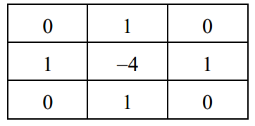

## 6.2 使用方式

- 通过函数`cv2.Laplacian()`实现**Laplacian算子运算**。
- **函数原型**：`dst = cv2.Laplacian( src, ddepth, ksize, scale, delta, borderType )`
- **参数说明**：
  - **dst**：表示**目标图像**。
  - **src**：表示**原始图像**。
  - **ddepth**：表示处理结果图像的图像深度。通常设置为**cv2.CV_64F**。
  - **ksize**：表示**滤波核**的大小。必须是**正奇数**。
  - **scale**：表示**计算导数值时所采用的缩放因子**，默认情况下是1，即没有缩放。
  - **delta**：表示**额外加在目标图像上的值**，默认为0。
  - **borderType**：表示**边界样式**，决定了以何种方式处理边界。

## 6.3 示例

```python
import cv2

src = cv2.imread("sample.png", cv2.IMREAD_GRAYSCALE)

Laplacian = cv2.Laplacian(src, cv2.CV_64F)
dst = cv2.convertScaleAbs(Laplacian)

cv2.imwrite("laplacian.png", dst)
```

|        原图         |          Laplacian算子检测          |
| :-----------------: | :---------------------------------: |
|  | 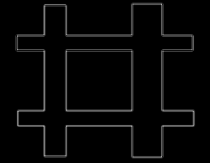 |
