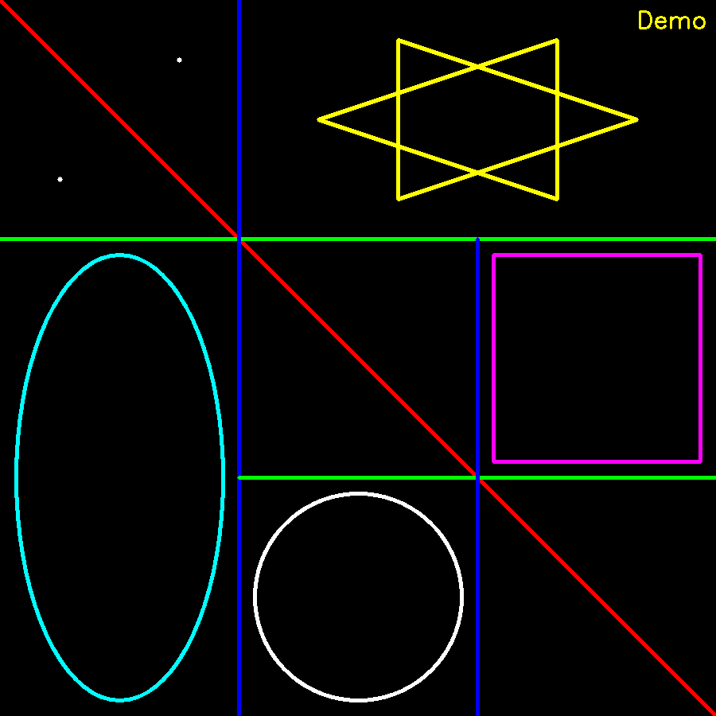
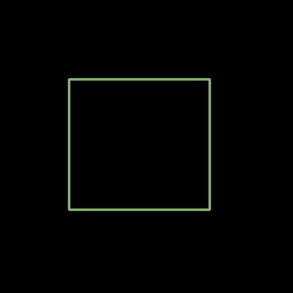
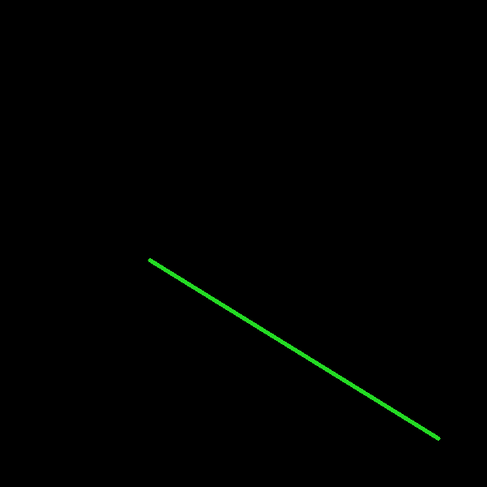
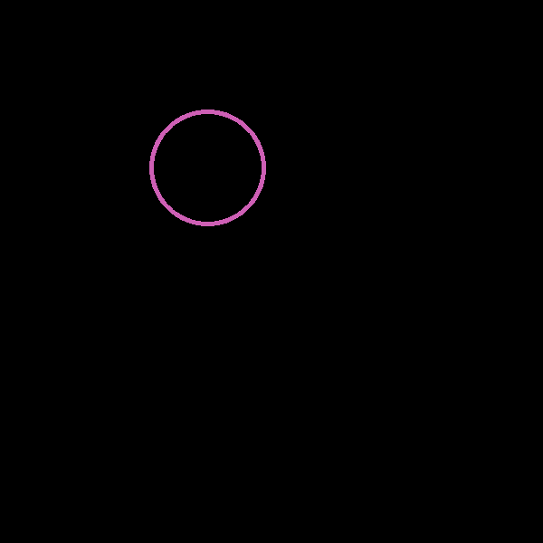
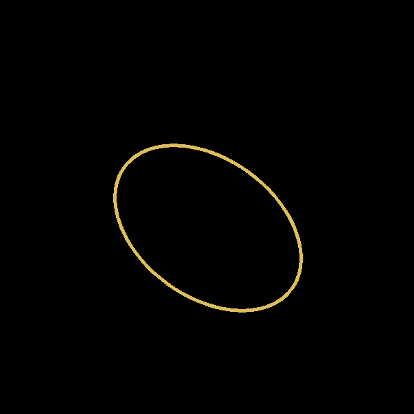
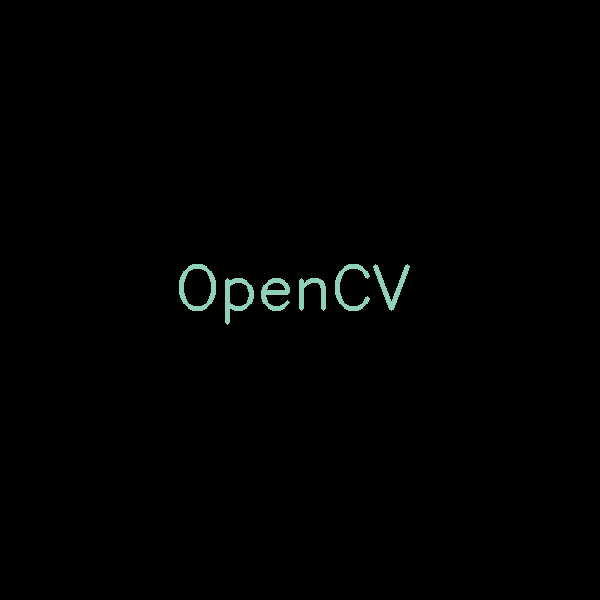
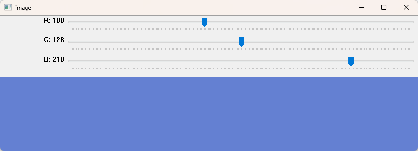

# 1. 绘图

​		OpenCV提供了**绘制直线**的函数**cv2.line()**、**绘制矩形**的函数**cv2.rectangle()**、**绘制圆**的函数**cv2.circle()**、**绘制椭圆**的函数**cv2.ellipse()**、**绘制多边形**的函数**cv2.polylines()**、**在图像内添加文字**的函数 **cv2.putText()** 等多种绘图函数。

## 1.1 通用参数

​		OpenCV提供的绘图函数，有一些**共有的参数**， 主要用于设置**源图像**、**颜色**、**线条属性**等。

- **img**：**图像**。
- **color**：绘制形状的**颜色**，通常使用 **`BGR模型`** 表示颜色，例如， (255, 0, 0)表示蓝色。
- **thickness**：**线条的粗细**，默认值是 1。如果设置为-1，表示绘制的图形是实心的。
- **lineType**：**线条的类型**，默认是8连接类型。
  - **cv2.FILLED**：填充
  - **cv2.LINE_4**：4连接类型
  - **cv2.LINE_8**：8连接类型
  - **cv2.LINE_AA**：抗锯齿，让线条更平滑
- **shift**：**数据精度**，控制数值的精度，一般情况下不需要设置。

## 1.2 绘制点

- 调用函数`cv2.circle()`，**radius**设置为**1**，**thickness设置为-1**，绘制**实心圆**
  - 函数原型：`img = cv2.circle(img, center, radius, color, thickness=-1, lineType)`
  - 函数参数：
    - **center**：表示**圆点坐标**。
    - **radius**：表示**圆点的半径**。

## 1.3 绘制直线

- 调用函数`cv2.line()`
  - 函数原型：`img = cv2.line(img, pt1, pt2, color, thickness, lineType)`
  - 函数参数：
    - **pt1**：表示线段的**起点**。
    - **pt2**：表示线段的**终点**。

## 1.4 绘制矩形

- 调用函数`cv2.rectangle()`
  - 函数原型：`img = cv2.rectangle(img, pt1, pt2, color, thickness, lineType)`
  - 函数参数：
    - **pt1**：表示矩形的**一个角点**。
    - **pt2**：表示矩形的**一个对角角点**。

## 1.5 绘制圆形

- 调用函数`cv2.circle()`
  - 函数原型：`img = cv2.circle(img, center, radius, color, thickness, lineType)`
  - 函数参数：
    - **center**：表示圆形的**圆心坐标点**。
    - **radius**：表示圆形的**半径**。

## 1.6 绘制椭圆形

- 调用函数`cv2.ellipse()`
  - 函数原型：`img = cv2.ellipse(img, center, axes, angle, startAngle, endAngle, color, thickness, lineType)`
  - 函数参数：
    - **center**：表示椭圆形的**圆心坐标点**。
    - **axes**：表示**轴的长度**。
    - **angle**：表示**偏转的角度**。
    - **startAngle**：表示**圆弧起始角的角度**。
    - **endAngle**：表示**圆弧终结角的角度**。

## 1.7 绘制多边形

- 调用函数`cv2.polylines()`
  - 函数原型：`img = cv2.polylines(img, pts, isClosed, color, thickness, lineType)`
  - 函数参数：
    - **pts**：多边形的**各个顶点**
    - **isClosed**：**闭合标记**，用来指示多边形是否是封闭的。
      - **True**：将最后一个点与第一个点连接，让多边形闭合。
      - **False**：仅仅将各个点依次连接起来，构成一条曲线。

## 1.8 绘制文字

- 调用函数`cv2.putText()`
  - 函数原型：`img=cv2.putText(img, text, pos, fontFace, fontScale, color, thickness,
    lineType, bottomLeftOrigin)`
  - 函数参数：
    - **text**：要绘制的**文字内容**。
    - **pos**：绘制字体的**位置**，以文字的左下角为起点。
    - **fontFace**：表示**字体类型**。
      - **cv2.FONT_HERSHEY_SIMPLEX**
      - **cv2.FONT_HERSHEY_PLAIN**
      - **cv2.FONT_HERSHEY_DUPLEX**
      - **cv2.FONT_HERSHEY_COMPLEX**
      - **cv2.FONT_HERSHEY_TRIPLEX**
      - **cv2.FONT_HERSHEY_COMPLEX_SMALL**
      - **cv2.FONT_HERSHEY_SCRIPT_SIMPLEX**
      - **cv2.FONT_HERSHEY_SCRIPT_COMPLEX**
      - **cv2.FONT_ITALIC**
    - **fontScale**：表示**字体大小**。
    - **bottomLeftOrigin **：**控制文字的方向**，默认值为**False**。
      - **True**：文字是垂直镜像的
      - **False**：文字是水平的

## 1.9 示例

```python
import numpy as np
import cv2

n = 900

Black   = (0,0,0)
Red     = (0,0,255)
Green   = (0,255,0)
Blue    = (255,0,0)
Yellow  = (0,255,255)
Cyan    = (255,255,0)
Magenta = (255,0,255)
White   = (255,255,255)

img = np.zeros((n,n,3), np.uint8)

img = cv2.circle(img, (int(n/12*3), int(n/12)), 3, White, -1)
img = cv2.circle(img, (int(n/12), int(n/12*3)), 3, White, -1)

img = cv2.line(img, (0,0), (int(n),int(n)), Red, 4)
img = cv2.line(img, (0,int(n/3)), (int(n),int(n/3)), Green, 4)
img = cv2.line(img, (int(n/3),0), (int(n/3),n), Blue, 4)
img = cv2.line(img, (int(n/3),int(n/3*2)), (int(n),int(n/3*2)), Green, 4)
img = cv2.line(img, (int(n/3*2),int(n/3)), (int(n/3*2),int(n)), Blue, 4)

img = cv2.rectangle(img, (int(n/3*2) + 10 * 2, int(n/3) + 10 * 2), (int(n) - 10 * 2, int(n/3*2) - 10 * 2), Magenta, 3)
img = cv2.circle(img, (int(n/2), int(n/6*5)), int(n/6) - 10 * 2, White, 3)

img = cv2.ellipse(img, (int(n/6), int(n/3*2)), (int(n/3) - 10 * 2, int(n/6) - 10 * 2), 90, 0, 360, Cyan, 3)

pts_1 = np.array([[int(n/9*4), int(n/18*3)], [int(n/9*7), int(n/18)], [int(n/9*7), int(n/18*5)]], np.int32)
pts_2 = np.array([[int(n/9*8), int(n/18*3)], [int(n/9*5), int(n/18)], [int(n/9*5), int(n/18*5)]], np.int32)
img = cv2.polylines(img, [pts_1], True, Yellow, 3)
img = cv2.polylines(img, [pts_2], True, Yellow, 3)

text = "Demo"
img=cv2.putText(img, text, (800, 35), cv2.FONT_HERSHEY_SIMPLEX, 1, Yellow, 2)

cv2.imshow('demo', img)
cv2.waitKey(0)
cv2.destroyAllWindows()
```



# 2. 交互

## 2.1 键盘交互

- 函数`ord()`用来**获取字符的ASCII码**。
- 通过函数`ord()`与函数`waitKey()`相结合，可以**根据不同的按键情况，运行不同的程序功能**。

## 2.2 鼠标交互

- 通过**触发函数**`cv2.setMouseCallback()`**实现对鼠标事件的响应**。
- **响应函数**：按照固定的格式创建，用于实现事件的响应操作。
  - 函数原型：`def onMouseAction(event, x, y, flags, param)`
  - 参数说明：
    - **event**：表示触发了**何种事件**
    - **x**, **y**：代表触发鼠标事件时， **鼠标在窗口中的坐标**(x, y)
    - **flags**：代表鼠标的**拖曳事件**，以及**键盘鼠标联合事件**
    - **param**：函数ID，标识所响应的事件函数
    - **onMouseAction**：**响应函数的名称**，**可自定义**
  - **鼠标事件**：
    - **cv2.EVENT_LBUTTONDBLCLK**：双击左键
    - **cv2.EVENT_LBUTTONDOWN**：按下左键
    - **cv2.EVENT_LBUTTONUP**：抬起左键
    - cv2.EVENT_MBUTTONDBLCLK：双击中间键
    - cv2.EVENT_MBUTTONDOWN：按下中间键
    - cv2.EVENT_MBUTTONUP：抬起中间键
    - **cv2.EVENT_RBUTTONDBLCLK**：双击右键
    - **cv2.EVENT_RBUTTONDOWN**：按下右键
    - **cv2.EVENT_RBUTTONUP**：抬起右键
    - cv2.EVENT_MOUSEWHEEL：滚轮滑动， 正值向前进滚动，负值向后滚动
    - cv2.EVENT_MOUSEHWHEEL：滚轮滑动，正值向左滚动，负值向右滚动
    - **cv2.EVENT_MOUSEMOVE**：鼠标滑动
  - **拖曳事件**和**联合事件**：
    - **cv2.EVENT_FLAG_LBUTTON**：左键拖曳
    - cv2.EVENT_FLAG_MBUTTON：中间键拖曳
    - cv2.EVENT_FLAG_RBUTTON：右键拖曳
    - **cv2.EVENT_FLAG_CTRLKEY**：按住Ctrl键
    - **cv2.EVENT_FLAG_ALTKEY**：按住Alt键
    - **cv2.EVENT_FLAG_SHIFTKEY**：按住Shift键
- **触发函数**：将**响应函数**与**窗口**绑定
  - 函数原型：`cv2.setMouseCallback(winName,callbackFunc)`
  - 参数说明：
    - **winName**：绑定的窗口名
    - **callbackFunc**：绑定的响应函数名

### 示例

```python
import numpy as np
import cv2

n = 600
mode = 0

def draw(event, x, y, flags, param):

	if event == cv2.EVENT_LBUTTONDOWN:
		length = np.random.randint(1, n)
		radius = np.random.randint(1, n/5)
		angle = np.random.randint(0, 360)
		color = np.random.randint(low = 20, high = 225, size = (3,)).tolist()
		thickness = np.random.randint(1, 8)

		global img
		img = np.zeros((n,n,3), np.uint8)

		if mode == 1:
			cv2.rectangle(img, (x,y), (length,length), color, thickness)
		elif mode == 2:
			cv2.circle(img, (x,y), radius, color, thickness)
		elif mode == 3:
			cv2.line(img, (x,y), (length,length), color, thickness)
		elif mode == 4:
			cv2.ellipse(img, (x,y), (int(n/6),int(n/4)), angle, 0, 360, color, thickness)
		elif mode == 5:
			cv2.putText(img, 'OpenCV', (x,y), cv2.FONT_HERSHEY_SIMPLEX, 2, color, thickness)


if __name__ == "__main__":

	global img
	img = np.zeros((n,n,3), np.uint8)
	
	cv2.namedWindow('image')
	cv2.setMouseCallback('image', draw)
	while(1):
		cv2.imshow('image', img)
		k = cv2.waitKey(1) & 0xFF
		if k == ord('r'):   # rectangle
			mode = 1
		elif k == ord('c'): # circle
			mode = 2
		elif k == ord('l'): # line
			mode = 3
		elif k == ord('e'): # ellipse
			mode=4
		elif k == ord('t'): # text
			mode=5
		elif k == 27: # "Esc"
			break
	cv2.destroyAllWindows()
```

| 矩形  | 直线 | 圆形 | 椭圆形 | 文字 |
| :---: | :--: | :--: | :----: | :--: |
|  |  |  |  |  |

## 2.3 滚动条交互

​		滚动条是非常方便的交互工具，它依附于特定的窗口而存在。**通过调节滚动条能够设置、获取指定范围内的特定值。**

- 调用函数`cv2.createTrackbar()`用来**创建滚动条**
  - 函数原型：`cv2.createTrackbar(trackbarname, winname, value, count, onChange)`
  - 函数参数：
    - **trackbarname**：表示**滚动条的名称**。
    - **winname**：表示**滚动条所依附窗口的名称**。
    - **value**：表示**初始值**。
    - **count**：表示**滚动条的最大值**。通常情况下， 这个值的最小值是0。
    - **count**：表示**回调函数**。通常情况下，将**滚动条改变后要实现的操作写在回调函数内**。
  - 效果：**拖动滚动条，就可以设置滚动条的值**，并**让滚动条返回对应的值**。
- 调用函数`cv2.getTrackbarPos()`用来**获取滚动条的值**
  - 函数原型：`retval=cv2.getTrackbarPos(trackbarname, winname)`
  - 函数参数：
    - **retval**：返回值，获取函数`cv2.createTrackbar()`生成的滚动条的值。
    - **trackbarname**：滚动条的名称。
    - **winname**：滚动条所依附的窗口的名称。

### 示例

```python
import numpy as np
import cv2

def changeColor(x):
	r = cv2.getTrackbarPos('R', 'image')
	g = cv2.getTrackbarPos('G', 'image')
	b = cv2.getTrackbarPos('B', 'image')
	img[:] = [b,g,r]

img=np.zeros((150,850,3),np.uint8)

cv2.namedWindow('image')
cv2.createTrackbar('R', 'image', 0, 255, changeColor)
cv2.createTrackbar('G', 'image', 0, 255, changeColor)
cv2.createTrackbar('B', 'image', 0, 255, changeColor)

while(1):
	cv2.imshow('image', img)
	k = cv2.waitKey(1) & 0xFF
	if k == 27:
		break
cv2.destroyAllWindows()
```

