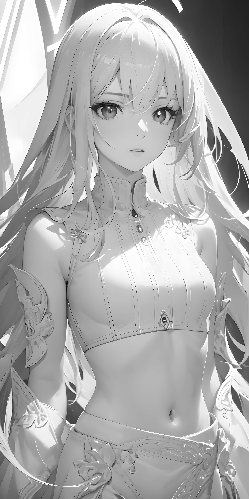
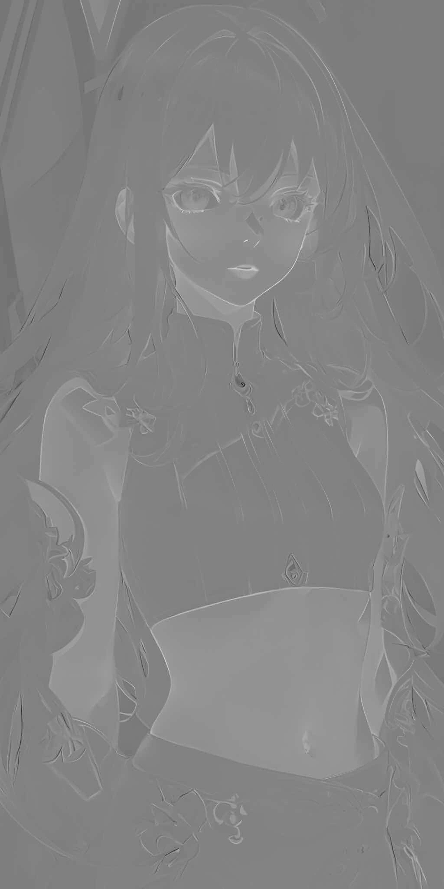
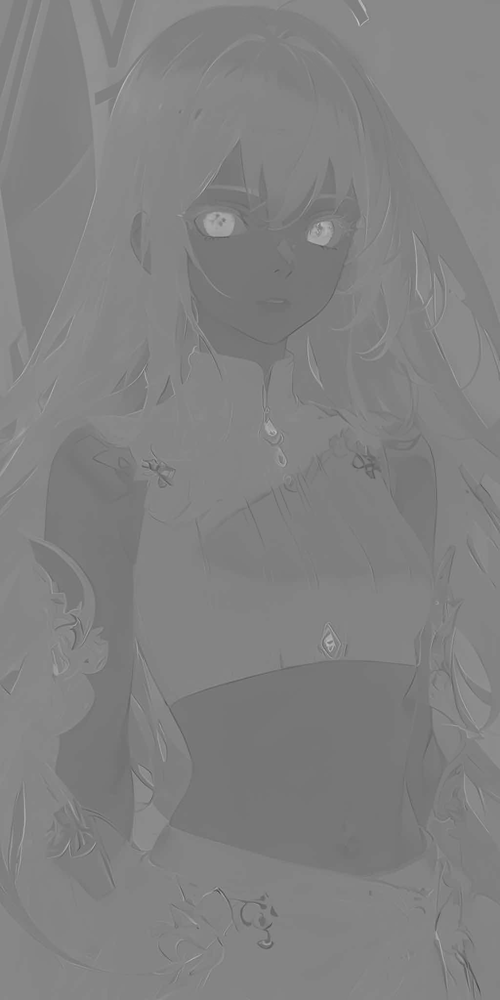
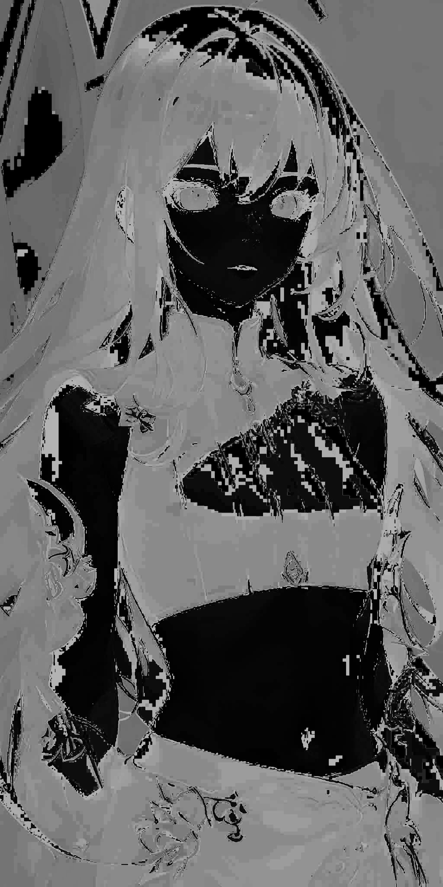
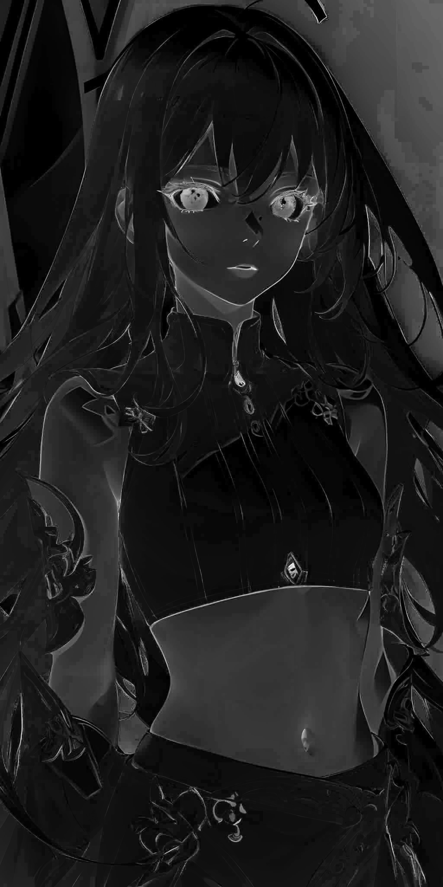
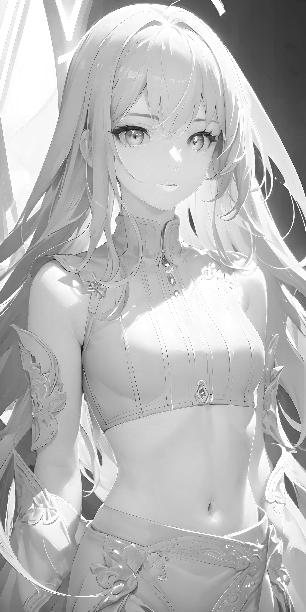

# 1. 介绍

​		**RGB色彩空间**是一种比较常见的色彩空间类型，除此以外还有一些其他的色彩空间，比较常见的包括**GRAY色彩空间**、**YCrCb色彩空间**、**HSV色彩空间**、**HLS色彩空间**、**L\*a\*b\*色彩空间**、**L\*u\*v\*色彩空间** 等。

​		**每个色彩空间都有自己擅长处理问题的领域**，`为了更方便地处理某个具体问题`，就要用到`色彩空间类型转换`——**将图像从一个色彩空间转换到另一个色彩空间**。

# 2. 色彩空间

## 2.1 GRAY色彩空间

​		GRAY色彩空间是一种只有一个通道的色彩空间，像素值的范围是[0,255]，用于表示图像的亮度信息。

- **转换方式**
  - **RGB转GRAY**：`Gray = 0.299 * 𝑅 + 0.587 * 𝐺 + 0.114 * 𝐵`

  - **GRAY转RGB**：`R = G = B = Gray`，当图像**由GRAY色彩空间转换为RGB色彩空间**时，**所有通道的值都将是相同的。**

## 2.2 YCrCb色彩空间

​		在YCrCb色彩空间中，Y代表光源的亮度，体现了颜色的亮暗程度，色度信息保存在Cr和Cb中，Cr 表示红色分量信息，Cb表示蓝色分量信息。

- **转换方式**
$$
\delta =
\begin{cases}
128, & \text{8位图像} \\
32768, & \text{16位图像} \\
0.5, & \text{单精度图像}
\end{cases}
$$

- **RGB转YCrCb**
  - `𝑌 = 0.299 * 𝑅 + 0.587 * 𝐺 + 0.114 * 𝐵`
  - `Cr = (𝑅 − 𝑌) × 0.713 + delta`
  - `Cb = (𝐵 − 𝑌) × 0.564 + delta`
- **YCrCb转RGB**
  - `𝑅 = 𝑌 + 1.403 * (Cr − delta)`
  - `𝐺 = 𝑌 − 0.714 * (Cr − delta) − 0.344 * (Cb − delta)`
  - `𝐵 = 𝑌 + 1.773 * (Cb − delta)`

## 2.3 HSV色彩空间

​		**HSV色彩空间**是**一种面向视觉感知的颜色模型**。HSV色彩空间从心理学和视觉的角度出发，指出人眼的色彩知觉包含的三要素：**色调**（Hue）、**饱和度**（Saturation）、**亮度**（Value）。`色调`指`光的颜色`，`饱和度`是指`色彩的深浅程度`，`亮度`指`人眼感受到光的明暗程度`	。

- **色调**：取值范围为[0, 360]。将颜色分布在圆周上，**不同的角度代表不同的颜色，两个角度之间的角度对应两个颜色之间的过渡色**。
- **饱和度**：取值范围是[0, 1]。所选颜色的纯度值和该颜色最大纯度值之间的比值。
- **亮度**：取值范围是[0, 1]。表示色彩的明亮程度。

## 2.4 L\*a\*b\*色彩空间

​		L\*a\*b\*色彩空间是**均匀色彩空间模型**，它也是面向视觉感知的颜色模型。

​		在L\*a\*b\*色彩空间中，**L\*分量用于表示像素的亮度**，取值范围是[0,100]，表示从纯黑到纯白；**a\*分量表示从红色到绿色的范围**，取值范围是[-127,127]；**b*分量表示从黄色到蓝色的范围**，取值范围是[-127,127]。

## 2.5 L\*u\*v\*色彩空间

​		L\*u\*v\*色彩空间**与设备无关**，适用于**显示器显示**和**根据加色原理进行组合**的场合，该模型中比较**强调对红色的表示**， 即对红色的变化比较敏感，但**对蓝色的变化不太敏感**。

# 3. 色彩空间转换

## 3.1 调用方式

- **函数**：`dst = cv2.cvtColor( src, code [, dstCn] )`
  - **dst**表示**输出图像**，与原始输入图像具有同样的数据类型和深度。
  - **src**表示**原始输入图像**，可以是8位无符号图像、16位无符号图像，或者单精度浮点数等。
  - **code**是**色彩空间转换码**。
  - **dstCn**是目标图像的通道数，默认为0。

:::note[注意]

由于**计算过程存在四舍五入**，所以**转换过程并不是精准可逆的**。

:::

## 3.2 转换码

### RGB、BGR与RGBA、BGRA

| RGB、BGR → RGBA、BGRA | RGBA、BGRA → RGB、BGR |
| :-------------------: | :-------------------: |
|  cv2.COLOR_BGR2BGRA   |  cv2.COLOR_BGRA2BGR   |
|  cv2.COLOR_BGR2RGBA   |  cv2.COLOR_RGBA2BGR   |
|  cv2.COLOR_RGB2RGBA   |  cv2.COLOR_RGBA2RGB   |
|  cv2.COLOR_RGB2BGRA   |  cv2.COLOR_BGRA2RGB   |

| RGB → BGR、RGBA → BGRA | BGR → RGB、BGRA → RGBA |
| :-------------------: | :-------------------: |
| cv2.COLOR_RGB2BGR | cv2.COLOR_BGR2RGB |
| cv2.COLOR_RGBA2BGRA | cv2.COLOR_BGRA2RGBA |

### RGB与GRAY

|      RGB→ GRAY      |     GRAY → RGB      |
| :-----------------: | :-----------------: |
| cv2.COLOR_BGR2GRAY  | cv2.COLOR_GRAY2BGR  |
| cv2.COLOR_RGB2GRAY  | cv2.COLOR_GRAY2RGB  |
| cv2.COLOR_BGRA2GRAY | cv2.COLOR_GRAY2BGRA |
| cv2.COLOR_RGBA2GRAY | cv2.COLOR_GRAY2RGBA |

### RGB与YCrCb

|     RGB → YCrCb     |     YCrCb → RGB     |
| :-----------------: | :-----------------: |
| cv2.COLOR_BGR2YCrCb | cv2.COLOR_YCrCb2BGR |
| cv2.COLOR_RGB2YCrCb | cv2.COLOR_YCrCb2RGB |

### RGB与YUV

|     RGB → YUV     |     YUV → RGB     |
| :---------------: | :---------------: |
| cv2.COLOR_BGR2YUV | cv2.COLOR_YUV2BGR |
| cv2.COLOR_RGB2YUV | cv2.COLOR_YUV2RGB |

### RGB与HSV

|     RGB → HSV     |     HSV → RGB     |
| :---------------: | :---------------: |
| cv2.COLOR_BGR2HSV | cv2.COLOR_HSV2BGR |
| cv2.COLOR_RGB2HSV | cv2.COLOR_HSV2RGB |

### RGB与L\*a\*b\*

|  RGB → L\*a\*b\*  |  L\*a\*b\* → RGB  |
| :---------------: | :---------------: |
| cv2.COLOR_BGR2Lab | cv2.COLOR_Lab2BGR |
| cv2.COLOR_RGB2Lab | cv2.COLOR_Lab2RGB |

### RGB与L\*u\*v\*

|  RGB → L\*u\*v\*  |  L\*u\*v\* → RGB  |
| :---------------: | :---------------: |
| cv2.COLOR_BGR2Luv | cv2.COLOR_Luv2BGR |
| cv2.COLOR_RGB2Luv | cv2.COLOR_Luv2RGB |

## 3.3 示例

### RGB与GRAY

```python
import cv2

BGR = cv2.imread("person.jpg")

GRAY = cv2.cvtColor(BGR, cv2.COLOR_BGR2GRAY)
cv2.imwrite("GRAY.jpg", GRAY)
GRAY_BGR = cv2.cvtColor(GRAY, cv2.COLOR_GRAY2BGR)
cv2.imwrite("GRAY_BGR.jpg", GRAY_BGR)
```

|        BGR         |     BGR转GRAY     |         GRAY转BGR         |
| :----------------: | :---------------: | :-----------------------: |
|  |  |  |

### RGB与YCrCb

```python
import cv2

BGR = cv2.imread("person.jpg")

YCbCr = cv2.cvtColor(BGR, cv2.COLOR_BGR2YCrCb)
cv2.imwrite("Y.jpg", YCbCr[:,:,0])
cv2.imwrite("Cb.jpg", YCbCr[:,:,1])
cv2.imwrite("Cr.jpg", YCbCr[:,:,2])
YCbCr_BGR = cv2.cvtColor(YCbCr, cv2.COLOR_YCrCb2BGR)
cv2.imwrite("YCbCr_BGR.jpg", YCbCr_BGR)
```

|        BGR         | Y           |      Cb       | Cr   |        YCrCb转BGR         |
| :----------------: | :---------: | :-----------: | :--: | :-----------------------: |
|  |  |  |  |  |

### RGB与HSV

```python
import cv2

BGR = cv2.imread("person.jpg")

HSV = cv2.cvtColor(BGR, cv2.COLOR_BGR2HSV)
cv2.imwrite("H.jpg", HSV[:,:,0])
cv2.imwrite("S.jpg", HSV[:,:,1])
cv2.imwrite("V.jpg", HSV[:,:,2])
HSV_BGR = cv2.cvtColor(HSV, cv2.COLOR_HSV2BGR)
cv2.imwrite("HSV_BGR.jpg", HSV_BGR)
```

|        BGR         |      H      |      S      |      V      |        HSV转BGR         |
| :----------------: | :---------: | :---------: | :---------: | :---------------------: |
|  |  |  |  |  |

# 4. 色彩控制

## 4.1 控制方式

- **函数**：`cv2.inRange()`，判断图像内像素点的像素值是否在指定的范围内，可以用来生成相应的掩膜
- **调用方式**：`dst = cv2.inRange( src, lower, upper )`
- **参数说明**：
  - **dst**：表示输出结果，大小和src一致。
  - **src**：表示要检查的数组或图像。
  - **lower**：表示范围下界。
  - **upper**：表示范围上界。

## 4.2 示例

```python
import cv2
import numpy as np

bgr = cv2.imread("logo.png")
hsv = cv2.cvtColor(bgr, cv2.COLOR_BGR2HSV)

minBlue = np.array([110,100,100])
maxBlue = np.array([130,255,255])
maskBlue = cv2.inRange(hsv, minBlue, maxBlue)
blue = cv2.bitwise_and(bgr, bgr, mask=maskBlue)
cv2.imwrite("B.jpg", blue)

minGreen = np.array([50,100,100])
maxGreen = np.array([70,255,255])
maskGreen = cv2.inRange(hsv, minGreen, maxGreen)
green = cv2.bitwise_and(bgr, bgr, mask=maskGreen)
cv2.imwrite("G.jpg", green)

minRed = np.array([0,100,100])
maxRed = np.array([30,255,255])
maskRed = cv2.inRange(hsv, minRed, maxRed)
red = cv2.bitwise_and(bgr, bgr, mask=maskRed)
cv2.imwrite("R.jpg", red)
```

|       LOGO        |      R      |      G      |      B      |
| :---------------: | :---------: | :---------: | :---------: |
|  |  |  |  |
