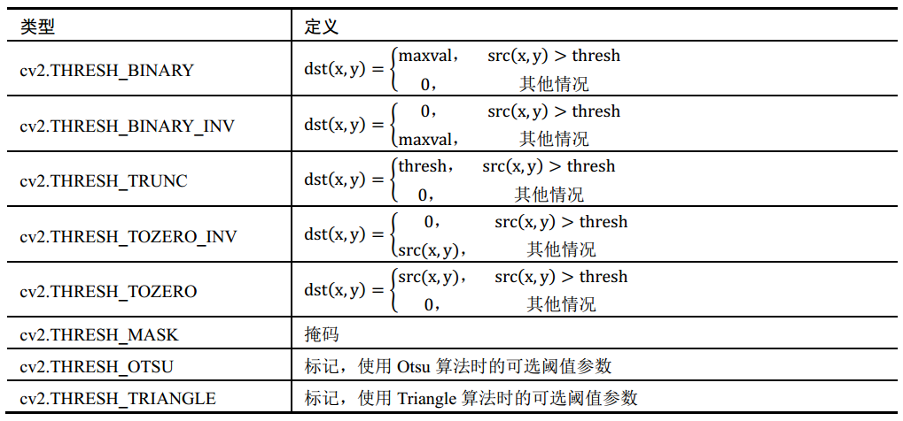
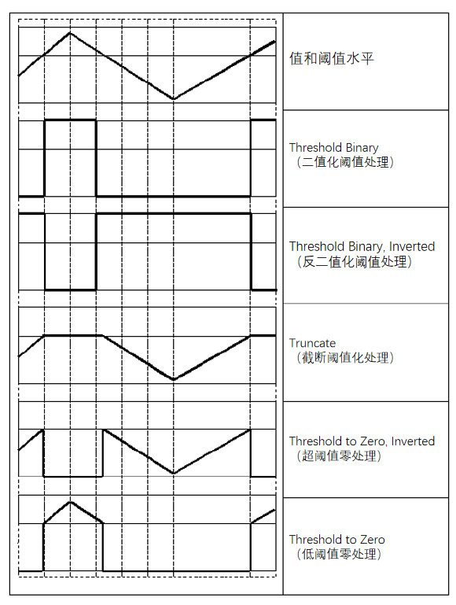

# 1. 介绍

​		阈值处理，指**剔除图像内像素值高于一定值或者低于一定值的像素点**。通过阈值处理方式，可以**将一幅灰度图像处理为一幅二值图像**，有效实现了前景和背景的分离。

# 2. 通用阈值处理

- 通过**函数**`cv2.threshold()`，实现通用的**阈值处理**。
- **函数原型**：`retval, dst = cv2.threshold( src, thresh, maxval, type )`
- **参数说明**：
  - **retval**：**返回的阈值**。
  - **dst**：**阈值分割结果图像**，与原始图像具有相同的大小和类型。
  - **src**：**要进行阈值分割的图像**，可以是多通道的8位或32位浮点型数值。
  - **thresh**：**设定的阈值**。
  - **maxval**：当type参数为**THRESH_BINARY**或者**THRESH_BINARY_INV**类型时，需要设定的**最大值**。
  - **type**：**阈值分割的类型**。





```python
import cv2

src = cv2.imread("person.jpg", cv2.IMREAD_GRAYSCALE)

val, BINARY = cv2.threshold(src=src, thresh=127, maxval=255, type=cv2.THRESH_BINARY)
val, BINARY_INV = cv2.threshold(src=src, thresh=127, maxval=255, type=cv2.THRESH_BINARY_INV)
val, TRUNC = cv2.threshold(src=src, thresh=127, maxval=255, type=cv2.THRESH_TRUNC)
val, TOZERO = cv2.threshold(src=src, thresh=127, maxval=255, type=cv2.THRESH_TOZERO)
val, TOZERO_INV = cv2.threshold(src=src, thresh=127, maxval=255, type=cv2.THRESH_TOZERO_INV)

cv2.imwrite("BINARY.jpg", BINARY)
cv2.imwrite("BINARY_INV.jpg", BINARY_INV)
cv2.imwrite("TRUNC.jpg", TRUNC)
cv2.imwrite("TOZERO.jpg", TOZERO)
cv2.imwrite("TOZERO_INV.jpg", TOZERO_INV)
```

|        原图         |        二值化         |          反二值化           |
| :-----------------: | :-------------------: | :-------------------------: |
|  |  |  |

|        原图         |        截断处理        |
| :-----------------: | :--------------------: |
|  |  |

|        原图         |          超阈值零处理           |        低阈值零处理         |
| :-----------------: | :-----------------------------: | :-------------------------: |
|  |  |  |

# 3. Otsu阈值处理

​		在使用函数`cv2.threshold()`进行阈值处理时，需要**自定义一个阈值**，并**以此阈值作为图像阈值处理的依据**。通常情况下，处理的图像都是**色彩均衡**的，这时直接**将阈值设为127是比较合适的**。但是有时**图像灰度级的分布是不均衡的**，如果此时还将阈值设置为127，那么阈值处理的结果就是失败的。**Otsu方法能够根据当前图像，给出最佳的类间分割阈值**。

- 通过**函数**`cv2.threshold()`，实现**Otsu阈值处理**。
- **函数原型**：`retval, dst = cv2.threshold( src, thresh, maxval, type )`
- **参数说明**：
  - **retval**：**返回的阈值**。
  - **dst**：**阈值分割结果图像**，与原始图像具有相同的大小和类型。
  - **src**：**要进行阈值分割的图像**，必须是单通道的8位或32位浮点型数值。
  - **thresh**：设定的**阈值**。**对于Otsu算法，该值必须设置为0**。
  - **maxval**：设定的**最大值**，**一般可设定为255**。
  - **type**：**阈值分割的类型**，**对于Otsu算法，该值必须设置为cv2.THRESH_OTSU**。

```python
import cv2

src = cv2.imread("person.jpg", cv2.IMREAD_GRAYSCALE)

val, OTSU = cv2.threshold(src=src, thresh=0, maxval=255, type=cv2.THRESH_OTSU)

cv2.imwrite("OTSU.jpg", OTSU)
```

|        原图         |       Otsu二值化        |
| :-----------------: | :---------------------: |
|  |  |

# 4. 自适应阈值处理

​		对于**色彩均衡**的图像，**直接使用一个阈值**就能完成对图像的阈值化处理。但是，有时**图像的色彩是不均衡的**，此时**如果只使用一个阈值，就无法得到清晰有效的阈值分割结果图像**。

​		有一种**改进的**阈值处理技术，它**使用变化的阈值**完成对图像的阈值处理，这种技术被称为**自适应阈值处理**。在进行阈值处理时，自适应阈值处理的方式**通过计算每个像素点周围临近区域的加权平均值获得阈值**，并**使用该阈值对当前像素点进行处理**。与普通的阈值处理方法相比，**自适应阈值处理能够更好地处理明暗差异较大的图像**。

- 通过**函数**`cv2.adaptiveThreshold()`，实现**自适应阈值处理**。
- **函数原型**：`dst = cv.adaptiveThreshold( src, maxValue, adaptiveMethod, thresholdType,
  blockSize, C )`
- **参数说明**：
  - **dst**：**阈值分割结果图像**，与原始图像具有相同的大小和类型。
  - **src**：**要进行阈值分割的图像**，必须是**单通道**的**8位图像**。
  - **maxValue**：设定的**最大值**，**一般可设定为255**。
  - **adaptiveMethod**：**自适应方法**。
    - **cv2.ADAPTIVE_THRESH_MEAN_C**：**邻域所有像素点的权重值是一致的**。
    - **cv2.ADAPTIVE_THRESH_GAUSSIAN_C**：**权重值与邻域各个像素点到中心点的距离有关**，通过**高斯方程**得到各个点的权重值。
  - **thresholdType**：**阈值分割的类型**，**该值必须是cv2.THRESH_BINARY或cv2.THRESH_BINARY_INV其中的一个**。
  - **blockSize**：**邻域检测块的大小**，通常设置为3、5、7等。
  - **C**：常量。

```python
import cv2

src = cv2.imread("person.jpg", cv2.IMREAD_GRAYSCALE)

MEAN  = cv2.adaptiveThreshold(src, 255, cv2.ADAPTIVE_THRESH_MEAN_C, cv2.THRESH_BINARY, 5, 3)
GAUSS = cv2.adaptiveThreshold(src, 255, cv2.ADAPTIVE_THRESH_GAUSSIAN_C, cv2.THRESH_BINARY, 5, 3)

cv2.imwrite("MEAN.jpg", MEAN)
cv2.imwrite("GAUSS.jpg", GAUSS)
```

|        原图         |       均值法        |        高斯法        |
| :-----------------: | :-----------------: | :------------------: |
|  |  |  |
