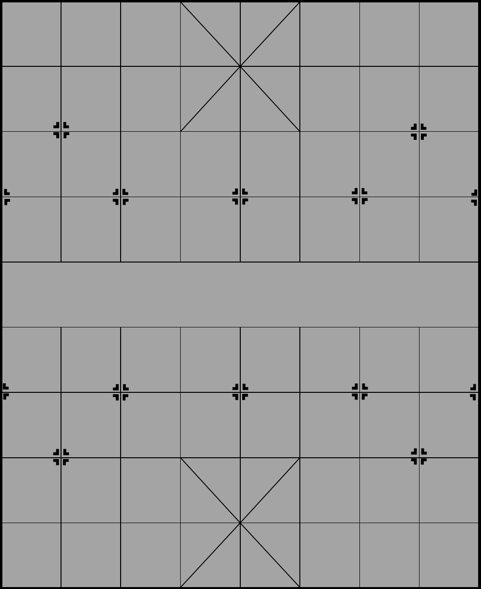
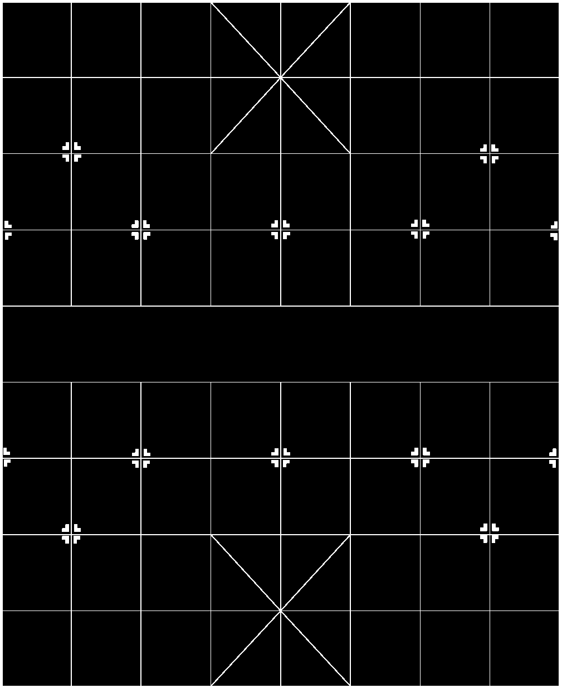
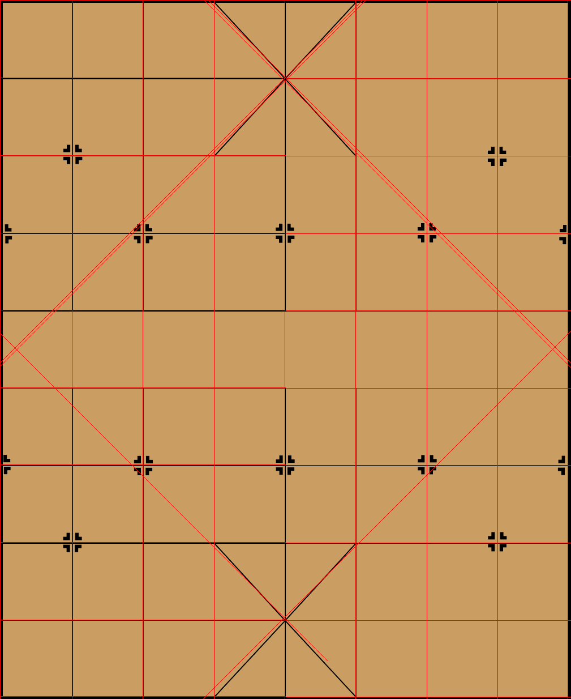
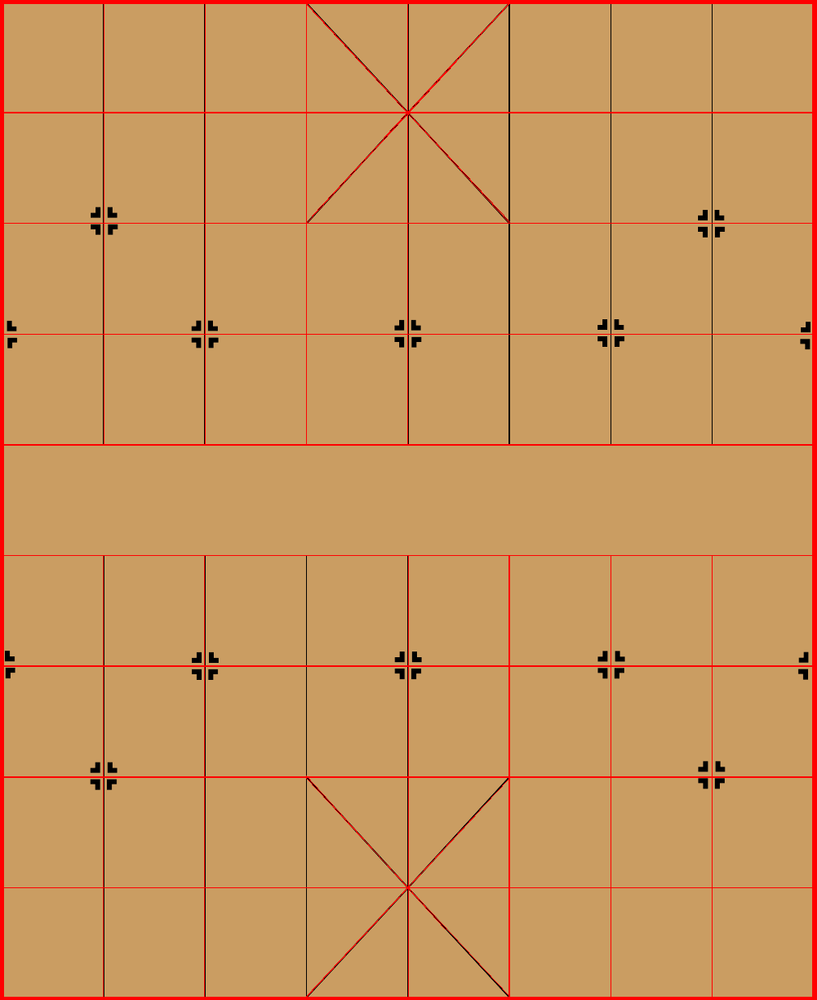
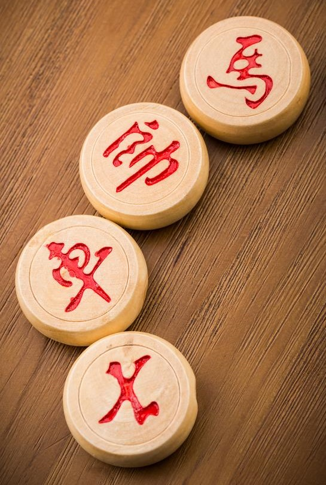
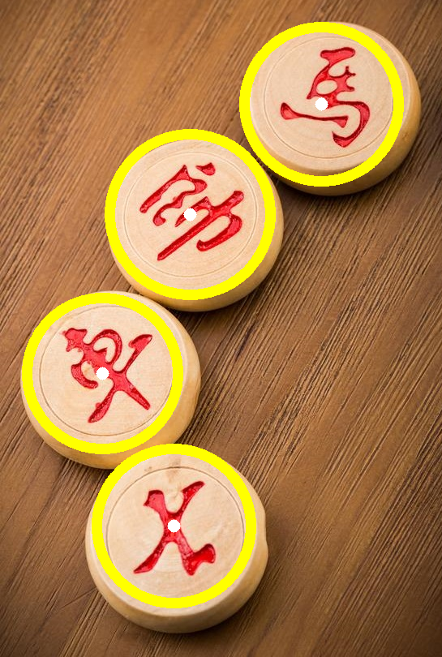

# 1. 介绍

​		**霍夫变换**是**一种在图像中寻找直线、圆形以及其他简单形状的方法**。

​		**最初的霍夫变换只能用于检测直线**，经过发展后，**霍夫变换不仅能够识别`直线`，还能识别其他简单的图形结构，常见的有 `圆` 、 `椭圆` 等**。

​		**霍夫直线变换**用来**在图像内寻找直线**，可以用函数 **`cv2.HoughLines()`** 和函数 **`cv2.HoughLinesP()`** 实现；**霍夫圆变换**用来**在图像内寻找圆**，可以用函数 **`cv2.HoughCircles()`** 实现。

# 2. 霍夫直线变换

## 2.1 基本原理

- **笛卡儿空间内的直线**：*y = k·x + b*与**霍夫空间内的点**：*(k, b)*，互相对应。
- **霍夫空间内的直线**：*b = -x·k + y*与**笛卡儿空间内点**：*(x, y)*，互相对应。
- **极坐标系**内的**一个点**与**霍夫坐标系**内的**一条正弦曲线**，互相对应。
- 在**霍夫空间**内，**经过一个点的直线越多**，说明其在**笛卡儿空间**内**映射的直线**是**由越多的点所穿过**的。 
- **霍夫变换选择直线**的**基本思路**是： **选择有尽可能多直线交汇的点**。

---

- 在使用霍夫变换进行检测时，**经常存在非常严重的误检测**，于是出现了霍夫变换的改进版——**概率霍夫变换**。
  - **改进1**：**所接受直线的最小长度**。如果有超过阈值个数的像素点构成了一条直线，但是**这条直线很短**，那么就不会接受该直线作为判断结果。
  - **改进2**：**接受直线时允许的最大像素点间距**。如果有超过阈值个数的像素点构成了一条直线，但是**这组像素点之间的距离都很远**，就不会接受该直线作为判断结果。

---

- **在实际检测中，`需要不断调整参数`才能得到最优结果。**

## 2.2 使用方法

- 通过**函数**`cv2.HoughLines()`实现**霍夫直线变换**。
- **函数原型**：`lines = cv2.HoughLines( image, rho, theta, threshold )`
- **参数说明**：
  - **image**：**原始图像**，必须是**8位**的、**单通道**、**二值图像**。
  - **rho**：**以像素为单位的距离r的精度**，默认精度为**1**。
  - **theta**：**角度𝜃的精度**，默认精度为**π/180**，表示要**搜索所有可能的角度**。
  - **threshold**：**阈值**。值越小，判定出的直线就越多。
  - **lines**：**numpy.ndarray类型数据**。每个元素都是**一对浮点数**，表示**检测到的直线的参数**，即 **(r, θ)** 。
- 使用函数**cv2.HoughLines()**检测到的是**图像中的直线**而**不是线段**，检测到的直线是**没有端点**的。

---

- 通过**函数**`cv2.HoughLinesP()`实现**霍夫直线变换**。
- **函数原型**：`lines = cv2.HoughLinesP( image, rho, theta, threshold, minLineLength, maxLineGap )`
- **参数说明**：
  - **image**：**原始图像**，必须是**8位**的、**单通道**、**二值图像**。
  - **rho**：**以像素为单位的距离r的精度**，默认精度为**1**。
  - **theta**：**角度𝜃的精度**，默认精度为**π/180**，表示要**搜索所有可能的角度**。
  - **threshold**：**阈值**。值越小，判定出的直线就越多。
  - **minLineLength**：控制“**接受直线的最小长度**”的值，默认值为0。
  - **maxLineGap**：控制“**接受共线线段之间的最小间隔**”的值，即在一条线中两点的最大间隔，默认值为0。
  - **lines**：**numpy.ndarray类型数据**。每个元素都是**一对浮点数**，表示**检测到的直线的参数**，即 **(x1, y1, x2, y2)** 。

## 2.3 示例

- **霍夫直线变换**

```python
import cv2
import numpy as np

img = cv2.imread("board.png")

img_gray = cv2.cvtColor(img, cv2.COLOR_BGR2GRAY)
cv2.imwrite("board_gray.png", img_gray)

val, img_edge = cv2.threshold(src=img_gray, thresh=127, maxval=255, type=cv2.THRESH_BINARY_INV)
cv2.imwrite("board_edge.png", img_edge)

lines = cv2.HoughLines(img_edge, 1, np.pi/4, 146)

D = max(img.shape[0], img.shape[1])

for line in lines:
    rho, theta = line[0]

    x = rho * np.cos(theta)
    y = rho * np.sin(theta)
    x1 = int(x - D * np.sin(theta))
    y1 = int(y + D * np.cos(theta))
    x2 = int(x + D * np.sin(theta))
    y2 = int(y - D * np.cos(theta))

    cv2.line(img, (x1,y1), (x2,y2), (0,0,255), 1)

cv2.imwrite("HoughLines.png", img)
```

- **概率霍夫直线变换**

```python
import cv2
import numpy as np

img = cv2.imread("board.png")

img_gray = cv2.cvtColor(img, cv2.COLOR_BGR2GRAY)
cv2.imwrite("board_gray.png", img_gray)

val, img_edge = cv2.threshold(src=img_gray, thresh=127, maxval=255, type=cv2.THRESH_BINARY_INV)
cv2.imwrite("board_edge.png", img_edge)

lines = cv2.HoughLinesP(img_edge, 1, np.pi/180, 120, minLineLength=150, maxLineGap=10)

for line in lines:
    x1,y1,x2,y2 = line[0]
    cv2.line(img, (x1,y1), (x2,y2), (0,0,255), 1)

cv2.imwrite("HoughLinesP.png", img)
```

|      原图      |      灰度图像       |     二值化图像      |
| :------------: | :-----------------: | :-----------------: |
|  |  |  |

|      霍夫变换       |     概率霍夫变换     |
| :-----------------: | :------------------: |
|  |  |

# 3. 霍夫圆变换

- 只要是**能够用一个参数方程表示的对象**，都**适合用霍夫变换来检测**。
- 在霍夫圆变换中，需要考虑**圆半径r**和**圆心x坐标**、**圆心y坐标**共3 个参数。
  - **策略**是**两轮筛选**：**第1轮**筛选找出可能存在**圆心位置**，**第2轮**根据第1轮的结果筛选出**半径大小**。
- 霍夫圆变换也有用于决定是否接受圆的参数：**圆心间的最小距离**、**圆的最小半径**、**圆的最大半径**。
- **在实际检测中，`需要不断调整参数`才能得到最优结果。**

## 3.1 使用方法

- 通过**函数**`cv2.HoughCircles()`实现**霍夫圆变换**。

- **函数原型**：`circles = cv2.HoughCircles( image, method, dp, minDist, param1, param2, minRadius, maxRadius )`

- **参数说明**：

  - **image**：**原始图像**，必须是**8位**的、**单通道**、**二值图像**。
  - **method**：**检测方法**。
  - **dp**：**累计器分辨率**，用来指定**图像分辨率**与**圆心累加器分辨率**的比例。
  - **minDist**：**圆心间的最小间距**。如果存在圆心间距离小于该值的多个圆，则仅有一个会被检测出来。因此，如果该值太小，则会有多个临近的圆被检测出来；如果该值太大，则可能会在检测时漏掉一些圆。
  - **param1**：**对应Canny边缘检测器的高阈值**。缺省时值为100。
  - **param2**：**值越大，检测到的圆越少； 值越小，检测到的圆越多**。缺省时值为100。
- **minRadius**：**圆半径的最小值**，**小于该值的圆不会被检测出来**。缺省值，默认为0。
  - **maxRadius**：**圆半径的最大值**，**大于该值的圆不会被检测出来**。缺省值，默认为0。
  - **circles**：**numpy.ndarray类型数据**，由**圆心坐标**和**半径**构成。

## 3.2 示例

```python
import cv2
import numpy as np

img = cv2.imread("chess.jpg")

img_gray = cv2.cvtColor(img, cv2.COLOR_BGR2GRAY)
img_gray = cv2.medianBlur(img_gray, 3)
cv2.imwrite("chess_gray.png", img_gray)

circles = cv2.HoughCircles(img_gray, cv2.HOUGH_GRADIENT, 1, 180, param1=50, param2=30, minRadius=90, maxRadius=100)

circles = np.uint16(np.around(circles))
for i in circles[0,:]:
    cv2.circle(img, (i[0],i[1]), 2, (255,255,255), 12)
    cv2.circle(img, (i[0],i[1]), i[2], (0,255,255), 12)

cv2.imwrite("HoughCircles.png", img)
```

|    霍夫变换    |      灰度图像       |      霍夫圆变换       |
| :------------: | :-----------------: | :-------------------: |
|  |  |  |