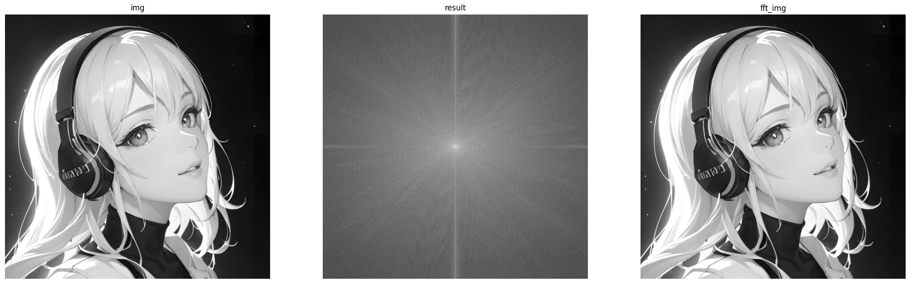
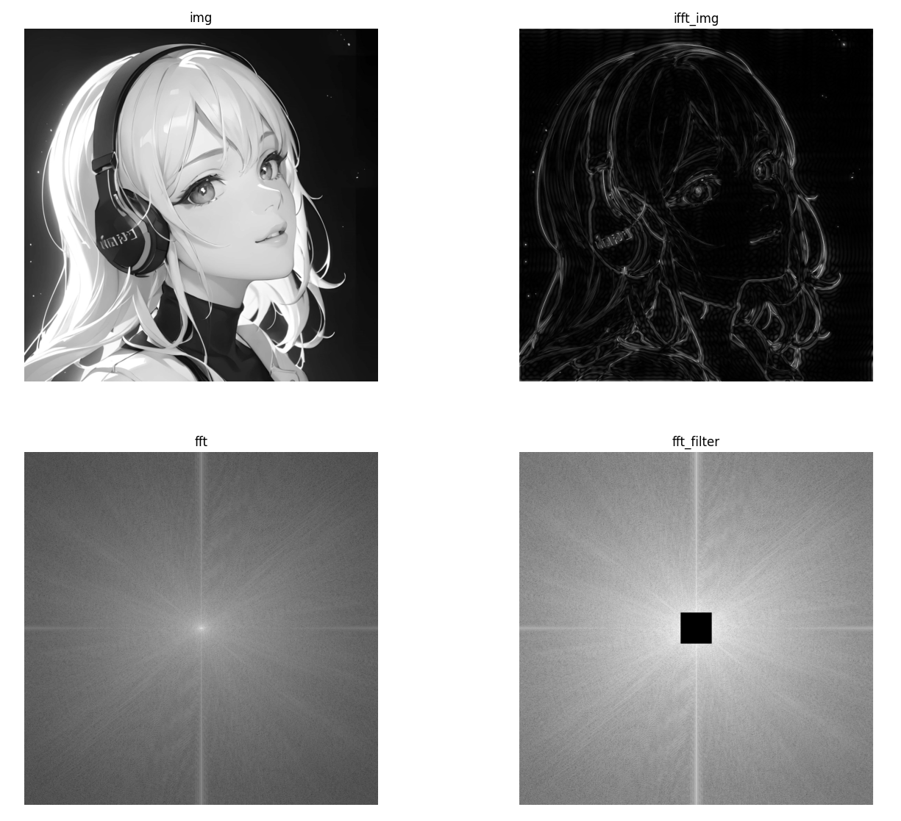
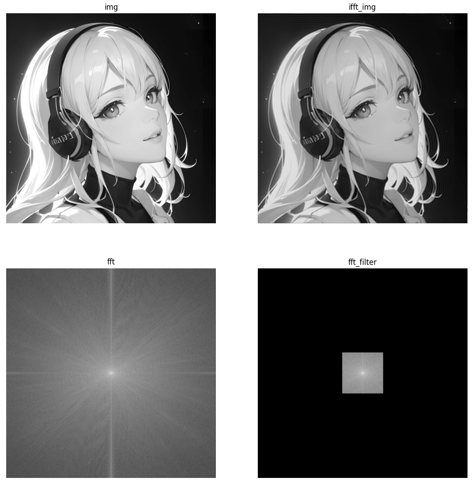
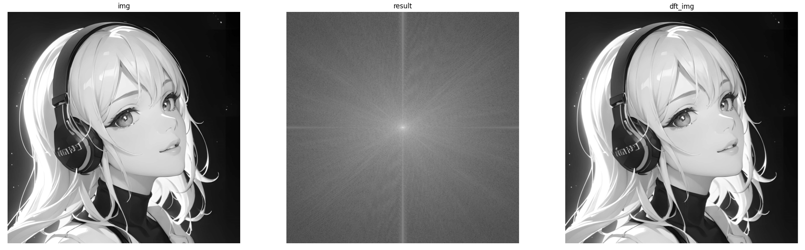
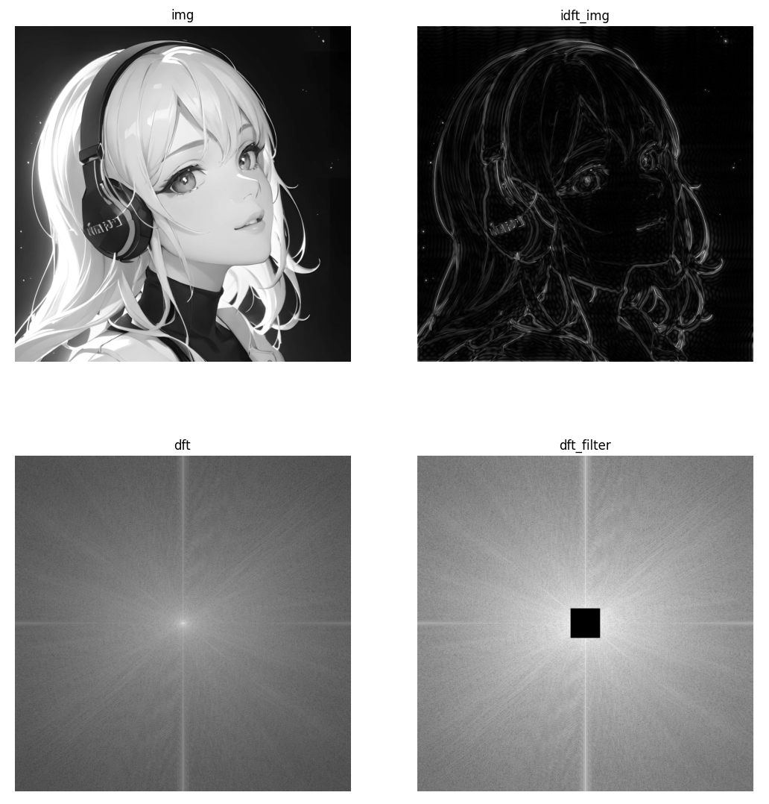
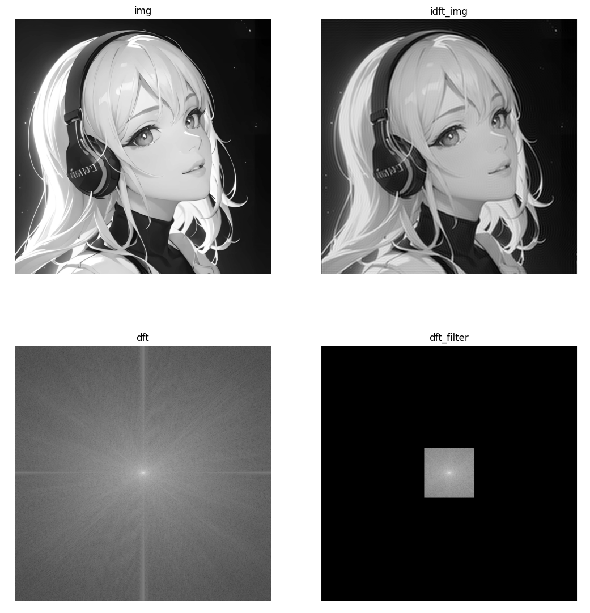

# 1. 理论基础

​		图像处理一般分为**空间域处理**和**频率域处理**。

​		**空间域处理**是**直接对图像内的像素进行处理**。空间域处理主要划分为**灰度变换**和**空间滤波**两种形式。**灰度变换**是对图像内的单个像素进行处理，比如**调节对比度**和**处理阈值**等；**空间滤波**涉及图像质量的改变，例如**图像平滑**、**图像锐化**等。**空间域处理的计算简单方便，运算速度更快。**

​		**频率域处理**是**先将图像变换到频率域**，然后**在频率域对图像进行处理**，最后再通过**反变换将图像从频率域变换到空间域**。 **`傅里叶变换`** 是应用最广泛的一种频域变换，它能够将图像从空间域变换到频率域，而 **`逆傅里叶变换`** 能够将频率域信息变换到空间域内。

​		在图像处理过程中，**傅里叶变换**就是将图像分解为**正弦分量**和**余弦分量**两部分，数字图像经过傅里叶变换后，得到的频域值是复数。**显示傅里叶变换的结果**需要使用**实数图像加虚数图像**的形式，或者**幅度图像加相位图像**的形式。因为**幅度图像包含了原图像中我们所需要的大部分信息**，所以在**图像处理**过程中， **通常`仅使用幅度图像`**。 **如果需要通过逆傅里叶变换恢复到原有的空域图像，就必须同时保留幅度图像和相位图像**。

​		对图像进行傅里叶变换后，我们会得到图像中的 **`低频信息`** 和 **`高频信息`** 。**低频信息**对应图像内**变化缓慢的灰度分量**，**高频信息**对应图像内**变化越来越快的灰度分量**。

​		**傅里叶变换**在图像处理领域发挥着非常**关键**的作用，可以实现**图像增强**、**图像去噪**、**边缘检测**、**特征提取**、**图像压缩和加密**等。

# 2. Numpy实现傅里叶变换

## 2.1 傅里叶变换

### numpy.fft.fft2()

- 通过**函数**`numpy.fft.fft2()`，实现**傅里叶变换**。
- **函数原型**：`complex_ndarray = numpy.fft.fft2( gray_img )`
- **参数说明**：
  - **complex_ndarray**：表示**复数数组**。
  - **gray_img**：表示**灰度图像**。

### numpy.fft.fftshift()

- 通过**函数**`numpy.fft.fftshift()`，实现**傅里叶变换的频谱移动**。
- **函数原型**：`spectrum_shift = numpy.fft.fftshift( spectrum )`
- **参数说明**：
  - **spectrum_shift **：表示**转变后的频谱**。
  - **spectrum**：表示**原始频谱**。

:::note[注意]

​		**对图像进行傅里叶变换后，得到的是一个复数数组**。为了显示方便，**需要将它们的值调整到[0, 255]的灰度空间内**。可以使用`20 * np.log(np.abs(频谱值))`进行范围调整。

:::

## 2.2 逆傅里叶变换

### numpy.fft.ifft2()

- 通过**函数**`numpy.fft.ifft2()`，实现**逆傅里叶变换**。
- **函数原型**：`complex_ndarray_output = numpy.fft.fft2( complex_ndarray_input )`
- **参数说明**：
  - **complex_ndarray_output**：表示**复数数组**。
  - **complex_ndarray_input**：表示**灰度图像**。

- **图像获取**：**逆傅里叶变换**得到的空域信息是**一个复数数组**，可以通过`img = np.abs(spectrum)`将该信息调整至[0, 255]灰度空间内。

### numpy.fft.ifftshift()

- 通过**函数**`numpy.fft.ifftshift()`，实现**傅里叶变换的频谱移动**，和函数`numpy.fft.fftshift()`的操作过程相反。
- **函数原型**：`spectrum_shift = numpy.fft.ifftshift( spectrum )`
- **参数说明**：
  - **spectrum_shift **：表示**转变后的频谱**。
  - **spectrum**：表示**原始频谱**。

:::note[注意]

​		如果在**傅里叶变换过程**中使用了`numpy.fft.fftshift()`函数移动零频率分量，那么在**逆傅里叶变换过程**中，需要先使用`numpy.fft.ifftshift()`函数将零频率分量移到原来的位置，再进行逆傅里叶变换。

:::

## 2.3 示例

```python
import cv2
import numpy as np
import matplotlib.pyplot as plt

img = cv2.imread("person.jpg", 0)

# FFT
spectrum = np.fft.fft2(img)
spectrum_shift = np.fft.fftshift(spectrum)

spectrum_show = 20 * np.log(np.abs(spectrum_shift))

# iFFT
spectrum_ishift = np.fft.ifftshift(spectrum_shift)
spectrum_img = np.fft.ifft2(spectrum_ishift)

fft_img = np.abs(spectrum_img)

plt.subplot(131)
plt.title('img')
plt.imshow(img, cmap='gray')
plt.axis('off')

plt.subplot(132)
plt.imshow(spectrum_show, cmap='gray')
plt.title('result')
plt.axis('off')

plt.subplot(133)
plt.imshow(fft_img, cmap='gray')
plt.title('fft_img')
plt.axis('off')

plt.show()
```



## 2.4 应用

### 高通滤波器：边缘提取

- **允许高频信号通过**的滤波器称为**高通滤波器**。

```python
import cv2
import numpy as np
import matplotlib.pyplot as plt

img = cv2.imread("person.jpg", 0)
center_row, center_col = int(img.shape[0]/2), int(img.shape[1]/2)
delta = 45

# FFT
f = np.fft.fft2(img)
f_shift = np.fft.fftshift(f)
fft = 20 * np.log(np.abs(f_shift))
f_shift[(center_row-delta):(center_row+delta), (center_col-delta):(center_col+delta)] = 1
fft_filter = 20 * np.log(np.abs(f_shift))

# iFFT
f_ishift = np.fft.ifftshift(f_shift)
ifft_img = np.fft.ifft2(f_ishift)

ifft_img = np.abs(ifft_img)

plt.subplot(221), plt.title('img'), plt.axis('off')
plt.imshow(img, cmap='gray')

plt.subplot(222), plt.title('ifft_img'), plt.axis('off')
plt.imshow(ifft_img, cmap='gray')

plt.subplot(223), plt.title('fft'), plt.axis('off')
plt.imshow(fft, cmap='gray')

plt.subplot(224), plt.title('fft_filter'), plt.axis('off')
plt.imshow(fft_filter, cmap='gray')

plt.show()
```



### 低通滤波器：图像模糊

- **允许低频信号通过**的滤波器称为**低通滤波器**。

```python
import cv2
import numpy as np
import matplotlib.pyplot as plt

img = cv2.imread("person.jpg", 0)
row, col = img.shape
center_row, center_col = int(row/2), int(col/2)
delta = 100

# FFT
f = np.fft.fft2(img)
f_shift = np.fft.fftshift(f)
fft = 20 * np.log(np.abs(f_shift))

mask = np.zeros((row, col),np.uint8)
mask[(center_row-delta):(center_row+delta), (center_col-delta):(center_col+delta)] = 1
f_shift = f_shift * mask
f_shift[f_shift==0] = 1
fft_filter = 20 * np.log(np.abs(f_shift))

# iFFT
f_ishift = np.fft.ifftshift(f_shift)
ifft_img = np.fft.ifft2(f_ishift)

ifft_img = np.abs(ifft_img)

plt.subplot(221), plt.title('img'), plt.axis('off')
plt.imshow(img, cmap='gray')

plt.subplot(222), plt.title('ifft_img'), plt.axis('off')
plt.imshow(ifft_img, cmap='gray')

plt.subplot(223), plt.title('fft'), plt.axis('off')
plt.imshow(fft, cmap='gray')

plt.subplot(224), plt.title('fft_filter'), plt.axis('off')
plt.imshow(fft_filter, cmap='gray')

plt.show()
```



# 3. OpenCV实现傅里叶变换

## 3.1 傅里叶变换

### cv2.dft()

- 通过**函数**`cv2.dft()`，实现**傅里叶变换**。
- **函数原型**：`输出数组 = cv2.dft( 原始图像, 转换标识 )`
- **参数说明**：
  - **输出数组**：格式为**复数数组**。
    - 返回的值是双通道的。**第1个通道**是**实数部分**，**第2个通道**是**虚数部分**。
  - **原始图像**：首先使用`np.float32()`函数**将图像转换成np.float32格式**。
  - **转换标识**：通常为**cv2.DFT_COMPLEX_OUTPUT**，用来输出一个**复数数组**。

### cv2.magnitude()

- 通过**函数**`cv2.magnitude()`，计算**频谱信息的幅度**。
- **函数原型**：`返回值 = cv2.magnitude(参数 1，参数 2)`
- **参数说明**：
  - **参数1**：浮点型的**x坐标值**，也就是**实部**。
  - **参数2**：浮点型的**y坐标值**，也就是**虚部**。
  - **返回值**：参数1和参数2平方和的平方根，即 $$ret = \sqrt{(x^2 + y^2)}$$

:::note[注意]

​		**对图像进行傅里叶变换后，得到的是一个复数数组**。为了显示方便，**需要将它们的值调整到[0, 255]的灰度空间内**。可以使用`20 * np.log(幅度值)`进行范围调整。

:::

## 3.2 逆傅里叶变换

### cv2.idft()

- 通过**函数**`cv2.idft()`，实现**逆傅里叶变换**。
- **函数原型**：`返回图像 = cv2.idft( 复数数组 )`
- **图像获取**：**逆傅里叶变换**得到的空域信息是**一个复数数组**，可以通过`img = np.abs(spectrum)`将该信息调整至[0, 255]灰度空间内。

:::note[注意]

​		如果在**傅里叶变换过程**中使用了`numpy.fft.fftshift()`函数移动零频率分量，那么在**逆傅里叶变换过程**中，需要先使用`numpy.fft.ifftshift()`函数将零频率分量移到原来的位置，再进行逆傅里叶变换。

:::

## 3.3 示例

```python
import cv2
import numpy as np
import matplotlib.pyplot as plt

img = cv2.imread("person.jpg", 0)

# DFT
spectrum = cv2.dft(np.float32(img), flags=cv2.DFT_COMPLEX_OUTPUT)
spectrum_shift = np.fft.fftshift(spectrum)

spectrum_magnitude = cv2.magnitude(spectrum_shift[:,:,0], spectrum_shift[:,:,1])
spectrum_show = 20 * np.log(spectrum_magnitude)

# iDFT
spectrum_ishift = np.fft.ifftshift(spectrum_shift)
spectrum_img = cv2.idft(spectrum_ishift)

dft_img = cv2.magnitude(spectrum_img[:,:,0], spectrum_img[:,:,1])

plt.subplot(131)
plt.title('img')
plt.imshow(img, cmap='gray')
plt.axis('off')

plt.subplot(132)
plt.imshow(spectrum_show, cmap='gray')
plt.title('result')
plt.axis('off')

plt.subplot(133)
plt.imshow(dft_img, cmap='gray')
plt.title('dft_img')
plt.axis('off')

plt.show()
```



## 3.4 应用

### 高通滤波器：边缘提取

- **允许高频信号通过**的滤波器称为**高通滤波器**。

```python
import cv2
import numpy as np
import matplotlib.pyplot as plt

img = cv2.imread("person.jpg", 0)
center_row, center_col = int(img.shape[0]/2), int(img.shape[1]/2)
delta = 45

# DFT
f = cv2.dft(np.float32(img), flags=cv2.DFT_COMPLEX_OUTPUT)
f_shift = np.fft.fftshift(f)
fft = 20 * np.log(cv2.magnitude(f_shift[:,:,0], f_shift[:,:,1]))

f_shift[(center_row-delta):(center_row+delta), (center_col-delta):(center_col+delta)] = 1
fft_filter = 20 * np.log(cv2.magnitude(f_shift[:,:,0], f_shift[:,:,1]))

# iDFT
f_ishift = np.fft.ifftshift(f_shift)
ifft_img = cv2.idft(f_ishift)

ifft_img = cv2.magnitude(ifft_img[:,:,0], ifft_img[:,:,1])

plt.subplot(221), plt.title('img'), plt.axis('off')
plt.imshow(img, cmap='gray')

plt.subplot(222), plt.title('idft_img'), plt.axis('off')
plt.imshow(ifft_img, cmap='gray')

plt.subplot(223), plt.title('dft'), plt.axis('off')
plt.imshow(fft, cmap='gray')

plt.subplot(224), plt.title('dft_filter'), plt.axis('off')
plt.imshow(fft_filter, cmap='gray')

plt.show()
```



### 低通滤波器：图像模糊

- **允许低频信号通过**的滤波器称为**低通滤波器**。

```python
import cv2
import numpy as np
import matplotlib.pyplot as plt

img = cv2.imread("person.jpg", 0)
row, col = img.shape
center_row, center_col = int(row/2), int(col/2)
delta = 100

# DFT
f = cv2.dft(np.float32(img), flags=cv2.DFT_COMPLEX_OUTPUT)
f_shift = np.fft.fftshift(f)
fft = 20 * np.log(cv2.magnitude(f_shift[:,:,0], f_shift[:,:,1]))

mask = np.zeros((row, col, 2),np.uint8)
mask[(center_row-delta):(center_row+delta), (center_col-delta):(center_col+delta)] = 1
f_shift = f_shift * mask
f_shift[f_shift==0] = 1
fft_filter = 20 * np.log(cv2.magnitude(f_shift[:,:,0], f_shift[:,:,1]))

# iDFT
f_ishift = np.fft.ifftshift(f_shift)
ifft_img = cv2.idft(f_ishift)

ifft_img = cv2.magnitude(ifft_img[:,:,0], ifft_img[:,:,1])

plt.subplot(221), plt.title('img'), plt.axis('off')
plt.imshow(img, cmap='gray')

plt.subplot(222), plt.title('idft_img'), plt.axis('off')
plt.imshow(ifft_img, cmap='gray')

plt.subplot(223), plt.title('dft'), plt.axis('off')
plt.imshow(fft, cmap='gray')

plt.subplot(224), plt.title('dft_filter'), plt.axis('off')
plt.imshow(fft_filter, cmap='gray')

plt.show()
```

