# 1. 介绍

- **Krita**：一个深受数字艺术家喜爱的绘图工具，拥有**强大的手绘功能**和**细节调整能力**。**Krita**拥有**丰富的笔刷、图层功能和色彩管理能力**，非常适合用来完成高精度的插画或者漫画创作。
- **ComfyUI**：一个灵活的AI图像生成工具，以直观的节点工作流、强大的自定义功能为特色。**ComfyUI**通过AI的生成能力，快速产生高质量的初稿图。
- **Krita-ai-diffusion**：一个插件，通过这个插件，能够**让ComfyUI在Krita里起到作用**。

# 2. 下载

- **Krita**：https://krita.org/zh-cn/download

- **ComfyUI**：从<https://github.com/comfyanonymous/ComfyUI>的GitHub网页中下载**最新版本**
  - **Windows系统**：下载整合包
  - **Linux系统**：使用`git clone`下载程序包
- **Krita-ai-diffusion**：从<https://github.com/Acly/krita-ai-diffusion>的GitHub网页的Release中下载**最新版本**

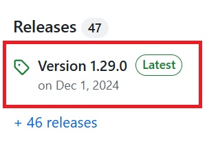

# 3. 安装与配置

## 3.1 Krita

### 安装

​		**便携版**：解压即可使用。

​		**客户端版**：自行安装后即可使用。

### 配置

​		在Krita中，可以通过**设置**-**语言选项**修改界面语言。

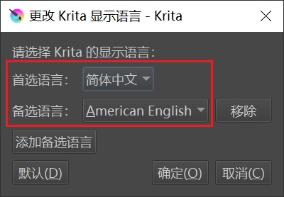

## 3.2 ComfyUI

### 安装

- **Windows系统**：解压整合包。
  - 创建开发环境后，**运行`run_nvidia_gpu.bat`即可打开ComfyUI界面**。
- **Linux系统**：解压程序包。
  - 创建开发环境后，**运行`python main.py --port 8188 --listen 127.0.0.1 --cuda-device 6`即可启动ComfyUI后台**。
  - **通过在浏览器中输入`127.0.0.1:8188`可访问ComfyUI界面**。

### 配置

​		ComfyUI的初始配置主要包括**模型配置**和**节点配置**。

- **模型配置**
  - **SD1.5模型**
    - **基础模型**（如cytusMix、ghostMix等），保存在 **/models/checkpoints** 文件夹中
    - **vae模型**（如animevae、vae-ft-mse-840000-ema-pruned_fp16等），保存在 **/models/vae** 文件夹中
  - **SD3.5模型**
    - **基础模型**（如sd_3.5_large、sd_3.5_medium等），保存在 **/models/checkpoints** 文件夹中
    - **clip模型**（如clip_g.safetensors、clip_l.safetensors、t5xxl_fp8_e4m3fn.safetensors等），保存在 **/models/clip** 文件夹中
  - **FLUX模型**
    - **基础模型**（如flux-dev、flux-schnell等），保存在 **/models/unet** 文件夹中
    - **clip模型**（如clip_l.safetensors、t5xxl_fp8_e4m3fn.safetensors等），保存在 **/models/clip** 文件夹中
    - **vae模型**（如ae等），保存在 **/models/vae** 文件夹中
- **节点配置**
  - **ComfyUI-Manager**：在**custom_nodes**中安装 [**ComfyUI-Manager**](https://github.com/ltdrdata/ComfyUI-Manager) 插件，便于节点查看和管理。

## 3.3 Krita-ai-diffusion

### 安装

​		在Krita中，打开**工具**-**脚本**-**从文件导入python插件**，选择**Krita-ai-diffusion**的压缩包。

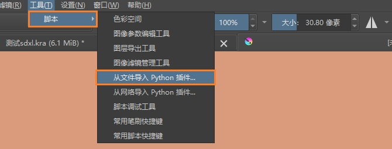

​		安装完成后，打开**设置**-**显示面板**-**AI Image Generation**，即可在界面右下侧打开**AI Image Generation**的窗口。

### 配置

1. 在ComfyUI的后台里，安装[ControlNet preprocessors](https://github.com/Fannovel16/comfyui_controlnet_aux)、[IP-Adapter](https://github.com/cubiq/ComfyUI_IPAdapter_plus)、[Inpaint nodes](https://github.com/Acly/comfyui-inpaint-nodes)、[External tooling nodes](https://github.com/Acly/comfyui-tooling-nodes)四个节点，分别用于：**ControlNet预处理**、**IP-Adapter风格指定**、**局部重绘**、**连接ComfyUI和Krita的功能组件**等。

2. 在ComfyUI的后台里，下载多个**必须的**模型文件：
   - [Clip-Vision](https://hf-mirror.com/h94/IP-Adapter/resolve/main/models/image_encoder/model.safetensors)，保存在`models/clip_vision` 中，并且重命名为`clip-vision_vit-h.safetensors`
   - [NMKD Superscale SP_178000_G](https://hf-mirror.com/gemasai/4x_NMKD-Superscale-SP_178000_G/resolve/main/4x_NMKD-Superscale-SP_178000_G.pth)，保存在`models/upscale_models`中
   - [OmniSR_X2_DIV2K](https://hf-mirror.com/Acly/Omni-SR/resolve/main/OmniSR_X2_DIV2K.safetensors)，保存在`models/upscale_models`中
   - [OmniSR_X3_DIV2K](https://hf-mirror.com/Acly/Omni-SR/resolve/main/OmniSR_X3_DIV2K.safetensors)，保存在`models/upscale_models`中
   - [OmniSR_X4_DIV2K](https://hf-mirror.com/Acly/Omni-SR/resolve/main/OmniSR_X4_DIV2K.safetensors)，保存在`models/upscale_models`中
   - [MAT_Places512_G_fp16](https://hf-mirror.com/Acly/MAT/resolve/main/MAT_Places512_G_fp16.safetensors)，保存在`models/inpaint`中
   
3. 在ComfyUI的后台里，下载多个**必须的**模型文件，适用于SD1.5模型：
   - [ControlNet inpaint](https://hf-mirror.com/comfyanonymous/ControlNet-v1-1_fp16_safetensors/resolve/main/control_v11p_sd15_inpaint_fp16.safetensors)，保存在`models/controlnet`中
   - [ControlNet tile](https://hf-mirror.com/comfyanonymous/ControlNet-v1-1_fp16_safetensors/resolve/main/control_lora_rank128_v11f1e_sd15_tile_fp16.safetensors)，保存在`models/controlnet`中
   - [IP-Adapter (SD1.5)](https://hf-mirror.com/h94/IP-Adapter/resolve/main/models/ip-adapter_sd15.safetensors)，保存在`models/ipadapter`中
   - [Hyper-SD-LoRA (SD1.5)](https://hf-mirror.com/ByteDance/Hyper-SD/resolve/main/Hyper-SD15-8steps-CFG-lora.safetensors)，保存在`models/loras/`中
   
4. 在ComfyUI的后台里，下载多个**必须的**模型文件，适用于SDXL模型：
   - [ControlNet inpaint](https://hf-mirror.com/lllyasviel/fooocus_inpaint/resolve/main/fooocus_inpaint_head.pth)，保存在`models/inpaint`中
   - [ControlNet inpaint](https://hf-mirror.com/lllyasviel/fooocus_inpaint/resolve/main/inpaint_v26.fooocus.patch)，保存在`models/inpaint`中
   - [IP-Adapter (SDXL)](https://hf-mirror.com/h94/IP-Adapter/resolve/main/sdxl_models/ip-adapter_sdxl_vit-h.safetensors)，保存在`models/ipadapter`中
   - [Hyper-SD-LoRA (SDXL)](https://hf-mirror.com/ByteDance/Hyper-SD/resolve/main/Hyper-SDXL-8steps-CFG-lora.safetensors)，保存在`models/loras/`中
   
5. 在ComfyUI的后台里，下载**基础大模型**文件，如[Realistic Vision](https://hf-mirror.com/lllyasviel/fav_models/resolve/main/fav/realisticVisionV51_v51VAE.safetensors)等，保存在`models/checkpoints`中。

6. 如有其他问题，可参见：https://github.com/Acly/krita-ai-diffusion/wiki/ComfyUI-Setup。

7. **启动ComfyUI**。

8. **启动Krita**。

9. 在Krita中，新建图像，**宽高**可自行设置，比如 **768 * 1024** 。

   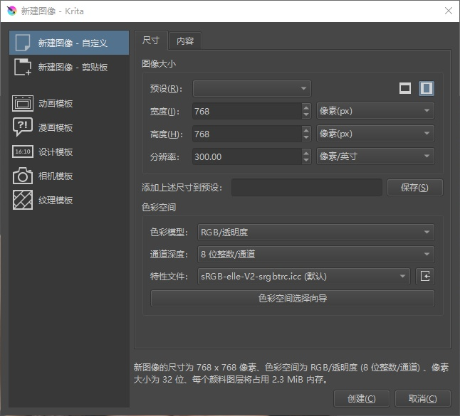

10. 在绘图页面的右下角找到**AI Image Generation**，进行**配置**。

    

11. 选择**接口**选项，进行**语言切换**。将语言设置为**简体中文**后，重启Krita以生效。

    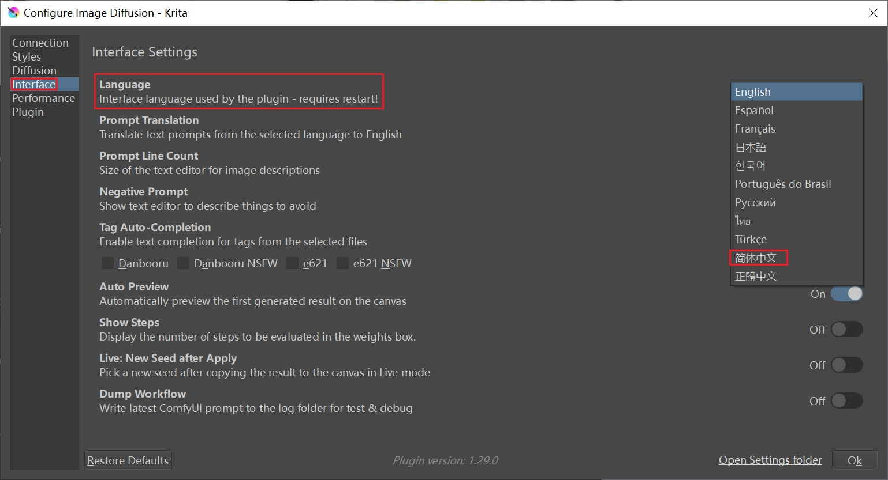

12. 选择**连接**选项，选择**自定义服务器**，然后**在服务器网址里填写ComfyUI的后台地址**，连接即可。如果在连接中出现错误，可参考第6步，自行纠错处理。

13. 选择**风格**选项，在页面中修改**大模型**、**vae模型**、**LoRA模型**、**提示词**、**采样器**、**采样器步数**、**CFG强度**等信息。

    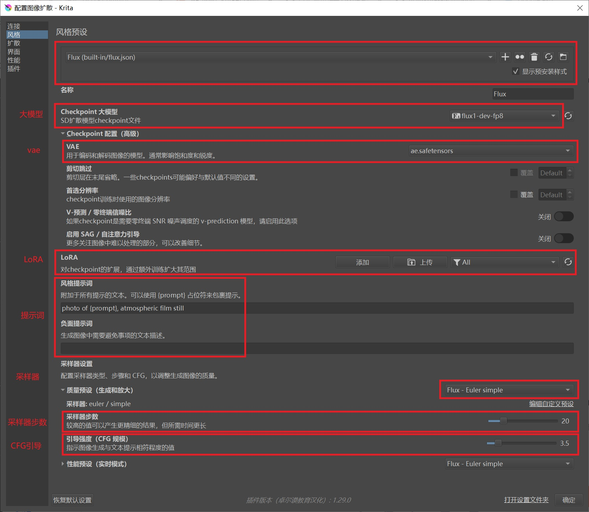

14. 返回绘图界面，可在**预设方案**里调整AI大模型方案，在**提示词**里填写提示词内容，然后点击**生成**，**生成的图会在下方列出**。

    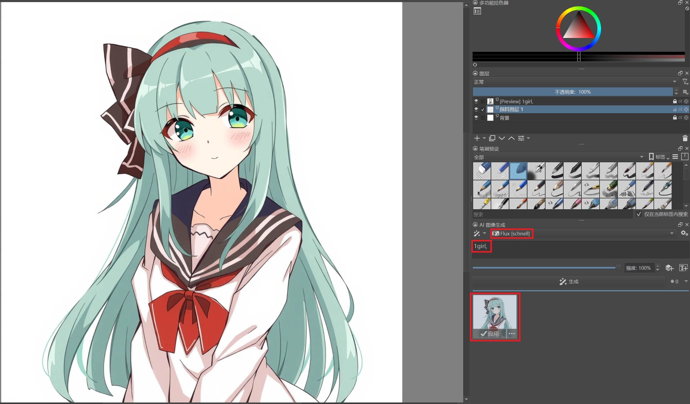

# 4. Krita支持的AI绘图功能

​		Krita的AI绘画，支持5个常用功能：**生成**、**放大**、**实时**、**动画**、**节点**。

## 4.1 生成

​		**生成**模式下有两种方案，一个是**生成图像**，一个是**优化图像**，前者针对**背景**而言，会**生成一张AI图像**，后者针对**选区**而言，**进行选区图像内的处理**。

​		可以通过**扩散**的选项，修改选区的**扩展范围**，**羽化强度**和**填充范围**。

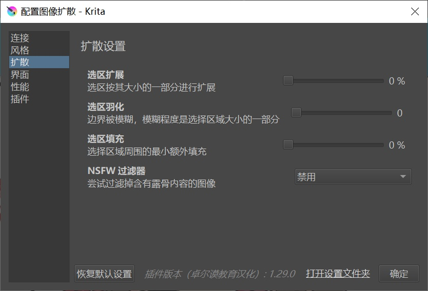

## 4.2 放大

​		**放大**模式下，可以对原图进行放大。可以自行选择**放大模型**、**放大倍数**、是否再作**图像优化**等。

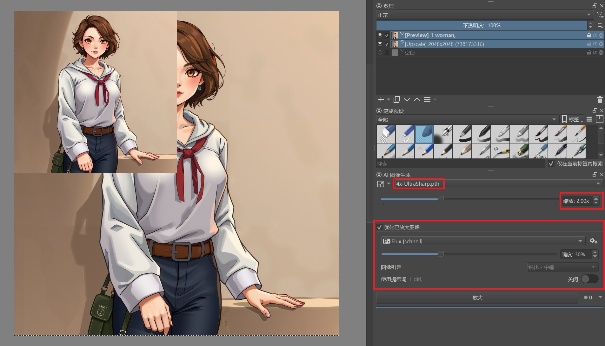

## 4.3 节点

​		Krita可以通过**节点模式**，和ComfyUI工作流**在线交互**。

### 平台交互

- 通过**导入**的方式，导入本地工作流。
- 通过**在线交互**的方式，在线编辑工作流。

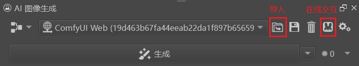

### 输出图像交互

​		在ComfyUI中加载**Krita Output节点**，将其**接入图像输出的接口**（如VAE解码），即可将ComfyUI的**输出图像**，输出至**Krita的画布**中。

### 输入参数交互

​		在ComfyUI中加载**Parameter节点**，将其相应参数接口上，即可将ComfyUI的**输入参数**，对接至**Krita的参数**中。然后**可以在Parameter节点中，修改参数的名称、类型及上下限**。一旦**Parameter节点**和ComfyUI的参数相连接，该参数就将显示在**Krita界面**中，**参数名称**即为**Parameter节点**设定的**名称**。

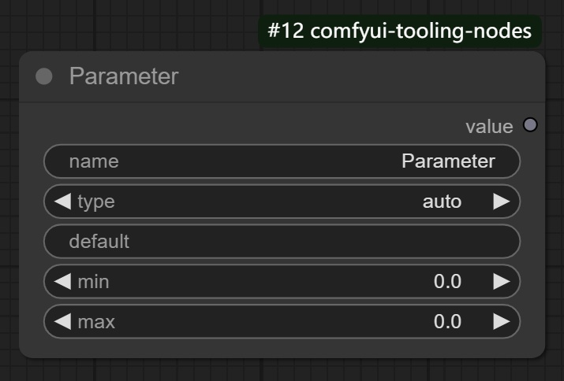

### 输入图像交互

​		在ComfyUI中加载**Krita Canvas节点**，它有4个输出接口，分别对应Krita界面的**画布图像**、**画布宽度**、**画布高度**、**绘图种子**，将其按需**接入ComfyUI的工作流接口**，即可在Krita界面控制ComfyUI工作流的参数。

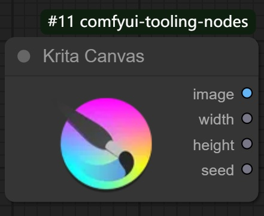

### 参考图和参考蒙版

​		在ComfyUI中加载**Image Layer节点**和**Mask Layer节点**，连接至ComfyUI的相关接口后，即可将**Krita的图层图像**用于**参考图**或**参考蒙版**。

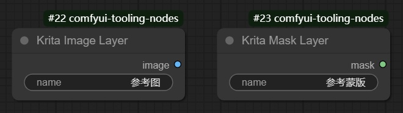

### 实例：文生图

- **ComfyUI工作流**

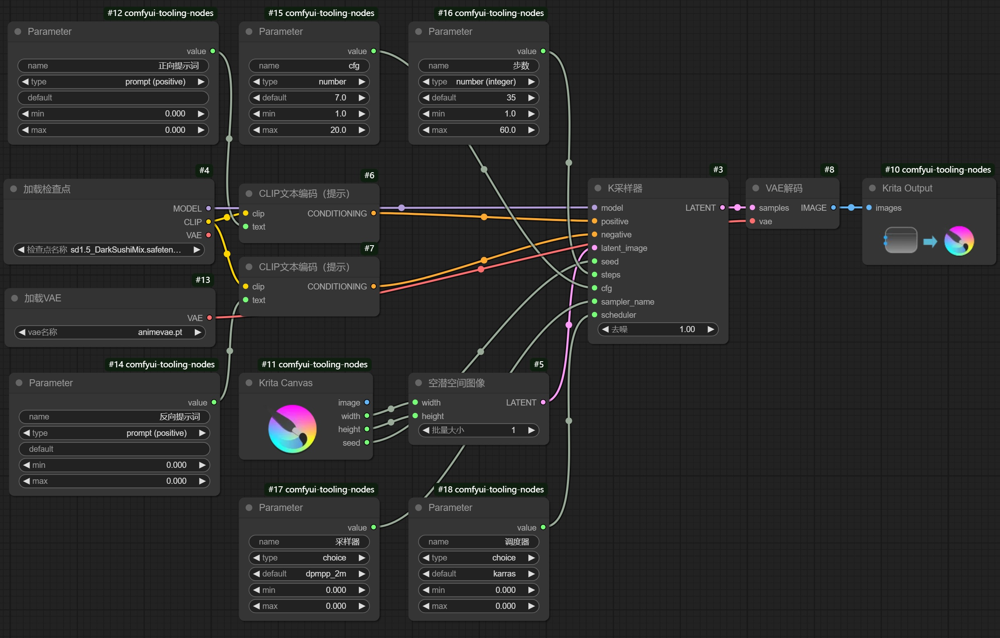

- **Krita绘图**

### 实例：图生图

- **ComfyUI工作流**

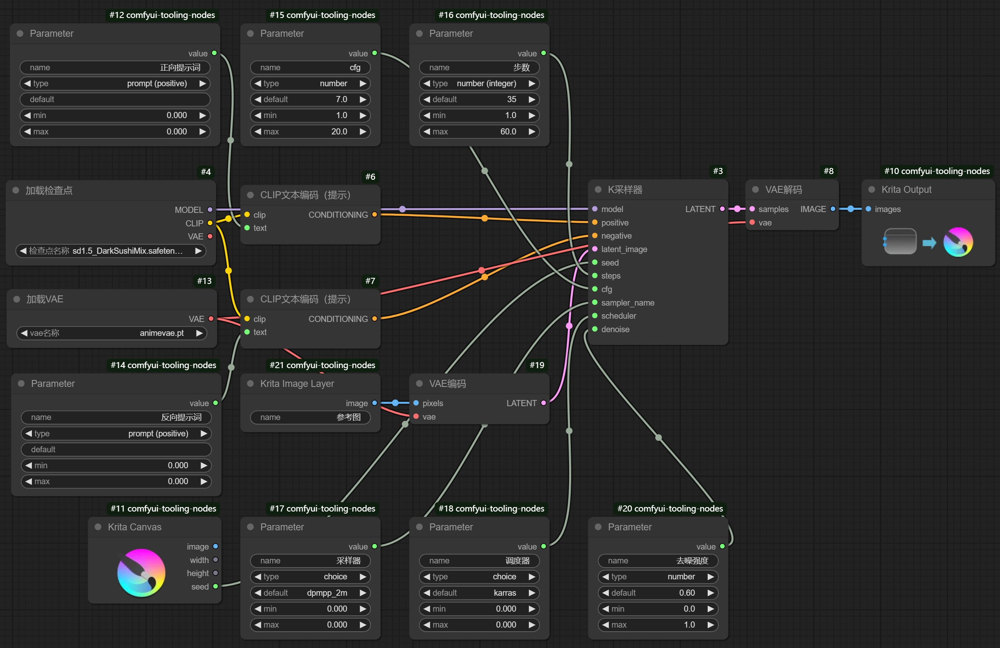

- **Krita绘图**

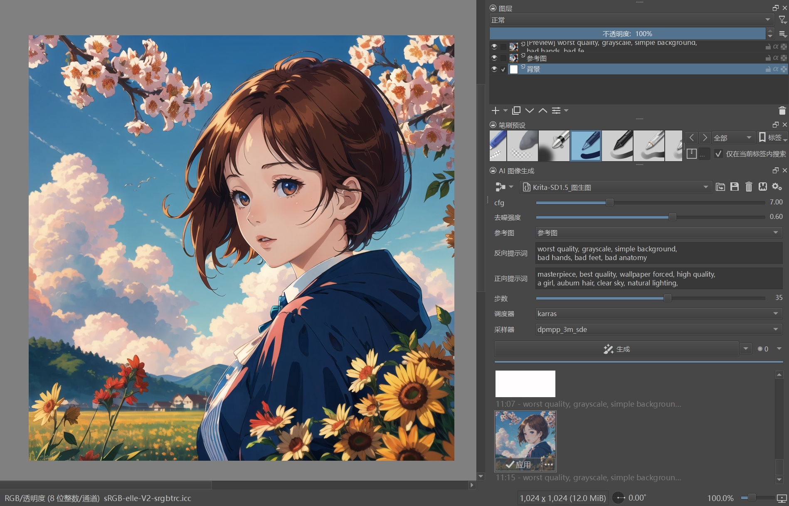

## 4.4 IP Adapter和ControlNet

​		在**生图**模式下，Krita可以对**选定图层**作**IP Adapter处理**和**ControlNet处理**，进而在此基础上进行图像重绘。

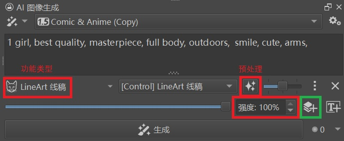

### 功能支持

​		**IP Adapter**和**ControlNet**支持的功能有：

​		**不同模型**对功能的**支持度**不尽相同，详见下表：【🟢表示**支持**，⚪表示**支持**，但不常用，❌表示**不支持**】

|      功能类型      | SD 1.5 | SDXL | SD 3.5 | FLUX |
| :----------------: | :----: | :--: | :----: | :--: |
| IP Adapter综合参考 |   🟢    |  🟢   |   ❌    |  🟢   |
| IP Adapter风格参考 |   ⚪    |  ⚪   |   ❌    |  ❌   |
| IP Adapter构图参考 |   ⚪    |  ⚪   |   ❌    |  ❌   |
|    FaceID 面部     |   🟢    |  🟢   |   ❌    |  ❌   |
|   Scribble 涂鸦    |   🟢    |  🟢   |   ❌    |  ❌   |
|    LineArt 线稿    |   🟢    |  🟢   |   ❌    |  🟢   |
|  SoftEdge 软边缘   |   🟢    |  🟢   |   ❌    |  🟢   |
|    Canny 硬边缘    |   🟢    |  🟢   |   ❌    |  🟢   |
|     Depth 深度     |   🟢    |  🟢   |   ❌    |  🟢   |
|    Normal 法线     |   ⚪    |  ❌   |   ❌    |  ❌   |
|     Pose 姿势      |   🟢    |  🟢   |   ❌    |  ❌   |
|  Segment 语义分割  |   ⚪    |  ⚪   |   ❌    |  ❌   |
|   Tile 分块锐化    |   ⚪    |  ⚪   |   ❌    |  ⚪   |
|   Stencil 二维码   |   ⚪    |  ⚪   |   ❌    |  ❌   |
|     Hands 手部     |   ⚪    |  ⚪   |   ❌    |  ❌   |

### 示例：线稿控制

|                 原始图                  |            线稿图（LineArt）            |                 生成图                  |
| :-------------------------------------: | :-------------------------------------: | :-------------------------------------: |
|  |  |  |

### 预处理器模型的下载链接

- [yzd-v/DWPose/yolox_l.onnx](https://hf-mirror.com/yzd-v/DWPose/resolve/main/yolox_l.onnx)

- [yzd-v/DWPose/dw-ll_ucoco_384.onnx](https://hf-mirror.com/yzd-v/DWPose/resolve/main/dw-ll_ucoco_384.onnx)

- [lllyasviel/Annotators/150_16_swin_l_oneformer_coco_100ep.pth](https://hf-mirror.com/lllyasviel/Annotators/resolve/main/150_16_swin_l_oneformer_coco_100ep.pth)

- [lllyasviel/Annotators/sk_model.pth](https://hf-mirror.com/lllyasviel/Annotators/resolve/main/sk_model.pth)

- [lllyasviel/Annotators/sk_model2.pth](https://hf-mirror.com/lllyasviel/Annotators/resolve/main/sk_model2.pth)

- [lllyasviel/Annotators/scannet.pt](https://hf-mirror.com/lllyasviel/Annotators/resolve/main/scannet.pt)

- [lllyasviel/Annotators/table5_pidinet.pth](https://hf-mirror.com/lllyasviel/Annotators/resolve/main/table5_pidinet.pth)

- [TheMistoAI/MistoLine/Anyline/MTEED.pth](https://hf-mirror.com/TheMistoAI/MistoLine/resolve/main/Anyline/MTEED.pth)

- [depth-anything/Depth-Anything-V2-Base/depth_anything_v2_vitb.pth](https://hf-mirror.com/depth-anything/Depth-Anything-V2-Base/resolve/main/depth_anything_v2_vitb.pth)
