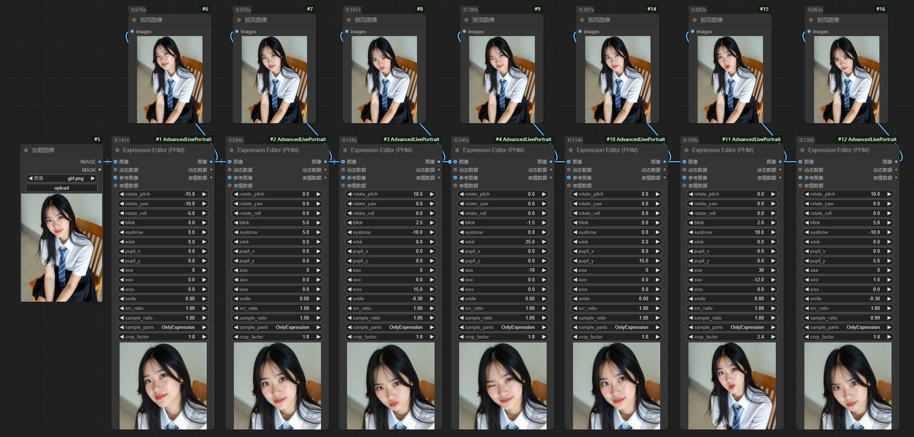
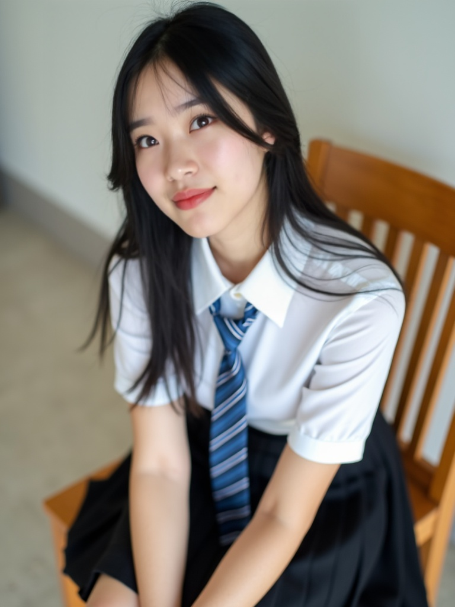
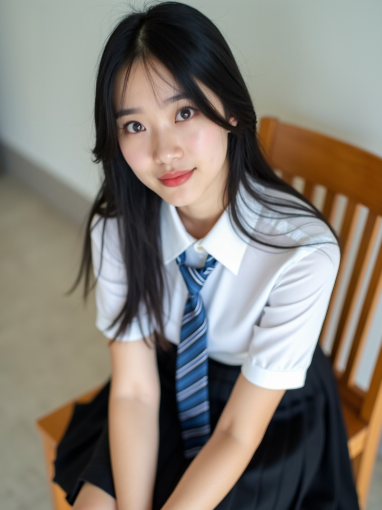
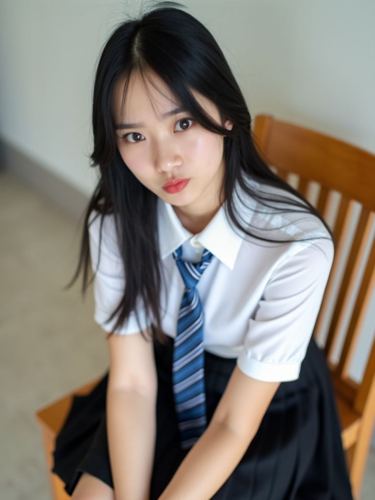
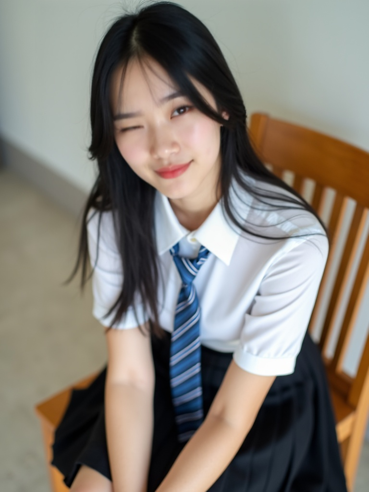
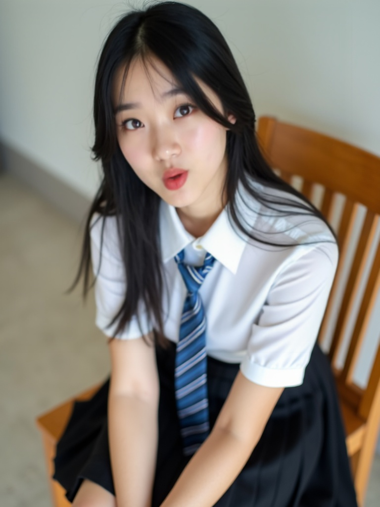

# 1. 安装插件

```bash
cd custom_nodes
git clone https://github.com/PowerHouseMan/ComfyUI-AdvancedLivePortrait.git
cd ComfyUI-AdvancedLivePortrait
pip install -r requirements.txt
```

# 2. 下载模型

- 方案一：将**nodes.py**文件中的**huggingface.co**替换为**hf-mirror.com**，以便自动下载模型

- 方案二：**手动下载模型**
  - 新建文件夹：**models/liveportrait**
  - 下载模型：[appearance_feature_extractor.safetensors](https://hf-mirror.com/Kijai/LivePortrait_safetensors/resolve/main/appearance_feature_extractor.safetensors)，保存至：models/liveportrait
  - 下载模型：[motion_extractor.safetensors](https://hf-mirror.com/Kijai/LivePortrait_safetensors/resolve/main/motion_extractor.safetensors)，保存至：models/liveportrait
  - 下载模型：[warping_module.safetensors](https://hf-mirror.com/Kijai/LivePortrait_safetensors/resolve/main/warping_module.safetensors)，保存至：models/liveportrait
  - 下载模型：[spade_generator.safetensors](https://hf-mirror.com/Kijai/LivePortrait_safetensors/resolve/main/spade_generator.safetensors)，保存至：models/liveportrait
  - 下载模型：[stitching_retargeting_module.safetensors](https://hf-mirror.com/Kijai/LivePortrait_safetensors/resolve/main/stitching_retargeting_module.safetensors)，保存至：models/liveportrait
  - 下载模型：[face_yolov8n.pt](https://hf-mirror.com/Bingsu/adetailer/resolve/main/face_yolov8n.pt)，保存至：models/ultralytics

# 3. 工作流



# 4. 使用方法

-  **`rotate_pitch`** 、 **`rotate_pitch`** 、 **`rotate_pitch`** ：头部姿态
-  **`blink`** ：眨眼
-  **`eyebrow`** ：眉毛高度
-  **`wink`** ：眨一只眼
-  **`pupil_x`** 、 **`pupil_y`** ：瞳仁位置
-  **`aaa`** 、 **`eee`** 、 **`woo`** ：口型
-  **`smile`** ：微笑程度

# 5. 示例图

|       参考图        |      生成图      |
| :-----------------: | :--------------: |
|  |  |

|      生成图      |      生成图      |      生成图      |
| :--------------: | :--------------: | :--------------: |
|  |  |  |
|  |  |  |

