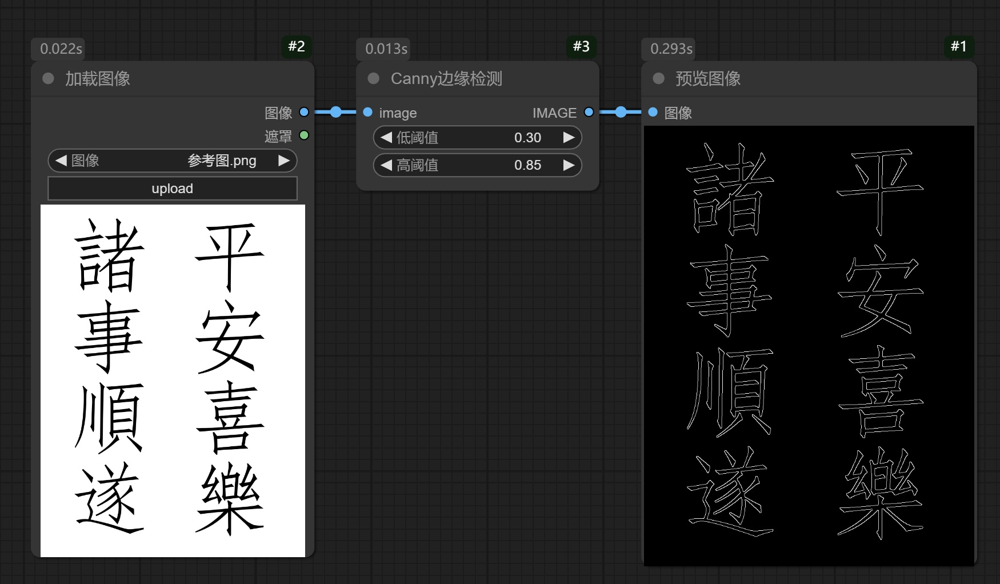
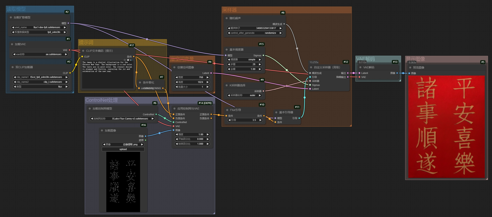
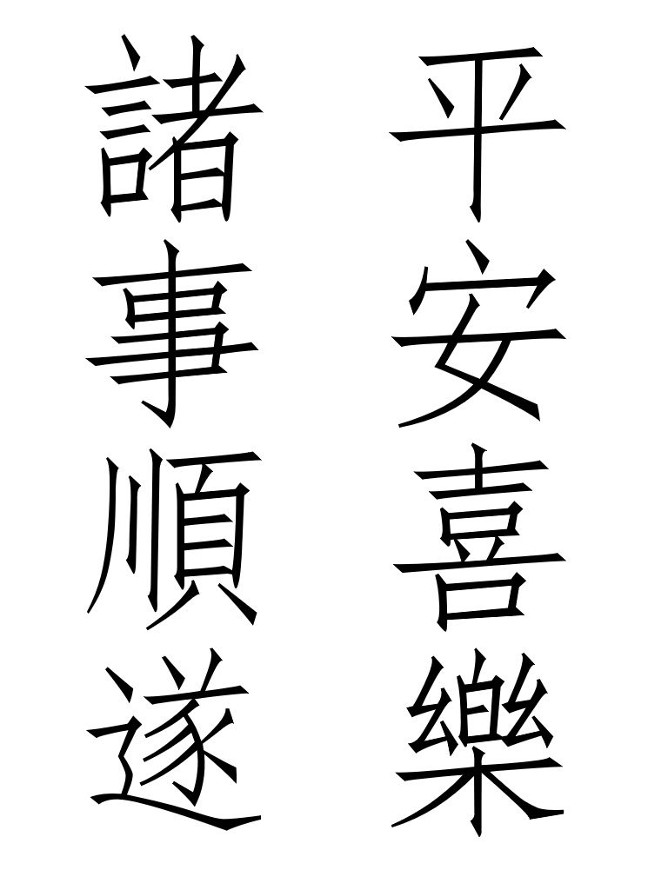
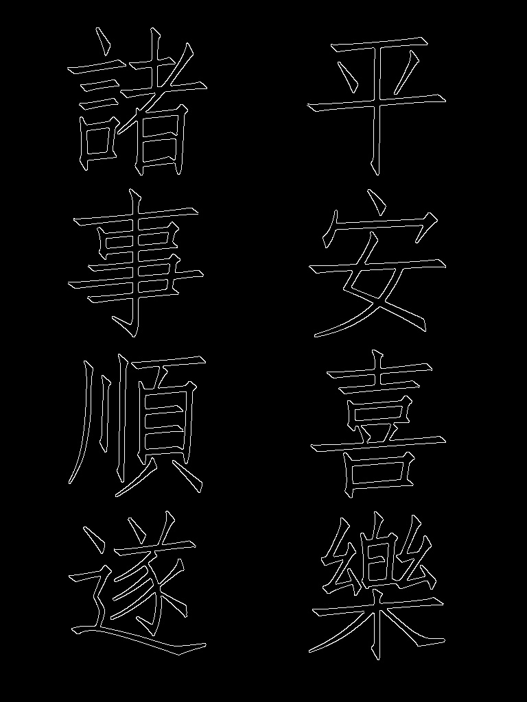

# 1. 说明

​		尽管目前的提示词解析能力已经得到大幅提升，但是**在词句量变大后，依然不可避免会产生错误**，比如**字符书写错误**、**字符排序错误**等。因此：

- 在**只需要书写少量词汇**的场合，可以**直接在提示词中告诉AI书写相关内容**（配合相应的clip解析器）
- 在**需要书写小语种字符、需要书写大量词句内容**时，建议**在第三方平台书写字符，存为图像**，然后**使用ControlNet组件的Canny、Depth、Scribble等功能进行画图书写**。

# 2. 边缘提取

​		利用**ControlNet预处理器**的**边缘检测**功能，**提取图像中的文字边缘**。

## 2.1 工作流

## 2.2 预处理器效果参考

# 3. ControlNet组件

## 3.1 工作流

## 3.2 提示词

​		`The image is a digital illustration for the Chinese New Year. The background is a red color. The texts are in gold color. The overall design is elegant and festive, conveying the joy and celebration of the new year.`

## 3.3 生成图

|        参考图         |        边缘提取图         |        生成图         |
| :-------------------: | :-----------------------: | :-------------------: |
|  |  |  |