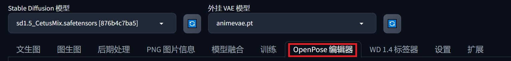
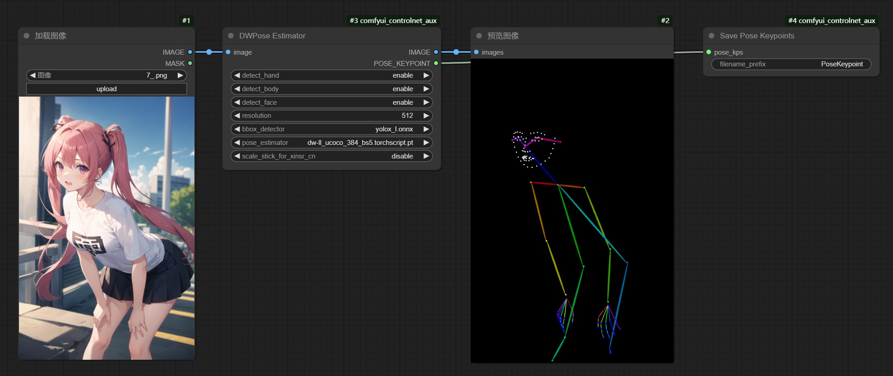
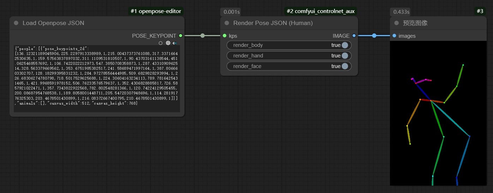
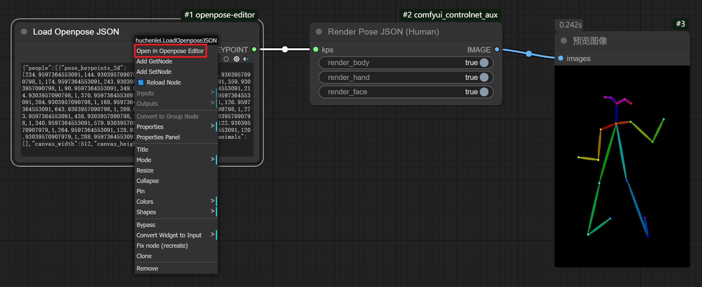
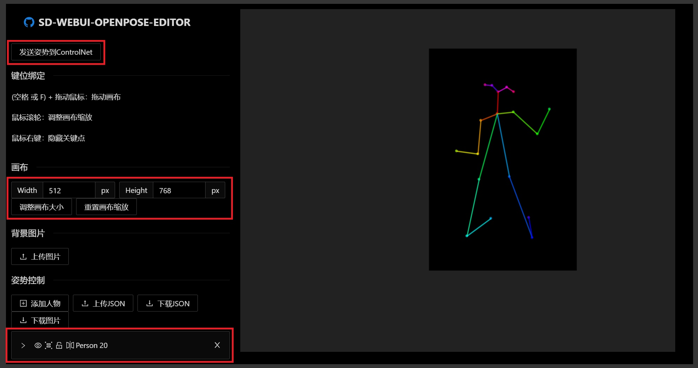

# 1. 姿势图调整

​		对于**openpose姿势图**（**图像**+**JSON文件**），可以使用**姿势编辑**的插件，**对姿势图进行调整**。

# 2. WebUI

​		可以使用[WebUI插件](https://github.com/fkunn1326/openpose-editor)进行姿态调整。

## 2.1 依赖环境安装

```bash
# 安装：tb-nightly（清华源没有这个库，需要从阿里源下载）
python -m pip install tb-nightly -i https://mirrors.aliyun.com/pypi/simple

# 安装：basicsr
pip install basicsr
```

## 2.2 插件安装

Step 1. 启动WebUI，打开**扩展**标签页。

Step 2. 点击**从网址安装**（**Install from URL**）。

Step 3. 在**扩展的git仓库网址**（**URL for extension's git repository**）处输入：<https://github.com/fkunn1326/openpose-editor.git>。

Step 4. 点击**安装**（**Install**）。

Step 5. **重启WebUI**，自动安装环境依赖。

## 2.3 插件使用

​		打开WebUI，选择**OpenPose编辑器**标签。



## 2.4 功能说明


- 自定义修改**图像尺寸**：**宽度**、**高度**
- 自定义修改**人物姿态**
- 可以按需添加**人物数量**：**添加**按钮
- 可以**直接读取JSON文件**
- 可以**从图像中提取骨骼节点图**
- 可以**将修改后的骨骼图保存为图像或JSON格式**
- 可以**将修改后的骨骼图发送至文生图或图生图**——需要将**预处理器**设为**None**

## ※ BUG处理

### 1. 无法安装basicsr，提示缺少tb-nightly。

​		先通过**阿里源**安装**tb-nightly**，再安装**basicsr**。

### 2. 在webui-forge环境下，报错：ModuleNotFoundError: No module named 'torchvision.transforms.functional_tensor'。

​		**basicsr**在调用**data/degradation.py**的库时，`from torchvision.transforms.functional_tensor import rgb_to_grayscale`已经不能正常运行，需要修改为`from torchvision.transforms._functional_tensor import rgb_to_grayscale`：**functional_tensor前增加一个下划线**。

### 3. 在webui-forge环境下，报错：ValueError: Invalid value for parameter 'type': bytes. Please choose from one of: ['filepath', 'binary']。

​		**openpose-editor**在运行**script/main.py**的代码时，由于**gradio**的大版本更新，`png_input = gr.UploadButton(label="Detect from Image", file_types=["image"], type="bytes", elem_id="openpose_detect_button")`的**type参数**已经不支持**bytes**了，需要修改为**binary**。

### 4. 下载模型太慢了，怎么提前准备模型？

​		可以提前下载下面的模型至`stable-diffusion/models/openpose`文件夹中（需要自行创建）：

- [**body_pose_model.pth**](https://hf-mirror.com/lllyasviel/Annotators/resolve/main/body_pose_model.pth)
- [**hand_pose_model.pth**](https://hf-mirror.com/lllyasviel/Annotators/resolve/main/hand_pose_model.pth)
- [**facenet.pth**](https://hf-mirror.com/lllyasviel/Annotators/resolve/main/facenet.pth)

# 3. ComfyUI

## 3.1 插件安装

```bash
cd ComfyUI/custom_nodes
git clone https://github.com/huchenlei/ComfyUI-openpose-editor.git
```

## 3.2 工作流：生成姿态图



## 3.3 工作流：修改姿态图

### 加载工作流



### 选择Open in Openpose Editor

- 右击 **`Load Openpose JSON`** ，选择 **`Open in Openpose Editor`**



### 调整人物姿态

- 可以**手动**调整**画布大小**
- 可以**手动**添加**手部信息**和**脸部信息**，默认**不自动添加**。
- 可以**上传JSON文件**、**下载JSON文件**
- 可以**上传背景图像**、**下载姿态图像**

