# 1. 介绍

​		[**FluxTools**](https://blackforestlabs.ai/tools-home)是由**黑森林团队**发布的AI绘画工具集，包含多个功能强大的模型和工具，旨在提升AI绘画的效率和效果。

​		**FluxTools**主要包括以下几个功能：

- **Canny**：**线稿控制**，生成线稿效果。
- **Depth**：**深度控制**，用于控制图像的深度信息。
- **Fill**：实现**局部重绘**和**扩图**功能，可以在给定文本描述和蒙版的情况下编辑和扩展图像。
- **Redux**：**图像变体和混合**，通过文本提示词生成全新的图像变体。
  - 需要**安装插件**才能更好地发挥效果。

# 2. Canny

## 2.1 模型下载与存放

- **模型下载**：[**flux1-canny-dev.safetensors**](https://modelscope.cn/models/AI-ModelScope/FLUX.1-Canny-dev)
- **模型存放**：`ComfyUI\models\unet`

## 2.2 工作流

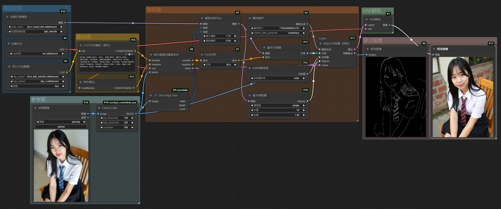

## 2.3 提示词

​		`Asian young girl, solo, long hair, white skin, daylight, outdoor, photography, realistic style,\nlooking at viewer, black hair, sitting, closed mouth, short sleeves, blurry, black eyes, lips, dark red necktie, nose, wooden chair,`

## 2.4 效果图

|        原图         |        Canny图        |            效果图            |
| :-----------------: | :-------------------: | :--------------------------: |
|  | 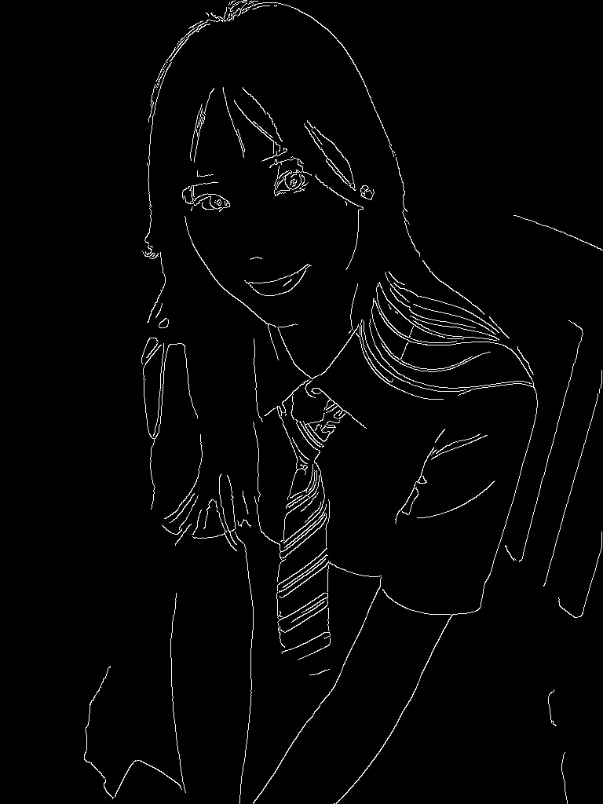 |  |

# 3. Depth

## 3.1 模型下载与存放

- **模型下载**：[**flux1-depth-dev.safetensors**](https://modelscope.cn/models/AI-ModelScope/FLUX.1-Depth-dev)
- **模型存放**：`ComfyUI\models\unet`

## 3.2 工作流

## 3.3 提示词

​		`Asian young girl, solo, long hair, white skin, outdoor, photography, realistic style,\nlooking at viewer, black hair, sitting, closed mouth, short sleeves, black eyes, lips, red striped necktie, nose, wooden chair,`

## 3.4 效果图

|        原图         |        深度图        |            效果图            |
| :-----------------: | :------------------: | :--------------------------: |
|  |  |  |

# 4. Fill

## 4.1 模型下载与存放

- **模型下载**：[**flux1-fill-dev.safetensors**](https://modelscope.cn/models/AI-ModelScope/FLUX.1-Fill-dev)
- **模型存放**：`ComfyUI\models\unet`

## 4.2 inpaint（局部重绘）

### 4.2.1 工作流

### 4.2.2 提示词

​		`light pink down jacket,`

### 4.2.3 效果图

|        原图         |           局部重绘蒙版           |                效果图                |
| :-----------------: | :------------------------------: | :----------------------------------: |
|  |  |  |

## 4.3 outpaint（扩图）

### 4.3.1 工作流

### 4.3.2 提示词

​		推荐使用**提示词反推**获取提示词。

### 4.3.3 效果图

|        原图         |           区域扩展蒙版           |              效果图              |
| :-----------------: | :------------------------------: | :------------------------------: |
|  |  |  |

# 5. Redux

## 5.1 模型下载与存放

- **基础模型**：**flux1系列**的基础模型，存放在**unet**文件夹：`ComfyUI\models\unet`
- **风格模型**：[**flux1-redux-dev.safetensors**](https://modelscope.cn/models/AI-ModelScope/FLUX.1-Redux-dev)，存放在**style_models**文件夹：`ComfyUI\models\style_models`
- **CLIP模型**：[**sigclip_vision_patch14_384.safetensors**](https://hf-mirror.com/Comfy-Org/sigclip_vision_384/resolve/main/sigclip_vision_patch14_384.safetensors)，存放在**clip_vision**文件夹：`ComfyUI\models\clip_vision`

## 5.2 插件安装

- **插件**：[AdvancedReduxControl](https://github.com/kaibioinfo/ComfyUI_AdvancedRefluxControl)

## 5.3 元素参考：单元素

### 5.3.1 工作流

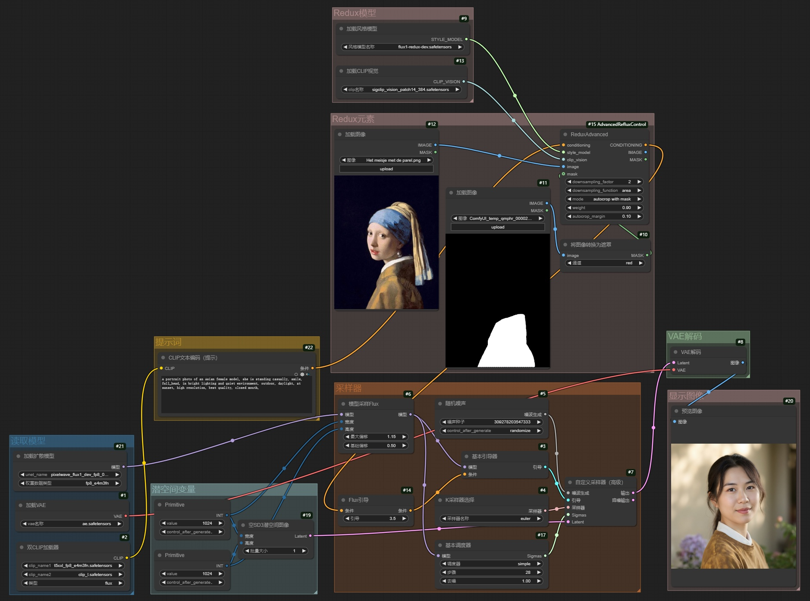

### 5.3.2 参考图和效果图

|           参考元素            |                 效果图                  |
| :---------------------------: | :-------------------------------------: |
|  |  |

## 5.4 元素参考：多元素

### 5.4.1 工作流

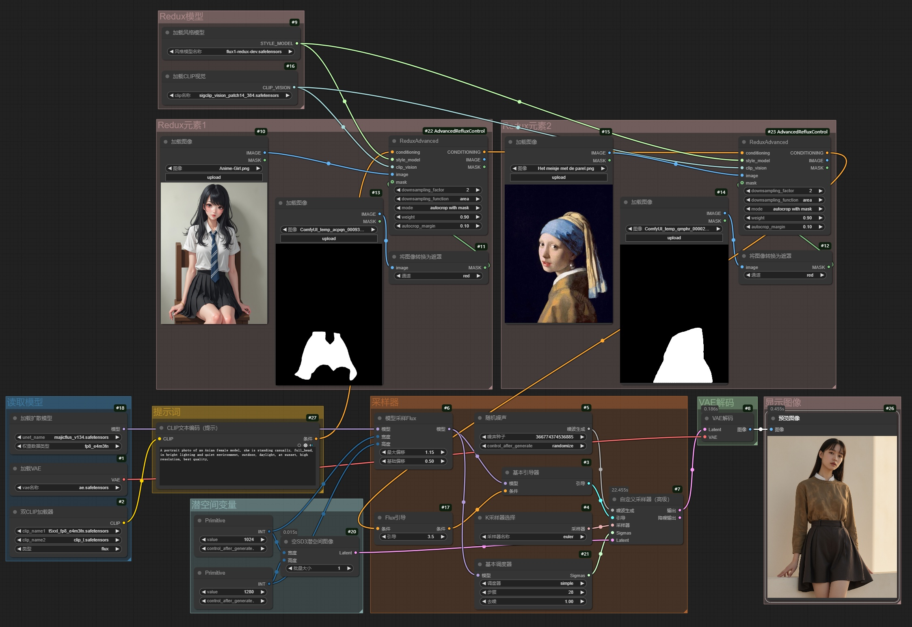

### 5.4.2 参考图和效果图

|          参考元素-1           |          参考元素-2           |                 效果图                  |
| :---------------------------: | :---------------------------: | :-------------------------------------: |
|  | 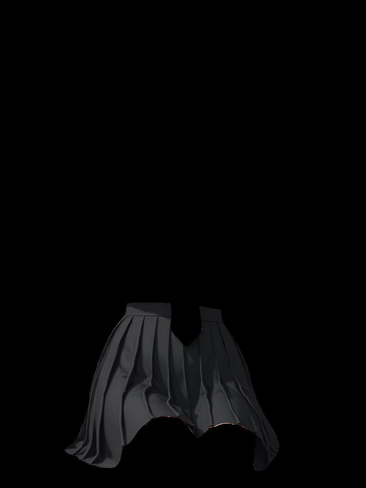 |  |

## 5.5 背景参考

### 5.5.1 工作流

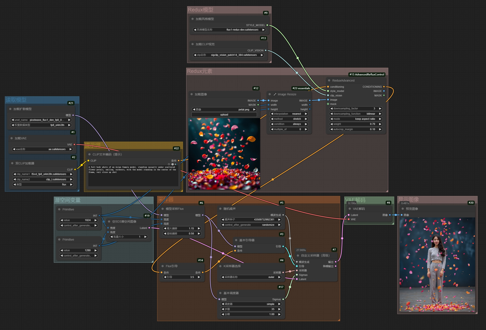

### 5.5.2 参考图和效果图

|           参考图            |                效果图                 |
| :-------------------------: | :-----------------------------------: |
|  |  |

## 5.6 元素参考 + 背景参考

### 5.6.1 工作流

### 5.6.2 参考图和效果图

|          参考元素-1           |          参考元素-2           |           参考背景            |
| :---------------------------: | :---------------------------: | :---------------------------: |
|  |  |  |

|                      效果图                      |                      效果图                      |                      效果图                      |
| :----------------------------------------------: | :----------------------------------------------: | :----------------------------------------------: |
|  |  |  |

# 6. Canny + Redux = 线稿上色

​		利用**FluxTools**的**Canny模型**和**Redux模型**，可以实现**线稿上色**功能。

## 6.1 工作流

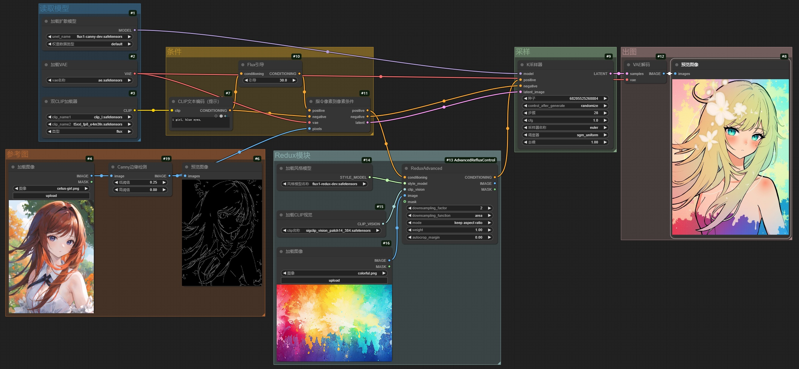

## 6.2 效果图

|          人物参考图           |           Canny图           |           风格参考图            |               生成图               |
| :---------------------------: | :-------------------------: | :-----------------------------: | :--------------------------------: |
|  |  |  |  |

## 6.3 使用经验

- 可以在**提示词**里**填写一些内容**，以**约束画面内容**，也可以**什么都不填**，让**AI自行融合**。
- **downsampling_factor参数**，可选为1-9，表述**风格参考图的权重**，**1代表最强，9代表最弱**，**酌情调整参考强度**。
- 也可以将**预处理器**改用**Lineart**，使用**线稿图**作为**参考底图**。

# 7. Depth + Redux = 画风迁移

​		利用**FluxTools**的**Depth模型**和**Redux模型**，可以实现**画风迁移**功能。

## 7.1 工作流

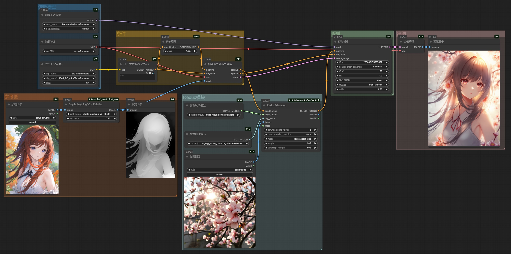

## 7.2 效果图

|          人物参考图           |           Depth图           |           风格参考图            |               生成图               |
| :---------------------------: | :-------------------------: | :-----------------------------: | :--------------------------------: |
|  |  |  |  |

## 7.3 使用经验

- 可以在**提示词**里**填写一些内容**，以**约束画面内容**；也可以**什么都不填**，让**AI自行融合**。
- **downsampling_factor参数**，可选为1-9，表述**风格参考图的权重**，**1代表最强，9代表最弱**，**酌情调整参考强度**。

# 8. Fill + Redux = 万物迁移

​		利用**FluxTools**的**Fill模型**和**Redux模型**，可以实现**万物迁移**功能。

## 8.1 工作流

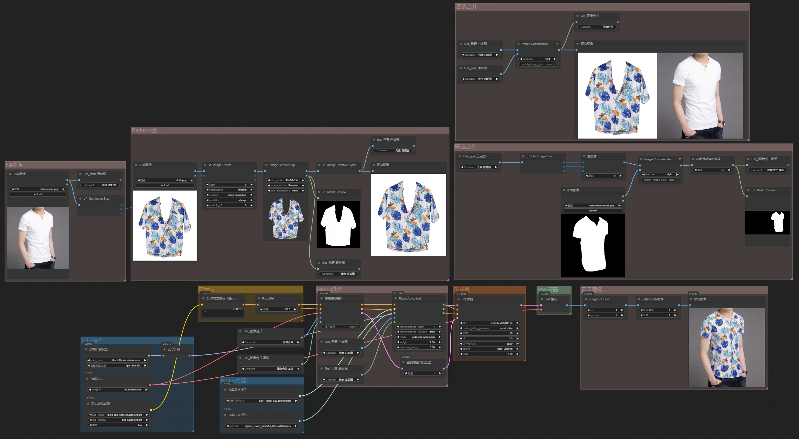

## 8.2 效果图

|        参考图         |        Fill重绘区域         |          参考元素（白底图）           |               效果图                |
| :-------------------: | :-------------------------: | :-----------------------------------: | :---------------------------------: |
|  | 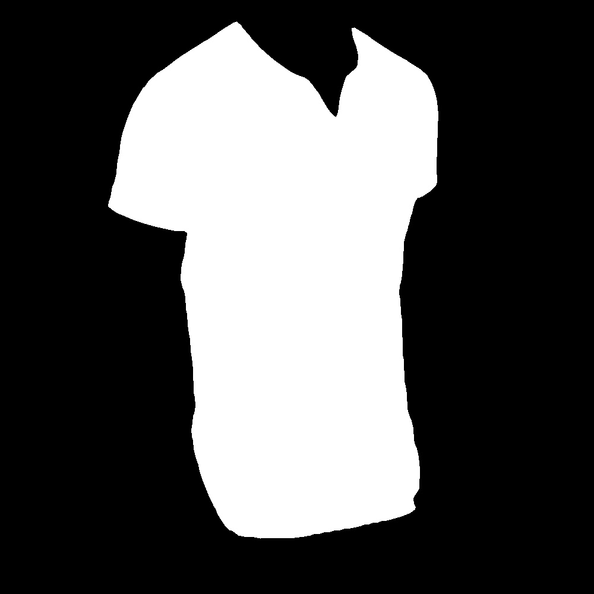 | 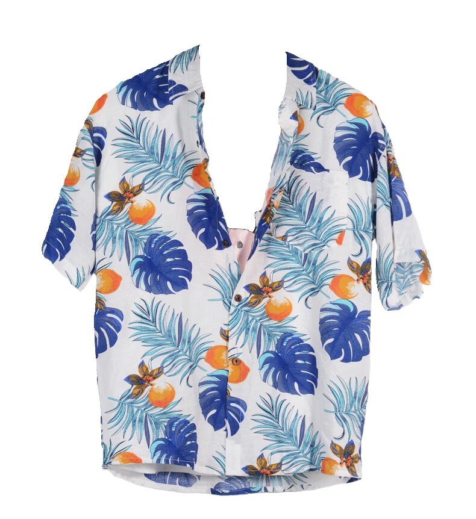 |  |
|  |  |  |  |

## 8.3 使用经验

- **蒙版图**决定了重绘区域的**范围**
- **参考图**决定了重绘区域的**内容**
- 局部重绘的区域为**浅色系**时，万物迁移效果更好