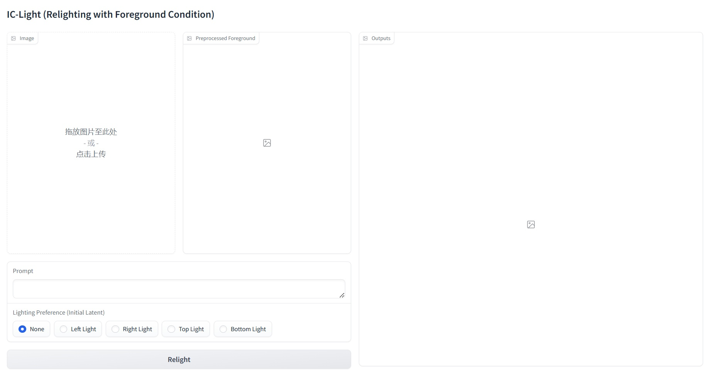
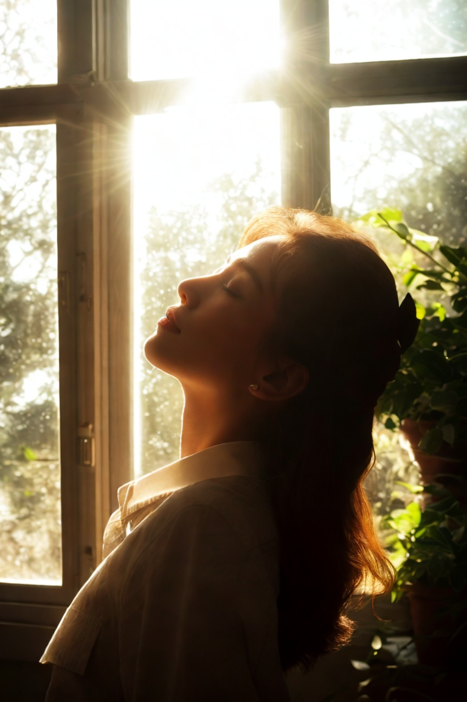
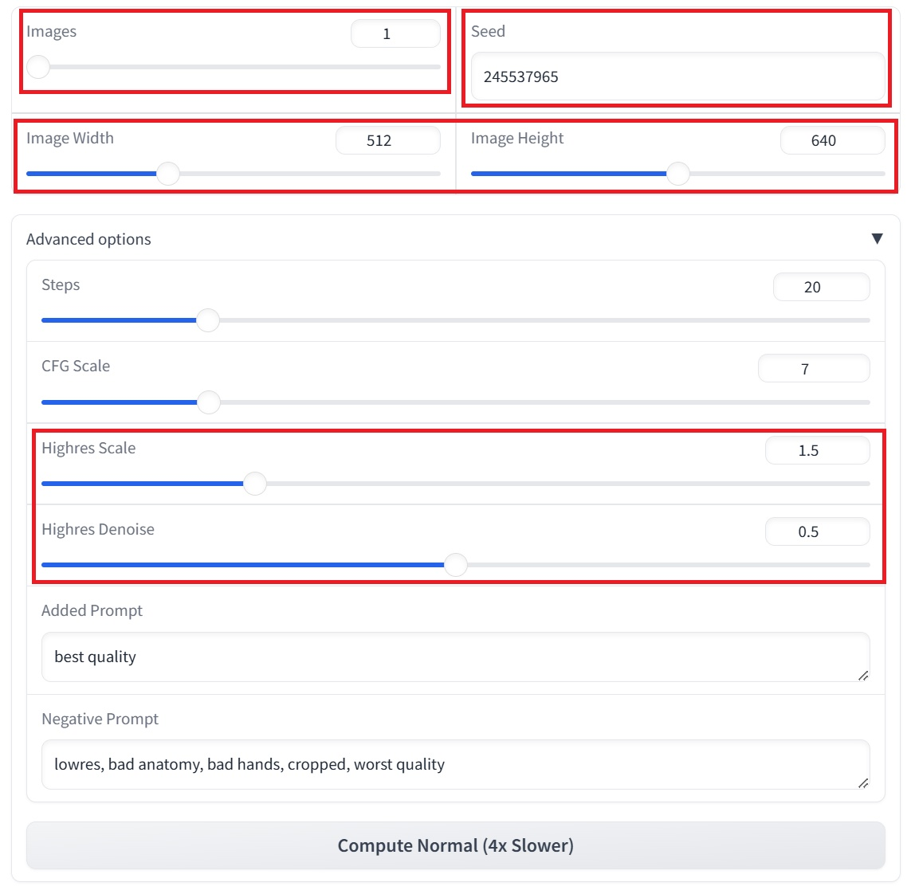
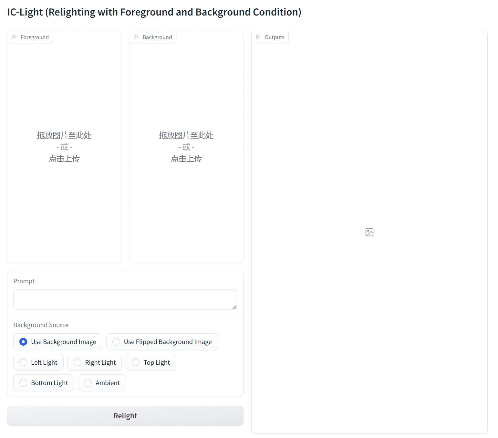
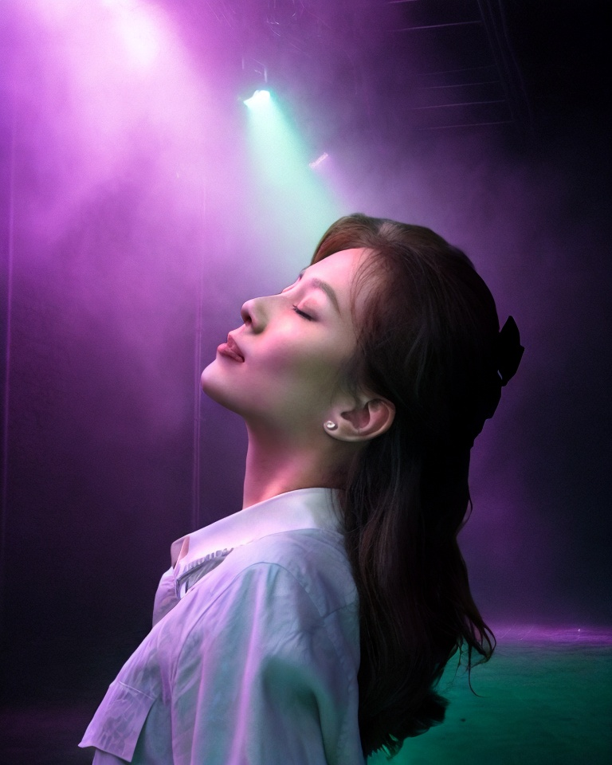
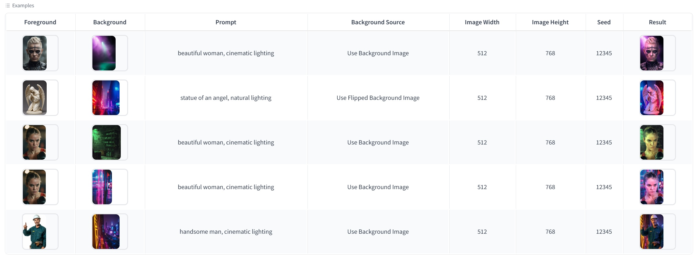

# 1. 介绍

​		**`IC-Light组件`** 一款AI图像照明操纵工具，它提供了两种主要模型：**文本条件模型**和**背景条件模型**，分别根据**文本提示**或**背景内容**对前景图像进行照明调整‌。

# 2. 核心步骤

## 2.1 参考图 + 光线描述

Step 1：**人工介入**：上传一张**参考主体图像**

Step 2：**人工介入**：撰写**光线描述提示词**，设定**光线方向**或上传**光线贴图**

Step 3：**AI**：根据**光线设定信息**，自动**调节主体的光线分布**

Step 4：**AI**：将**主体**和**光线设定效果**融合在一起，**生成新的合成照片**

## 2.2 参考图 + 参考背景 + 光线描述

Step 1：**人工介入**：上传一张**参考主体图像**

Step 2：**人工介入**：上传一张**参考背景图像**

Step 3：**人工介入**：撰写**光线描述提示词**，设定**光线方向**

Step 4：**AI**：根据**背景光照**，自动**调节主体的光线分布**

Step 5：**AI**：将**主体**和**背景**融合在一起，**生成新的合成照片**

# 3. 功能演示

## 3.1 环境配置

### 3.1.1 获取仓库代码

```bash
git clone https://github.com/lllyasviel/IC-Light.git
```

### 3.1.2 创建conda环境

```bash
conda create -n iclight python=3.10
conda activate iclight
pip install torch==2.5.0 torchvision==0.20.0 torchaudio==2.5.0 --index-url https://download.pytorch.org/whl/cu121
```

### 3.1.3 安装环境依赖

```bash
pip install -r ./IC-Light/requirements.txt
```

### 3.1.4 开发环境版本调整

```bash
pip install sacremoses
pip install huggingface_hub==0.25.0
pip install peft==0.13.0
pip install gradio==3.48.0
```

### 3.1.5 下载IC-Light模型

```bash
cd ./IC-Light/models
wget https://modelscope.cn/models/AI-ModelScope/ic-light/resolve/master/iclight_sd15_fbc.safetensors
wget https://modelscope.cn/models/AI-ModelScope/ic-light/resolve/master/iclight_sd15_fc.safetensors
```

### 3.1.6 启动

```bash
cd IC-Light
python gradio_demo.py    # 文本设定背景，启动后会自动下载模型：realistic-vision-v51和RMBG-1.4
python gradio_demo_bg.py # 图像设定背景，启动后会自动下载模型：realistic-vision-v51和RMBG-1.4
```

## 3.2 文本设定背景

### 3.2.1 运行界面



### 3.2.2 上传参考图像


### 3.2.3 设定光线方向、撰写提示词


### 3.2.4 运行结果



### 3.2.5 参数设定



- 设定**生成图像数量**
- 设定**种子数**
- 设定**生成图像尺寸**
- 设定**迭代步数**
- 设定**高清修复比例**
- 设定**高清修复的去噪强度**

### 3.2.6 预设方案


## 3.3 图像设定背景

### 3.3.1 运行界面



### 3.3.2 上传参考主体图像、设定参考背景图像

|         参考图像          |         参考背景图像          |
| :-----------------------: | :---------------------------: |
|  |  |

### 3.3.3 设定光线方向、撰写提示词


### 3.3.4 运行结果



### 3.3.5 参数说明


- 设定**生成图像数量**
- 设定**种子数**
- 设定**生成图像尺寸**
- 设定**迭代步数**
- 设定**高清修复比例**
- 设定**高清修复的去噪强度**

### 3.3.6 预设方案



## 3.4. 优点和缺点

### ⭐ 优点

- **开发环境**简单
- **调试方式**容易
- 有一定数量的**预设方案**可以参考

### ❌ 缺点

- 只能使用**固定的基础模型**，不能切换风格