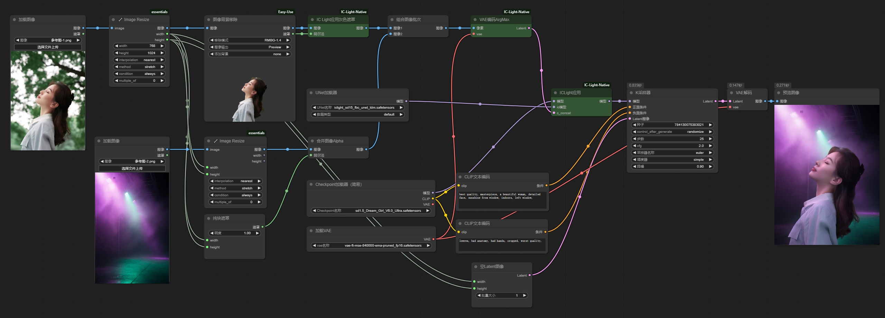
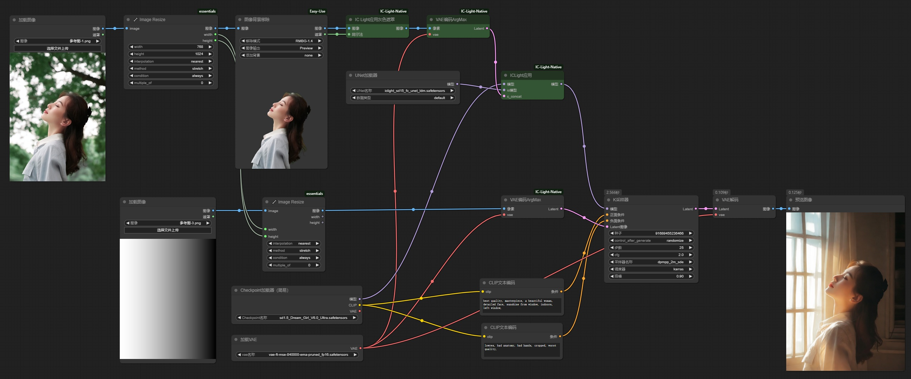
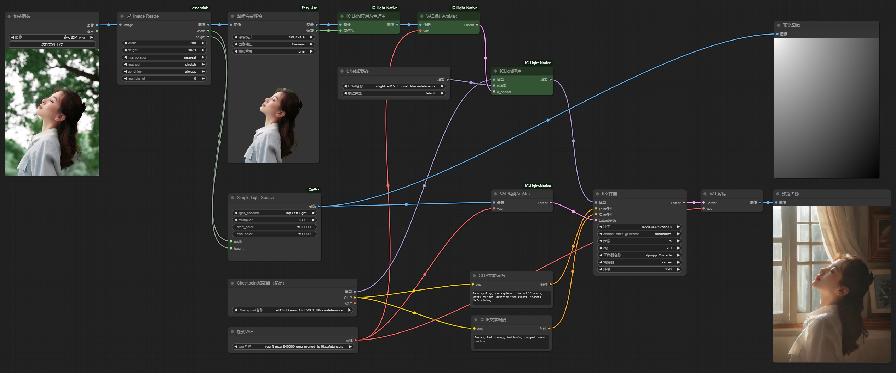
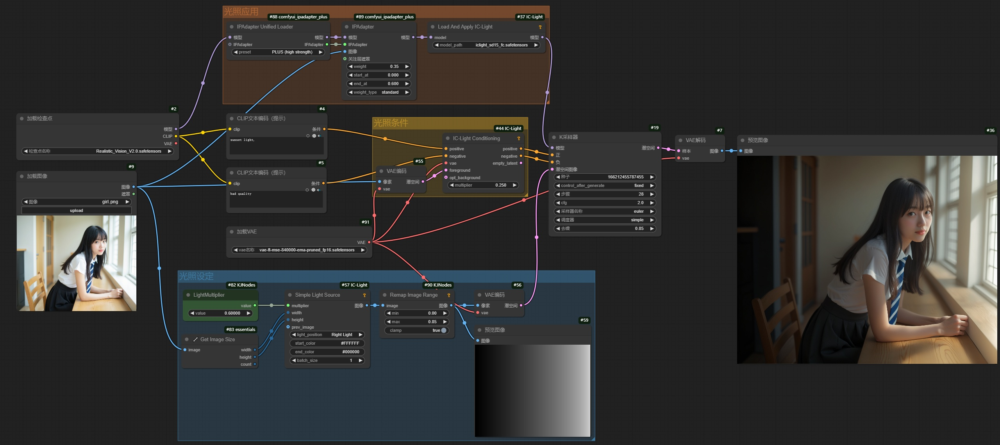

# 1. 环境配置

## 1.1 下载插件、安装环境依赖

```bash
# 进入节点文件夹
cd ComfyUI/custom_nodes

# 安装ComfyUI-IC-Light-Native
git clone https://github.com/huchenlei/ComfyUI-IC-Light-Native.git

# 安装ComfyUI-Easy-Use
git clone https://github.com/yolain/ComfyUI-Easy-Use.git
pip install -r ./ComfyUI-Easy-Use/requirements.txt

# 安装ComfyUI_essentials
git clone https://github.com/cubiq/ComfyUI_essentials.git
pip install -r ./ComfyUI_essentials/requirements.txt
```

## 1.2 下载模型

- **IC Light模型**

```bash
cd ComfyUI/models/unet
wget https://hf-mirror.com/huchenlei/IC-Light-ldm/resolve/main/iclight_sd15_fbc_unet_ldm.safetensors
wget https://hf-mirror.com/huchenlei/IC-Light-ldm/resolve/main/iclight_sd15_fc_unet_ldm.safetensors
```

- **RMBG模型**

```bash
cd ComfyUI/models
mkdir rembg
cd rembg
wget https://hf-mirror.com/briaai/RMBG-1.4/resolve/main/model.pth
mv model.pth RMBG-1.4.pth
```

## 1.3 启动

```bash
python main.py --port 18188 --listen 127.0.0.1 --cuda-device 7
```

# 2. 文本设定背景

## 2.1 工作流


## 2.2 参考图 & 生成效果

|         参考图          |         AI生成图          |         AI生成图          |         AI生成图          |         AI生成图          |
| :---------------------: | :-----------------------: | :-----------------------: | :-----------------------: | :-----------------------: |
|  |  |  |  |  |

# 3. 图像设定背景：背景图像

## 3.1 工作流



## 3.2 参考图 & 生成效果

|         参考图          |         参考背景图          |         AI生成图          |
| :---------------------: | :-------------------------: | :-----------------------: |
|  |  |  |

# 4. 图像设定背景：打光图像

## 4.1 工作流



## 4.2 参考图 & 生成效果

|         参考图          |         打光背景图          |         AI生成图          |
| :---------------------: | :-------------------------: | :-----------------------: |
|  |  |  |

# 5. 图像设定背景：打光设定

## 5.1 插件安装

- **安装插件**

```bash
git clone https://github.com/huagetai/ComfyUI-Gaffer.git
cd ComfyUI-Gaffer
pip install -r requirements.txt
```

- **下载脚本**
  - 从[网页](https://github.com/comfyanonymous/ComfyUI/blob/ce557cfb88ffd1e92cad88e123862398a94e08e6/comfy/diffusers_convert.py)中下载**diffusers_convert.py**文件，拷贝至**ComfyUI-Gaffer**文件夹中

- **更新代码**
  - **修改文件**：`ComfyUI-Gaffer\iclight.py`
  - **修改前**：`from comfy.diffusers_convert import convert_unet_state_dict`
  - **修改后**：`from .diffusers_convert import convert_unet_state_dict`

## 5.2 工作流



## 5.3 参考图 & 生成效果

|         参考图          |         打光设定图          |         AI生成图          |
| :---------------------: | :-------------------------: | :-----------------------: |
|  |  |  |
|  |  |  |
|  |  |  |

# 6. 图像设定背景：打光图像【不抠图】

## 6.1 工作流


## 6.2 参考图 & 生成效果

|         参考图          |         打光设定图          |          AI生成图          |          AI生成图          |
| :---------------------: | :-------------------------: | :------------------------: | :------------------------: |
|  |  |  |  |

# 7. 图像设定背景：打光设定【不抠图】

## 7.1 工作流



## 7.2 参考图 & 生成效果

|         参考图          |         打光设定图          |          AI生成图          |          AI生成图          |
| :---------------------: | :-------------------------: | :------------------------: | :------------------------: |
|  |  |  |  |

|         参考图          |          打光设定图          |          AI生成图          |          AI生成图          |
| :---------------------: | :--------------------------: | :------------------------: | :------------------------: |
|  |  |  |  |

|          参考图          |          打光设定图          | AI生成图                   | AI生成图                   |
| :----------------------: | :--------------------------: | -------------------------- | -------------------------- |
|  |  |  |  |