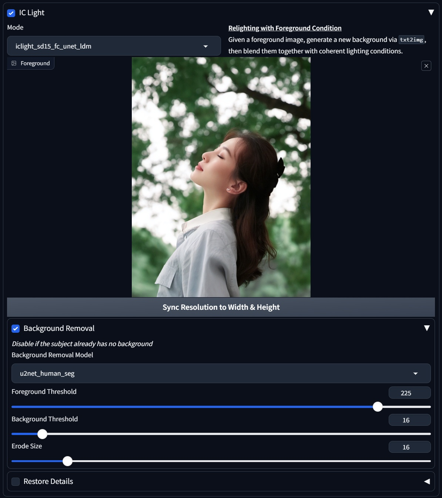
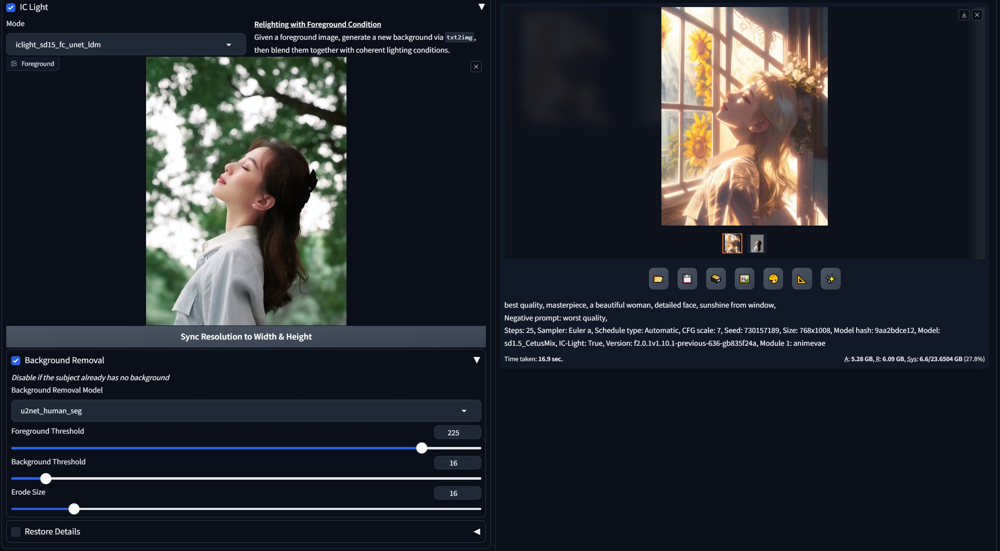
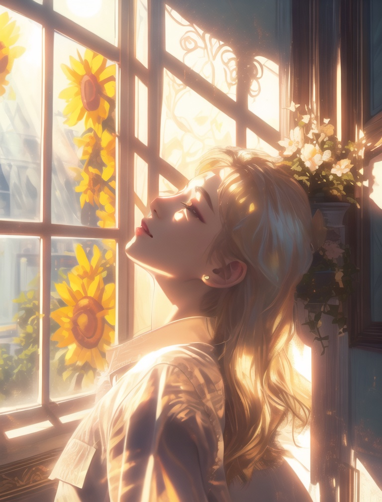
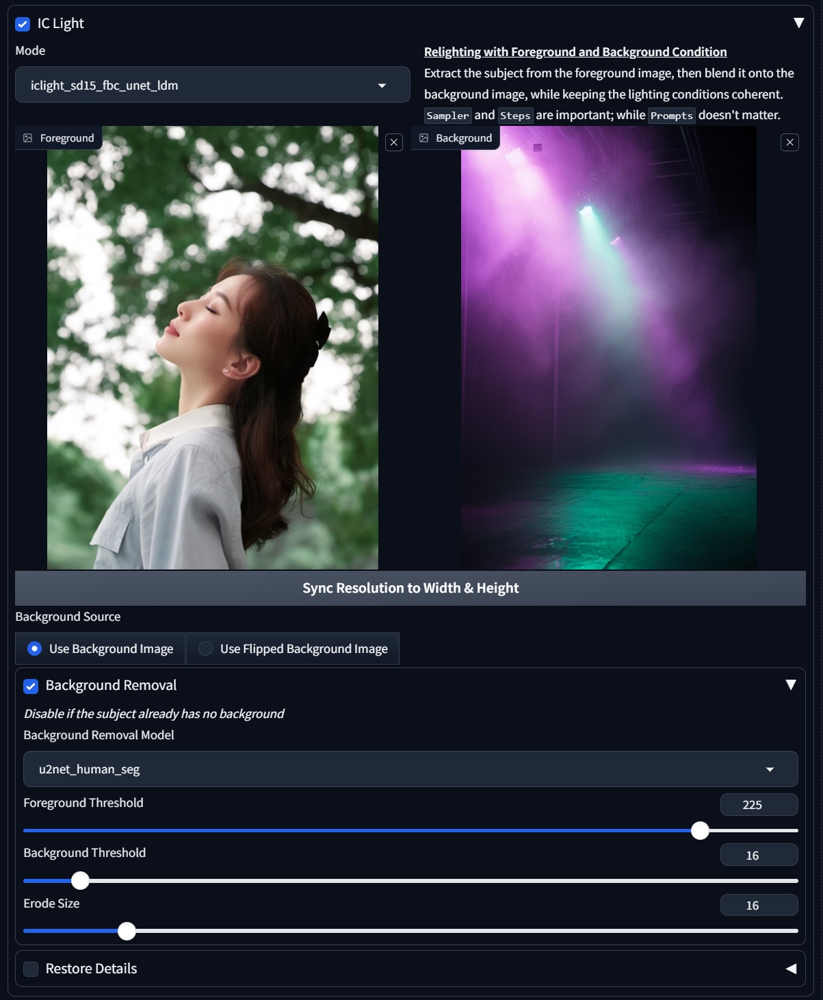
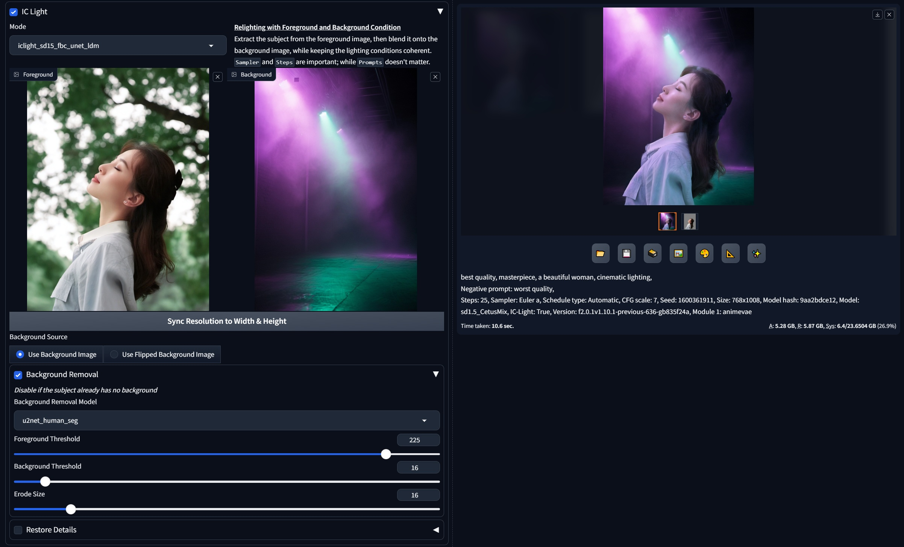
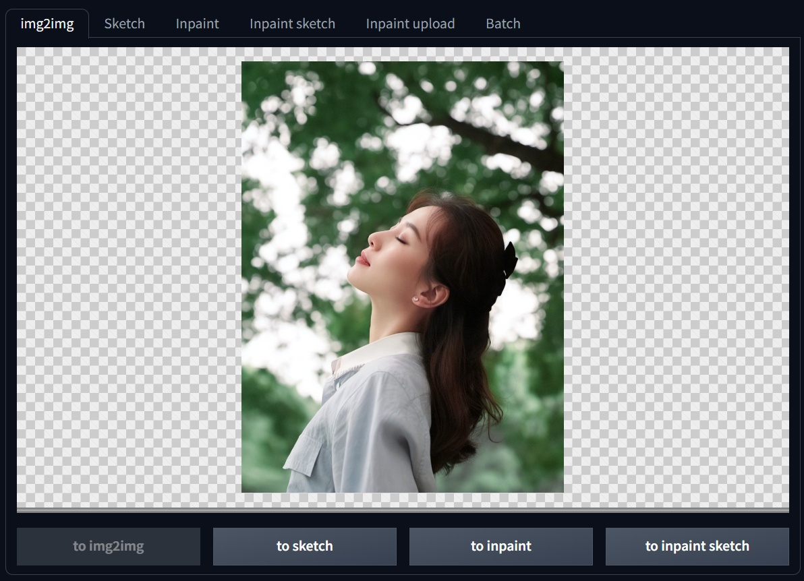
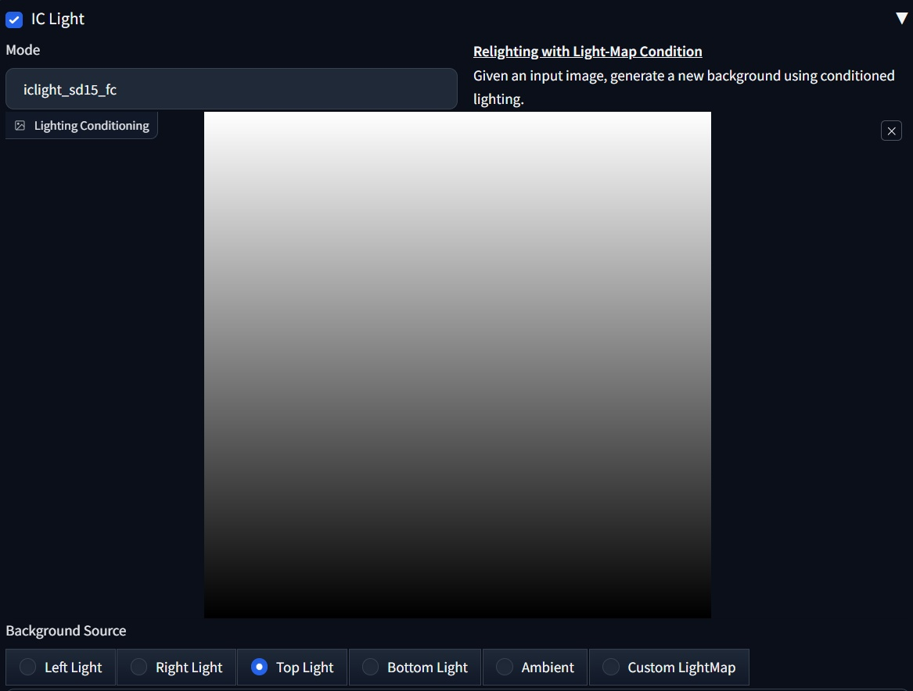
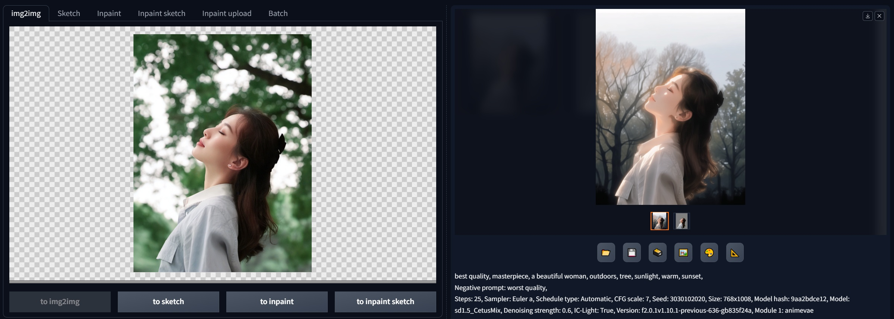
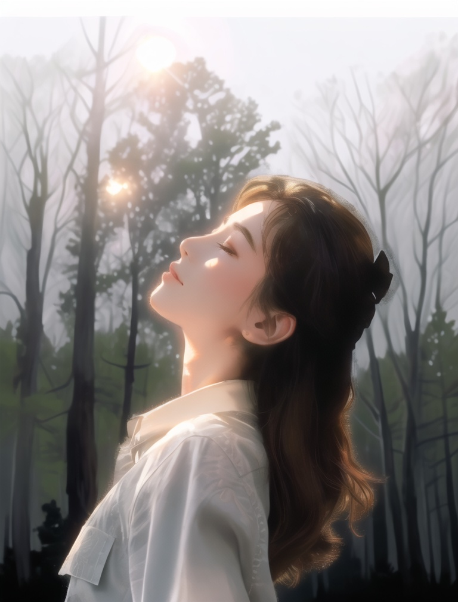

# 1. 环境配置

## 1.1 下载插件

```bash
cd sd-webui-forge/extensions
git clone https://github.com/Haoming02/sd-forge-ic-light.git
```

## 1.2 下载IC-Light模型

```bash
cd sd-webui-forge/models
mkdir ic-light
cd ic-light
wget https://hf-mirror.com/huchenlei/IC-Light-ldm/resolve/main/iclight_sd15_fbc_unet_ldm.safetensors
wget https://hf-mirror.com/huchenlei/IC-Light-ldm/resolve/main/iclight_sd15_fc_unet_ldm.safetensors
```

## 1.3 启动

```bash
bash start.sh
```

# 2. 文本设定背景

## 2.1 运行界面

​		切换至**文生图**标签页面。

## 2.2 上传参考图像

- 选择**iclight_sd15_fc_unet_ldm**模型



## 2.3 撰写提示词

- **正向提示词**：`best quality, masterpiece, a beautiful woman, detailed face, sunshine from window,`
- **反向提示词**：`worst quality,`

## 2.4 设定绘图参数

- **基础模型**：基于**SD 1.5系列**的生图模型，如 **cetusMix** 、 **majic_realism** 等
- **迭代步数**：25左右
- **图像尺寸**：**和原图一致**
- **高清修复**：按需设定

## 2.5 运行结果



|         AI生成图          |         AI生成图          |
| :-----------------------: | :-----------------------: |
|  |  |

# 3. 图像设定背景：背景图像

## 3.1 运行界面

​		切换至**文生图**标签页面。

## 3.2 上传参考图像、参考背景图像

- 选择**iclight_sd15_fbc_unet_ldm**模型



## 3.3 撰写提示词

- **正向提示词**：`best quality, masterpiece, a beautiful woman, cinematic lighting,`
- **反向提示词**：`worst quality,`

## 3.4 设定绘图参数

- **基础模型**：基于**SD 1.5系列**的生图模型，如 **cetusMix** 、 **majicMIX_realistic** 等
- **迭代步数**：25左右
- **图像尺寸**：按需设定
- **高清修复**：按需设定

## 3.5 运行结果




# 4. 图像设定背景：打光图像

## 4.1 运行界面

​		切换至**图生图**标签页面。

## 4.2 上传参考图像



## 4.3 设定打光方式或上传打光图像

- 选择**iclight_sd15_fc_unet_ldm**模型
- 可以勾选**Reinforce Foreground**，以增强生成图的前景效果



## 4.4 撰写提示词

- **正向提示词**：`best quality, masterpiece, a beautiful woman, outdoors, tree, sunlight, warm, sunset`
- **反向提示词**：`worst quality,`

## 4.5 设定绘图参数

- **基础模型**：基于**SD 1.5系列**的生图模型，如**cetusMix**、**majicMix_realistic**等
- **迭代步数**：25左右
- **图像尺寸**：按需设定
- **高清修复**：按需设定

## 4.6 运行结果



|         AI生成图          |         AI生成图          |
| :-----------------------: | :-----------------------: |
|  |  |

# 5. 优点和缺点

## ⭐ 优点

- 可以和传统的**Webui-Forge**生图方式融合
- 可以按需要**更换生图模型**

## ❌ 缺点

- 没有**预设方案**，只能自行设定