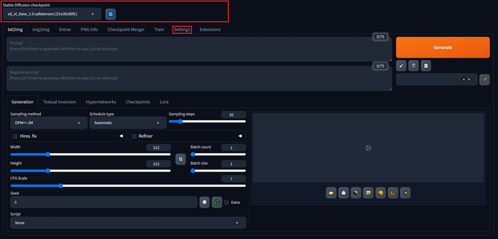
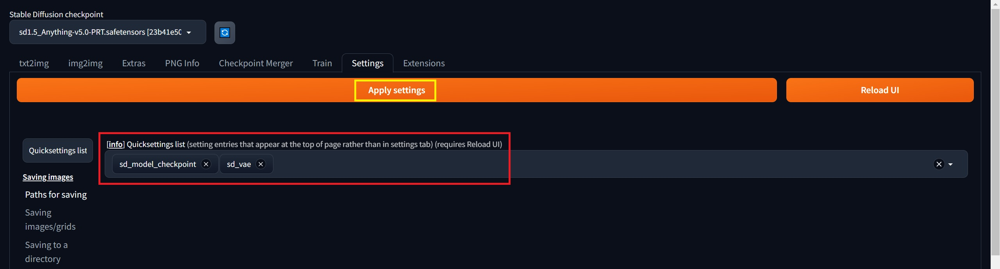
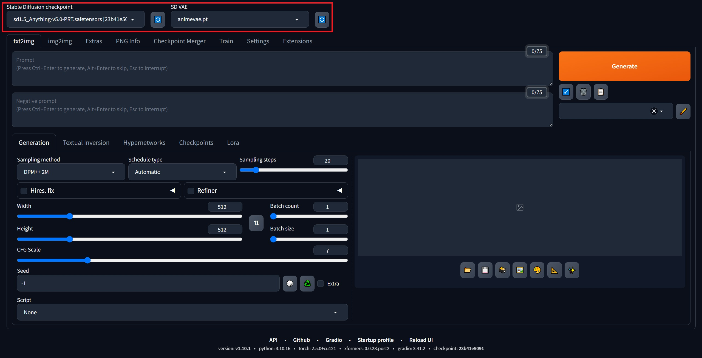
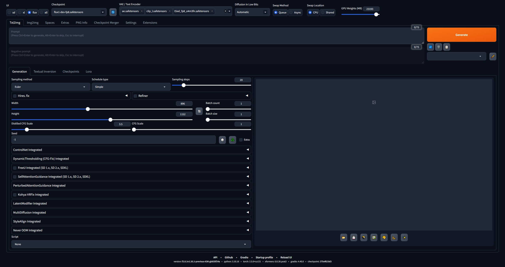

# 1. 基础环境安装

- [**显卡驱动**](https://www.nvidia.cn/geforce/drivers/)：下载**最新版本**
- [**CUDA**](https://developer.nvidia.com/cuda-toolkit-archive)：推荐和显卡驱动**匹配**的版本，下载时选**本地安装**模式（**Local**版本）
- [**miniconda**](https://www.anaconda.com/download/success)：下载较新的版本
- [**Git**](https://git-scm.com/download)：推荐**最新**版本

# 2. WebUI：官方原版

## 2.1 获取仓库代码

```bash
git clone https://github.com/AUTOMATIC1111/stable-diffusion-webui.git
```

## 2.2 创建虚拟环境

```bash
conda create -n webui python=3.10
conda activate webui
```

## 2.3 安装pytorch

- 注意`pytorch版本`和`显卡驱动版本`的兼容

```bash
# 最新版本
pip install torch torchvision torchaudio --index-url https://download.pytorch.org/whl/cu121
# 指定版本
pip install torch==2.5.0 torchvision==0.20.0 torchaudio==2.5.0 --index-url https://download.pytorch.org/whl/cu121
```

## 2.4 安装xformers

- 注意`xformers`和`pytorch`的版本对应

```bash
# 最新版本
pip install xformers
# 指定版本
pip install xformers==0.0.28.post2 # 对应torch=2.5.0、torchvision=0.20.0、torchaudio=2.5.0
```

## 2.5 安装依赖环境

```bash
# 进入项目目录
cd stable-diffsion-webui

# 安装依赖环境
pip install -r requirements_versions.txt
pip install -r requirements.txt
```

## 2.6 下载模型

- 以**SD 1.5系列**的Anything-v5.0模型为例
  - **Anything-v5.0-PRT.safetensors**的checkpoints模型文件
  - **animevae.pt**的vae模型文件

```bash
# 进入项目目录
cd stable-diffsion-webui

# 下载checkpoints模型
wget -P ./models/checkpoints https://hf-mirror.com/swl-models/Anything-v5.0-PRT/resolve/main/Anything-v5.0-PRT.safetensors

# 下载vae模型
wget -P ./models/VAE https://hf-mirror.com/Loli-Kyn/animevae/resolve/main/animevae.pt
```

## 2.7 创建启动脚本

- **创建启动脚本**：`start.sh`
- **参数说明**：
  - **xformers**：启用xformers，可以极大地改善内存消耗和速度
  - **no-half-vae**：不启用半精VAE，解决生成图片时，可能的VAE精度不足所导致的报错
  - **disable-safe-unpickle**：不启动安全检查，不加可能导致模型加载时报错
  - **port**：对外暴露的端口号
  - **theme**：主题
  - **device-id**：指定GPU

```bash
#!/bin/bash

export COMMANDLINE_ARGS="--xformers --no-half-vae --disable-safe-unpickle --port 18288 --theme dark --device-id 6"

python_cmd="python"
LAUNCH_SCRIPT="launch.py"

"${python_cmd}" "${LAUNCH_SCRIPT}" "$@"
```

## 2.8 启动

```bash
bash start.sh
```


## 附：无法选择vae模型？

1. 选择`Settings`标签页

   

2. 在`Quicksettings list`中选择`sd_model_checkpoints`和`sd_vae`，并`应用设置`

   

3. `刷新`页面

   

## 附：需要安装CLIP？

​		可以从[clip-vit-large-patch14](https://www.modelscope.cn/AI-ModelScope/clip-vit-large-patch14)中获取clip资源，保存在`models/openai`文件夹中，文件夹需要自行新建。

## 附：没有中文界面？

​		中文界面汉化扩展插件：https://github.com/hanamizuki-ai/stable-diffusion-webui-localization-zh_Hans


# 3. WebUI-Forge：lllyasviel整合包

## 3.1 获取仓库代码

```bash
git clone https://github.com/lllyasviel/stable-diffusion-webui-forge.git
```

## 3.2 创建虚拟环境

```bash
conda create -n webui-forge python=3.10
conda activate webui-forge
```

## 3.3 安装pytorch

- 注意`pytorch版本`和`显卡驱动版本`的兼容

```bash
# 最新版本
pip install torch torchvision torchaudio --index-url https://download.pytorch.org/whl/cu121
# 指定版本
pip install torch==2.5.0 torchvision==0.20.0 torchaudio==2.5.0 --index-url https://download.pytorch.org/whl/cu121
```

## 3.4 安装xformers

- 注意`xformers`和`pytorch`的版本对应

```bash
# 最新版本
pip install xformers
# 指定版本
pip install xformers==0.0.28.post2 # 对应torch=2.5.0、torchvision=0.20.0、torchaudio=2.5.0
```

## 3.5 安装依赖环境

```bash
# 进入项目目录
cd stable-diffsion-webui-forge

# 更新einops版本
sed -i 's/einops==0.4.1/einops==0.8.0/g' requirements_versions.txt

# 安装依赖环境
pip install -r requirements_versions.txt

# 安装缺少模块
pip install sacremoses
```

## 3.6 下载模型

- 以**SD 1.5系列**的Anything-v5.0模型为例
  - **Anything-v5.0-PRT.safetensors**的checkpoints模型文件
  - **animevae.pt**的vae模型文件

```bash
# 进入项目目录
cd stable-diffsion-webui-forge

# 下载checkpoints模型
wget -P ./models/checkpoints https://hf-mirror.com/swl-models/Anything-v5.0-PRT/resolve/main/Anything-v5.0-PRT.safetensors

# 下载vae模型
wget -P ./models/VAE https://hf-mirror.com/Loli-Kyn/animevae/resolve/main/animevae.pt
```

## 3.7 创建启动脚本

- **创建启动脚本**：`start.sh`
- **参数说明**：
  - **xformers**：启用xformers，可以极大地改善内存消耗和速度
  - **no-half-vae**：不启用半精VAE，解决生成图片时，可能的VAE精度不足所导致的报错
  - **disable-safe-unpickle**：不启动安全检查，不加可能导致模型加载时报错
  - **port**：对外暴露的端口号
  - **theme**：主题
  - **gpu-device-id**：指定GPU

```bash
#!/bin/bash

export COMMANDLINE_ARGS="--xformers --no-half-vae --disable-safe-unpickle --port 11888 --theme dark --gpu-device-id 6"

python_cmd="python"
LAUNCH_SCRIPT="launch.py"

"${python_cmd}" "${LAUNCH_SCRIPT}" "$@"
```

## 3.8 启动

```bash
bash start.sh
```



## 附：无法读取SD 3.5的CLIP组件？

- 下载[**SD35_ForgeV2插件**](https://drive.google.com/file/d/1_VYyQ8wQpjh-AoGtWWCa6zK5vEQbwA4K/view?pli=1)，追加并替换原有的文件夹内容：**backend**、**modules**、**repositories**。
- **设置**
  - **UI**选择：**all**
  - **checkpoint**选择：**SD3.5系列模型**
  - **VAE/Text Encoder**选择：**clip_l.safetensors**、**clip_g.safetensors**、**t5xxl_fp8_e4m3fn.safetensors**
- **完成上述设置**后，即可**正常生图**

# 4. ComfyUI：官方原版

## 4.1 获取仓库代码

```bash
git clone https://github.com/comfyanonymous/ComfyUI.git
```

## 4.2 创建虚拟环境

```bash
conda create -n comfyui python=3.10
conda activate comfyui
```

## 4.3 安装pytorch

- 注意`pytorch版本`和`显卡驱动版本`的兼容

```bash
# 最新版本
pip install torch torchvision torchaudio --index-url https://download.pytorch.org/whl/cu121
# 指定版本
pip install torch==2.5.0 torchvision==0.20.0 torchaudio==2.5.0 --index-url https://download.pytorch.org/whl/cu121
```

## 4.4 安装依赖环境

```bash
pip install -r requirements.txt
```

## 4.5 下载模型

- 以**SD 1.5系列**的Anything-v5.0模型为例
  - **Anything-v5.0-PRT.safetensors**的checkpoints模型文件
  - **animevae.pt**的vae模型文件

```bash
# 进入项目目录
cd ComfyUI

# 下载checkpoints模型
wget -P ./models/checkpoints https://hf-mirror.com/swl-models/Anything-v5.0-PRT/resolve/main/Anything-v5.0-PRT.safetensors

# 下载vae模型
wget -P ./models/vae https://hf-mirror.com/Loli-Kyn/animevae/resolve/main/animevae.pt
```

## 4.6 启动

```bash
python main.py --port 8188 --listen 127.0.0.1 --cuda-device 6
# listen指定IP地址
# port指定IP端口
# cuda-device指定GPU的ID号
```

