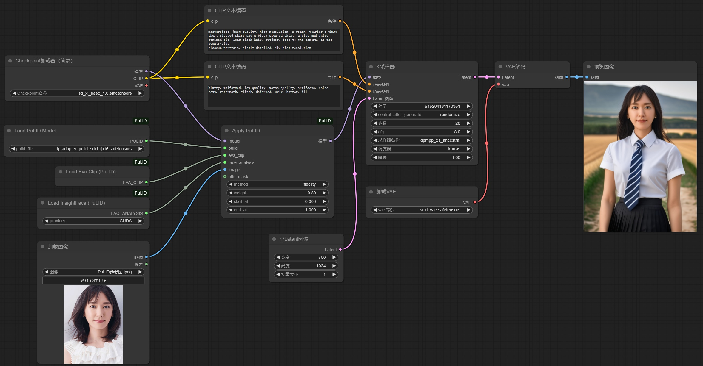
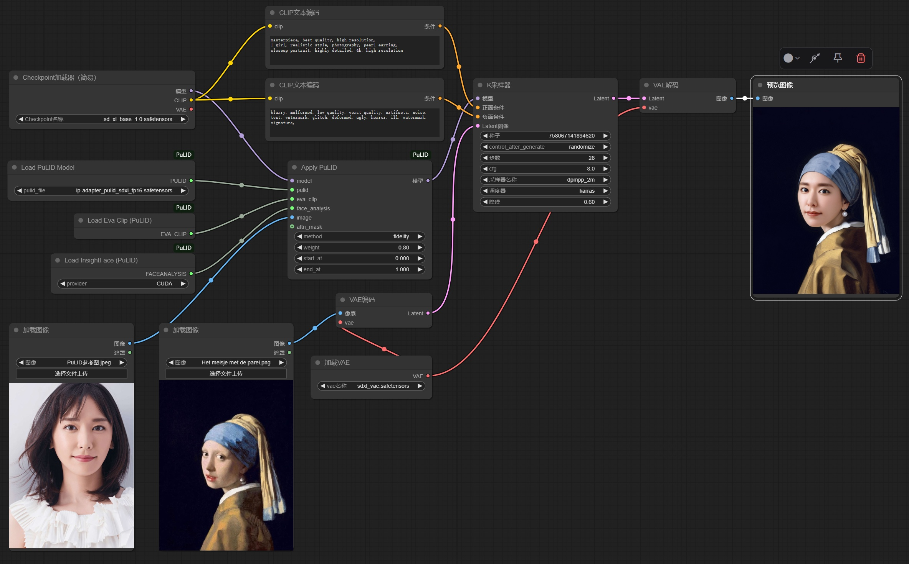
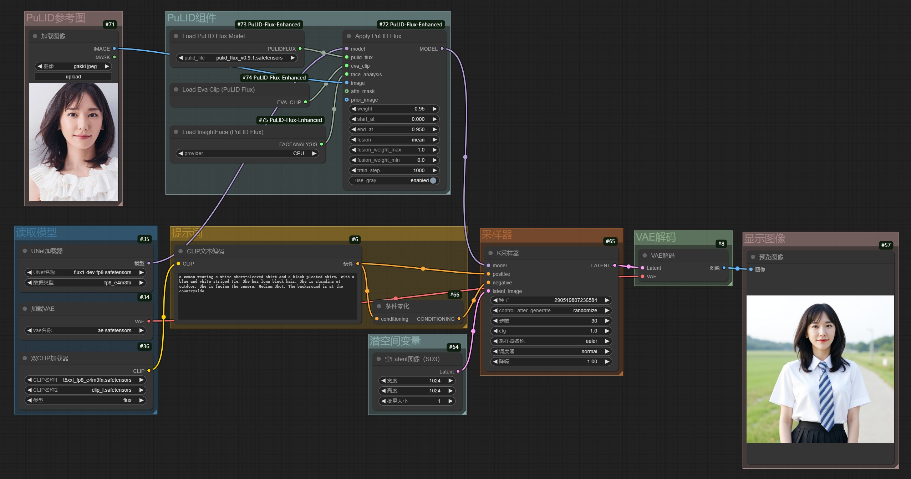
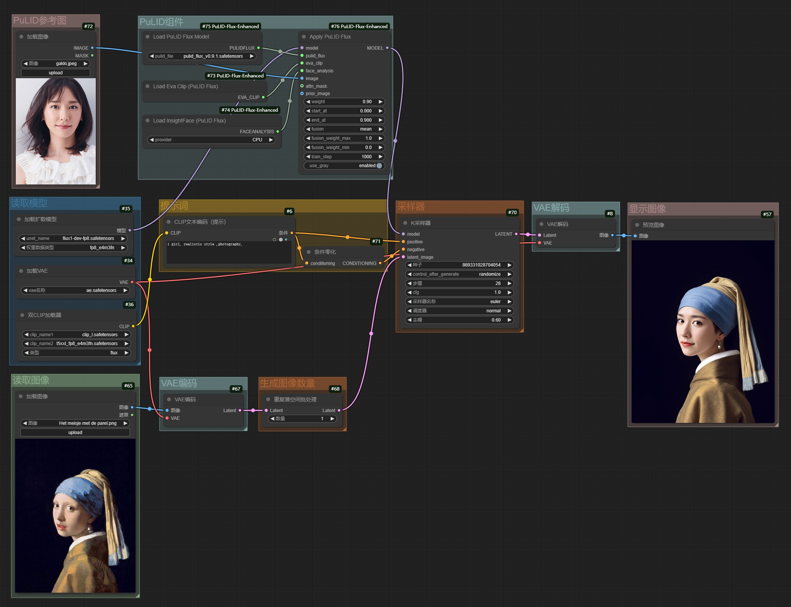

# 1. 介绍

​		[参考网页](https://github.com/ToTheBeginning/PuLID/tree/main)

​		使用PuLID插件，可以实现 **`人脸迁移`** 功能，即**生成图像的人脸和参考图像的人脸很相似**。

​		目前PuLID插件支持**SDXL模型**和**FLUX模型**，推荐使用**FLUX模型**：**提示词解析更好**、**出图效果更好**、**出图分辨率更高**。

# 2. 安装节点插件

## 2.1 官方版

​		[参考网页](https://github.com/ToTheBeginning/PuLID)

​		仅为**开发**使用的版本，**不支持ComfyUI**。

## 2.2 支持SDXL的版本

​		[参考网页](https://github.com/cubiq/PuLID_ComfyUI)

```bash
# 进入节点文件夹
cd ComfyUI/custom_nodes

# 下载节点插件
git clone https://github.com/cubiq/PuLID_ComfyUI.git

# 安装环境依赖
cd PuLID_ComfyUI
pip install -r requirements.txt
```

## 2.3 支持FLUX的版本

​		[参考网页](https://github.com/sipie800/ComfyUI-PuLID-Flux-Enhanced)

```bash
# 进入节点文件夹
cd ComfyUI/custom_nodes

# 下载节点插件
git clone https://github.com/sipie800/ComfyUI-PuLID-Flux-Enhanced.git

# 安装环境依赖
cd ComfyUI-PuLID-Flux-Enhanced
pip install -r requirements.txt
```

# 3. 下载模型

## 3.1 生图模型

- **SDXL**
  - 基础模型：**sdxl_base.safetensors**
  - vae模型：**sdxl_vae.safetensors**

- **FLUX**
  - 基础模型：**flux-dev-fp8.safetensors**
  - clip模型：**clip_l.safetensors**、**t5xxl_fp8_e4m3fn.safetensors**
  - vae模型：**ae.safetensors**

## 3.2 PuLID模型

​		从<https://modelscope.cn/models/shiertier/ComfyUI-pulid/files>中下载需要的PuLID模型。

- **SDXL**对应[**ip-adapter_pulid_sdxl_fp16.safetensors**](https://modelscope.cn/models/shiertier/ComfyUI-pulid/resolve/master/ip-adapter_pulid_sdxl_fp16.safetensors)
- **FLUX**对应[**pulid_flux_v0.9.1.safetensors**](https://modelscope.cn/models/shiertier/ComfyUI-pulid/resolve/master/pulid_flux_v0.9.1.safetensors)

​		模型下载完成后，保存在**models/pulid**文件夹中，**文件夹需要自行创建**。

## 3.3 CLIP模型

​		从<https://hf-mirror.com/QuanSun/EVA-CLIP/tree/main>中下载**EVA-CLIP**模型，推荐下载**EVA02_CLIP_L_336_psz14_s6B.pt**。

​		模型下载完成后，保存在**models/clip**文件夹中。

## 3.4 Antelopev2模型

​		从<https://hf-mirror.com/MonsterMMORPG/tools/tree/main>中下载**Antelopev2**模型，模型需要全部下载：**1k3d68.onnx**、**2d106det.onnx**、**genderage.onnx**、**glintr100.onnx**、**scrfd_10g_bnkps.onnx**。

​		模型下载完成后，保存在**models/insightface/models/antelopev2**文件夹中，**文件夹需要自行创建**。

## 3.5 备用模型

​		[detection_Resnet50_Final.pth](https://github.com/xinntao/facexlib/releases/download/v0.1.0/detection_Resnet50_Final.pth)、[parsing_bisenet.pth](https://github.com/xinntao/facexlib/releases/download/v0.2.0/parsing_bisenet.pth)、[parsing_parsenet.pth](https://github.com/xinntao/facexlib/releases/download/v0.2.2/parsing_parsenet.pth)，这三个模型，网络畅通时会自动下载，无需手动干预，网络拥堵时要自行下载，然后存放到**facexlib**的**weights**文件夹中。

# 4. 示例

## 4.1 SDXL：文生图

### 4.1.1 采样方式

**推荐**：

- **DPM++ 2M** & **Karras**
- **DPM++ 2S a** & **Karras**

### 4.1.2 工作流



### 4.1.3 效果图

|           PuLID参考图           |           AI生成图            |
| :-----------------------------: | :---------------------------: |
|  |  |


## 4.2 SDXL：图生图

### 4.2.1 采样方式

**推荐**：

- **DPM++ 2M** & **Karras**
- **DPM++ 2S a** & **Karras**

### 4.2.2 工作流



### 4.2.3 效果图

|           PuLID参考图           |        参考图         |           AI生成图            |
| :-----------------------------: | :-------------------: | :---------------------------: |
|  |  |  |


## 4.3 FLUX：文生图

### 4.3.1 工作流



### 4.3.2 效果图

|           PuLID参考图           |           AI生成图            |
| :-----------------------------: | :---------------------------: |
|  |  |


## 4.4 FLUX：图生图

### 4.4.1 工作流



### 4.4.2 效果图

|           PuLID参考图           |       AI参考图        |           AI生成图            |
| :-----------------------------: | :-------------------: | :---------------------------: |
|  |  |  |