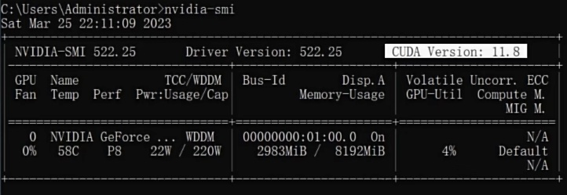
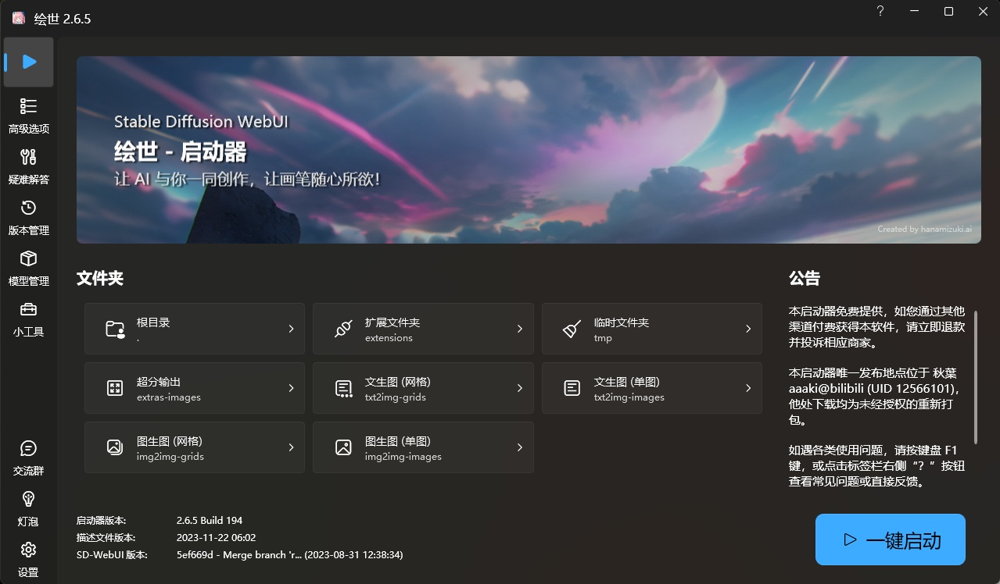
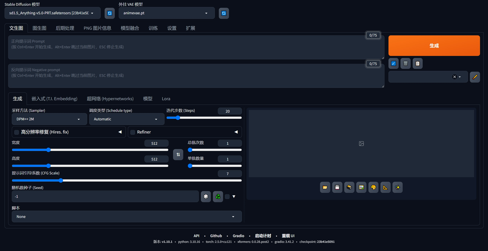
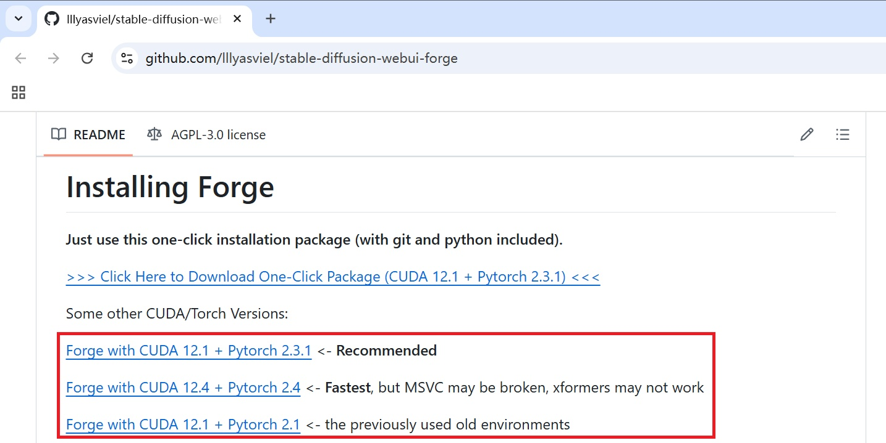
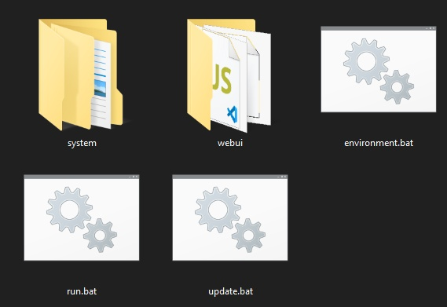
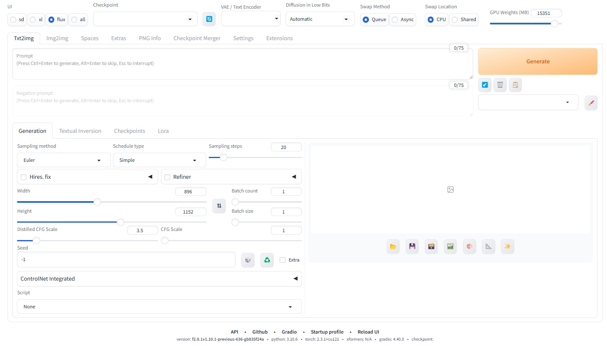
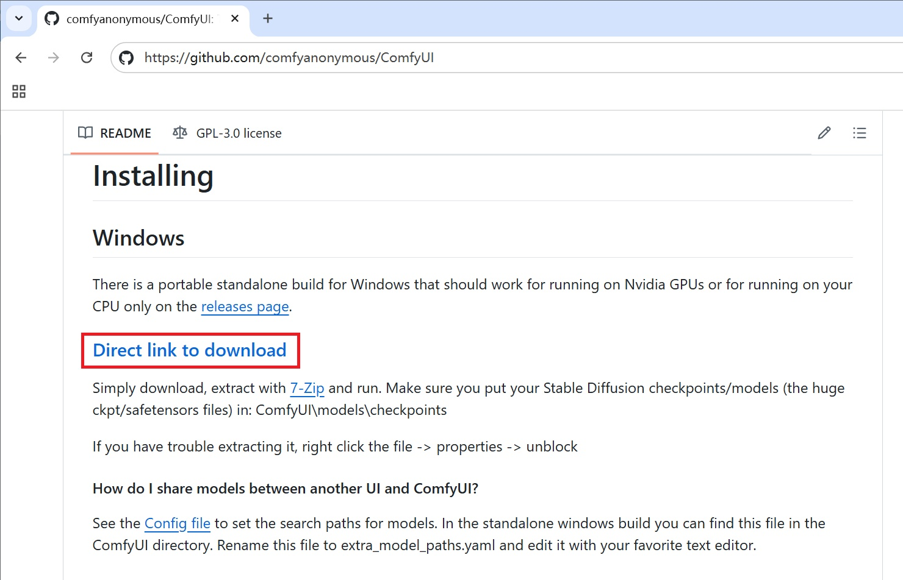
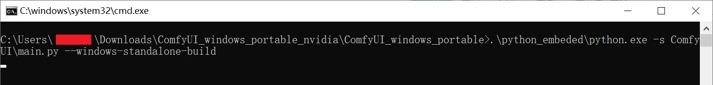

# 1. 基础环境安装

- [**Python**](https://www.python.org/downloads)：推荐**3.10**以后版本
- [**.NET**](https://dotnet.microsoft.com/zh-cn/download/dotnet)：推荐**6.0.11**以后版本
- [**Git**](https://git-scm.com/download)：推荐**最新**版本
- [**CUDA**](https://developer.nvidia.com/cuda-toolkit-archive)：推荐和显卡驱动**匹配**的版本，下载时选**本地安装**模式（**Local**版本）
  - 查询显卡适用的**最高**CUDA版本：在命令提示符中输入**nvidia-smi**

# 2. WebUI：秋叶整合包

## 2.1 下载整合包

- [**下载链接**](https://pan.quark.cn/s/2c832199b09b)

## 2.2 解压安装

- `安装路径`**不要有中文字符**
- 由于AI模型大且多，因此**软件需要安装在容量较大的盘符**中——大约需要**200 GB以上**的硬盘空间

## 2.3 运行和启动

- 进入软件安装文件夹，运行`AI启动器.exe`，等待加载和更新。

- 点击`一键启动`，自动打开**WebUI**界面。

# 3. WebUI-Forge：lllyasviel整合包

## 3.1 下载整合包

- [**仓库链接**](https://github.com/lllyasviel/stable-diffusion-webui-forge)：**webui_forge_cu121_torch231.7z**

## 3.2 解压安装

- `安装路径`**不要有中文字符**

## 3.3 更新、运行和启动

- 进入软件安装文件夹，运行`update.bat`，等待程序更新至最新版本。
- 进入软件安装文件夹，运行`run.bat`，等待程序加载。
- 加载完成后，自动打开**WebUI-Forge**界面。

## 附：无法读取SD 3.5的CLIP组件？

- 下载[**SD35_ForgeV2插件**](https://drive.google.com/file/d/1_VYyQ8wQpjh-AoGtWWCa6zK5vEQbwA4K/view?pli=1)，**合并**至原有的文件夹（**重名文件覆盖替换**）：**backend**、**modules**、**repositories**。
- **设置**
  - **UI**选择：**all**
  - **checkpoint**选择：**SD3.5系列模型**
  - **VAE/Text Encoder**选择：**clip_l.safetensors**、**clip_g.safetensors**、**t5xxl_fp8_e4m3fn.safetensors**
- **完成上述设置**后，即可**正常生图**

# 4. ComfyUI：官方原版

## 4.1 下载整合包

- [**仓库链接**](https://github.com/comfyanonymous/ComfyUI)：**ComfyUI_windows_portable_nvidia.7z**

## 4.2 解压安装

- `安装路径`**不要有中文字符**
- 由于AI模型大且多，因此**软件需要安装在容量较大的盘符**中——大约需要**200 GB以上**的硬盘空间

## 4.3 运行和启动

- 进入软件安装文件夹，运行`run_nvidia_gpu.bat`，等待程序加载。

- 加载完成后，自动打开**ComfyUI**界面。

