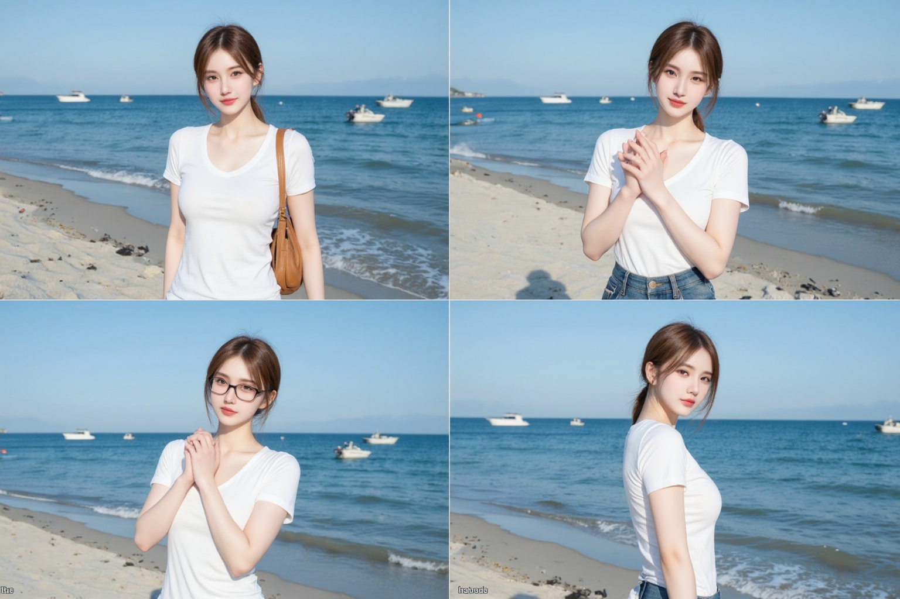
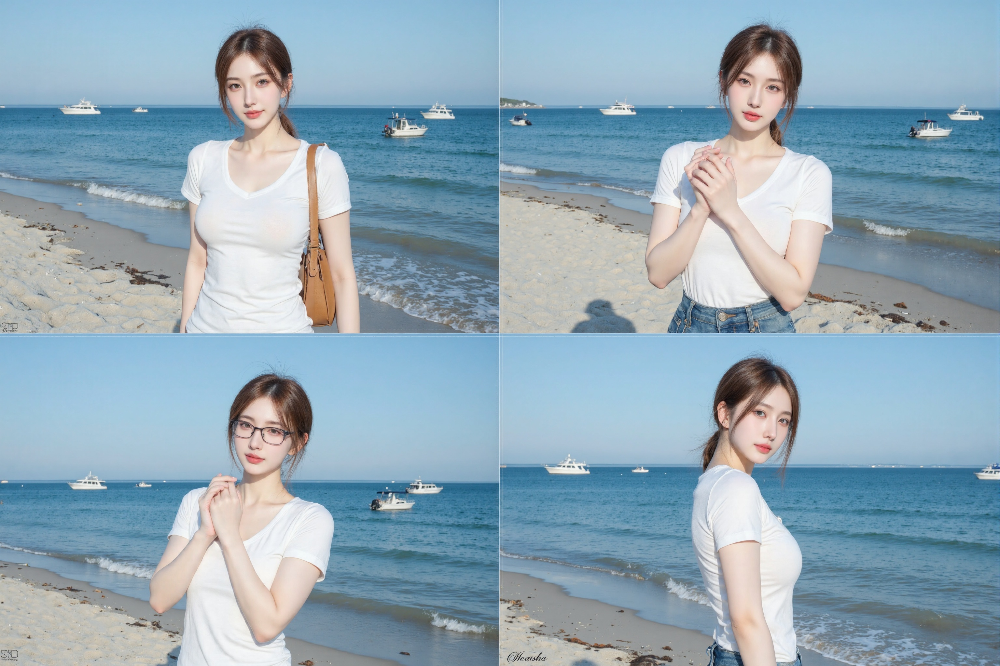
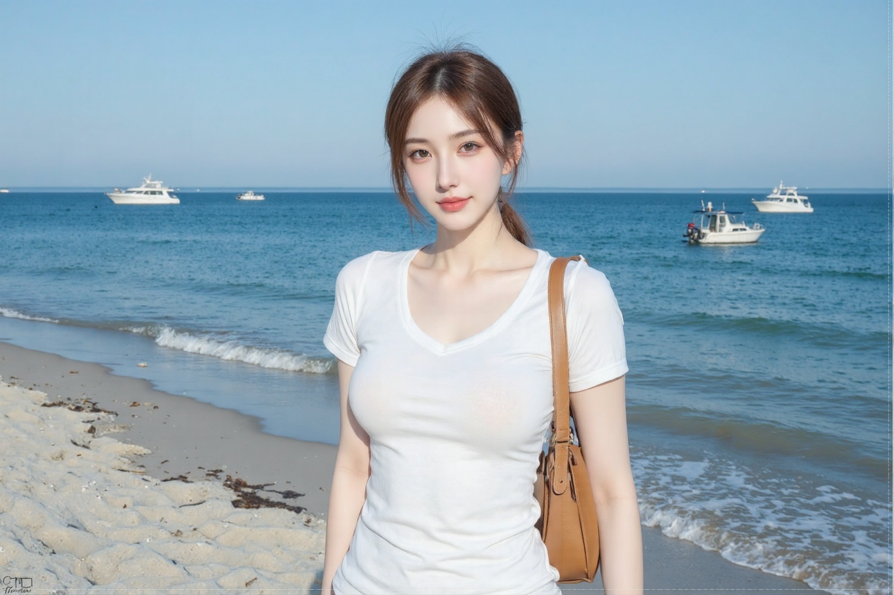
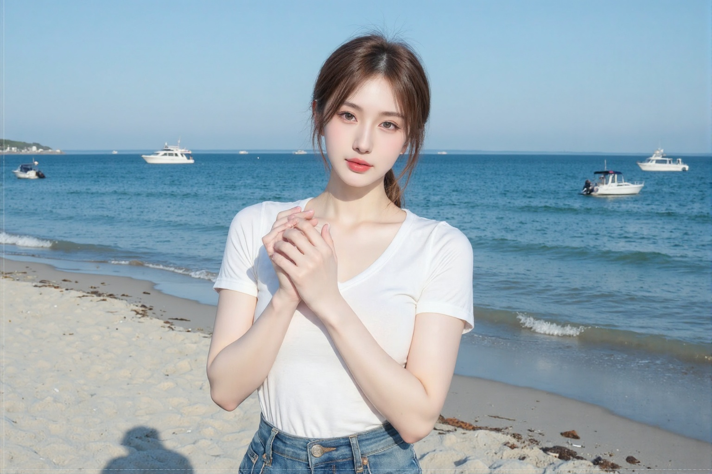
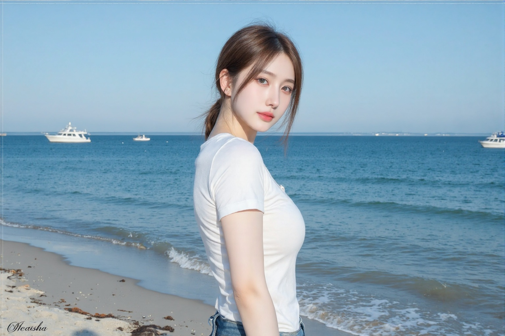

# 1. 介绍

​		在AIGC绘图中，**一致性**指**在生成图像过程中，保持特定元素（如人物、物品、风格等）在不同生成结果中的特征、外观或结构的一致性**。

​		在**一致性**的作图要求下，主要关注**人物、物品、风格、结构**的一致：

1. **人物一致性**：确保同一角色在不同图像中的面部特征、服装、发型等保持一致。
2. **物品一致性**：如将特定物品（如花瓶、家具）在不同场景中保持一致的外观。
3. **风格一致性**：保持整体画风（如动漫、写实、油画）的统一性。
4. **姿势/结构一致性**：如保持人物的骨骼姿势或物体的空间布局不变。

# 2. 原理

​		经过实践尝试，发现**在同一次生图中，将图像约束为多个画面，可以保证该次生成的图像内容，具有高度一致性**。

​		可参考[ali-vilab/In-Context-LoRA](https://hf-mirror.com/ali-vilab/In-Context-LoRA)提供的生图方案。

# 3. 工作流


# 4. 提示词

```
Seamless image connection. 2x2 grid.
A young woman walks on the blue seaside, at the beach, several boats are on the sea.
[TOP-LEFT] She stood by the seaside, smiling and looking at the camera.
[TOP-RIRHT] She made a gesture of empathy and looked at the camera.
[B0TTOM-LEFT] She crossed her hands and looked at the camera.
[B0TTOM-RIGHT] She put glasses and stood sideways, looking at the camera.
```

# 5. 示例图

## 第一次生图

- **尺寸**：1536 x 1024
- **生成图**


## 第二次生图：重采样

- **尺寸**：3072 x 2048
- **生成图**


## 图像裁剪

- **裁剪尺寸**：1536 x 1024，**4张**

|          生成图           |          生成图           |
| :-----------------------: | :-----------------------: |
|  |  |
|  |  |

# 6. 使用说明

- 第一次生图时，可能会出现**不是四象限构图**的情况，因此建议**先禁用重采样放大的功能**，待第一次生图满意后，再重采样放大。
- 第一次生图时，可能会出现**图像不是标准尺寸**的情况，即**四张图的宽度不完全一致**，建议重新生成。
- **放大方案**不建议使用模型对图像进行放大的方案，会爆显存，推荐的方式是**latent放大**或者**图像分块放大**。
- 工作流可以**改造为其他构图方式**，以满足**半身照**、**全身照**的需求，**图像分割方式也要相应调整**。