# 1. 参数说明

​		AI绘图过程主要涉及 **`基础模型`**（**Models**）、 **`提示词`**（**Prompts**）、 **`迭代步数`**（**Steps**）、 **`采样方法`**（**Sampler** & **Scheduler**）、 **`图像分辨率`**（**Width** & **Height**）、 **`每次生成图片数量`**（**Batchsize**）、 **`提示词相关性`**（**CFG**）、 **`随机种子`**（**Seed**）、 **`重绘幅度`**（**Denoise**）等参数。

- **WebUI的参数**

- **ComfyUI的参数**

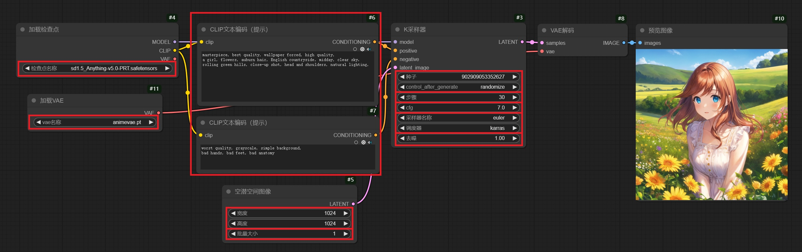

# 2. 基础模型

- **WebUI**

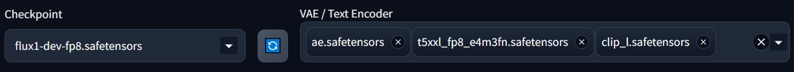

- **ComfyUI**

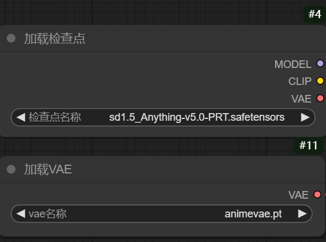

## 模型分类

- **`基础模型`**（**必须**）：**决定AI作品的呈现风格**

|      系列      | 生成速度 |      生图标准尺寸      |   提示词理解能力   |                缺点                |
| :------------: | :------: | :--------------------: | :----------------: | :--------------------------------: |
| **SD 1.5系列** |  **快**  |  512 * 512、768 * 768  | **短语，简单语句** | 人物容易崩坏（手部错乱、姿态错乱） |
|  **SDXL系列**  |  **快**  | 768 * 768、1024 * 1024 | **短语，简单语句** |   风格随机，需要手动约束画面风格   |
| **SD 3.5系列** |  **慢**  |      1024 * 1024       | **短语，复杂语句** |           硬件资源消耗大           |
|  **FLUX系列**  |  **慢**  |      1024 * 1024       | **短语，复杂语句** |    硬件资源消耗大，画面容易油腻    |

- **`辅助模型`**（**可选**）：**约束AI作品的画面形象、画面风格**
  - **Embendding 模型**：精准地指向个别字词的含义，给AI提供**一个极其高效的索引**
  - **HyperNetwork 模型**：改善**生成图像的整体风格**
  - **Lora模型**：向AI传递**一个特征准确、主体清晰的形象**
  - **ControlNet模型**：基于一些额外的输入信息，给AI图像的生成提供**明确的指引**

- **`美化模型`**（**可选**）：**影响AI作品的色彩和质感**
  - **VAE模型**：让图片的**色彩**和**质感**变得**更好**，尤其是在AI图像整体发灰时需要使用

## 画风分类

- **`动漫插画风`**：具有**鲜明的动漫笔触质感**
  - 代表模型：**Anything V5**、**Counterfeit**、**AbyssOrange**、**cetusMix**等
- **`写实风`**：**拟真化程度高**，对现实世界还原度强
  - 代表模型：**Deliberate**、**RealisticVision**、**DreamGirl**、**majicMIX realistic**等
- **`模型渲染风`**：**三维渲染效果**
  - 代表模型：**ReVAnimated**等
- **`综合型`**：**支持多种风格**，通过提示词方式进行切换
  - 代表模型：**SDXL**、**SD 3.5**、**FLUX**等

# 3. 提示词

- **WebUI**：分为**Prompt**（正向提示词）和**Negative Prompt**（反向提示词）

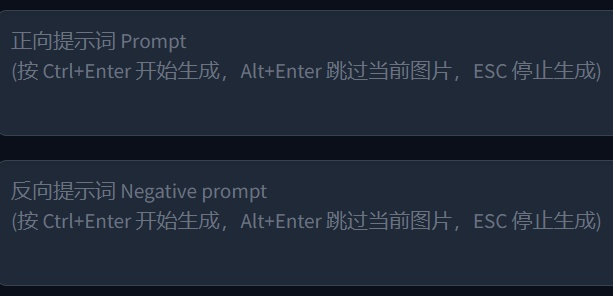

- **ComfyUI**：使用**CLIP文本编码节点**，接入**positive**即为**正向提示词**，接入**negative**即为**负向提示词**

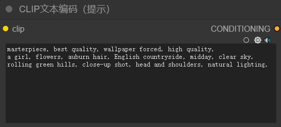

## 分类

- **`正向提示词`**：希望画面里**要**出现什么，绝大多数情况**必须**要有
- **`反向提示词`**：希望画面里**不要**出现什么，有些情况**可以没有**

## 建议

- **在使用Stable Diffusion的模型时，提示词只支持英文**，如果使用**中文模型**，如**Qwen系列**，那么**提示词对中英文都支持**。
- **提示词不是一下子就写好的，而是`先有一个雏形，再慢慢细化、补充和微调的`**。
- 可以**先用母语描述想绘画的内容**，再**翻译成英文**。
- 撰写提示词时，可以**使用推荐的提示词**。
- 可以通过**提示词平台**的协助，**更方便地确定提示词**。

# 4. 迭代步数

- **WebUI**

- **ComfyUI**

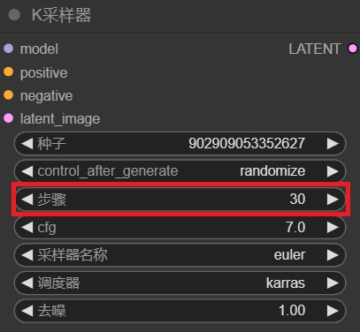

## 功能

- **理论**：**迭代步数越多，成像效果越清晰**
- **实际**：**采用步数大于25之后，成像效果提升不大**

## 建议

  1. **算力中等**：设定**在25-30之间**，**推荐28**
  2. **算力充足**：想追求更高的细致度，设定**在25-40之间**，**推荐35**
  3. 对于**SD Turbo**、**Flux Schnell**等**快速生图模型**：设定**在4-10之间**，**推荐6**

# 5. 采样方法

- **WebUI**

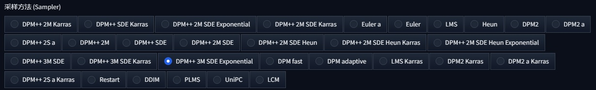

- **ComfyUI**

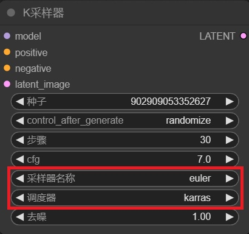

## 功能

- **采样方法**：**决定噪声图像去除的方式**
- **采样方法**包括**采样器**和**调度器**两个模块，通过**组合**的方式，确定**图像的降噪模式**

## 常见组合

|           采样器 | 调度器          |
| ---------------: | --------------- |
|        **Euler** | **Simple**      |
|        **Euler** | **Karras**      |
|        **Euler** | **sgm_uniform** |
|     **DPM++ 2M** | **Karras**      |
|     **DPM++ 2M** | **sgm_uniform** |
| **DPM++ 2M SDE** | **Exponential** |
| **DPM++ 3M SDE** | **Exponential** |

# 6. 图像分辨率

- **WebUI**

- **ComfyUI**

## 推荐分辨率

| 比例 |    小尺寸     |     中尺寸      |      大尺寸       |     特大尺寸      |     超大尺寸      |
| :--: | :-----------: | :-------------: | :---------------: | :---------------: | :---------------: |
| 1:1  | **512 * 512** |  **768 * 768**  | **`1024 * 1024`** |  **1280 * 1280**  |  **1536 * 1536**  |
|      | 26.2 万 像素  |  58.9 万 像素   |  `104.8 万 像素`  |   163.8 万 像素   |   235.9 万 像素   |
| 2:3  | **512 * 768** |        /        |  **768 * 1152**   | **`1024 * 1536`** |  **1536 * 2304**  |
|      | 39.3 万 像素  |        /        |   88.4 万 像素    |  `157.2 万 像素`  |   353.8 万 像素   |
| 3:4  | **480 * 640** | **`600 * 800`** | **`768 * 1024`**  |  **960 * 1280**   | **`1536 * 2048`** |
|      | 30.7 万 像素  | `48.0 万 像素`  |  `78.6 万 像素`   |   122.8 万 像素   |  `314.8 万 像素`  |
| 9:16 |       /       |  **540 * 960**  | **`720 * 1280`**  | **`900 * 1600`**  | **`1080 * 1920`** |
|      |       /       |  51.8 万 像素   |  `92.1 万 像素`   |   144.0 万 像素   |  `207.3 万 像素`  |

## 提高分辨率的办法

1. **直接生成高清图** → 会存在**显存不够用、主体对象会变多**等问题
   - 适用于**SDXL系列、SD 3.5系列、FLUX系列**
2. 先**生成低分辨率图**，再作**高分辨率修复**处理
   - 适用于**SD 1.5系列**

# 7. 每次生成图片数量

- **WebUI**

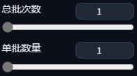

- **ComfyUI**

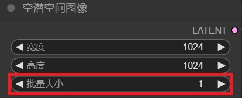

## 功能

- **总批次数**：**让AI一直不断地按照同一组提示词和参数出图，运行`总批次数`的次数**
- **单批数量（WebUI）、批量大小（ComfyUI）**：**每批次绘制的图像数量**
  - 数量**增大**，可以**一次生成更多的图**，提升生图效率
  - 数量**过大**，容易**爆显存**

# 8. 提示词相关性

- **WebUI**

- **ComfyUI**

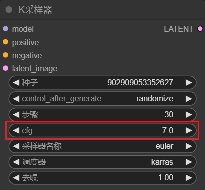

## 功能

- **提示词相关性**：**数值越高，AI反映提示词的程度越高**

## 标准值参考

- **SD 1.5**：7
- **SDXL**：7
- **SD 3.5**：3.5
- **FLUX**：3.5

# 9. 随机种子

- **WebUI**

- **ComfyUI**

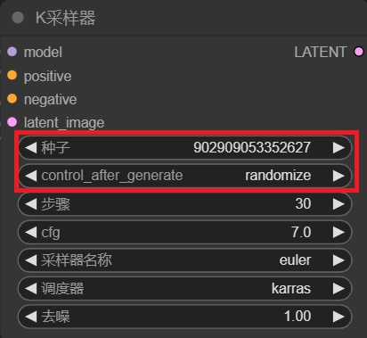

## 功能

- **随机种子**：**控制画面内容的一致性**
  - **同一个**随机种子，实现的**图像风格相似度较高**。

## 模式

|      模式      |   WebUI   |  ComfyUI  |
| :------------: | :-------: | :-------: |
|    **随机**    |   🎲：-1   | randomize |
|    **固定**    | 123456789 |   fixed   |
| **上一个种子** |     ♻️     |     /     |

- **随机**：软件会将随机种子设置为**随机正整数**，**每次都会生成新的图像样式**
- **固定**：软件会将随机种子设置为**上一次图像的种子**，**每次都是同一种图像样式**

# 10. 重绘幅度 / 去噪

- **WebUI**

- **ComfyUI**

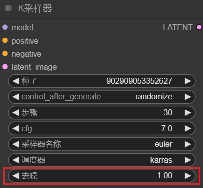

### 功能

- **重绘幅度**：用于**图生图**的流程中，**控制生成图和参考图的差异性**

## 推荐值参考

- **推荐值**：一般在 0.4 ~ 0.9 之间
  - 值很小，生成图和原图**很接近**
  - 值很大，生成图和原图的差异**会很大**

# 11. 对比示例图

## 对比：不同的模型

- **正向提示词**：`masterpiece, best quality, wallpaper forced, high quality, 1 girl, short hair, auburn hair, midday, clear sky, upper body, head and shoulders, natural lighting, blue eyes,`
- **负向提示词**：`worst quality, grayscale, simple background, bad hands, bad feet, bad anatomy`
- **种子**：456698801858549
- **步数**：30
- **提示词相关性**：**SD**：7.0，**FLUX**：1.0
- **采样器**：DPM++ 2M
- **调度器**：sgm_uniform

|          AnythingV5           |         CetusMix          |           CuteYukiMix           |          DreamGirl          |
| :---------------------------: | :-----------------------: | :-----------------------------: | :-------------------------: |
|  |  |  |  |

|       SDXL        |           SD3.5_Large           |       FLUX        |
| :---------------: | :-----------------------------: | :---------------: |
| 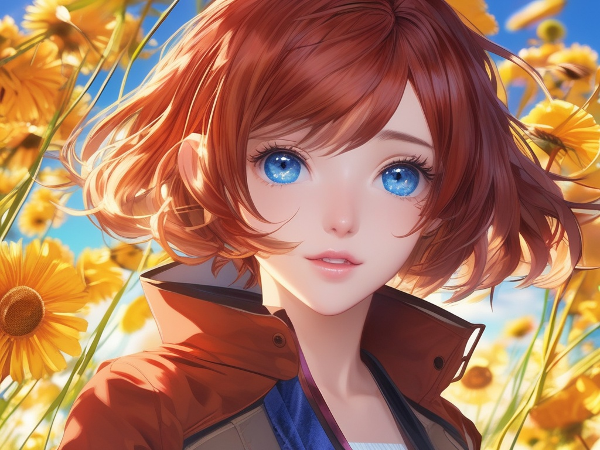 |  |  |

## 对比：不同的迭代步数

- **迭代步数**分别为：5、10、15、20、25、30，基础模型为**FLUX**

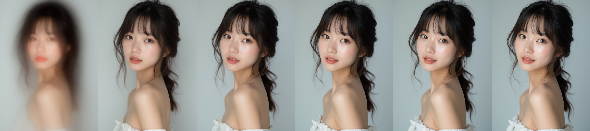

## 对比：不同的采样方式

- **多个采样方式**测试，图像细节略有变化，基础模型为**Anything V5**

|          Euler + Simple           |          Euler + Karras           |             Euler + sgm_uniform             |
| :-------------------------------: | :-------------------------------: | :-----------------------------------------: |
|  |  |  |

|            DPM++ 2M + Karras            |              DPM++ 2M + sgm_uniform               |               DPM++ 2M + ddim_uniform               |
| :-------------------------------------: | :-----------------------------------------------: | :-------------------------------------------------: |
|  |  |  |

## 对比：不同的提示词相关性

- **提示词引导系数**分别为**1.0、1.5、2.0、2.5、3.0、3.5**，基础模型为**FLUX**

## 对比：不同的随机种子

- 基础模型为**FLUX**

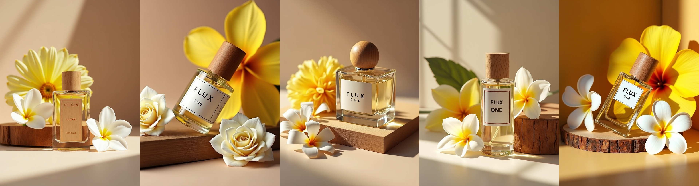

## 对比：不同的重绘幅度

- **重绘幅度**分别为**0.40、0.55、0.70、0.85、1.00**

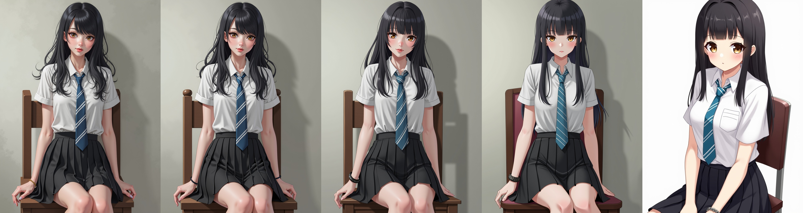