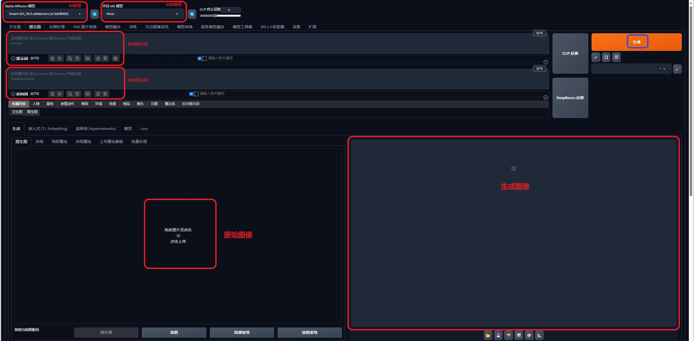
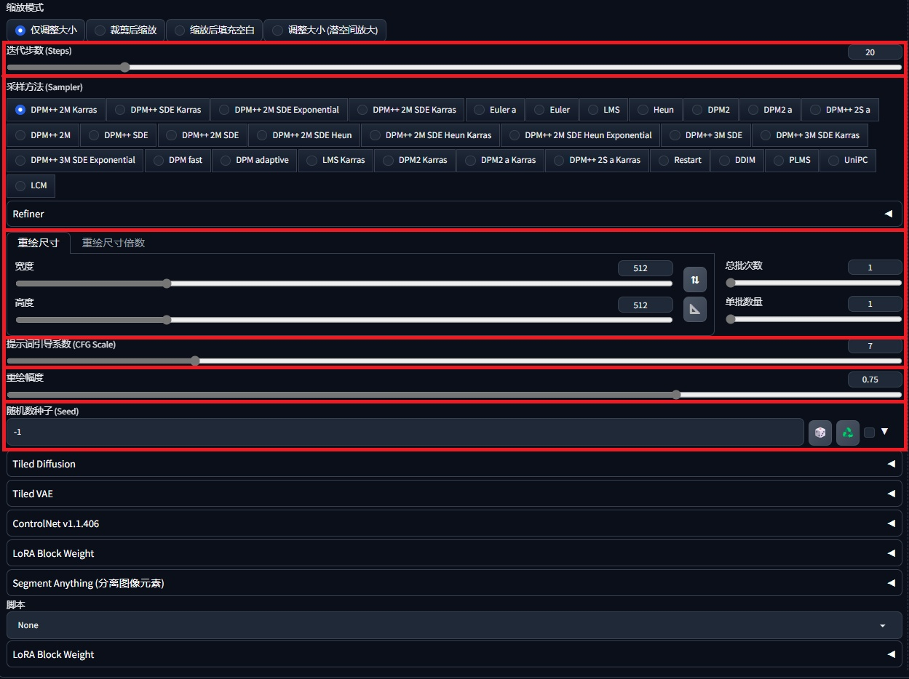
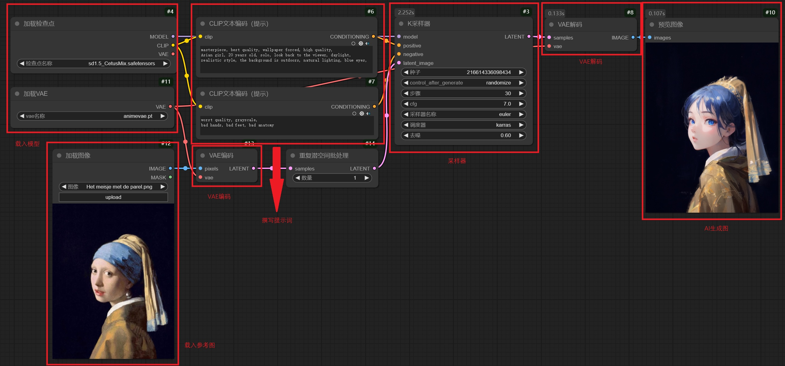
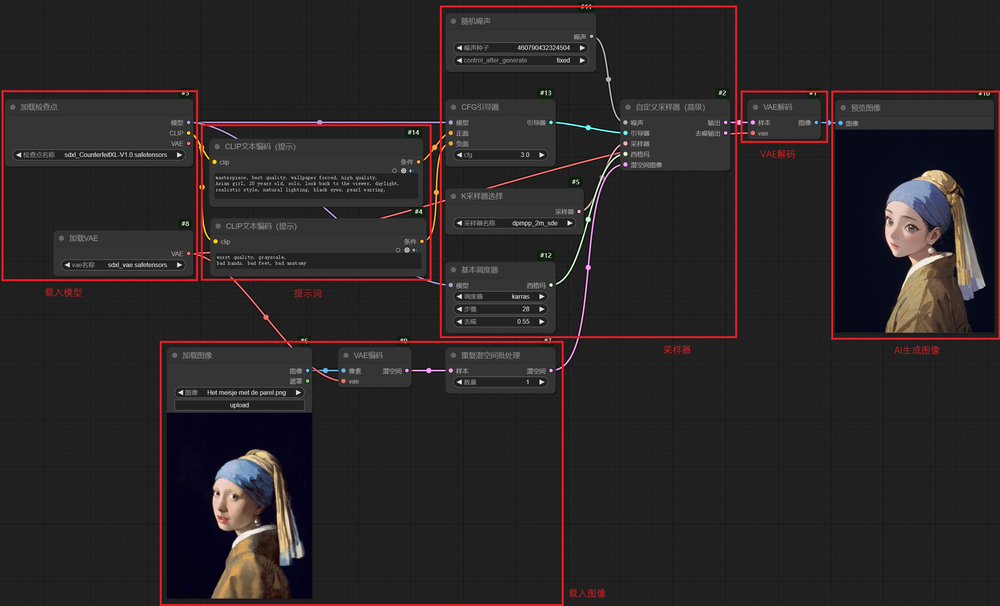
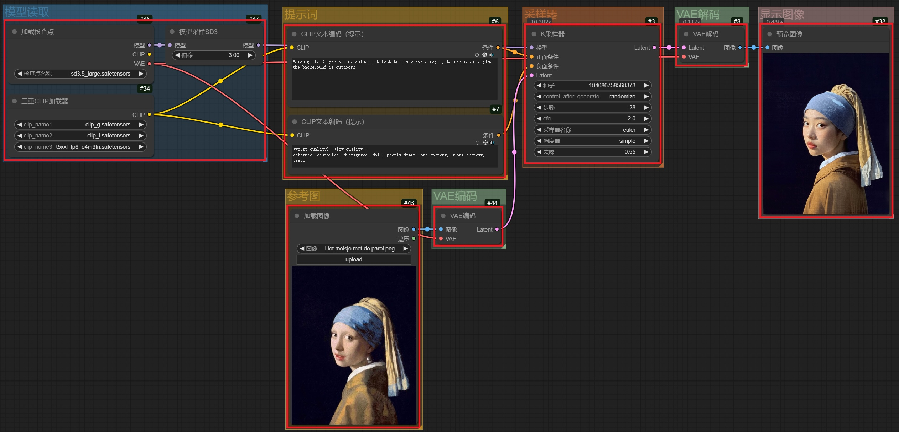
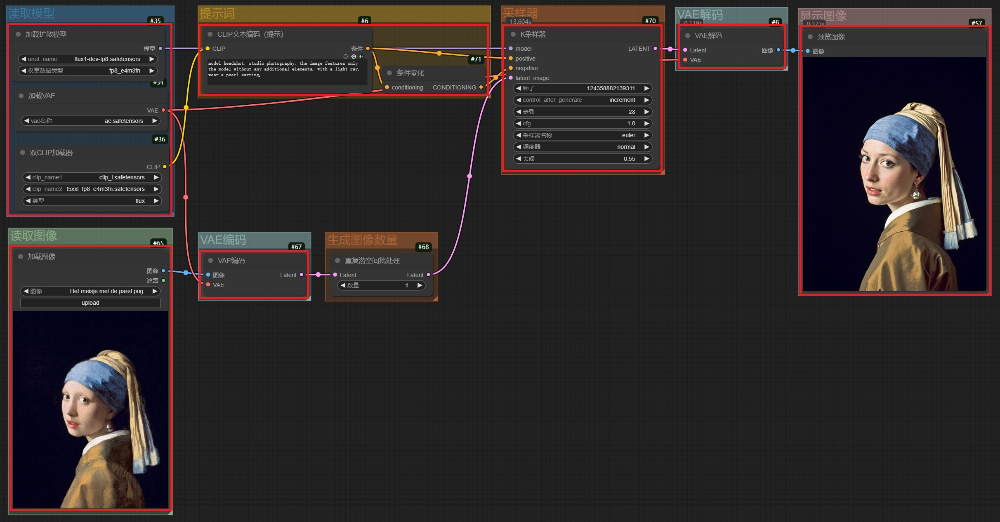
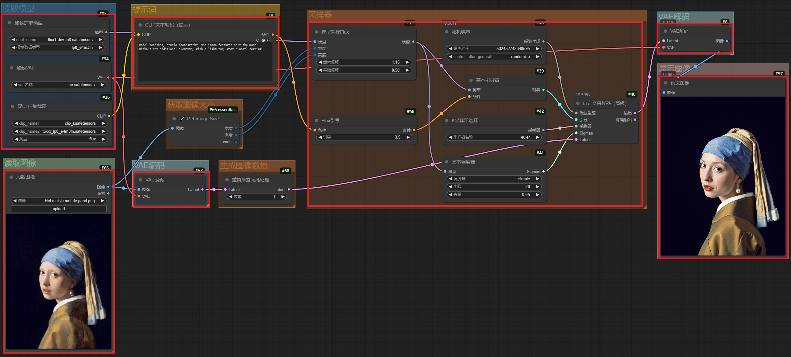
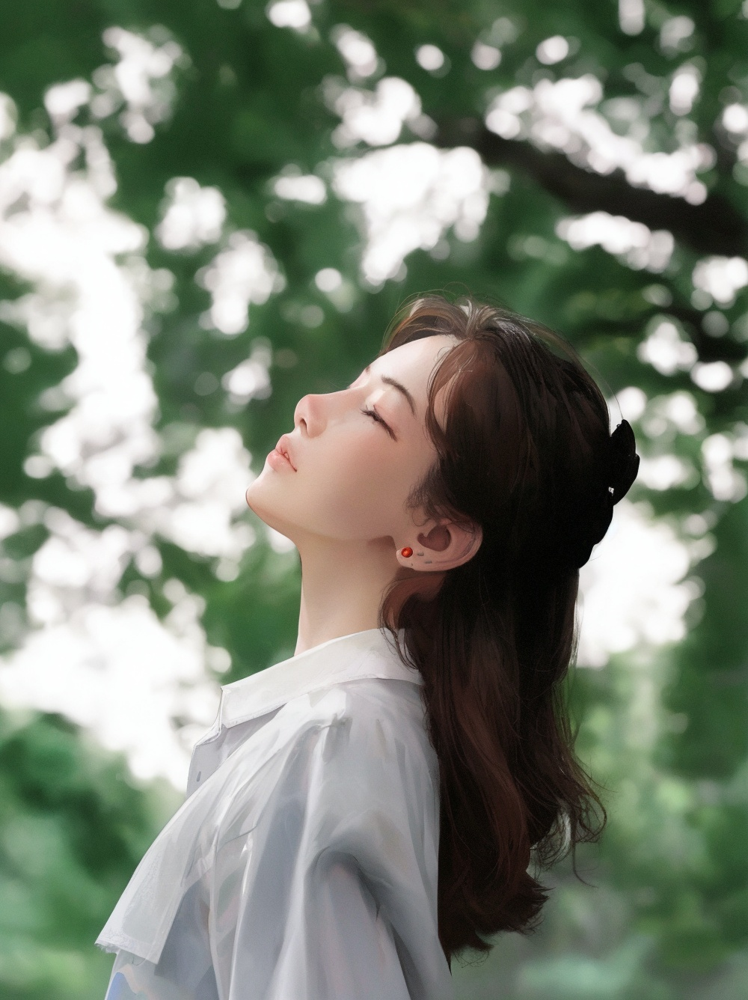
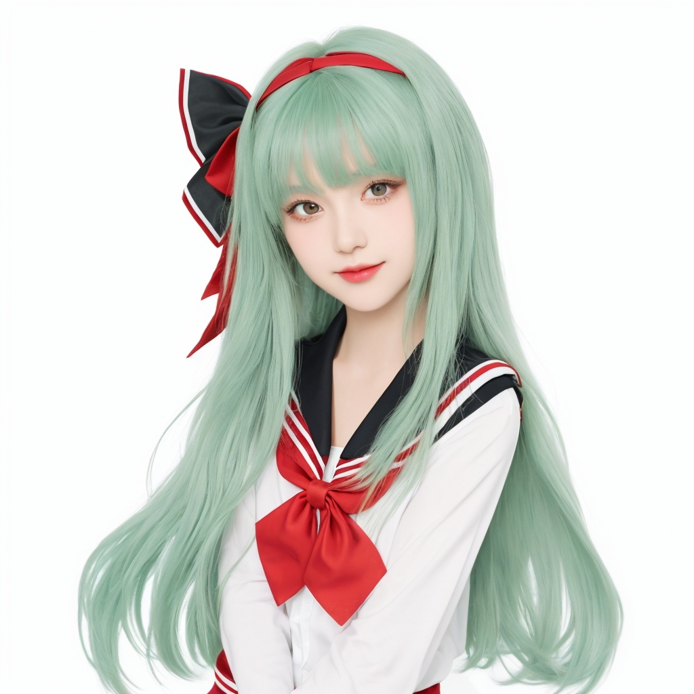
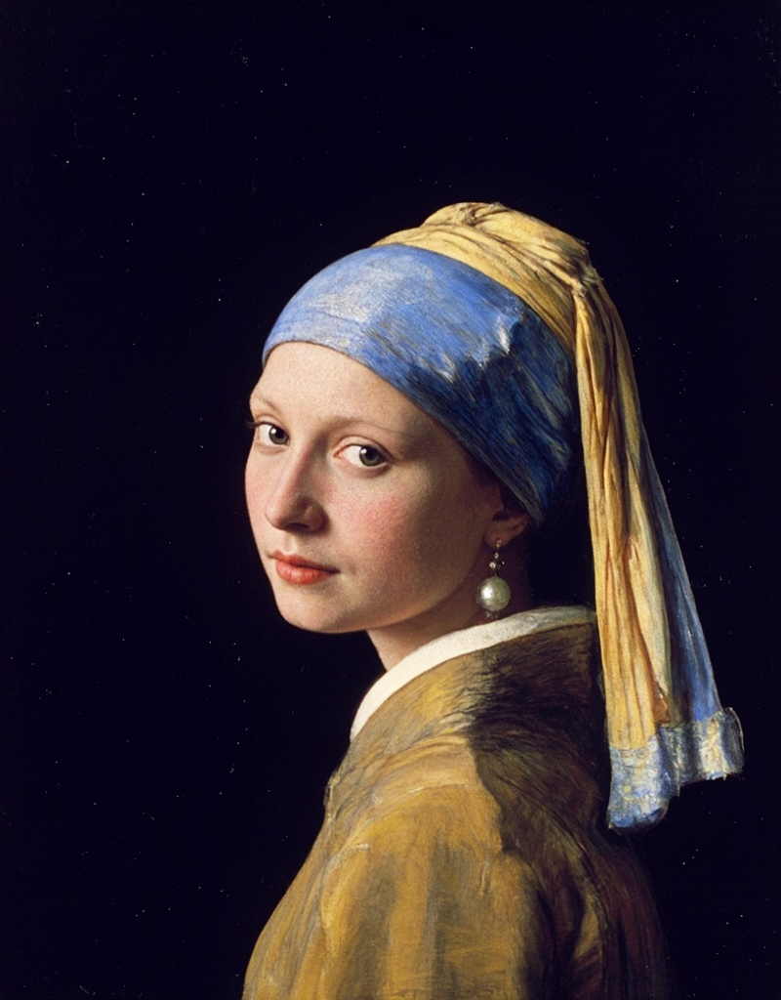

# 1. WebUI

## 1.1 载入模型

- 选取**AI模型**进行加载，如有必要，还需要加载**VAE模型**

## 1.2 填写正向提示词

- 尽管AI会识别原图的信息，但还是建议再次描述画面中出现的内容，**以免AI异想天开**
- 提示词 **`只支持英文`**

## 1.3 填写反向提示词

- 希望画面中需要**排除**的内容
- 提示词 **`只支持英文`**

## 1.4 设置合适的AI参数

- **采样迭代次数**
- **采样方法**
  - **采样器**：Euler、DPM……
  - **调度器**：Normal、Simple、Karras、sgm_uniform……
- **重绘尺寸**
  - 宽度、高度
  - 缩放倍数
- **提示词引导系数**
- **重绘幅度**：和原图的相似度，**推荐范围：0.4-0.8**
  - **值越小，和原图相似度越高**
- **批量生产**：总批次数、单批生成数
- **随机数种子**
  - 🎲：软件会将随机种子设置为 **-1**：**每次都会生成新的图像样式**
  - ♻️：软件会将随机种子设置为上一次图像的种子：**同一个随机种子，实现的图像风格相似度较高**

## 1.5 生成图片

- 确定**模型**、**提示词**、**原始图像**

- 设置**AI参数**

- 点击**生成**，进行**图生图**

## 1.6 浏览AI生成的图片

- 默认存放在本地的**outputs**文件夹中的**img2img-images**文件夹中

# 2. ComfyUI

## 2.1 搭建工作流

​		主要分为**载入模型**、**载入参考图**、**撰写提示词**、**设置采样器**、**设置输出**等功能模块。

### ① SD 1.5 工作流，K采样器

### ② SDXL 工作流，K采样器

### ③ SDXL 工作流，自定义采样器

### ④ SD 3.5 工作流，K采样器

### ⑤ FLUX 工作流，K采样器

- **CFG必须为1.0**

### ⑥ FLUX 工作流，自定义采样器

## 2.2 载入模型

- 选取**AI模型**进行加载
- 选取对应的**VAE模型**进行加载
- 选取**CLIP模型**进行加载（如有需要）

## 2.3 提示词

- **正向提示词**：连接至**采样器**的**positive输入端**
  - 希望在画面中**出现**的内容
  - 提示词 **`只支持英文`**
- **反向提示词**：连接至**采样器**的**negative输入端**
  - 希望画面中需要**排除**的内容
  - 提示词 **`只支持英文`**

## 2.4 设置合适的AI参数

- **种子**：随机数种子
- **步骤**：采样迭代次数
- **cfg**：提示词引导系数
- **采样器**：Euler、DPM……
- **调度器**：Normal、Simple、Karras、sgm_uniform……
- **图像尺寸**：宽度、高度
- **批量生产**：批量大小

## 2.5 生成图片

- **Preview Image**：**预览图像，但不保存**
- **Save Image**：**预览图像，同时保存**

# 3. 风格转换

## 3.1 真实场景 转 动漫风格

- 模型：**Anything V5**

|        真实场景         |          动漫风格          |
| :---------------------: | :------------------------: |
|  |  |

## 3.2 动漫风格 转 真实场景

- 模型：**DreamGirl V6.0 Ultra**

|          动漫风格          |           真实场景            |
| :------------------------: | :---------------------------: |
|  |  |

## 3.3 油画 转 动漫风格

- 模型：**CetusMix**

|                 油画                 |                  动漫风格                   |
| :----------------------------------: | :-----------------------------------------: |
|  |  |

## 3.4 油画 转 真实场景

- 模型：**majicflus**

|                 油画                 |                  真实场景                   |
| :----------------------------------: | :-----------------------------------------: |
|  |  |