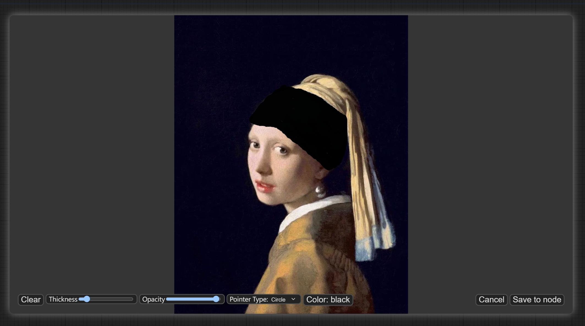
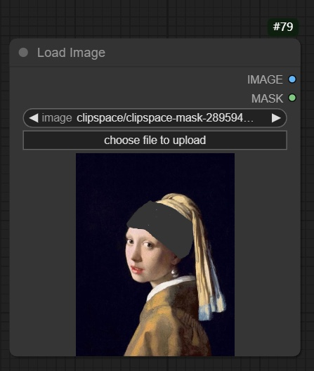
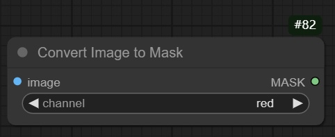
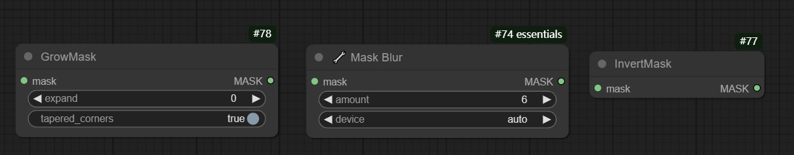
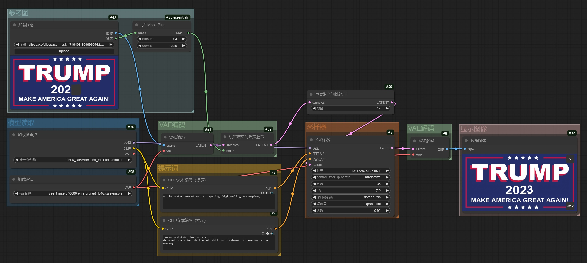
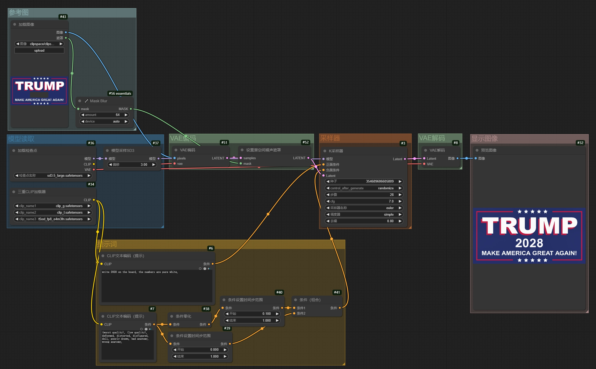
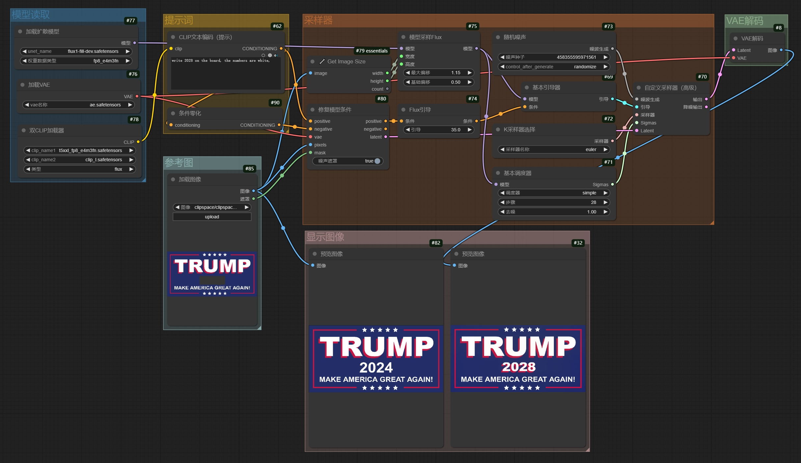
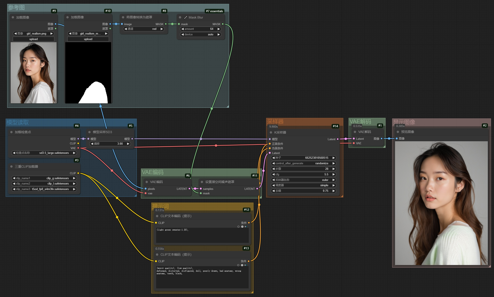
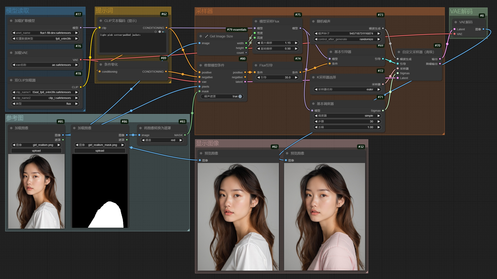
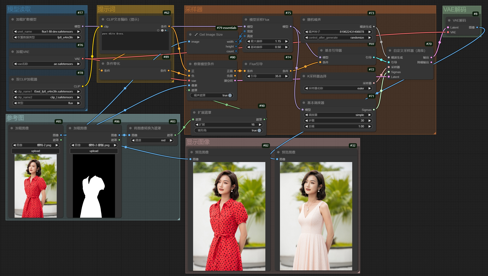

# 1. 说明

​		在通过生图得到了一张成品图片以后，如果**对大部分区域满意，只希望修改里面的一小部分内容**，就可以使用**局部重绘**功能。

# 2. 实现方式

​		通过**参考图**和**蒙版图**进行组合的方式，进行**图生图**重新采样。

## 2.1 准备蒙版图

### 手动重绘

​		在**读取图像节点**中，获取到图像后，右击图像，选择“**Open in MaskEdit**”即可弹出**蒙版编辑框**。可以**手动绘制重绘区域，完成后确认**即可。这之后，读取图像节点中的**image即为原始图像信息**，**mask即为蒙版信息**。

|         选择菜单          |         手动绘制重绘区域          |
| :-----------------------: | :-------------------------------: |
|  |  |

- **效果显示**

### 蒙版重绘

​		使用**读取图像节点**，载入**蒙版图像**。通过**Convert Image to Mask**节点，**将蒙版图像转换为蒙版遮罩层**。蒙版图的**白色区域**是**需要重绘**的部分，**黑色区域**是**固定不变**的。

|           读取蒙版图像            |          图像转蒙版           |
| :-------------------------------: | :---------------------------: |
|  |  |

## 2.2 蒙版图的二次处理

​		可以通过下述操作对**蒙版图**进行二次处理：

1. **GrowMask**插件进行**白色区域扩张**
2. **Mask Blur**插件进行**蒙版区域模糊处理**，实现羽化效果
3. **InvertMask**插件进行**蒙版区域反转处理**

# 3. 工作流：手动重绘

## 3.1 SD系列：SD 1.5 & SD 3.5

## 3.2 Flux系列

## 3.3 效果图

|      参考图       |       SD 1.5 模型       |       SD 3.5 模型       |        FLUX模型         |
| :---------------: | :---------------------: | :---------------------: | :---------------------: |
|  |  |  |  |

# 4. 工作流：蒙版重绘

## 4.1 SD系列：SD 1.5 & SD 3.5

​		SD系列的模型对局部重绘的支持**效果尚可**，可以**直接使用SD模型进行局部重绘**。

## 4.2 Flux系列

​		FLUX系列**原生的模型对局部重绘的支持效果并不好**，但**可以选择局部重绘专用的FLUX模型**——**Fill模型**，进行**局部重绘**，效果很好。

## 4.3 效果图

|       参考图        |       蒙版图        |
| :-----------------: | :-----------------: |
|  |  |

|        效果图-1         |        效果图-2         |        效果图-3         |
| :---------------------: | :---------------------: | :---------------------: |
|  |  |  |

# 5. 换装

​		利用**局部重绘**功能，**给想要更换衣服的区域设置蒙版**，再在**提示词**里**填写更换衣服的描述**，即可实现**换装**功能。

## 5.1 工作流

- **蒙版**决定了重绘区域的**范围**：通过**抠图插件**获取**感兴趣区域的蒙版**
- **提示词**决定了重绘区域的**内容**：`pure white dress,`

## 5.2 示例

|       参考图        |       蒙版图        |        效果图         |
| :-----------------: | :-----------------: | :-------------------: |
|  |  |  |

