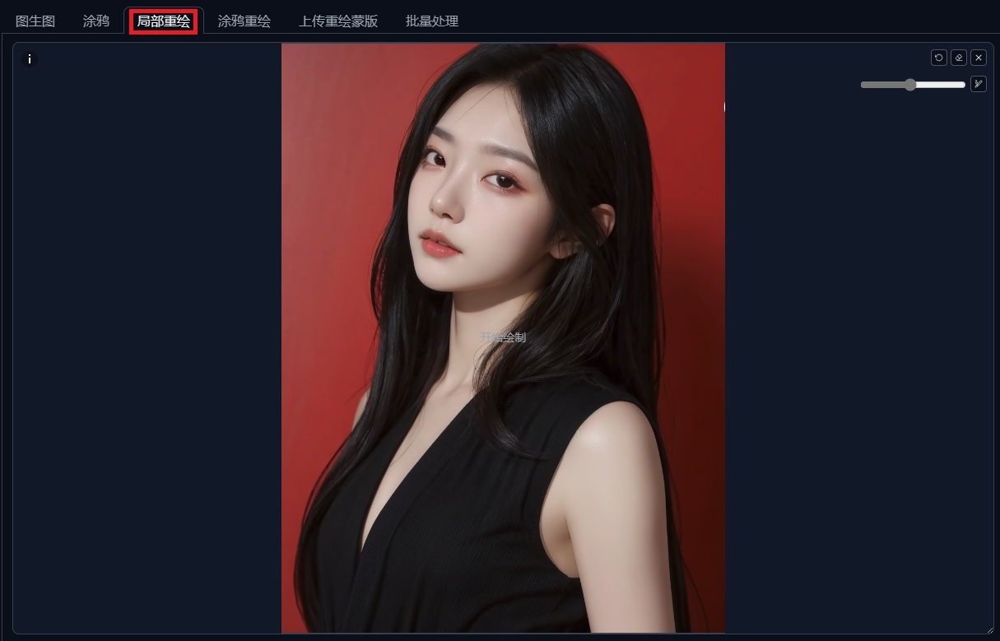
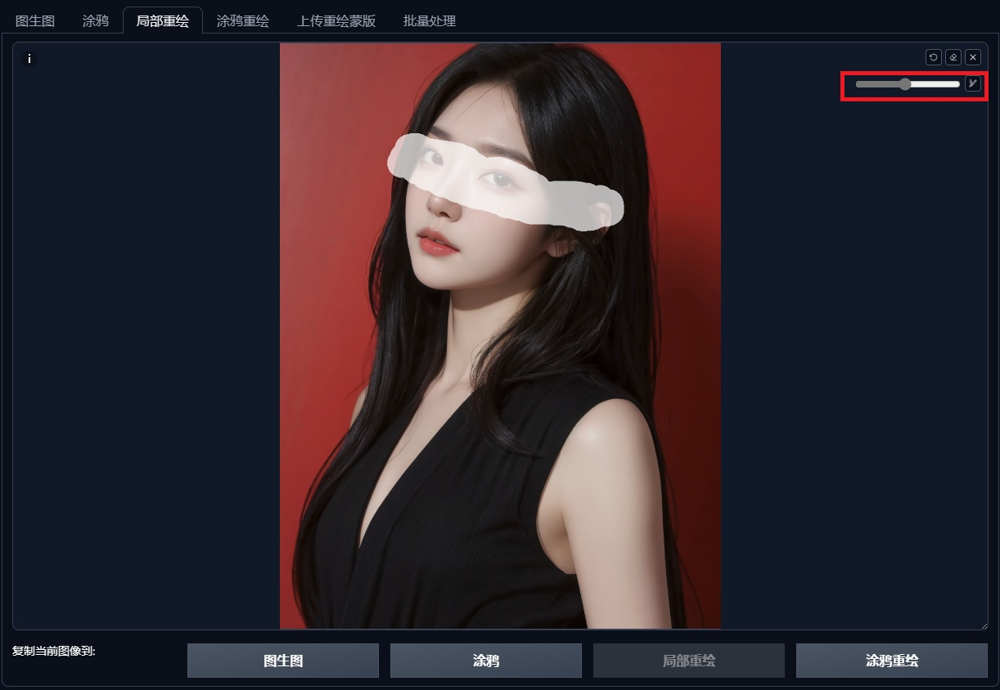
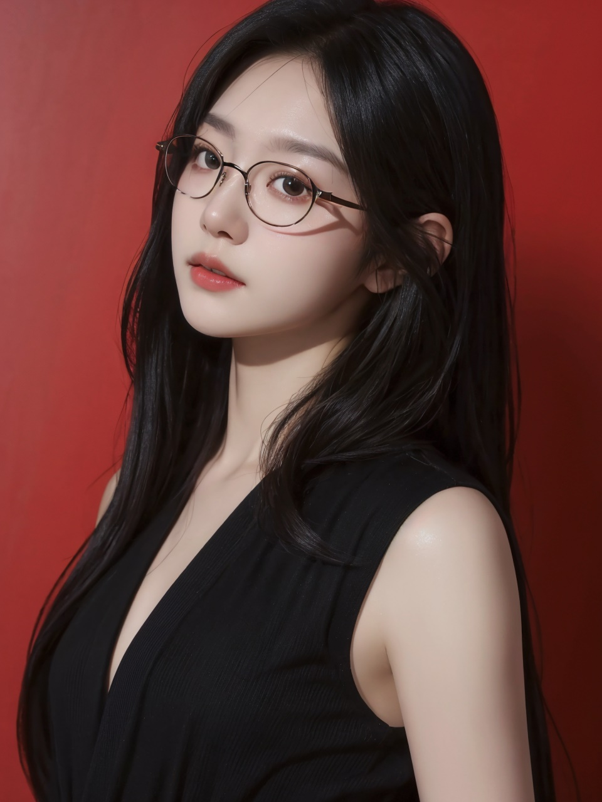
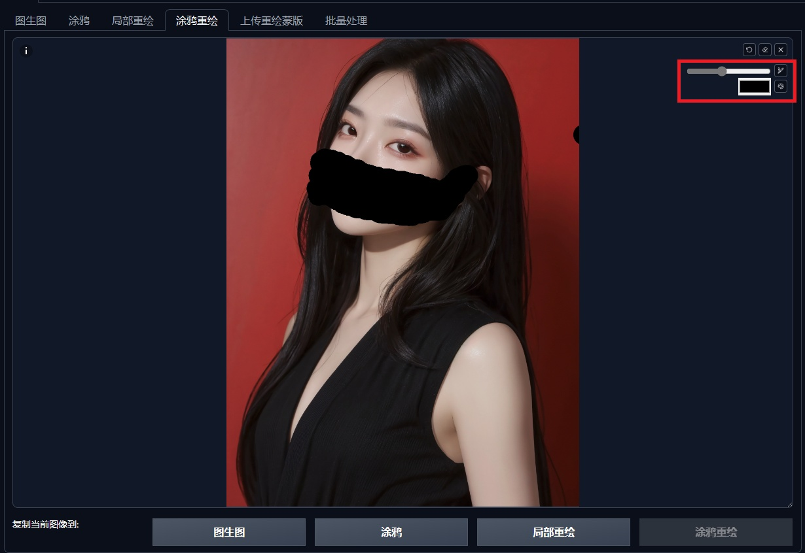
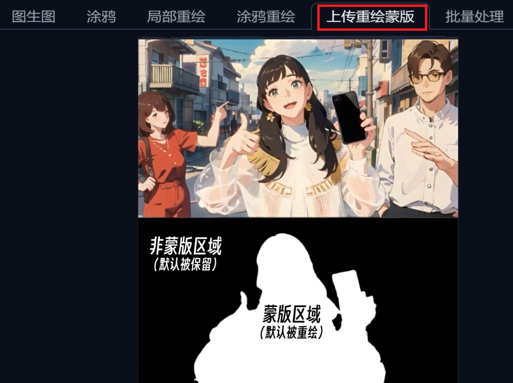

# 1. 局部重绘

## 1.1 作用

​		通过**手动绘制蒙版**的方式，对**蒙版区域内的画面内容**进行修改。

## 1.2 操作方法

### 切换至图生图标签页，选择局部重绘功能，导入图片

### 涂抹需要重绘的范围

- 通过鼠标**涂抹**想要重绘的区域

- 可选择右上角的**画棒**标记，更改笔触的大小
  - **大笔触**：更**高效**地**圈定重绘区域**
  - **小笔触**：更**精确**地**控制区域边缘**

### 添加提示词

- 在**提示词**增加想要修改的内容，以约束画面内容，如：`glasses`

### 参数调整

- 蒙版参数可保持**默认**配置
- 将**重绘幅度**调整到比较高的数值，如0.7~0.8。**重绘幅度越大，AI的创作空间越大；重绘幅度越小，生成图越接近原图**

### 生成

- 点击**生成**，进行局部重绘
- 等待绘制完成，在右侧的**生成图**里查看生成结果

|       原图        |                 生成图                  |
| :---------------: | :-------------------------------------: |
|  |  |

## 1.3 核心参数解析

- **蒙版边缘模糊度**：决定重绘区域边缘和其他部分如何接触（**羽化**）
  - 默认数值：**4**
  - 安全范围：**10** 左右
- **蒙版模式**
  - **重绘蒙版内容**：**增加**蒙版区域里新特征的**提示词**，一般为角色或局部特定区域
  - **重绘非蒙版内容**：**增加**非蒙版区域里新特征的**提示词**，一般为场景
- **蒙版区域内容处理**：AI进行**图生图**的**输入信息**
  - **填充**：用图像的颜色、以高强度模糊方式进行填充
  - **原图**：原图，不进行预处理
  - **潜变量噪声**：在潜变量中添加**随机噪声**，再在此基础上进行AI图像生成
  - **空白潜变量**：在潜变量中**以0作为初始噪声**，然后在此基础上进行AI图像生成
- **重绘区域**
  - **全图**：AI会基于新的要求（提示词+参数）**把整张图重新画一遍，最后只保留蒙版区域**，再拼回原图
  - **仅蒙版**：AI会基于新的要求（提示词+参数）**只在蒙版区域重新画一遍**，最后拼回原图
  - 建议选择**全图**，不失画面整体感
- **仅蒙版区域下边缘预留像素**：缓冲带效用

# 2. 涂鸦重绘

## 2.1 特点

- **蒙版重绘的局限性**：即便区域被精准的选中，但重新生成的过程仍然充满不确定性，AI如果能生成一次错误的图案，就能再生成第二次、第三次……
- **涂鸦重绘的优势**：利用**调色盘**涂抹想要**重绘的区域**，通过区域和颜色的组合，使出图更符合预期

## 2.2 操作方法

### 切换至图生图标签页，选择涂鸦重绘功能，导入图片

### 利用调色盘涂抹想要重绘的区域

### 在提示词里增加想要修改的内容

​		在**提示词**增加想要修改的内容，以约束画面内容，如：`black mask`

### 参数调整

​		将**重绘幅度**调整到相对合理的数值，如：0.7左右

###  生成

|       原图        |                 生成图                  |
| :---------------: | :-------------------------------------: |
|  |  |

# 3. 蒙版重绘

## 3.1 优势

利用导入的蒙版图，可以**更加精确地控制重绘的区域范围**

## 3.2 操作方法

### 切换至图生图标签页，选择上传重绘蒙版功能，导入图片

- 导入**参考图**
- 导入**重绘区域蒙版图**

### 参数调整

- 蒙版参数可保持**默认**配置
- 将**重绘幅度**调整到比较高的数值，如0.7~0.8

### 生成

- 点击**生成**，进行局部重绘
- 等待绘制完成，在右侧的**生成图**里查看生成结果