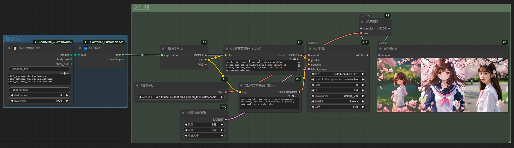
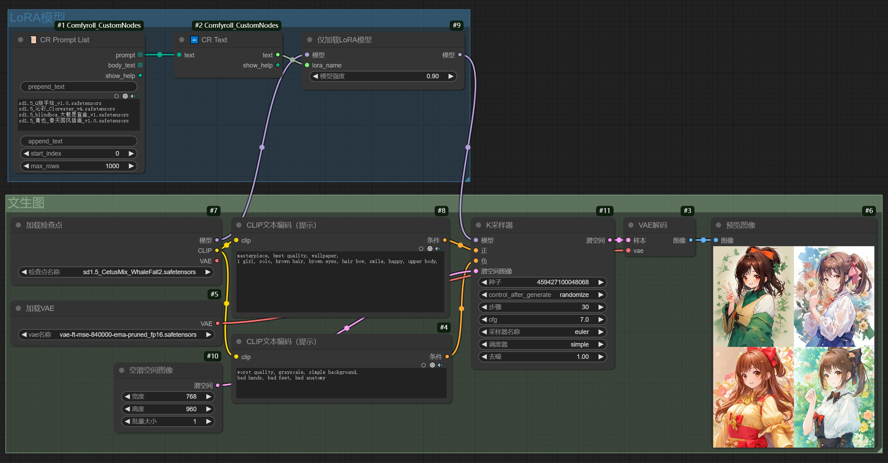
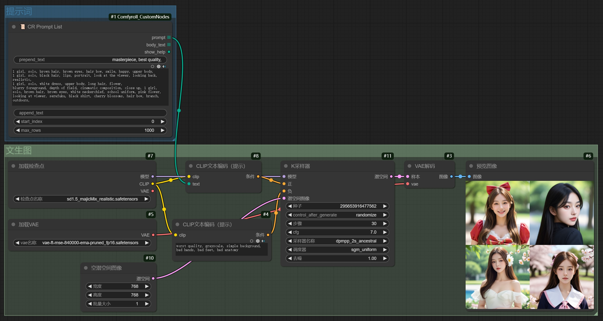
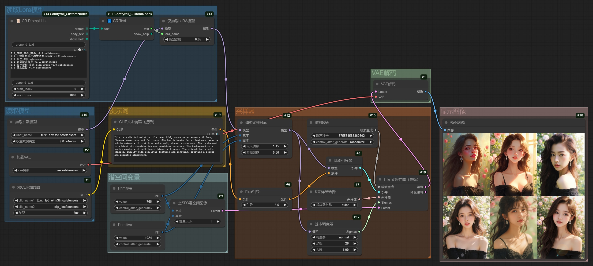

# 1. 介绍

​		在AIGC绘图中，有时候希望**只修改某一个因素，其他因素不变**，观察工作流的运作情况，**更方便差异对比**。

​		经过实践尝试，发现可以使用**CR Prompt List**节点，实现参数的**堆叠修改**，不同的参数**以换行分隔**。

# 2. 插件安装

```bash
cd custom_nodes
git clone https://github.com/Suzie1/ComfyUI_Comfyroll_CustomNodes.git
```

# 3. 实验：SD1.5\_文生图\_批量模型

## 工作流



## 示例图

|                 AnyPastel-fp16                 |                 CetusMix                 |                 majicMix                 |
| :--------------------------------------------: | :--------------------------------------: | :--------------------------------------: |
|  |  |  |

# 4. 实验：SD1.5\_文生图\_批量LoRA

## 工作流



## 示例图

|                 Q版手绘                 |                 沁彩                 |                 大概是盲盒                 |                 青也                 |
| :-------------------------------------: | :----------------------------------: | :----------------------------------------: | :----------------------------------: |
|  |  |  |  |

# 5. 实验：SD1.5\_文生图\_批量提示词

## 工作流



## 示例图

|                  提示词-1                  |                  提示词-2                  |                  提示词-3                  |                  提示词-4                  |
| :----------------------------------------: | :----------------------------------------: | :----------------------------------------: | :----------------------------------------: |
|  |  |  |  |

# 6. 实验：FLUX\_文生图\_批量LoRA

## 工作流



## 示例图

|                梧桐_厚涂_插画                 |                手绘淡水彩小场景治愈风插画                 |                胶片_CCD                 |
| :-------------------------------------------: | :-------------------------------------------------------: | :-------------------------------------: |
|  |  |  |

|                春日胶片类型                 |                胶片摄影_日系_Film_Grain                 |                纪实摄影                 |
| :-----------------------------------------: | :-----------------------------------------------------: | :-------------------------------------: |
|  |  |  |

# 7. 实验：FLUX\_文生图\_批量提示词

## 工作流


## 示例图

|                 提示词-1                  |                 提示词-2                  |                 提示词-3                  |
| :---------------------------------------: | :---------------------------------------: | :---------------------------------------: |
|  |  |  |