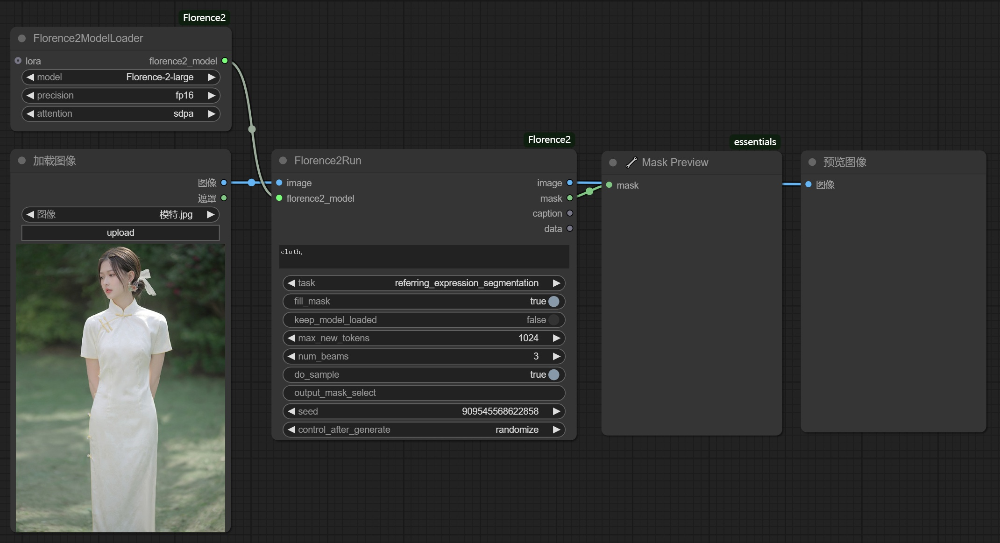
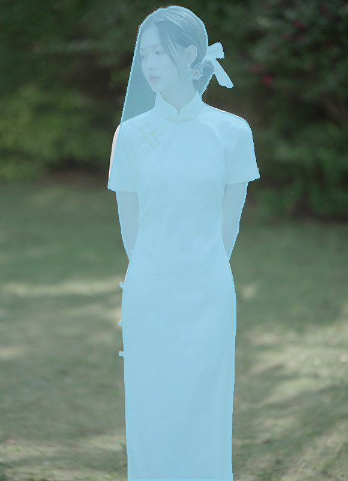
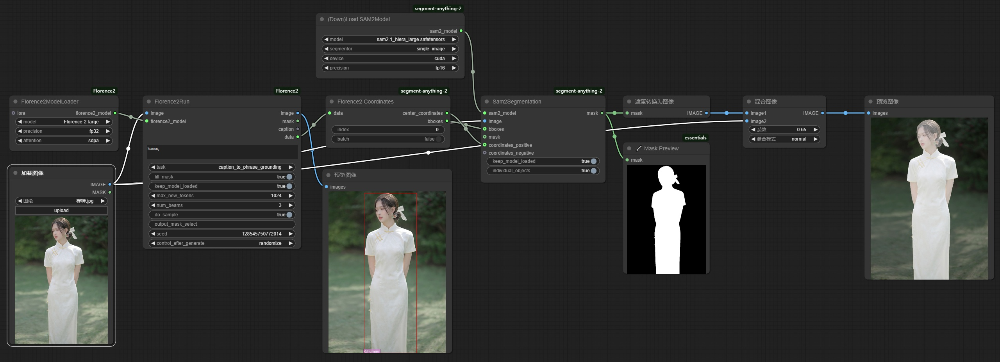
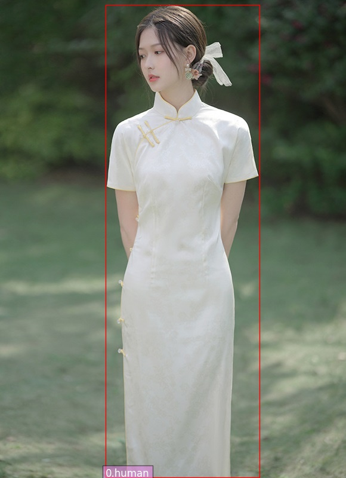
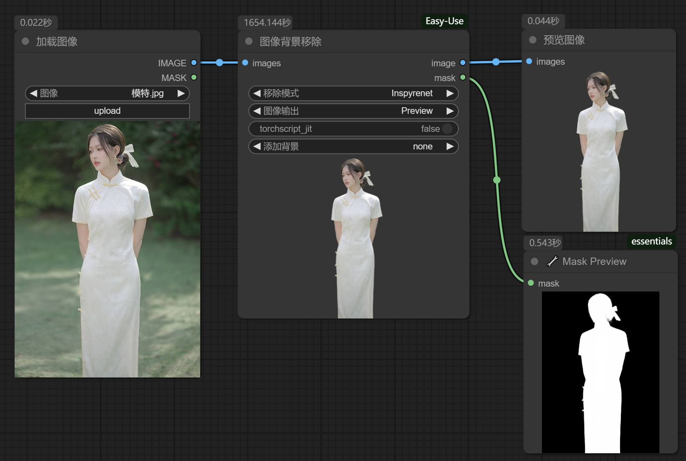
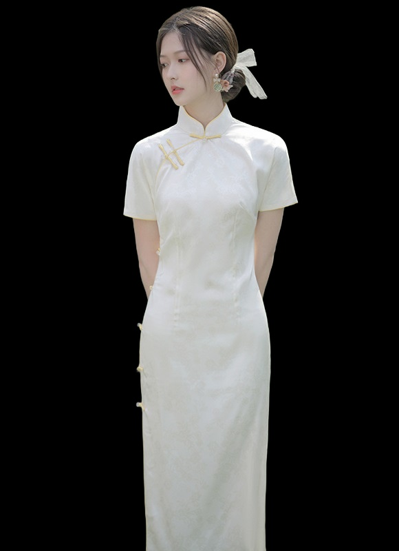
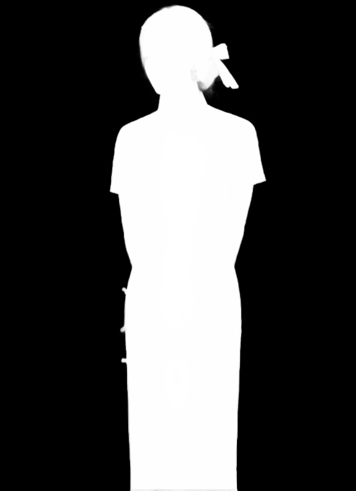

# 1.说明

​		在实际的图像处理过程中，经常需要使用**抠图**技术，以**提取准确的前景目标**。

# 2. Florence 2

​		使用Florence 2插件的**caption_to_phrase_grounding**功能，可**对图像中的指定目标进行抠图**。不过，**当前景目标太大时，抠图会不准确或者不完整**。

## 2.1 节点安装

- 节点网站：https://github.com/kijai/ComfyUI-Florence2
- 建议通过**git clone**安装
- 安装环境依赖：**pip install -r requirements.txt**

## 2.2 模型下载

- 下载位置：**ComfyUI/models/LLM**

|                        hf-mirror仓库                         |                        modelscope仓库                        |
| :----------------------------------------------------------: | :----------------------------------------------------------: |
| [Florence-2-large](https://hf-mirror.com/microsoft/Florence-2-large) | [Florence-2-large](https://modelscope.cn/models/AI-ModelScope/Florence-2-large) |
| [Florence-2-large-ft](https://hf-mirror.com/microsoft/Florence-2-large-ft) | [Florence-2-large-ft](https://modelscope.cn/models/AI-ModelScope/Florence-2-large-ft) |
| [Florence-2-base](https://hf-mirror.com/microsoft/Florence-2-base) | [Florence-2-base](https://modelscope.cn/models/AI-ModelScope/Florence-2-base) |
| [Florence-2-base-ft](https://hf-mirror.com/microsoft/Florence-2-base-ft) | [Florence-2-base-ft](https://modelscope.cn/models/AI-ModelScope/Florence-2-base-ft) |

## 2.3 节点使用

## 2.4 示例参考

|      参考图       |                准确抠图：cloth                |                不准确抠图：person                 |
| :---------------: | :-------------------------------------------: | :-----------------------------------------------: |
|  |                     |                         |
|  |  |  |

# 3. Florence 2 + SAM 2

​		**SAM2**全称是：Segment Anything Model 2，擅长在**图像领域**和**视频领域**中完成**目标分割**任务。它与Florence 2的**目标检测**功能相结合，会获得较好的**目标分割**效果。

## 3.1 节点安装

- 节点网站：https://github.com/kijai/ComfyUI-segment-anything-2
- 建议通过**git clone**安装
- 安装环境依赖：**pip install -r requirements.txt**

## 3.2 [模型下载](https://hf-mirror.com/Kijai/sam2-safetensors/tree/main)

- 下载位置：**ComfyUI/models/sam2**
  - [sam2.1_hiera_base_plus-fp16.safetensors](https://hf-mirror.com/Kijai/sam2-safetensors/blob/main/sam2.1_hiera_base_plus-fp16.safetensors)
  - [sam2.1_hiera_base_plus.safetensors](https://hf-mirror.com/Kijai/sam2-safetensors/blob/main/sam2.1_hiera_base_plus.safetensors)
  - [sam2.1_hiera_large-fp16.safetensors](https://hf-mirror.com/Kijai/sam2-safetensors/blob/main/sam2.1_hiera_large-fp16.safetensors)
  - [sam2.1_hiera_large.safetensors](https://hf-mirror.com/Kijai/sam2-safetensors/blob/main/sam2.1_hiera_large.safetensors)

## 3.3 节点使用

## 3.4 示例参考

|       参考图        |           Florence 2目标检测            |                效果图：蒙版                |           效果图           |
| :-----------------: | :-------------------------------------: | :----------------------------------------: | :------------------------: |
|  |  |  |  |

# 4. Image Remove Bg

​		**ComfyUI-Easy-Use**组件里的**Image Remove Bg**节点可以用于提取输入图像中的前景目标，支持**RMBG模型**和**Inspyrenet模型**。

## 4.1 节点安装

- 节点网站：https://github.com/yolain/ComfyUI-Easy-Use
- 建议通过**git clone**安装
- 安装环境依赖：**pip install -r requirements.txt**

## 4.2 模型下载

- 下载位置：**ComfyUI/models/rembg**
- **hf-mirror仓库**：[RMBG-1.4](https://hf-mirror.com/briaai/RMBG-1.4/resolve/main/model.pth)、[RMBG-2.0](https://hf-mirror.com/briaai/RMBG-2.0/tree/main)

## 4.3 节点使用

## 4.4 示例参考

|      参考图       |                  效果图：RMBG-1.4                  |                  效果图：RMBG-2.0                  |                     效果图：Inspyrenet                      |
| :---------------: | :------------------------------------------------: | :------------------------------------------------: | :---------------------------------------------------------: |
|  |                         |                         |                                  |
|  |  |  |  |

# 5. 总结

|              方式               | 输入：图像 | 能否指定目标 | 输出：蒙版 | 输出：裁剪图 |               效果               |
| :-----------------------------: | :--------: | :----------: | :--------: | :----------: | :------------------------------: |
|           Florence 2            |     🟢      |      🟢       |     🟢      |      ❌       |   可以**指定目标**，抠图精度差   |
|     **Florence 2 + SAM 2**      |     🟢      |      🟢       |     🟢      |      ❌       | 可以**指定目标**，抠图**效果好** |
|    Image Remove Bg：RMBG-1.4    |     🟢      |      ❌       |     🟢      |      🟢       |    效果很好，**强制去除背景**    |
|    Image Remove Bg：RMBG-2.0    |     🟢      |      ❌       |     🟢      |      🟢       |    效果很好，**强制去除背景**    |
| **Image Remove Bg：InsPyrence** |     🟢      |      ❌       |     🟢      |      🟢       | **细节非常好**，**强制去除背景** |
