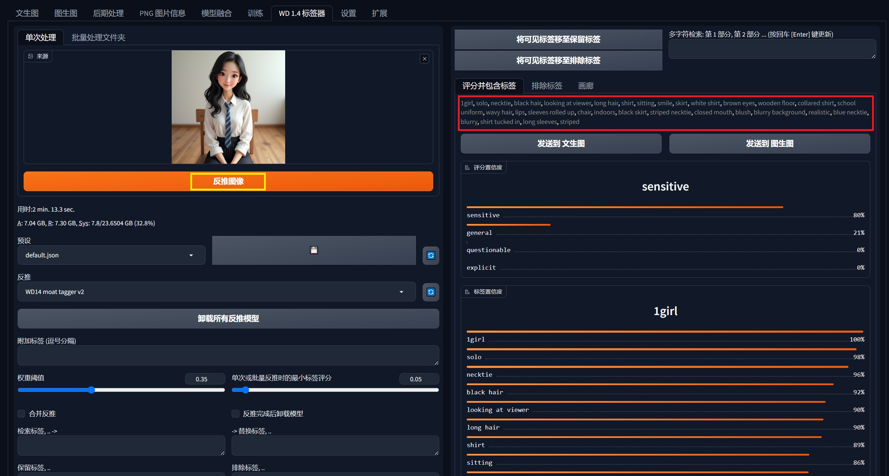
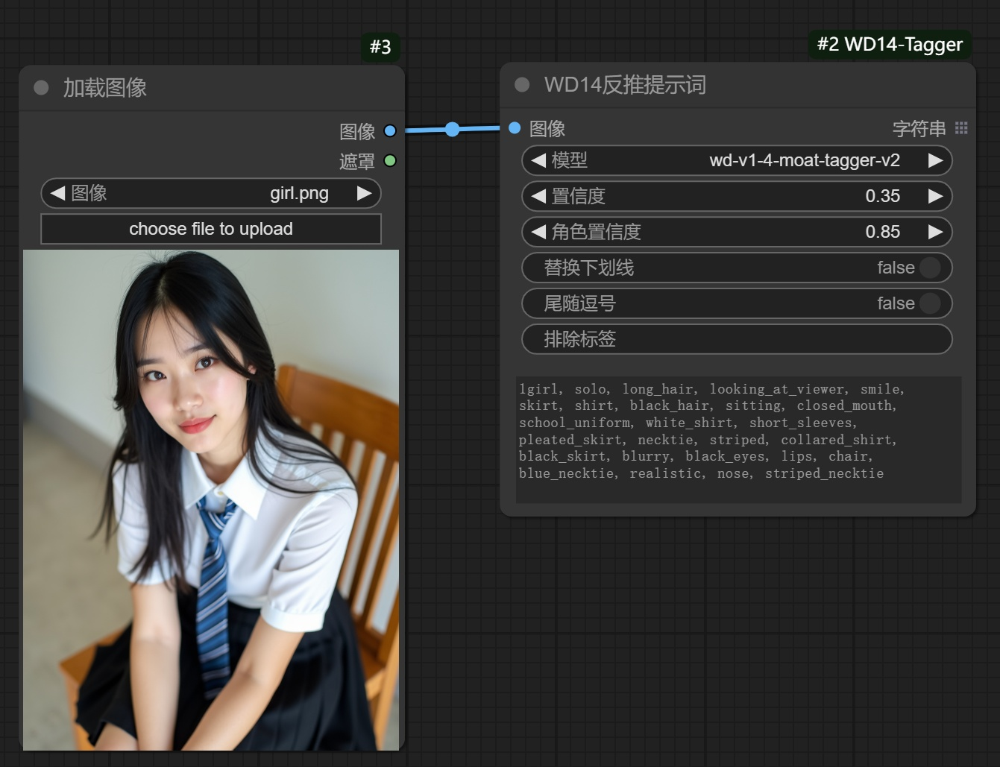
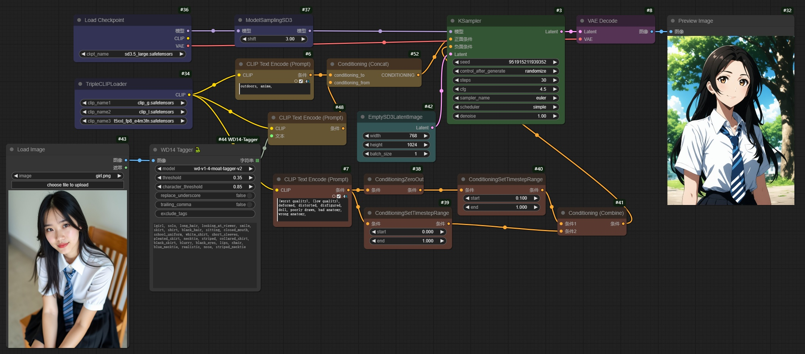
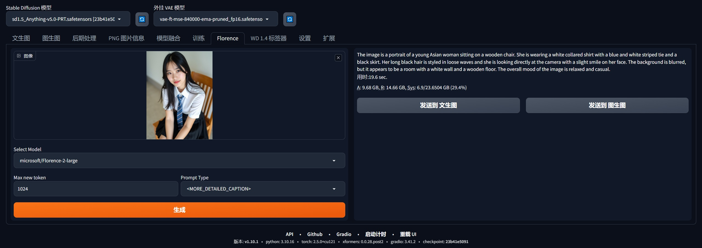
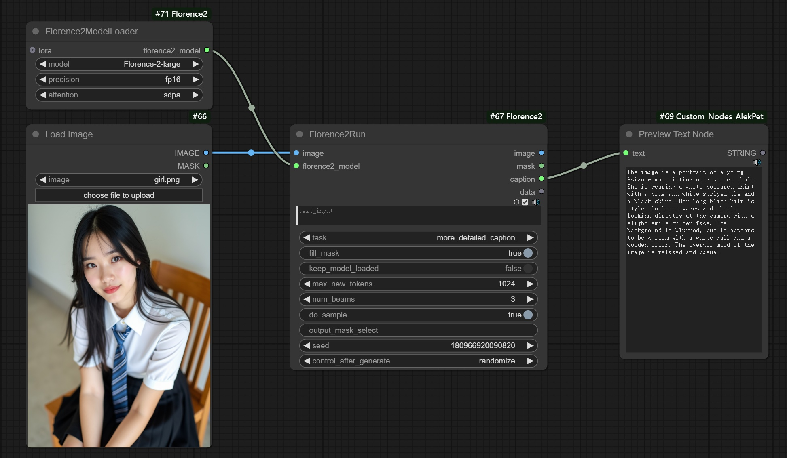
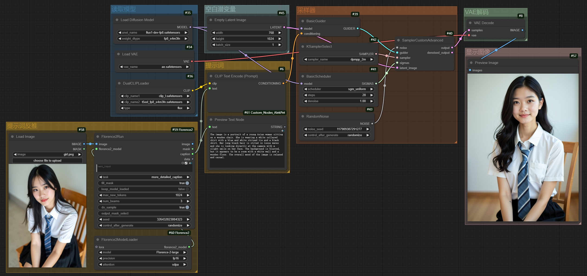

# 1. 说明

​		当看到一张**喜欢**的图，却**不知道该如何描述**时，可以使用**提示词反推**的方案。利用AI的 **`图生文`** 功能，可以轻松地获得提示词内容。

- 使用**WD 14反推**方案，可以获得**基于词组的提示词**。
- 使用**Florence 2反推**方案，可以获得**基于自然语言的提示词**。

# 2. WD 14反推：WebUI方式

## 2.1 插件安装

- 节点网站：https://github.com/picobyte/stable-diffusion-webui-wd14-tagger

- 手动通过**git clone**安装

- 安装环境依赖

  ```bash
  pip install -r requirements.txt
  ```

## 2.2 模型下载

- 使用**反推图像**功能时，会自动下载模型

## 2.3 提示词反推



## 2.4 提示词反推+图像再生成

|     参考图像      |     AI生成图像：CetusMix      |
| :---------------: | :---------------------------: |
|  |  |


# 3. WD 14反推：ComfyUI方式

## 3.1 节点安装

- 节点网站：https://github.com/pythongosssss/ComfyUI-WD14-Tagger

- 手动通过**git clone**安装，也可以通过**节点管理器**安装。

- 安装环境依赖

  ```bash
  pip install -r requirements.txt
  ```

## 3.2 模型下载

- 以**wd-v1-4-moat-tagger-v2**为例：
  - 下载onnx模型[**model.onnx**](https://hf-mirror.com/SmilingWolf/wd-v1-4-moat-tagger-v2/resolve/main/model.onnx)至**ComfyUI/custom_nodes/ComfyUI-WD14-Tagger/models**中，并重命名为**wd-v1-4-moat-tagger-v2.onnx**
  - 下载csv文件[**selected_tag.csv**](https://hf-mirror.com/SmilingWolf/wd-v1-4-moat-tagger-v2/resolve/main/selected_tags.csv)至**ComfyUI/custom_nodes/ComfyUI-WD14-Tagger/models**中，并重命名为**wd-v1-4-moat-tagger-v2.csv**

## 3.3 提示词反推



## 3.4 提示词反推+图像再生成



|     参考图像      |      AI生成图像：CetusMix       |
| :---------------: | :-----------------------------: |
|  |  |


# 4. Florence 2反推：WebUI方式

## 4.1 插件安装

- 节点网站：https://github.com/ilyq/sd-webui-florence-2
- 手动通过**git clone**安装

## 4.2 修改代码

- 注释**line 43**：`imports.remove("flash_attn")`，不用安装flash_attn组件

## 4.3 模型下载

- 下载位置：**stable-diffusion-webui/models/florence2/microsoft**
- **hf-mirror仓库**
  - [Florence-2-large](https://hf-mirror.com/microsoft/Florence-2-large)
  - [Florence-2-large-ft](https://hf-mirror.com/microsoft/Florence-2-large-ft)
  - [Florence-2-base](https://hf-mirror.com/microsoft/Florence-2-base)
  - [Florence-2-base-ft](https://hf-mirror.com/microsoft/Florence-2-base-ft)
- **modelscope仓库**
  - [Florence-2-large](https://modelscope.cn/models/AI-ModelScope/Florence-2-large)
  - [Florence-2-large-ft](https://modelscope.cn/models/AI-ModelScope/Florence-2-large-ft)
  - [Florence-2-base](https://modelscope.cn/models/AI-ModelScope/Florence-2-base)
  - [Florence-2-base-ft](https://modelscope.cn/models/AI-ModelScope/Florence-2-base-ft)

## 4.4 提示词反推



## 4.5 提示词反推+图像再生成

|     参考图像      |        AI生成图像：CetusMix        |
| :---------------: | :--------------------------------: |
|  |  |


# 5. Florence 2反推：ComfyUI方式

## 5.1 节点安装

- 节点网站：https://github.com/kijai/ComfyUI-Florence2
- 建议通过**git clone**安装
- 安装环境依赖

```bash
pip install -r requirements.txt
```

## 5.2 模型下载

- 下载位置：**ComfyUI/models/LLM**
- **hf-mirror仓库**
  - [Florence-2-large](https://hf-mirror.com/microsoft/Florence-2-large)
  - [Florence-2-large-ft](https://hf-mirror.com/microsoft/Florence-2-large-ft)
  - [Florence-2-base](https://hf-mirror.com/microsoft/Florence-2-base)
  - [Florence-2-base-ft](https://hf-mirror.com/microsoft/Florence-2-base-ft)
- **modelscope仓库**
  - [Florence-2-large](https://modelscope.cn/models/AI-ModelScope/Florence-2-large)
  - [Florence-2-large-ft](https://modelscope.cn/models/AI-ModelScope/Florence-2-large-ft)
  - [Florence-2-base](https://modelscope.cn/models/AI-ModelScope/Florence-2-base)
  - [Florence-2-base-ft](https://modelscope.cn/models/AI-ModelScope/Florence-2-base-ft)

## 5.3 提示词反推



## 5.4 提示词反推+图像再生成



|     参考图像      |           AI生成图像：FLUX           |
| :---------------: | :----------------------------------: |
|  |  |


# 6. 使用经验

​		**通过提示词反推出来的结果，不一定十分准确**。如果需要**精确出图**，建议**分步处理**：

1. **用提示词反推方案，获得提示词**
2. **对提示词内容进行修正**
3. **生成图像**